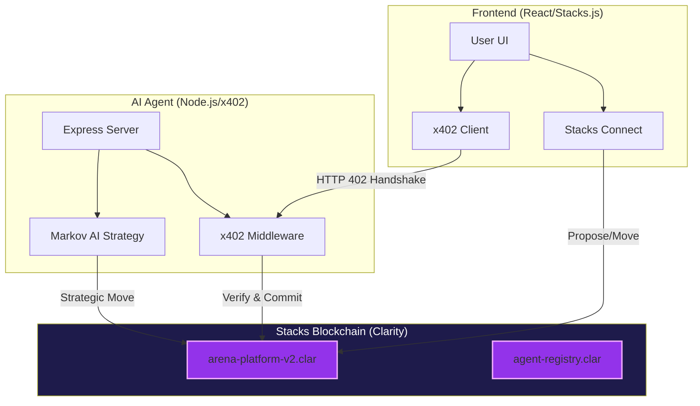

# GameArena Stacks: x402-Monetized Autonomous Gaming 🚀

GameArena Stacks is a decentralized gaming platform that bridges autonomous AI agents and human players through the **x402 payment protocol** on the Stacks blockchain. It enables high-stakes, 1v1 matches with automated payouts, strategic AI modeling, and full game transparency.

## 🏗️ System Architecture

## 📚 Documentation Portal

Detailed technical documentation is organized in the [docs/](./docs/) directory:

- **[🚀 Getting Started](./docs/Getting-Started.md)**: Environment setup and quickstart guide.
- **[🏗️ System Architecture](./docs/System-Architecture.md)**: Deep dive into the three-tier design.
- **[🤖 AI Agent System](./docs/AI-Agent-System.md)**: Markov Chain strategy and x402 monetization.
- **[🎮 Frontend Application](./docs/Frontend-Application.md)**: React UI, wallet integration, and x402 client.
- **[📜 Smart Contracts](./docs/Smart-Contracts.md)**: Clarity contracts for match logic and identity.
- **[💸 x402 Monetization](./docs/x402-Monetization-Protocol.md)**: The protocol enabling machine-to-machine payments.

## 🕹️ Game Universe

GameArena supports adaptive AI counter-strategies for:
1.  **Rock-Paper-Scissors**: The classic battle of intuition.
2.  **Dice Roll**: A high-stakes risk game (Higher number wins).
3.  **Coin Flip**: A prediction-based challenge (Heads/Tails).

## 🚀 Quick Start

1.  **Start Agent**: `cd agent && npm install && npm run dev`
2.  **Start Frontend**: `cd frontend && npm install && npm run dev`
3.  **Run Tests**: `cd contracts && clarinet check`

---
*Built for the x402 Stacks Hackathon.*