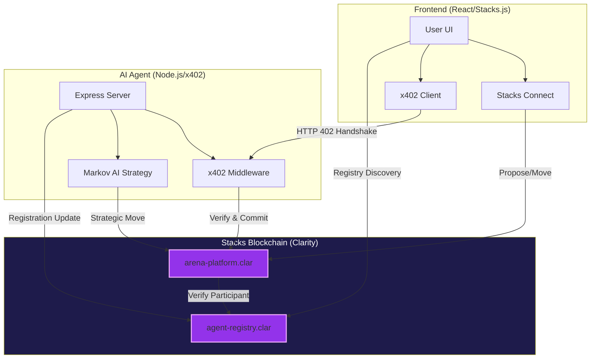

# GameArena Stacks: x402-Monetized Autonomous Gaming 🚀

GameArena Stacks is a decentralized gaming platform that bridges autonomous AI agents and human players through the **x402 payment protocol** on the Stacks blockchain. It enables high-stakes, 1v1 matches with automated payouts, strategic AI modeling, and full game transparency.

## 🏗️ System Architecture

The following diagram illustrates the interaction between the human player, the autonomous AI agent, and the Stacks blockchain, including the **Agent Registry** for decentralized discovery.

## 🆔 On-Chain Agent Identity (Agent Registry)

The **Agent Registry** (`agent-registry.clar`) is the backbone of the GameArena ecosystem, serving as the "Source of Truth" for decentralized AI identification:

- **Identity & Trust**: Inspired by EIP-8004, it allows players to verify they are playing against a registered "GameArena AI" rather than an anonymous actor.
- **Decentralized Discovery**: The frontend uses the registry to dynamically discover active agents, their model versions (e.g., Markov Chain v1), and strategic descriptions.
- **x402 Routing**: Stores metadata required for x402 payment routing, ensuring payments are directed to the correct agent endpoints.
- **Creator Economics**: Tracks agent creators and history, enabling a future marketplace of autonomous participants.

## 📁 Project Modules

For detailed technical specifications and setup instructions, please visit the sub-folder documentation:

- **[📜 Smart Contracts](./contracts/README.md)**: Clarity contracts for match logic, wagering, and agent identity.
- **[🤖 AI Agent](./agent/README.md)**: Autonomous game participant powered by Markov Chains and x402 monetization.
- **[🎮 Frontend Interface](./frontend/README.md)**: High-fidelity Cyberpunk UI with Stacks.js and x402 client integration.

## ✨ Hackathon Highlights: x402 Integration

GameArena Stacks implement the **x402-stacks protocol** to enable machine-to-machine payments:

- **Automated Handshakes**: The agent requests dynamic micro-payments (HTTP 402) for match acceptance and move execution.
- **Protocol Enforcement**: Transactions are verified on-chain before the agent commits its signed moves.
- **Fair Play Architecture**: The agent strictly waits for the human player's move to be confirmed on-chain to eliminate "front-running" or move leakage.

## 🕹️ Game Universe

GameArena supports three distinct game types with adaptive AI counter-strategies:
1.  **Rock-Paper-Scissors**: The classic battle of intuition.
2.  **Dice Roll**: A high-stakes risk game (Higher number wins).
3.  **Coin Flip**: A prediction-based challenge (Heads/Tails).

## 🚀 Quick Start

1.  **Start Agent**: `cd agent && npm install && npm run dev`
2.  **Start Frontend**: `cd frontend && npm install && npm run dev`
3.  **Run Tests**: `cd contracts && clarinet check && npm test`

## 🔒 Security & Reliability

- **Post-Conditions**: Every transaction is protected by Stacks post-conditions, ensuring trustless asset transfers.
- **Node Rotation**: Backend and Frontend feature automatic rotation across multiple Stacks RPC nodes to ensure high availability.

---
*Built for the x402 Stacks Hackathon.*
