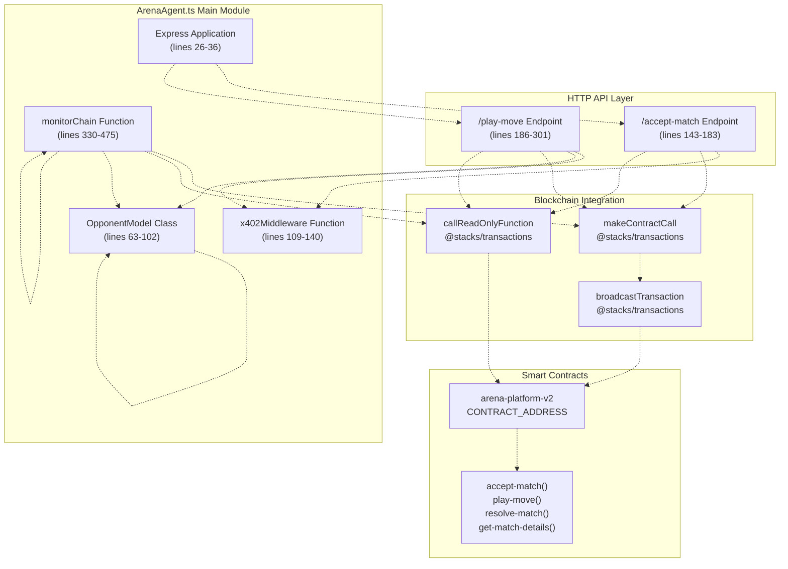
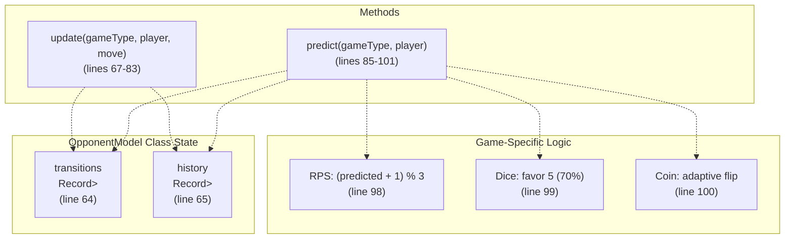
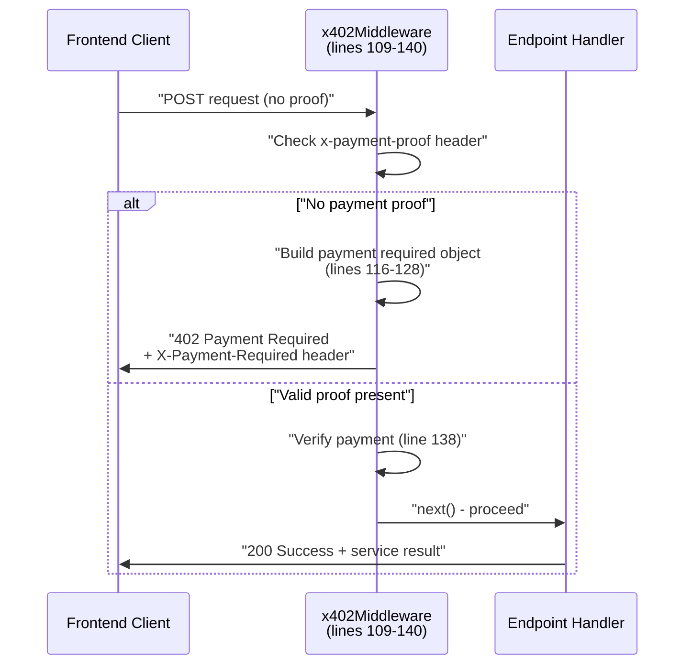
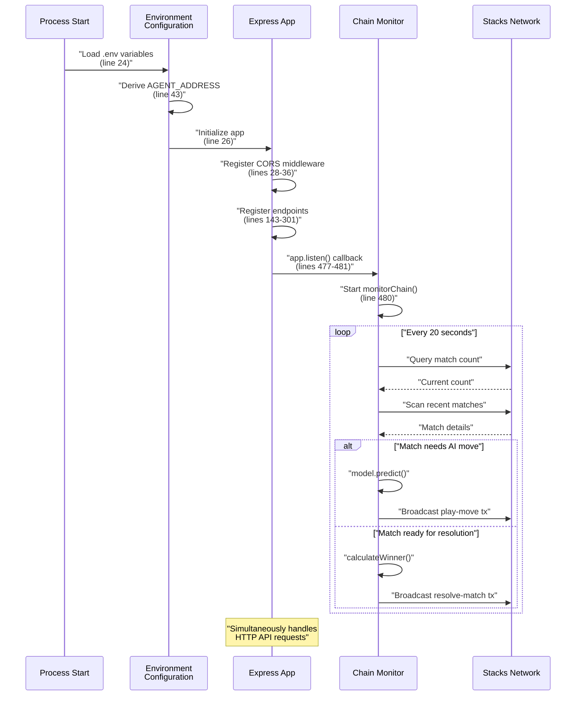

# AI Agent System

> **Relevant source files**
> * [agent/.env.example](https://github.com/HACK3R-CRYPTO/GameArenaStacks/blob/23ba68fb/agent/.env.example)
> * [agent/Procfile](https://github.com/HACK3R-CRYPTO/GameArenaStacks/blob/23ba68fb/agent/Procfile)
> * [agent/README.md](https://github.com/HACK3R-CRYPTO/GameArenaStacks/blob/23ba68fb/agent/README.md)
> * [agent/package.json](https://github.com/HACK3R-CRYPTO/GameArenaStacks/blob/23ba68fb/agent/package.json)
> * [agent/src/ArenaAgent.ts](https://github.com/HACK3R-CRYPTO/GameArenaStacks/blob/23ba68fb/agent/src/ArenaAgent.ts)

## Purpose and Scope

This document describes the autonomous AI agent that participates in GameArena matches as an intelligent opponent. The agent is a self-contained Node.js application that combines strategic gameplay using Markov Chain modeling with automated blockchain interaction and service monetization through the x402 protocol. This page provides an architectural overview of the agent system, its core components, and how they integrate with the broader GameArena ecosystem.

For detailed information on specific subsystems, see:

* Agent installation and deployment: [Agent Setup and Configuration](/HACK3R-CRYPTO/GameArenaStacks/3.1-agent-setup-and-configuration)
* Payment protocol implementation: [x402 Payment Middleware](/HACK3R-CRYPTO/GameArenaStacks/3.2-x402-payment-middleware)
* Strategic AI algorithms: [Markov Chain AI Strategy](/HACK3R-CRYPTO/GameArenaStacks/3.3-markov-chain-ai-strategy)
* Autonomous blockchain operations: [Chain Monitoring and Auto-Resolution](/HACK3R-CRYPTO/GameArenaStacks/3.4-chain-monitoring-and-auto-resolution)
* HTTP API specification: [Agent API Endpoints](/HACK3R-CRYPTO/GameArenaStacks/3.5-agent-api-endpoints)

**Sources:** [agent/src/ArenaAgent.ts L1-L482](https://github.com/HACK3R-CRYPTO/GameArenaStacks/blob/23ba68fb/agent/src/ArenaAgent.ts#L1-L482)

 [agent/README.md L1-L41](https://github.com/HACK3R-CRYPTO/GameArenaStacks/blob/23ba68fb/agent/README.md#L1-L41)

---

## System Architecture

The AI Agent is implemented as an Express.js TypeScript application that operates autonomously on the Stacks blockchain. It functions simultaneously as an HTTP API server and a blockchain monitoring daemon.

### High-Level Agent Architecture



**Sources:** [agent/src/ArenaAgent.ts L26-L36](https://github.com/HACK3R-CRYPTO/GameArenaStacks/blob/23ba68fb/agent/src/ArenaAgent.ts#L26-L36)

 [agent/src/ArenaAgent.ts L63-L102](https://github.com/HACK3R-CRYPTO/GameArenaStacks/blob/23ba68fb/agent/src/ArenaAgent.ts#L63-L102)

 [agent/src/ArenaAgent.ts L109-L140](https://github.com/HACK3R-CRYPTO/GameArenaStacks/blob/23ba68fb/agent/src/ArenaAgent.ts#L109-L140)

 [agent/src/ArenaAgent.ts L143-L301](https://github.com/HACK3R-CRYPTO/GameArenaStacks/blob/23ba68fb/agent/src/ArenaAgent.ts#L143-L301)

 [agent/src/ArenaAgent.ts L330-L475](https://github.com/HACK3R-CRYPTO/GameArenaStacks/blob/23ba68fb/agent/src/ArenaAgent.ts#L330-L475)

---

## Core Components

### Configuration and Initialization

The agent loads its configuration from environment variables and initializes core services at startup:

| Configuration Variable | Purpose | Default Value |
| --- | --- | --- |
| `PRIVATE_KEY` | Agent wallet private key for signing transactions | Required |
| `NETWORK_TYPE` | Stacks network selection | `testnet` |
| `CONTRACT_ADDRESS` | Deployed arena-platform-v2 contract | `ST3V7NY32G2T67PVPBP3WVC1B228D7N2MCCAWW5F9` |
| `CONTRACT_NAME` | Contract identifier | `arena-platform-v2` |
| `PORT` | HTTP server port | `3000` |

The agent derives its Stacks address from the private key using `getAddressFromPrivateKey()` and initializes a `StacksTestnet` network instance pointing to `https://api.testnet.hiro.so`.

**Sources:** [agent/src/ArenaAgent.ts L39-L52](https://github.com/HACK3R-CRYPTO/GameArenaStacks/blob/23ba68fb/agent/src/ArenaAgent.ts#L39-L52)

 [agent/.env.example L1-L16](https://github.com/HACK3R-CRYPTO/GameArenaStacks/blob/23ba68fb/agent/.env.example#L1-L16)

---

### OpponentModel: Markov Chain AI

The `OpponentModel` class implements a first-order Markov Chain for opponent pattern recognition and counter-strategy generation. It maintains two data structures:

#### OpponentModel Data Structures



The `transitions` map tracks move-to-move probabilities as a 2D matrix for each game type and player. The `history` map records each player's most recent move. The `update()` method increments the transition count when observing a move sequence, while `predict()` analyzes the matrix to forecast the opponent's next move and applies game-specific counter-strategies.

**Sources:** [agent/src/ArenaAgent.ts L63-L102](https://github.com/HACK3R-CRYPTO/GameArenaStacks/blob/23ba68fb/agent/src/ArenaAgent.ts#L63-L102)

---

### x402 Payment Middleware

The `x402Middleware()` function implements the x402-stacks protocol by intercepting HTTP requests and enforcing payment requirements before service execution:



The middleware constructs a structured payment requirement object containing:

* `scheme`: `"direct-payment"`
* `network`: `"stacks-testnet"`
* `token`: `"STX"`
* `amount`: Service-specific microSTX amount
* `payTo`: `AGENT_ADDRESS`

This object is base64-encoded and returned in the `X-Payment-Required` header, enabling compatible x402 clients to automatically process the payment.

**Sources:** [agent/src/ArenaAgent.ts L109-L140](https://github.com/HACK3R-CRYPTO/GameArenaStacks/blob/23ba68fb/agent/src/ArenaAgent.ts#L109-L140)

 [agent/README.md L5-L12](https://github.com/HACK3R-CRYPTO/GameArenaStacks/blob/23ba68fb/agent/README.md#L5-L12)

---

## API Endpoints

### POST /accept-match

Accepts a proposed match on behalf of the agent. Protected by `x402Middleware(1000)`, requiring 1000 microSTX payment.

**Request Body:**

```yaml
{
  matchId: number
}
```

**Process Flow:**

1. Verify x402 payment (1000 microSTX)
2. Construct `accept-match` contract call with `uintCV(matchId)`
3. Broadcast transaction to Stacks network
4. Return transaction ID to client

**Sources:** [agent/src/ArenaAgent.ts L143-L183](https://github.com/HACK3R-CRYPTO/GameArenaStacks/blob/23ba68fb/agent/src/ArenaAgent.ts#L143-L183)

### POST /play-move

Submits the agent's move for an active match. Protected by `x402Middleware(500)`, requiring 500 microSTX payment.

**Request Body:**

```yaml
{
  matchId: number,
  move?: number  // Optional: if omitted, AI generates move
}
```

**Fairness Verification:**
Before generating or submitting a move, the endpoint performs a critical fairness check by querying `get-player-move()` for the challenger's address. If the challenger has not yet committed their move on-chain, the agent returns HTTP 403 with error code `FAIRNESS_VIOLATION`. This prevents the agent from front-running user moves.

**Sources:** [agent/src/ArenaAgent.ts L186-L301](https://github.com/HACK3R-CRYPTO/GameArenaStacks/blob/23ba68fb/agent/src/ArenaAgent.ts#L186-L301)

 specifically fairness check at [agent/src/ArenaAgent.ts L193-L224](https://github.com/HACK3R-CRYPTO/GameArenaStacks/blob/23ba68fb/agent/src/ArenaAgent.ts#L193-L224)

---

## Chain Monitoring and Auto-Resolution

The `monitorChain()` function runs as a background daemon, polling the blockchain every 20 seconds to detect and respond to match state changes:

### Chain Monitoring Flow

```

```

The monitoring loop processes matches in three scenarios:

1. **Both players moved**: Calculate winner using `calculateWinner()` and call `resolve-match()`
2. **Only challenger moved (agent is opponent)**: Update Markov model, predict counter-move, call `play-move()`
3. **No action needed**: Continue to next match

**Sources:** [agent/src/ArenaAgent.ts L330-L475](https://github.com/HACK3R-CRYPTO/GameArenaStacks/blob/23ba68fb/agent/src/ArenaAgent.ts#L330-L475)

---

## Winner Calculation Logic

The `calculateWinner()` function implements game-specific winner determination:

| Game Type | ID | Winner Logic |
| --- | --- | --- |
| Rock-Paper-Scissors | 0 | Cyclic dominance: Rock beats Scissors, Scissors beats Paper, Paper beats Rock |
| Dice Roll | 1 | Higher number wins |
| Coin Flip | 2 | Challenger's prediction (move1) matches result (move2) |

Draws return `null`, which the monitor defaults to the challenger (friendly behavior for demonstrations).

**Sources:** [agent/src/ArenaAgent.ts L304-L327](https://github.com/HACK3R-CRYPTO/GameArenaStacks/blob/23ba68fb/agent/src/ArenaAgent.ts#L304-L327)

---

## Technology Stack

The agent leverages the following key dependencies:

| Package | Version | Purpose |
| --- | --- | --- |
| `express` | 4.21.2 | HTTP server framework |
| `@stacks/transactions` | 6.13.0 | Transaction construction and signing |
| `@stacks/network` | 6.13.0 | Network configuration |
| `x402-stacks` | 2.0.1 | x402 protocol middleware |
| `tsx` | 4.21.0 | TypeScript execution without compilation |
| `chalk` | 5.6.2 | Terminal output formatting |

The agent runs on Node.js 18+ and uses TypeScript 5.9.3 for type safety with ESM module format (`"type": "module"`).

**Sources:** [agent/package.json L1-L30](https://github.com/HACK3R-CRYPTO/GameArenaStacks/blob/23ba68fb/agent/package.json#L1-L30)

---

## Multi-Node Failover

To ensure high availability, the agent implements fallback logic when fetching nonces for transaction construction. It attempts to query multiple Stacks RPC endpoints sequentially:

```javascript
const nodes = [
    'https://api.testnet.hiro.so',
    'https://stacks-node-api.testnet.stacks.co'
];
```

If the primary node (`api.testnet.hiro.so`) fails or times out (15-second timeout), the agent automatically retries with backup nodes. This resilience pattern ensures the agent can continue operating during network disruptions or rate limiting.

**Sources:** [agent/src/ArenaAgent.ts L246-L266](https://github.com/HACK3R-CRYPTO/GameArenaStacks/blob/23ba68fb/agent/src/ArenaAgent.ts#L246-L266)

---

## Agent Lifecycle

The complete agent lifecycle from startup to autonomous operation:



The agent operates in two parallel modes: (1) serving HTTP API requests with x402 payment verification, and (2) autonomously monitoring the blockchain for matches requiring automated response.

**Sources:** [agent/src/ArenaAgent.ts L477-L481](https://github.com/HACK3R-CRYPTO/GameArenaStacks/blob/23ba68fb/agent/src/ArenaAgent.ts#L477-L481)

---

## Deployment Configuration

The agent includes a `Procfile` for Heroku/Railway deployment:

```yaml
web: npm start
```

This configuration starts the compiled JavaScript (`dist/ArenaAgent.js`) in production mode. For development, use `npm run ts-start` to execute TypeScript directly with `tsx`.

**Sources:** [agent/Procfile L1-L2](https://github.com/HACK3R-CRYPTO/GameArenaStacks/blob/23ba68fb/agent/Procfile#L1-L2)

 [agent/package.json L7-L11](https://github.com/HACK3R-CRYPTO/GameArenaStacks/blob/23ba68fb/agent/package.json#L7-L11)