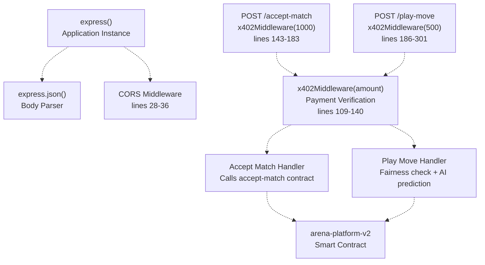
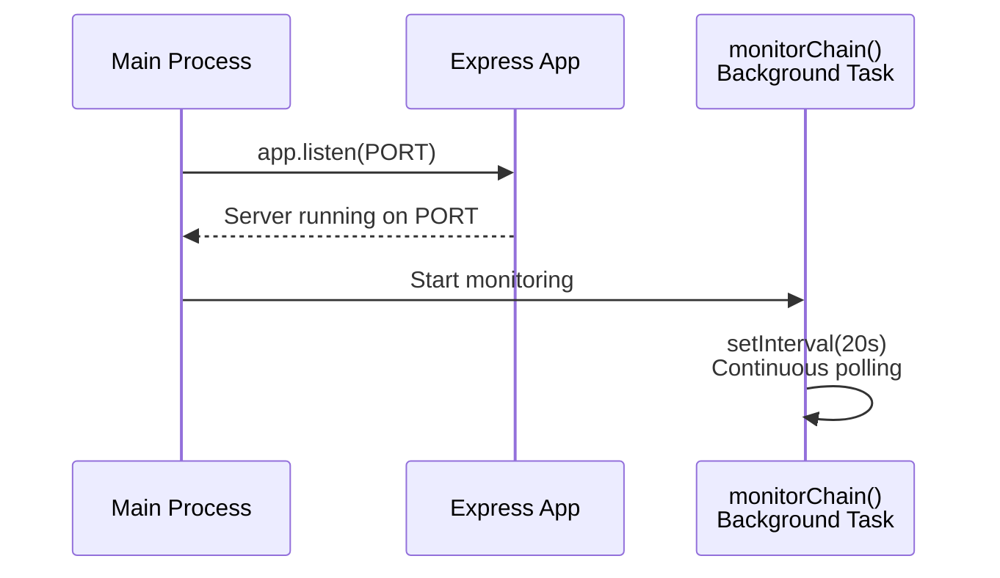
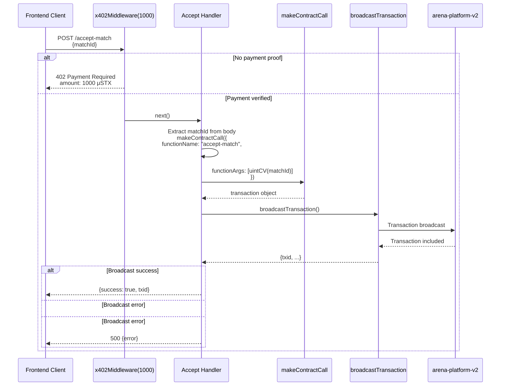
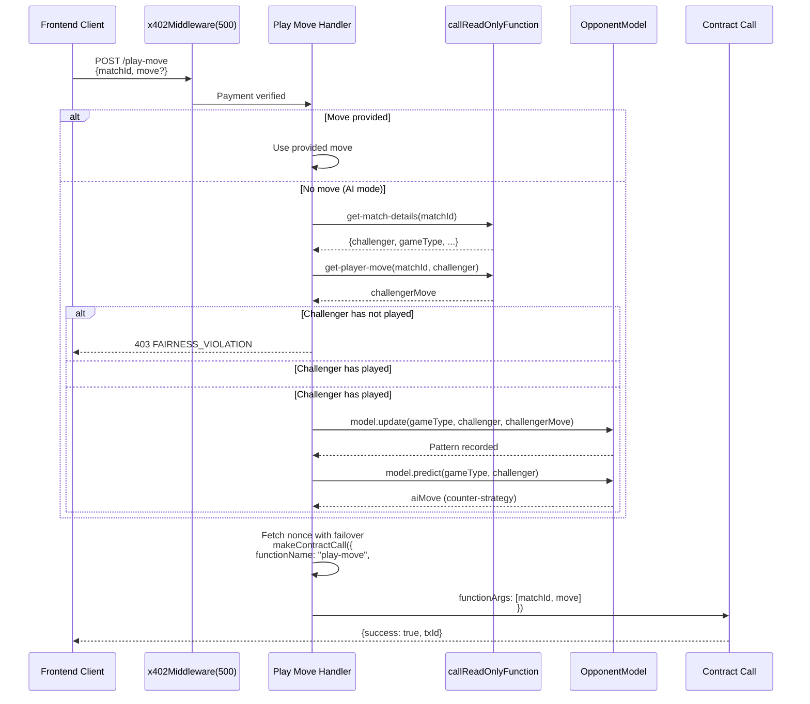
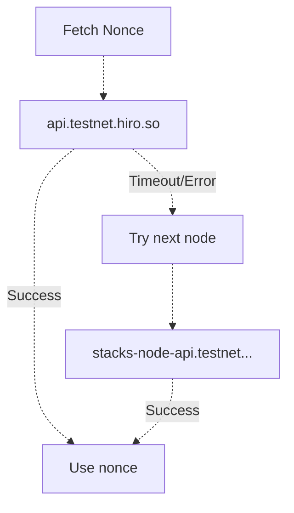
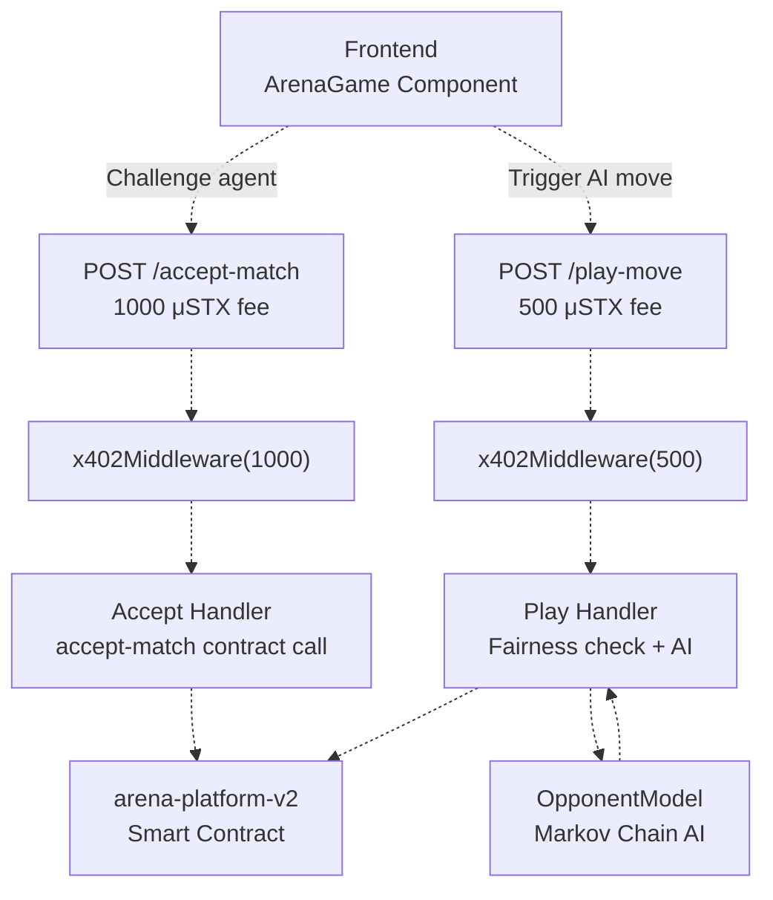

# Agent API Endpoints

> **Relevant source files**
> * [agent/.env.example](https://github.com/HACK3R-CRYPTO/GameArenaStacks/blob/23ba68fb/agent/.env.example)
> * [agent/src/ArenaAgent.ts](https://github.com/HACK3R-CRYPTO/GameArenaStacks/blob/23ba68fb/agent/src/ArenaAgent.ts)
> * [agent/src/SimpleAgent.ts](https://github.com/HACK3R-CRYPTO/GameArenaStacks/blob/23ba68fb/agent/src/SimpleAgent.ts)

This document describes the HTTP API endpoints exposed by the Arena Agent's Express server. These endpoints enable the frontend and external clients to interact with the autonomous AI agent, triggering match acceptance and move execution on the Stacks blockchain.

For information about the x402 payment protocol that protects these endpoints, see [x402 Payment Middleware](/HACK3R-CRYPTO/GameArenaStacks/3.2-x402-payment-middleware). For details on the AI strategy used when generating moves, see [Markov Chain AI Strategy](/HACK3R-CRYPTO/GameArenaStacks/3.3-markov-chain-ai-strategy). For the background monitoring process that auto-resolves matches, see [Chain Monitoring and Auto-Resolution](/HACK3R-CRYPTO/GameArenaStacks/3.4-chain-monitoring-and-auto-resolution).

## API Server Architecture

The agent runs an Express.js HTTP server that exposes two primary endpoints protected by x402 payment middleware. The server is configured in [agent/src/ArenaAgent.ts L26-L36](https://github.com/HACK3R-CRYPTO/GameArenaStacks/blob/23ba68fb/agent/src/ArenaAgent.ts#L26-L36)

 and listens on the port specified by the `PORT` environment variable (default: 3000).

### Express Application Structure



**Sources:** [agent/src/ArenaAgent.ts L26-L36](https://github.com/HACK3R-CRYPTO/GameArenaStacks/blob/23ba68fb/agent/src/ArenaAgent.ts#L26-L36)

 [agent/src/ArenaAgent.ts L143-L183](https://github.com/HACK3R-CRYPTO/GameArenaStacks/blob/23ba68fb/agent/src/ArenaAgent.ts#L143-L183)

 [agent/src/ArenaAgent.ts L186-L301](https://github.com/HACK3R-CRYPTO/GameArenaStacks/blob/23ba68fb/agent/src/ArenaAgent.ts#L186-L301)

### CORS Configuration

The agent configures Cross-Origin Resource Sharing (CORS) to allow frontend requests from any origin. The CORS middleware sets the following headers:

| Header | Value | Purpose |
| --- | --- | --- |
| `Access-Control-Allow-Origin` | `*` | Permit requests from any origin |
| `Access-Control-Allow-Headers` | `Origin, X-Requested-With, Content-Type, Accept, x-payment-proof, x-stacks-address` | Allow x402 payment headers |
| `Access-Control-Allow-Methods` | `GET, POST, OPTIONS` | Permit standard HTTP methods |

The middleware handles `OPTIONS` preflight requests by returning status 200 immediately on line 32-34.

**Sources:** [agent/src/ArenaAgent.ts L28-L36](https://github.com/HACK3R-CRYPTO/GameArenaStacks/blob/23ba68fb/agent/src/ArenaAgent.ts#L28-L36)

### Server Initialization

The server initialization sequence occurs on [agent/src/ArenaAgent.ts L477-L481](https://github.com/HACK3R-CRYPTO/GameArenaStacks/blob/23ba68fb/agent/src/ArenaAgent.ts#L477-L481)

:



**Sources:** [agent/src/ArenaAgent.ts L477-L481](https://github.com/HACK3R-CRYPTO/GameArenaStacks/blob/23ba68fb/agent/src/ArenaAgent.ts#L477-L481)

 [agent/src/ArenaAgent.ts L330-L475](https://github.com/HACK3R-CRYPTO/GameArenaStacks/blob/23ba68fb/agent/src/ArenaAgent.ts#L330-L475)

## POST /accept-match Endpoint

The `/accept-match` endpoint allows clients to request that the agent accept a pending match proposal. This endpoint requires a payment of **1000 microSTX** via the x402 protocol.

### Endpoint Specification

| Property | Value |
| --- | --- |
| **Path** | `/accept-match` |
| **Method** | `POST` |
| **Middleware** | `x402Middleware(1000)` |
| **Location** | [agent/src/ArenaAgent.ts L143-L183](https://github.com/HACK3R-CRYPTO/GameArenaStacks/blob/23ba68fb/agent/src/ArenaAgent.ts#L143-L183) |

### Request Format

The request must include the following components:

**Headers:**

* `Content-Type: application/json`
* `x-payment-proof: <base64-encoded-payment-receipt>` (for paid requests)
* `x-stacks-address: <sender-principal>` (for paid requests)

**Body:**

```json
{
  "matchId": 42
}
```

| Field | Type | Required | Description |
| --- | --- | --- | --- |
| `matchId` | `number` | Yes | The on-chain match identifier to accept |

### Response Format

**Success Response (200):**

```json
{
  "success": true,
  "txid": "0xabc123...",
  "message": "Match accepted on Stacks"
}
```

**Payment Required Response (402):**

```json
{
  "status": 402,
  "error": "Payment Required",
  "x402Version": 2,
  "resource": {
    "url": "/accept-match",
    "description": "Agent service fee"
  },
  "accepts": [{
    "scheme": "direct-payment",
    "network": "stacks-testnet",
    "token": "STX",
    "amount": "1000",
    "payTo": "ST1234..."
  }]
}
```

**Error Response (500):**

```json
{
  "error": "Broadcast failed: ..."
}
```

### Request Processing Flow



**Sources:** [agent/src/ArenaAgent.ts L143-L183](https://github.com/HACK3R-CRYPTO/GameArenaStacks/blob/23ba68fb/agent/src/ArenaAgent.ts#L143-L183)

 [agent/src/ArenaAgent.ts L109-L140](https://github.com/HACK3R-CRYPTO/GameArenaStacks/blob/23ba68fb/agent/src/ArenaAgent.ts#L109-L140)

### Implementation Details

The handler performs the following steps:

1. **Middleware Verification** (line 143): The `x402Middleware(1000)` validates payment before allowing the handler to execute
2. **Extract matchId** (line 144): Parse `matchId` from the request body
3. **Construct Transaction** (lines 151-161): Build a `makeContractCall` with: * `contractAddress`: `CONTRACT_ADDRESS` environment variable * `contractName`: `"arena-platform-v2"` * `functionName`: `"accept-match"` * `functionArgs`: `[uintCV(matchId)]` * `senderKey`: Agent's `PRIVATE_KEY` * `validateWithKnownAbi`: `false` (disabled to avoid indexer delays) * `anchorMode`: `AnchorMode.Any` * `postConditionMode`: `PostConditionMode.Allow`
4. **Broadcast Transaction** (line 165): Call `broadcastTransaction()` to submit to the Stacks network
5. **Handle Response** (lines 169-178): Check for broadcast errors and return appropriate JSON response

**Sources:** [agent/src/ArenaAgent.ts L143-L183](https://github.com/HACK3R-CRYPTO/GameArenaStacks/blob/23ba68fb/agent/src/ArenaAgent.ts#L143-L183)

## POST /play-move Endpoint

The `/play-move` endpoint executes a move in an active match. This endpoint requires a payment of **500 microSTX** via the x402 protocol. If no move is provided in the request, the agent uses its Markov Chain AI model to predict and generate an optimal move.

### Endpoint Specification

| Property | Value |
| --- | --- |
| **Path** | `/play-move` |
| **Method** | `POST` |
| **Middleware** | `x402Middleware(500)` |
| **Location** | [agent/src/ArenaAgent.ts L186-L301](https://github.com/HACK3R-CRYPTO/GameArenaStacks/blob/23ba68fb/agent/src/ArenaAgent.ts#L186-L301) |

### Request Format

**Headers:**

* `Content-Type: application/json`
* `x-payment-proof: <base64-encoded-payment-receipt>` (for paid requests)
* `x-stacks-address: <sender-principal>` (for paid requests)

**Body:**

```json
{
  "matchId": 42,
  "move": 1
}
```

| Field | Type | Required | Description |
| --- | --- | --- | --- |
| `matchId` | `number` | Yes | The on-chain match identifier |
| `move` | `number` | No | The move value (0-2 for RPS, 0-5 for Dice, 0-1 for Coin). If omitted, AI generates the move |

### Response Format

**Success Response (200):**

```json
{
  "success": true,
  "txId": "0xdef456..."
}
```

**Fairness Violation Response (403):**

```json
{
  "success": false,
  "error": "FAIRNESS_VIOLATION",
  "message": "AI only moves after the human has committed their move on-chain."
}
```

**Error Response (500):**

```json
{
  "error": "Broadcast failed: ..."
}
```

### Fairness Check and AI Prediction Flow



**Sources:** [agent/src/ArenaAgent.ts L186-L301](https://github.com/HACK3R-CRYPTO/GameArenaStacks/blob/23ba68fb/agent/src/ArenaAgent.ts#L186-L301)

 [agent/src/ArenaAgent.ts L63-L102](https://github.com/HACK3R-CRYPTO/GameArenaStacks/blob/23ba68fb/agent/src/ArenaAgent.ts#L63-L102)

### Fairness Check Implementation

The fairness check (lines 194-224) ensures the agent cannot front-run user moves. The process:

1. **Query Match Details** (lines 194-201): Call `get-match-details(matchId)` to retrieve challenger address and game type
2. **Check Challenger Move** (lines 207-214): Call `get-player-move(matchId, challenger)` to verify the challenger has committed a move on-chain
3. **Enforce Fairness** (lines 217-224): If the challenger has not played, return HTTP 403 with error code `FAIRNESS_VIOLATION`
4. **Record and Predict** (lines 227-232): If the challenger has played: * Update the `OpponentModel` with the challenger's move via `model.update()` * Generate a counter-move using `model.predict()`

This ensures the agent **strictly waits** for on-chain move confirmation before responding, preventing any possibility of front-running.

**Sources:** [agent/src/ArenaAgent.ts L194-L236](https://github.com/HACK3R-CRYPTO/GameArenaStacks/blob/23ba68fb/agent/src/ArenaAgent.ts#L194-L236)

### Nonce Fetching with Multi-Node Failover

The endpoint implements resilient nonce fetching with automatic failover across multiple Stacks RPC nodes (lines 245-266):



The nonce fetching logic:

1. Iterate through the `nodes` array (lines 246-249)
2. For each node, attempt to fetch from `/extended/v1/address/${address}/nonces` with a 15-second timeout
3. On success, extract `possible_next_nonce` and break the loop
4. On failure, log a warning and continue to the next node
5. If all nodes fail, the nonce defaults to 0

**Sources:** [agent/src/ArenaAgent.ts L245-L266](https://github.com/HACK3R-CRYPTO/GameArenaStacks/blob/23ba68fb/agent/src/ArenaAgent.ts#L245-L266)

### Transaction Construction and Broadcasting

After determining the move and fetching the nonce, the handler constructs and broadcasts the transaction (lines 268-297):

| Transaction Option | Value | Description |
| --- | --- | --- |
| `contractAddress` | `CONTRACT_ADDRESS` env var | Target contract address |
| `contractName` | `"arena-platform-v2"` | Contract name |
| `functionName` | `"play-move"` | Contract function to call |
| `functionArgs` | `[uintCV(matchId), uintCV(move)]` | Match ID and move value |
| `senderKey` | `PRIVATE_KEY` env var | Agent's private key |
| `network` | `StacksTestnet` instance | Network configuration |
| `anchorMode` | `1` (AnchorMode.Any) | Transaction anchor mode |
| `postConditionMode` | `1` (PostConditionMode.Deny) | Strict post-condition enforcement |
| `nonce` | `BigInt(nonce)` | Fetched nonce (if > 0) |

The transaction is then broadcast using `broadcastTransaction()`, which returns either a success response with `txid` or an error.

**Sources:** [agent/src/ArenaAgent.ts L268-L297](https://github.com/HACK3R-CRYPTO/GameArenaStacks/blob/23ba68fb/agent/src/ArenaAgent.ts#L268-L297)

## Error Handling Patterns

The API implements several error handling patterns across both endpoints:

### Broadcast Errors

When `broadcastTransaction()` returns an error (lines 169-172 for `/accept-match`, lines 290-294 for `/play-move`):

```
if (broadcastResponse.error) {
    console.error(`Broadcast failed: ${broadcastResponse.error}`);
    throw new Error(`Broadcast failed: ${broadcastResponse.error}`);
}
```

The handler logs the error and either throws (in `/accept-match`) or returns a 500 response (in `/play-move`).

### Network Timeout Handling

Network requests use `AbortSignal.timeout(15000)` on line 255 to prevent hanging requests when fetching nonces. If the timeout expires, the request is aborted and the handler attempts the next node.

### Try-Catch Wrappers

Both endpoints wrap their logic in try-catch blocks:

* `/accept-match`: Catches errors on lines 179-182 and returns 500 with error message
* `/play-move`: Catches errors on lines 298-300 and returns 500 with error message

### Fairness Violation Response

The `/play-move` endpoint returns a specific 403 response when the fairness check fails (lines 219-223):

```yaml
return res.status(403).json({
    success: false,
    error: 'FAIRNESS_VIOLATION',
    message: 'AI only moves after the human has committed their move on-chain.'
});
```

This provides clear feedback to clients when attempting to trigger AI moves prematurely.

**Sources:** [agent/src/ArenaAgent.ts L169-L172](https://github.com/HACK3R-CRYPTO/GameArenaStacks/blob/23ba68fb/agent/src/ArenaAgent.ts#L169-L172)

 [agent/src/ArenaAgent.ts L179-L182](https://github.com/HACK3R-CRYPTO/GameArenaStacks/blob/23ba68fb/agent/src/ArenaAgent.ts#L179-L182)

 [agent/src/ArenaAgent.ts L219-L223](https://github.com/HACK3R-CRYPTO/GameArenaStacks/blob/23ba68fb/agent/src/ArenaAgent.ts#L219-L223)

 [agent/src/ArenaAgent.ts L290-L300](https://github.com/HACK3R-CRYPTO/GameArenaStacks/blob/23ba68fb/agent/src/ArenaAgent.ts#L290-L300)

## Environment Configuration

The API server requires the following environment variables, documented in [agent/.env.example L1-L16](https://github.com/HACK3R-CRYPTO/GameArenaStacks/blob/23ba68fb/agent/.env.example#L1-L16)

:

| Variable | Default | Description |
| --- | --- | --- |
| `PRIVATE_KEY` | *required* | Agent's Stacks wallet private key |
| `NETWORK_TYPE` | `"testnet"` | Network type (`"testnet"` or `"mainnet"`) |
| `CONTRACT_ADDRESS` | `ST3V7NY32G2T67PVPBP3WVC1B228D7N2MCCAWW5F9` | Deployed contract address |
| `PORT` | `3000` | HTTP server port |
| `X402_FACILITATOR_URL` | `https://v2.x402stacks.xyz` | x402 facilitator endpoint (unused in current implementation) |

These constants are loaded on [agent/src/ArenaAgent.ts L40-L48](https://github.com/HACK3R-CRYPTO/GameArenaStacks/blob/23ba68fb/agent/src/ArenaAgent.ts#L40-L48)

 and used throughout the API implementation.

**Sources:** [agent/.env.example L1-L16](https://github.com/HACK3R-CRYPTO/GameArenaStacks/blob/23ba68fb/agent/.env.example#L1-L16)

 [agent/src/ArenaAgent.ts L40-L48](https://github.com/HACK3R-CRYPTO/GameArenaStacks/blob/23ba68fb/agent/src/ArenaAgent.ts#L40-L48)

## API Integration Summary



The agent's API endpoints serve as the bridge between the frontend user interface and the autonomous agent's blockchain interactions. The x402 middleware ensures all services are monetized, while the fairness checks and Markov Chain AI provide trustworthy and strategic gameplay.

**Sources:** [agent/src/ArenaAgent.ts L143-L301](https://github.com/HACK3R-CRYPTO/GameArenaStacks/blob/23ba68fb/agent/src/ArenaAgent.ts#L143-L301)

 [agent/src/ArenaAgent.ts L109-L140](https://github.com/HACK3R-CRYPTO/GameArenaStacks/blob/23ba68fb/agent/src/ArenaAgent.ts#L109-L140)

 [agent/src/ArenaAgent.ts L63-L102](https://github.com/HACK3R-CRYPTO/GameArenaStacks/blob/23ba68fb/agent/src/ArenaAgent.ts#L63-L102)