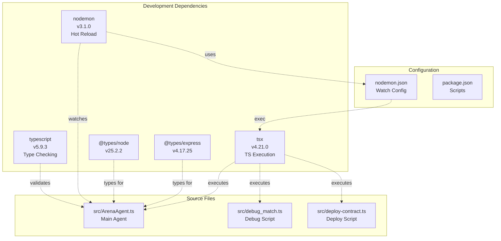
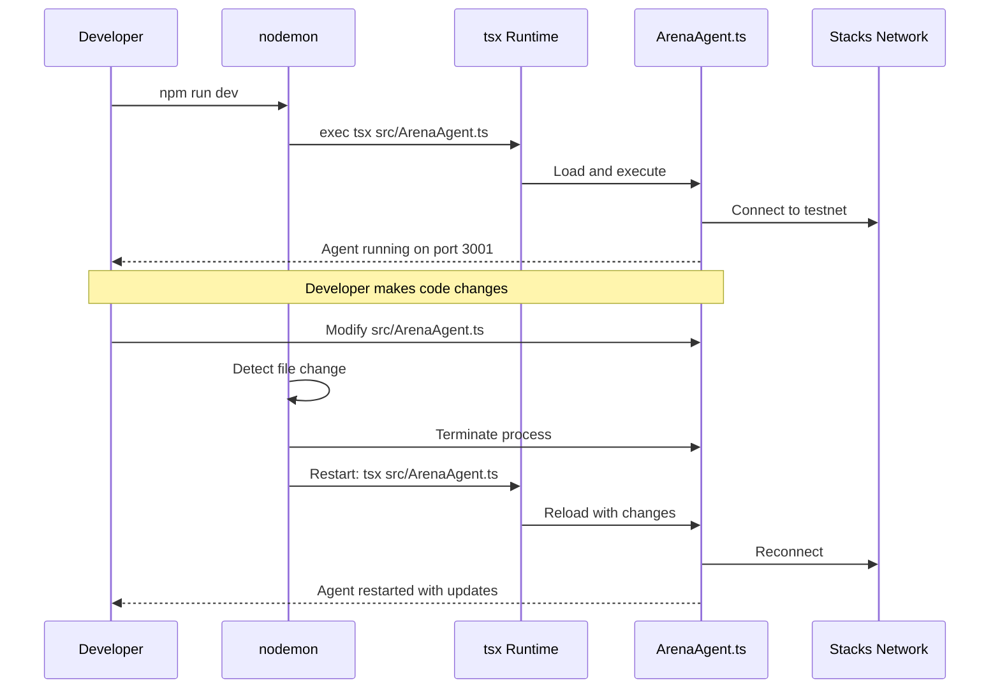
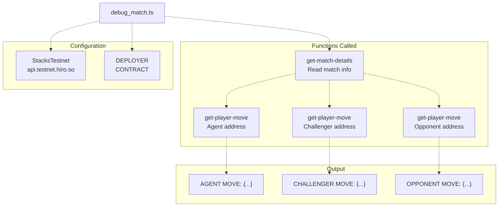
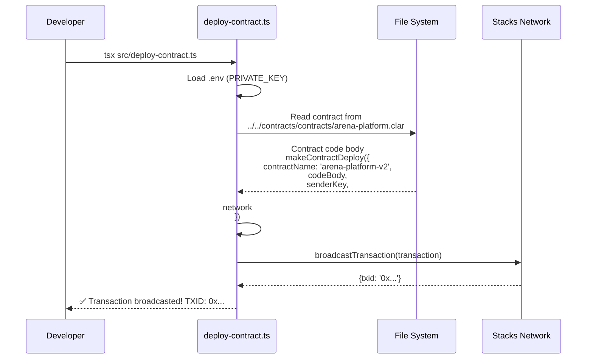
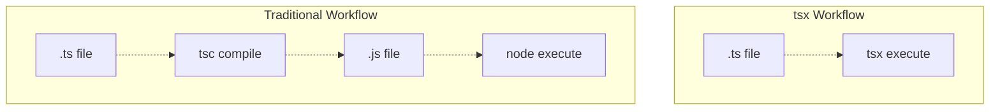
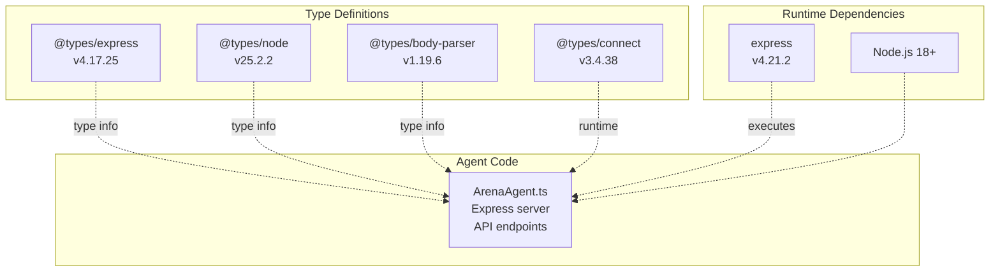
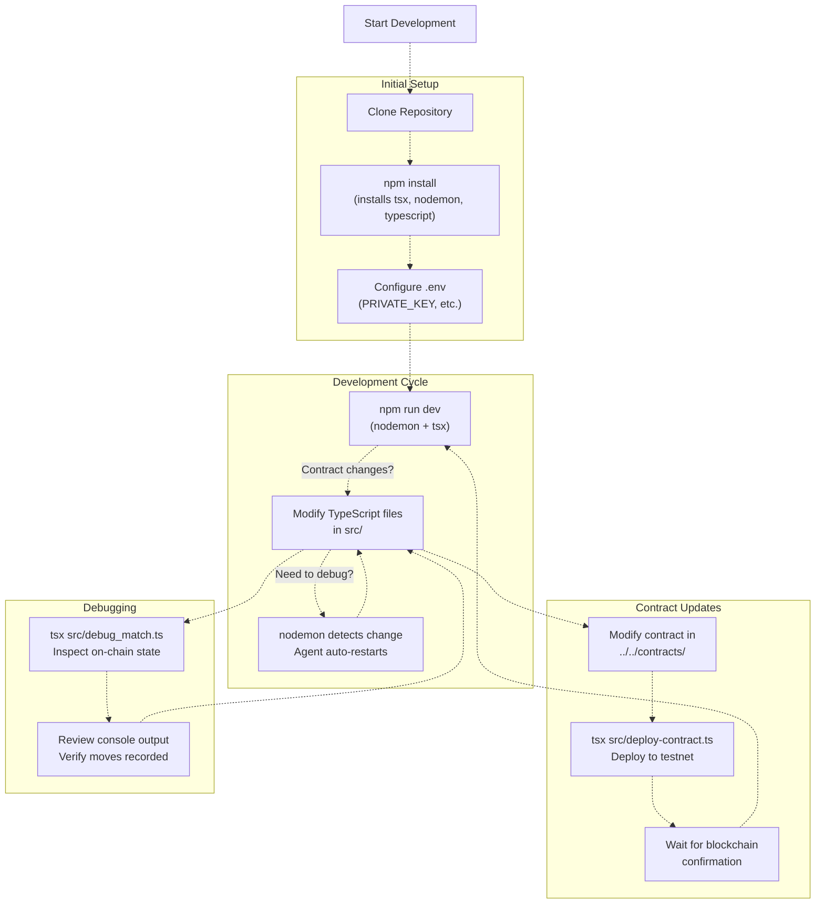

# Agent Development Tools

> **Relevant source files**
> * [agent/nodemon.json](https://github.com/HACK3R-CRYPTO/GameArenaStacks/blob/23ba68fb/agent/nodemon.json)
> * [agent/package-lock.json](https://github.com/HACK3R-CRYPTO/GameArenaStacks/blob/23ba68fb/agent/package-lock.json)
> * [agent/src/debug_match.ts](https://github.com/HACK3R-CRYPTO/GameArenaStacks/blob/23ba68fb/agent/src/debug_match.ts)
> * [agent/src/deploy-contract.ts](https://github.com/HACK3R-CRYPTO/GameArenaStacks/blob/23ba68fb/agent/src/deploy-contract.ts)

This document describes the development utilities, debugging scripts, and deployment tools available for agent development in the GameArenaStacks ecosystem. These tools facilitate rapid development iteration, on-chain debugging, and smart contract deployment from the agent environment.

For information about agent installation and initial configuration, see [Agent Setup and Configuration](/HACK3R-CRYPTO/GameArenaStacks/3.1-agent-setup-and-configuration). For details about the production agent architecture and API endpoints, see [Agent API Endpoints](/HACK3R-CRYPTO/GameArenaStacks/3.5-agent-api-endpoints).

---

## Development Toolchain Overview

The agent development environment is built on Node.js with TypeScript and includes specialized tools for hot-reloading, on-chain debugging, and contract deployment.

### TypeScript Development Stack

The agent uses a modern TypeScript development stack optimized for rapid iteration:

| Tool | Version | Purpose |
| --- | --- | --- |
| `typescript` | 5.9.3 | Type checking and compilation |
| `tsx` | 4.21.0 | Fast TypeScript execution without pre-compilation |
| `nodemon` | 3.1.0 | File watching and automatic restart on changes |
| `@types/node` | 25.2.2 | Node.js type definitions |
| `@types/express` | 4.17.25 | Express type definitions |

**Sources:** [agent/package-lock.json L20-L26](https://github.com/HACK3R-CRYPTO/GameArenaStacks/blob/23ba68fb/agent/package-lock.json#L20-L26)



**Title:** Agent Development Toolchain Architecture

**Sources:** [agent/package-lock.json L20-L26](https://github.com/HACK3R-CRYPTO/GameArenaStacks/blob/23ba68fb/agent/package-lock.json#L20-L26)

 [agent/nodemon.json L1-L12](https://github.com/HACK3R-CRYPTO/GameArenaStacks/blob/23ba68fb/agent/nodemon.json#L1-L12)

---

## Hot Reload Configuration with nodemon

The `nodemon` configuration enables automatic agent restart during development when TypeScript files change.

### nodemon.json Configuration

The agent includes a pre-configured `nodemon.json` that watches the `src` directory for TypeScript file changes:

```json
{
    "watch": ["src"],
    "ext": "ts",
    "ignore": [
        "src/**/*.test.ts",
        "src/**/*.spec.ts",
        "node_modules"
    ],
    "exec": "tsx src/ArenaAgent.ts"
}
```

**Configuration Details:**

| Field | Value | Purpose |
| --- | --- | --- |
| `watch` | `["src"]` | Monitor all files in the `src` directory |
| `ext` | `"ts"` | Only watch TypeScript files |
| `ignore` | Test files, node_modules | Exclude test files and dependencies |
| `exec` | `"tsx src/ArenaAgent.ts"` | Execute the main agent using `tsx` |

**Sources:** [agent/nodemon.json L1-L12](https://github.com/HACK3R-CRYPTO/GameArenaStacks/blob/23ba68fb/agent/nodemon.json#L1-L12)

### Development Workflow



**Title:** Hot Reload Development Cycle

**Sources:** [agent/nodemon.json L1-L12](https://github.com/HACK3R-CRYPTO/GameArenaStacks/blob/23ba68fb/agent/nodemon.json#L1-L12)

---

## Debugging Scripts

### debug_match.ts - On-Chain Match State Inspector

The `debug_match.ts` script provides a command-line utility to inspect match state directly from the Stacks blockchain, allowing developers to verify that moves were recorded correctly and troubleshoot match resolution issues.

**Script Structure:**



**Title:** debug_match.ts Execution Flow

**Sources:** [agent/src/debug_match.ts L1-L73](https://github.com/HACK3R-CRYPTO/GameArenaStacks/blob/23ba68fb/agent/src/debug_match.ts#L1-L73)

**Key Functions:**

1. **checkMoves()** - Main function that queries match state [agent/src/debug_match.ts L9-L70](https://github.com/HACK3R-CRYPTO/GameArenaStacks/blob/23ba68fb/agent/src/debug_match.ts#L9-L70) * Reads match details using `get-match-details` contract function * Extracts challenger and opponent addresses from match details * Queries each player's move using `get-player-move` * Logs all moves in JSON format for inspection

**Usage:**

```
tsx src/debug_match.ts
```

**Configuration Variables:**

| Variable | Value | Purpose |
| --- | --- | --- |
| `network` | `StacksTestnet` at `api.testnet.hiro.so` | Network endpoint |
| `DEPLOYER` | `ST3273FDNHADRB84GK2C0GWQQW9WXZGR1V5GAR0MA` | Contract deployer address |
| `CONTRACT` | `arena-platform-v2` | Contract name |
| `matchId` | `2` (hardcoded, can be modified) | Match to inspect |

**Sources:** [agent/src/debug_match.ts L5-L11](https://github.com/HACK3R-CRYPTO/GameArenaStacks/blob/23ba68fb/agent/src/debug_match.ts#L5-L11)

**Example Output:**

The script outputs the move state for all players in a match:

```yaml
Checking match 2 on-chain...
Challenger: ST1PQHQKV0RJXZFY1DGX8MNSNYVE3VGZJSRTPGZGM
Opponent: ST3273FDNHADRB84GK2C0GWQQW9WXZGR1V5GAR0MA
AGENT MOVE: {"value":{"value":"1"},"type":"(optional uint)"}
CHALLENGER MOVE: {"value":{"value":"2"},"type":"(optional uint)"}
OPPONENT MOVE: {"value":{"value":"1"},"type":"(optional uint)"}
```

**Sources:** [agent/src/debug_match.ts L16-L70](https://github.com/HACK3R-CRYPTO/GameArenaStacks/blob/23ba68fb/agent/src/debug_match.ts#L16-L70)

---

## Contract Deployment Tools

### deploy-contract.ts - Smart Contract Deployment Script

The `deploy-contract.ts` script enables developers to deploy or redeploy smart contracts directly from the agent development environment. This is useful for testing contract modifications or deploying to new environments.

**Deployment Flow:**



**Title:** Contract Deployment Process

**Sources:** [agent/src/deploy-contract.ts L1-L62](https://github.com/HACK3R-CRYPTO/GameArenaStacks/blob/23ba68fb/agent/src/deploy-contract.ts#L1-L62)

**Key Configuration:**

| Parameter | Source | Purpose |
| --- | --- | --- |
| `PRIVATE_KEY` | `.env` file | Signs deployment transaction |
| `network` | `StacksTestnet()` | Target network for deployment |
| `contractPath` | `../../contracts/contracts/arena-platform.clar` | Contract source file |
| `contractName` | `arena-platform-v2` | Name for deployed contract |

**Sources:** [agent/src/deploy-contract.ts L19-L40](https://github.com/HACK3R-CRYPTO/GameArenaStacks/blob/23ba68fb/agent/src/deploy-contract.ts#L19-L40)

**Transaction Options:**

The script configures deployment transactions with the following settings:

* **anchorMode:** `AnchorMode.Any` - Can be included in microblock or anchor block
* **postConditionMode:** `PostConditionMode.Allow` - Permits all asset transfers
* **senderKey:** From `PRIVATE_KEY` environment variable
* **network:** `StacksTestnet` instance

**Sources:** [agent/src/deploy-contract.ts L38-L45](https://github.com/HACK3R-CRYPTO/GameArenaStacks/blob/23ba68fb/agent/src/deploy-contract.ts#L38-L45)

**Error Handling:**

The script checks for broadcast errors and displays detailed error information:

```
if (broadcastResponse.error) {
    console.error('Broadcast failed:', broadcastResponse.error);
    console.error('Reason:', broadcastResponse.reason);
    return;
}
```

**Sources:** [agent/src/deploy-contract.ts L50-L54](https://github.com/HACK3R-CRYPTO/GameArenaStacks/blob/23ba68fb/agent/src/deploy-contract.ts#L50-L54)

**Usage:**

```markdown
# Ensure PRIVATE_KEY is set in .env
tsx src/deploy-contract.ts
```

---

## TypeScript Execution with tsx

The `tsx` package enables direct execution of TypeScript files without a separate compilation step, significantly speeding up the development cycle.

### tsx Features in Agent Development



**Title:** tsx vs Traditional TypeScript Compilation

**Sources:** [agent/package-lock.json L24](https://github.com/HACK3R-CRYPTO/GameArenaStacks/blob/23ba68fb/agent/package-lock.json#L24-L24)

**Commands Powered by tsx:**

| Script | Command | Purpose |
| --- | --- | --- |
| Debug Match | `tsx src/debug_match.ts` | Inspect on-chain match state |
| Deploy Contract | `tsx src/deploy-contract.ts` | Deploy smart contracts |
| Run Agent | `tsx src/ArenaAgent.ts` | Execute main agent (via nodemon) |

**Sources:** [agent/nodemon.json L11](https://github.com/HACK3R-CRYPTO/GameArenaStacks/blob/23ba68fb/agent/nodemon.json#L11-L11)

 [agent/src/debug_match.ts L1](https://github.com/HACK3R-CRYPTO/GameArenaStacks/blob/23ba68fb/agent/src/debug_match.ts#L1-L1)

 [agent/src/deploy-contract.ts L1](https://github.com/HACK3R-CRYPTO/GameArenaStacks/blob/23ba68fb/agent/src/deploy-contract.ts#L1-L1)

---

## Development Dependencies

The agent includes comprehensive type definitions for TypeScript development:



**Title:** TypeScript Type Definitions for Agent Development

**Sources:** [agent/package-lock.json L573-L672](https://github.com/HACK3R-CRYPTO/GameArenaStacks/blob/23ba68fb/agent/package-lock.json#L573-L672)

### Type Definition Packages

The following type definitions are installed as dev dependencies:

* **@types/express** - Type definitions for Express.js framework [agent/package-lock.json L573-L584](https://github.com/HACK3R-CRYPTO/GameArenaStacks/blob/23ba68fb/agent/package-lock.json#L573-L584)
* **@types/node** - Type definitions for Node.js runtime [agent/package-lock.json L613-L620](https://github.com/HACK3R-CRYPTO/GameArenaStacks/blob/23ba68fb/agent/package-lock.json#L613-L620)
* **@types/body-parser** - Type definitions for body-parser middleware [agent/package-lock.json L552-L561](https://github.com/HACK3R-CRYPTO/GameArenaStacks/blob/23ba68fb/agent/package-lock.json#L552-L561)
* **@types/connect** - Type definitions for Connect middleware [agent/package-lock.json L563-L571](https://github.com/HACK3R-CRYPTO/GameArenaStacks/blob/23ba68fb/agent/package-lock.json#L563-L571)

These enable full IntelliSense and type checking in IDEs and prevent runtime type errors.

**Sources:** [agent/package-lock.json L20-L26](https://github.com/HACK3R-CRYPTO/GameArenaStacks/blob/23ba68fb/agent/package-lock.json#L20-L26)

---

## Development Workflow Summary



**Title:** Complete Agent Development Workflow

**Sources:** [agent/nodemon.json L1-L12](https://github.com/HACK3R-CRYPTO/GameArenaStacks/blob/23ba68fb/agent/nodemon.json#L1-L12)

 [agent/src/debug_match.ts L1-L73](https://github.com/HACK3R-CRYPTO/GameArenaStacks/blob/23ba68fb/agent/src/debug_match.ts#L1-L73)

 [agent/src/deploy-contract.ts L1-L62](https://github.com/HACK3R-CRYPTO/GameArenaStacks/blob/23ba68fb/agent/src/deploy-contract.ts#L1-L62)

---

## File Structure Reference

```markdown
agent/
├── package-lock.json      # Locked dependency versions including dev tools
├── nodemon.json           # Hot reload configuration
└── src/
    ├── ArenaAgent.ts      # Main agent implementation
    ├── debug_match.ts     # On-chain state debugging script
    └── deploy-contract.ts # Contract deployment script
```

**Sources:** [agent/package-lock.json L1](https://github.com/HACK3R-CRYPTO/GameArenaStacks/blob/23ba68fb/agent/package-lock.json#L1-L1)

 [agent/nodemon.json L1](https://github.com/HACK3R-CRYPTO/GameArenaStacks/blob/23ba68fb/agent/nodemon.json#L1-L1)

 [agent/src/debug_match.ts L1](https://github.com/HACK3R-CRYPTO/GameArenaStacks/blob/23ba68fb/agent/src/debug_match.ts#L1-L1)

 [agent/src/deploy-contract.ts L1](https://github.com/HACK3R-CRYPTO/GameArenaStacks/blob/23ba68fb/agent/src/deploy-contract.ts#L1-L1)