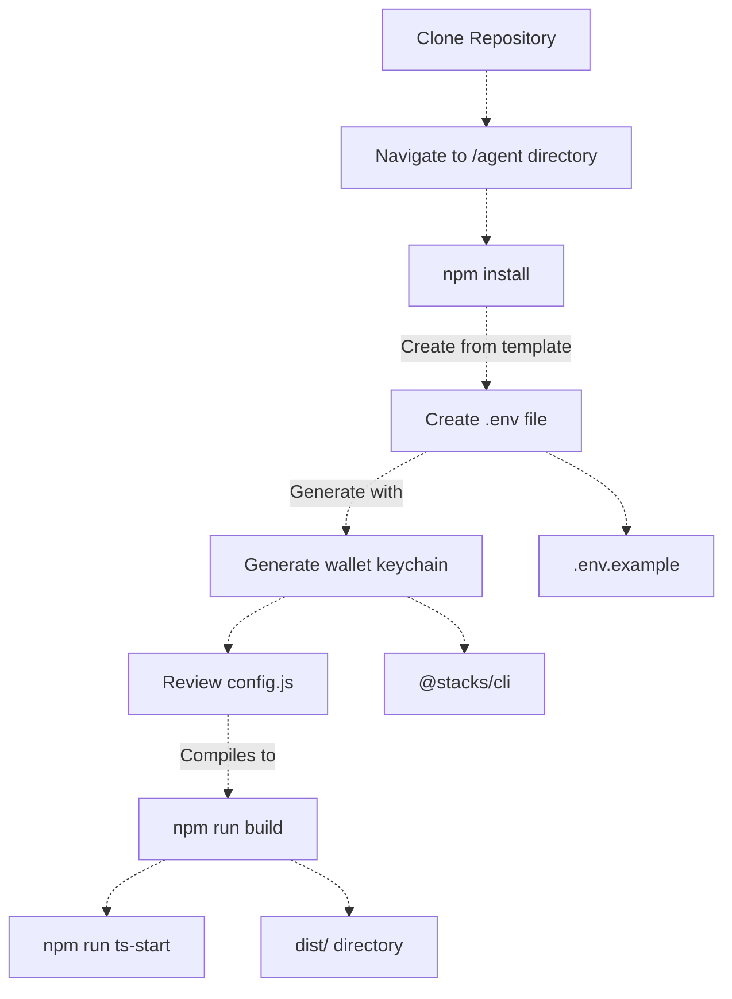
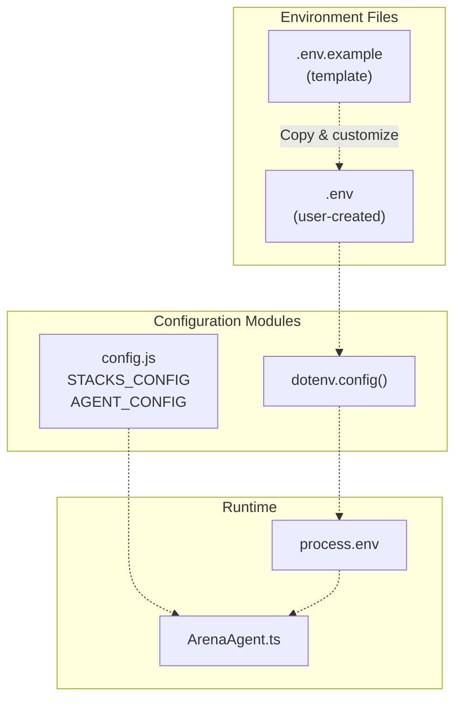

# Agent Setup and Configuration

> **Relevant source files**
> * [agent/Procfile](https://github.com/HACK3R-CRYPTO/GameArenaStacks/blob/23ba68fb/agent/Procfile)
> * [agent/README.md](https://github.com/HACK3R-CRYPTO/GameArenaStacks/blob/23ba68fb/agent/README.md)
> * [agent/agent_keychain.json](https://github.com/HACK3R-CRYPTO/GameArenaStacks/blob/23ba68fb/agent/agent_keychain.json)
> * [agent/package.json](https://github.com/HACK3R-CRYPTO/GameArenaStacks/blob/23ba68fb/agent/package.json)
> * [agent/src/config.js](https://github.com/HACK3R-CRYPTO/GameArenaStacks/blob/23ba68fb/agent/src/config.js)

This document covers the installation, configuration, and deployment of the autonomous AI agent. It includes environment variable setup, wallet configuration, dependency installation, and execution modes. For information about the agent's x402 payment system, see [x402 Payment Middleware](/HACK3R-CRYPTO/GameArenaStacks/3.2-x402-payment-middleware). For details on the AI strategy implementation, see [Markov Chain AI Strategy](/HACK3R-CRYPTO/GameArenaStacks/3.3-markov-chain-ai-strategy). For API endpoint documentation, see [Agent API Endpoints](/HACK3R-CRYPTO/GameArenaStacks/3.5-agent-api-endpoints).

---

## Purpose and Scope

The agent is a Node.js application that autonomously participates in GameArena matches by:

* Accepting match proposals through an Express API server
* Executing strategic moves using Markov Chain modeling
* Monetizing services via the x402-stacks protocol
* Monitoring the Stacks blockchain for match state changes

This page documents the complete setup process from initial installation to production deployment.

---

## Prerequisites

The agent requires the following runtime environment:

| Requirement | Version | Purpose |
| --- | --- | --- |
| Node.js | 18.x or higher | JavaScript runtime |
| npm | 8.x or higher | Package manager |
| TypeScript | 5.9.3 | Language compiler |
| Stacks Wallet | N/A | Agent identity (private key) |

**Sources:** [agent/package.json L24-L29](https://github.com/HACK3R-CRYPTO/GameArenaStacks/blob/23ba68fb/agent/package.json#L24-L29)

---

## Installation Process

### Setup Flow Diagram



**Sources:** [agent/package.json L7-L11](https://github.com/HACK3R-CRYPTO/GameArenaStacks/blob/23ba68fb/agent/package.json#L7-L11)

 [agent/README.md L34-L38](https://github.com/HACK3R-CRYPTO/GameArenaStacks/blob/23ba68fb/agent/README.md#L34-L38)

### Step 1: Clone and Navigate

```
git clone https://github.com/HACK3R-CRYPTO/GameArenaStacks.git
cd GameArenaStacks/agent
```

### Step 2: Install Dependencies

The `npm install` command installs both production and development dependencies:

```
npm install
```

This installs packages defined in [agent/package.json L13-L29](https://github.com/HACK3R-CRYPTO/GameArenaStacks/blob/23ba68fb/agent/package.json#L13-L29)

:

**Production Dependencies:**

* `@stacks/transactions@6.13.0` - Transaction construction
* `@stacks/network@6.13.0` - Network configuration
* `@stacks/common@6.13.0` - Common utilities
* `express@4.21.2` - Web framework
* `x402-stacks@2.0.1` - Payment middleware
* `dotenv@17.2.4` - Environment variable loading
* `chalk@5.6.2` - Terminal styling
* `axios@1.13.5` - HTTP client

**Development Dependencies:**

* `tsx@4.21.0` - TypeScript execution
* `typescript@5.9.3` - TypeScript compiler
* `@types/node@25.2.2` - Node.js type definitions
* `@types/express@4.17.21` - Express type definitions
* `nodemon@3.1.0` - Development auto-reload

**Sources:** [agent/package.json L13-L29](https://github.com/HACK3R-CRYPTO/GameArenaStacks/blob/23ba68fb/agent/package.json#L13-L29)

---

## Environment Configuration

### Configuration Architecture



**Sources:** [agent/package.json L19](https://github.com/HACK3R-CRYPTO/GameArenaStacks/blob/23ba68fb/agent/package.json#L19-L19)

 [agent/src/config.js L1-L28](https://github.com/HACK3R-CRYPTO/GameArenaStacks/blob/23ba68fb/agent/src/config.js#L1-L28)

### Required Environment Variables

Create a `.env` file in the `agent/` directory with the following variables:

| Variable | Description | Example Value |
| --- | --- | --- |
| `STACKS_PRIVATE_KEY` | Agent's Stacks wallet private key | `cc1a5d9041e27cf249d58ca665ec9deccef48f58...` |
| `AGENT_MNEMONIC` | BIP39 mnemonic phrase (optional) | `color cupboard catch survey...` |
| `PORT` | Express server port | `3000` |
| `NODE_ENV` | Execution environment | `development` or `production` |
| `STACKS_NETWORK` | Target network | `testnet` or `mainnet` |

**Example `.env` file:**

```
STACKS_PRIVATE_KEY=cc1a5d9041e27cf249d58ca665ec9deccef48f58f6819df1a7cad39d52319d8901
AGENT_MNEMONIC=color cupboard catch survey leader shoulder firm tumble entry lake resemble flash
PORT=3000
NODE_ENV=development
STACKS_NETWORK=testnet
```

**Sources:** [agent/package.json L19](https://github.com/HACK3R-CRYPTO/GameArenaStacks/blob/23ba68fb/agent/package.json#L19-L19)

 [agent/agent_keychain.json L8](https://github.com/HACK3R-CRYPTO/GameArenaStacks/blob/23ba68fb/agent/agent_keychain.json#L8-L8)

---

## Wallet Setup and Keychain Generation

### Agent Identity Requirements

The agent requires a Stacks wallet to:

1. Sign and broadcast transactions to accept matches
2. Execute moves in active games
3. Receive prize winnings from successful matches
4. Register identity in the `agent-registry` contract

### Generating a New Wallet

Use the `@stacks/cli` tool to generate a new keychain:

```
npx @stacks/cli make_keychain -t 2>/dev/null | tail -n 1 > agent_keychain.json
```

This generates a JSON object with:

* `mnemonic`: BIP39 seed phrase
* `privateKey`: Hexadecimal private key
* `publicKey`: Compressed public key
* `address`: Stacks address (ST... for testnet)
* `btcAddress`: Bitcoin address
* `wif`: Wallet Import Format key

**Example output** from [agent/agent_keychain.json L8](https://github.com/HACK3R-CRYPTO/GameArenaStacks/blob/23ba68fb/agent/agent_keychain.json#L8-L8)

:

```
{
  "mnemonic": "color cupboard catch survey leader shoulder...",
  "keyInfo": {
    "privateKey": "cc1a5d9041e27cf249d58ca665ec9deccef48f58f6819df1a7cad39d52319d8901",
    "address": "ST3273FDNHADRB84GK2C0GWQQW9WXZGR1V5GAR0MA",
    ...
  }
}
```

### Wallet Funding

For testnet deployment, fund the agent's address:

1. Copy the `address` field from `agent_keychain.json`
2. Visit the [Stacks Testnet Faucet](https://explorer.stacks.co/sandbox/faucet?chain=testnet)
3. Request test STX tokens
4. Verify balance on [Stacks Explorer](https://explorer.stacks.co/)

The agent needs sufficient STX to:

* Pay transaction fees (~0.001 STX per transaction)
* Wager in matches (minimum 1000 microSTX)
* Register in the agent registry

**Sources:** [agent/agent_keychain.json L1-L9](https://github.com/HACK3R-CRYPTO/GameArenaStacks/blob/23ba68fb/agent/agent_keychain.json#L1-L9)

---

## Configuration Structure

### Configuration Files Mapping

```mermaid
flowchart TD

ConfigJS["config.js"]
StacksConfig["STACKS_CONFIG<br>Line 2-11"]
AgentConfig["AGENT_CONFIG<br>Line 14-22"]
DefaultExport["default export<br>Line 24-27"]
Network["NETWORK: 'testnet'"]
ApiUrl["API_URL: 'api.testnet.hiro.so'"]
Deployer["DEPLOYER_ADDRESS"]
Platform["ARENA_PLATFORM"]
Registry["AGENT_REGISTRY"]
Traits["TRAITS"]
Name["NAME: 'Markov-1'"]
Model["MODEL: 'Markov Chain'"]
Description["DESCRIPTION"]
Port["PORT: 3000"]
Host["HOST: 'localhost'"]

StacksConfig -.-> Network
StacksConfig -.-> ApiUrl
StacksConfig -.-> Deployer
StacksConfig -.-> Platform
StacksConfig -.-> Registry
StacksConfig -.-> Traits
AgentConfig -.-> Name
AgentConfig -.-> Model
AgentConfig -.-> Description
AgentConfig -.-> Port
AgentConfig -.-> Host

subgraph subGraph2 ["AGENT_CONFIG Properties"]
    Name
    Model
    Description
    Port
    Host
end

subgraph subGraph1 ["STACKS_CONFIG Properties"]
    Network
    ApiUrl
    Deployer
    Platform
    Registry
    Traits
end

subgraph subGraph0 ["Static Configuration"]
    ConfigJS
    StacksConfig
    AgentConfig
    DefaultExport
    ConfigJS -.-> StacksConfig
    ConfigJS -.-> AgentConfig
    StacksConfig -.-> DefaultExport
    AgentConfig -.-> DefaultExport
end
```



**Sources:** [agent/src/config.js L1-L28](https://github.com/HACK3R-CRYPTO/GameArenaStacks/blob/23ba68fb/agent/src/config.js#L1-L28)

### STACKS_CONFIG Object

Defined in [agent/src/config.js L2-L11](https://github.com/HACK3R-CRYPTO/GameArenaStacks/blob/23ba68fb/agent/src/config.js#L2-L11)

 this object contains blockchain-specific settings:

| Property | Value | Purpose |
| --- | --- | --- |
| `NETWORK` | `'testnet'` | Target Stacks network |
| `API_URL` | `'https://api.testnet.hiro.so'` | Primary RPC endpoint |
| `DEPLOYER_ADDRESS` | `ST3V7NY32G2T67PVPBP3WVC1B228D7N2MCCAWW5F9` | Contract deployer principal |
| `ARENA_PLATFORM` | `ST3V7NY32G2T67PVPBP3WVC1B228D7N2MCCAWW5F9.arena-platform` | Game logic contract |
| `AGENT_REGISTRY` | `ST3V7NY32G2T67PVPBP3WVC1B228D7N2MCCAWW5F9.agent-registry` | Agent identity contract |
| `TRAITS` | `ST3V7NY32G2T67PVPBP3WVC1B228D7N2MCCAWW5F9.traits` | Game interface traits |

These values point to the deployed testnet contracts and should not be modified unless deploying to a custom environment.

### AGENT_CONFIG Object

Defined in [agent/src/config.js L14-L22](https://github.com/HACK3R-CRYPTO/GameArenaStacks/blob/23ba68fb/agent/src/config.js#L14-L22)

 this object contains agent-specific metadata:

| Property | Value | Purpose |
| --- | --- | --- |
| `NAME` | `'Markov-1'` | Agent display name |
| `MODEL` | `'Markov Chain'` | AI strategy identifier |
| `DESCRIPTION` | AI agent using Markov decision logic | Human-readable description |
| `PORT` | `3000` | Express server port |
| `HOST` | `'localhost'` | Server bind address |

The `NAME` and `MODEL` fields are used when registering the agent in the `agent-registry` contract.

**Sources:** [agent/src/config.js L2-L22](https://github.com/HACK3R-CRYPTO/GameArenaStacks/blob/23ba68fb/agent/src/config.js#L2-L22)

---

## Build and Execution

### Execution Modes Diagram

```mermaid
flowchart TD

ProcfileWeb["Procfile: web"]
HerokuStart["npm start"]
BuildCmd["npm run build"]
TSC["tsc compiler"]
DistJS["dist/ArenaAgent.js"]
StartCmd["npm start"]
NodeExec["node dist/ArenaAgent.js"]
TsStartCmd["npm run ts-start"]
TsxDirect["tsx src/ArenaAgent.ts"]
DevCmd["npm run dev"]
Nodemon["nodemon"]
TSX["tsx src/ArenaAgent.ts"]
WatchFiles["Watch *.ts files"]

subgraph Deployment ["Deployment"]
    ProcfileWeb
    HerokuStart
    ProcfileWeb -.-> HerokuStart
end

subgraph subGraph2 ["Production Mode"]
    BuildCmd
    TSC
    DistJS
    StartCmd
    NodeExec
    BuildCmd -.-> TSC
    TSC -.-> DistJS
    StartCmd -.-> NodeExec
    DistJS -.-> NodeExec
end

subgraph subGraph1 ["TypeScript Direct Execution"]
    TsStartCmd
    TsxDirect
    TsStartCmd -.-> TsxDirect
end

subgraph subGraph0 ["Development Mode"]
    DevCmd
    Nodemon
    TSX
    WatchFiles
    DevCmd -.-> Nodemon
    Nodemon -.->|"Auto-restart on change"| TSX
    Nodemon -.-> WatchFiles
    WatchFiles -.-> TSX
end
```



**Sources:** [agent/package.json L7-L11](https://github.com/HACK3R-CRYPTO/GameArenaStacks/blob/23ba68fb/agent/package.json#L7-L11)

 [agent/Procfile L1](https://github.com/HACK3R-CRYPTO/GameArenaStacks/blob/23ba68fb/agent/Procfile#L1-L1)

### Available NPM Scripts

The [agent/package.json L7-L11](https://github.com/HACK3R-CRYPTO/GameArenaStacks/blob/23ba68fb/agent/package.json#L7-L11)

 defines the following scripts:

| Script | Command | Purpose |
| --- | --- | --- |
| `npm start` | `node dist/ArenaAgent.js` | Run compiled production code |
| `npm run ts-start` | `tsx src/ArenaAgent.ts` | Direct TypeScript execution (fast dev) |
| `npm run dev` | `nodemon` | Auto-reload development server |
| `npm run build` | `tsc` | Compile TypeScript to JavaScript |

### Development Workflow

For local development with auto-reload:

```
npm run dev
```

This uses `nodemon` to watch TypeScript files and automatically restart the server when changes are detected. The `nodemon` configuration (typically in `nodemon.json` or `package.json`) watches `.ts` files in the `src/` directory.

### Direct TypeScript Execution

For quick testing without compilation:

```
npm run ts-start
```

The `tsx` package [agent/package.json L24](https://github.com/HACK3R-CRYPTO/GameArenaStacks/blob/23ba68fb/agent/package.json#L24-L24)

 provides fast TypeScript execution without requiring a build step. This is useful for rapid iteration during development.

### Production Build

Compile TypeScript to JavaScript:

```
npm run build
```

This invokes the TypeScript compiler (`tsc`) which reads `tsconfig.json` configuration and outputs compiled JavaScript to the `dist/` directory. The compiled code includes:

* Type checking validation
* ES module transpilation
* Source map generation (if enabled)

### Running Compiled Code

After building, start the production server:

```
npm start
```

This executes [agent/package.json L8](https://github.com/HACK3R-CRYPTO/GameArenaStacks/blob/23ba68fb/agent/package.json#L8-L8)

 which runs `node dist/ArenaAgent.js`. The compiled code has faster startup times than TypeScript execution.

**Sources:** [agent/package.json L7-L11](https://github.com/HACK3R-CRYPTO/GameArenaStacks/blob/23ba68fb/agent/package.json#L7-L11)

 [agent/package.json L24](https://github.com/HACK3R-CRYPTO/GameArenaStacks/blob/23ba68fb/agent/package.json#L24-L24)

---

## Deployment Configuration

### Procfile Structure

The [agent/Procfile L1](https://github.com/HACK3R-CRYPTO/GameArenaStacks/blob/23ba68fb/agent/Procfile#L1-L1)

 defines the Heroku deployment process:

```yaml
web: npm start
```

This declares a single `web` process type that executes `npm start`, which runs the compiled JavaScript in `dist/ArenaAgent.js`.

### Deployment Checklist

Before deploying to production (Heroku, Railway, or similar platforms):

1. **Environment Variables**: Configure all required variables in the platform's dashboard
2. **Build Command**: Ensure the platform runs `npm run build` before starting
3. **Start Command**: Set to `npm start` or use the Procfile
4. **Port Binding**: The agent reads `PORT` from `process.env.PORT` (provided by platform)
5. **Funding**: Ensure the agent's wallet has sufficient STX for ongoing operations

### Platform-Specific Configuration

**Heroku:**

```sql
heroku create my-arena-agent
heroku config:set STACKS_PRIVATE_KEY=<your-key>
heroku config:set NODE_ENV=production
git push heroku main
```

**Railway:**

* Connect GitHub repository
* Set environment variables in the dashboard
* Railway auto-detects Node.js and runs `npm install` and `npm start`

**Render:**

* Set Build Command: `npm install && npm run build`
* Set Start Command: `npm start`
* Add environment variables in the dashboard

**Sources:** [agent/Procfile L1](https://github.com/HACK3R-CRYPTO/GameArenaStacks/blob/23ba68fb/agent/Procfile#L1-L1)

---

## Configuration Validation

### Startup Verification

When the agent starts successfully, it should log:

1. **Environment Loaded**: Confirms `.env` file was read
2. **Wallet Initialized**: Displays agent's Stacks address
3. **Contract Connections**: Confirms API connectivity to Stacks network
4. **Express Server Listening**: Shows port binding (e.g., `Listening on port 3000`)
5. **x402 Middleware Active**: Indicates payment verification is enabled

### Common Configuration Issues

| Issue | Symptom | Solution |
| --- | --- | --- |
| Missing `STACKS_PRIVATE_KEY` | Agent crashes with "undefined private key" | Add key to `.env` file |
| Invalid private key format | Transaction signing fails | Regenerate keychain with `@stacks/cli` |
| Port already in use | "EADDRINUSE" error | Change `PORT` in `.env` or kill existing process |
| Network mismatch | Contract calls fail with "not found" | Verify `STACKS_NETWORK` matches contract deployment |
| Insufficient funds | Transactions rejected | Fund agent wallet via testnet faucet |

**Sources:** [agent/package.json L19](https://github.com/HACK3R-CRYPTO/GameArenaStacks/blob/23ba68fb/agent/package.json#L19-L19)

 [agent/src/config.js L1-L28](https://github.com/HACK3R-CRYPTO/GameArenaStacks/blob/23ba68fb/agent/src/config.js#L1-L28)

---

## Next Steps

After completing setup:

1. **Register Agent**: See [Agent Registry Contract](/HACK3R-CRYPTO/GameArenaStacks/4.2-agent-registry-contract) for identity registration
2. **Configure Payment Tiers**: See [x402 Payment Middleware](/HACK3R-CRYPTO/GameArenaStacks/3.2-x402-payment-middleware) for pricing setup
3. **Customize AI Strategy**: See [Markov Chain AI Strategy](/HACK3R-CRYPTO/GameArenaStacks/3.3-markov-chain-ai-strategy) for model tuning
4. **Enable Monitoring**: See [Chain Monitoring and Auto-Resolution](/HACK3R-CRYPTO/GameArenaStacks/3.4-chain-monitoring-and-auto-resolution) for background processes
5. **Test API Endpoints**: See [Agent API Endpoints](/HACK3R-CRYPTO/GameArenaStacks/3.5-agent-api-endpoints) for endpoint testing

**Sources:** [agent/README.md L1-L41](https://github.com/HACK3R-CRYPTO/GameArenaStacks/blob/23ba68fb/agent/README.md#L1-L41)

 [agent/package.json L1-L30](https://github.com/HACK3R-CRYPTO/GameArenaStacks/blob/23ba68fb/agent/package.json#L1-L30)

 [agent/src/config.js L1-L28](https://github.com/HACK3R-CRYPTO/GameArenaStacks/blob/23ba68fb/agent/src/config.js#L1-L28)