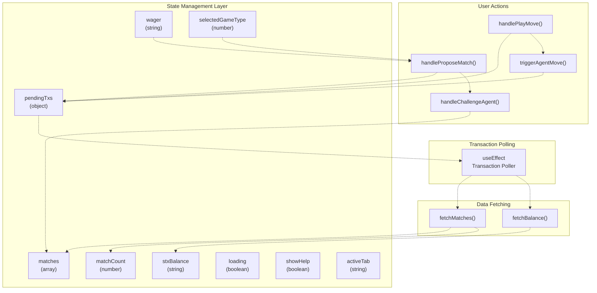
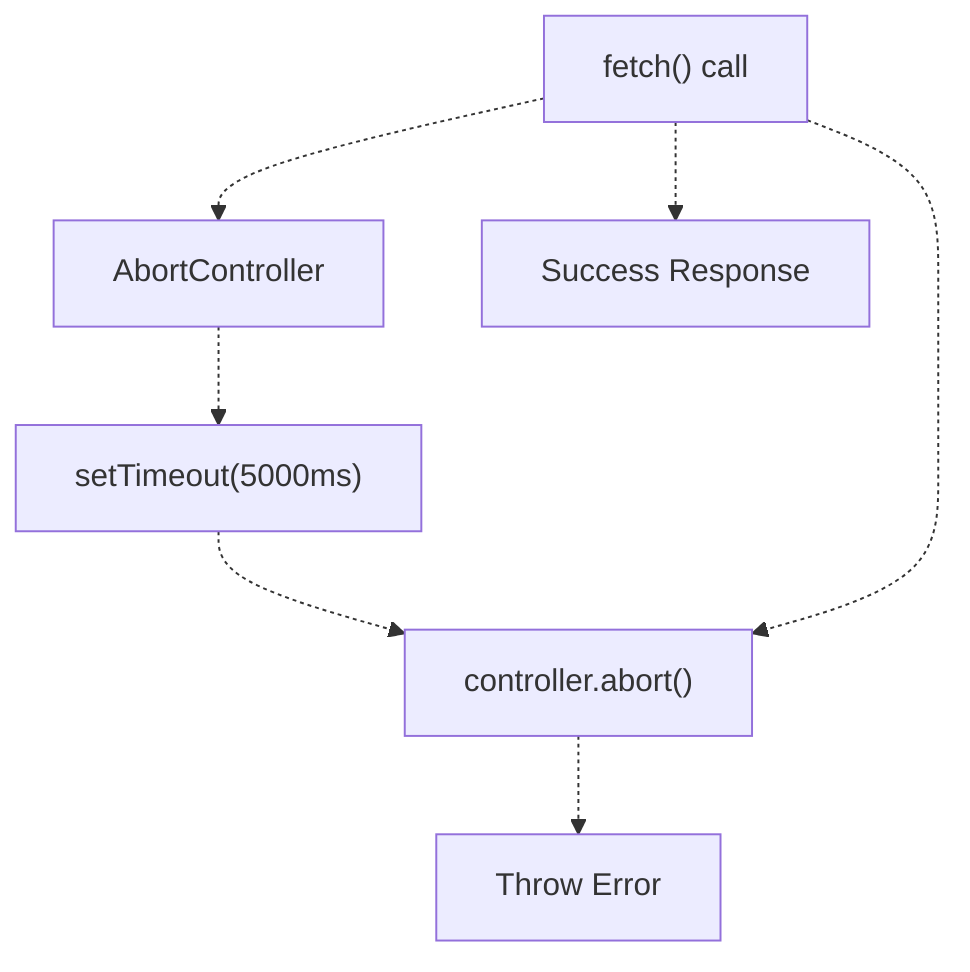
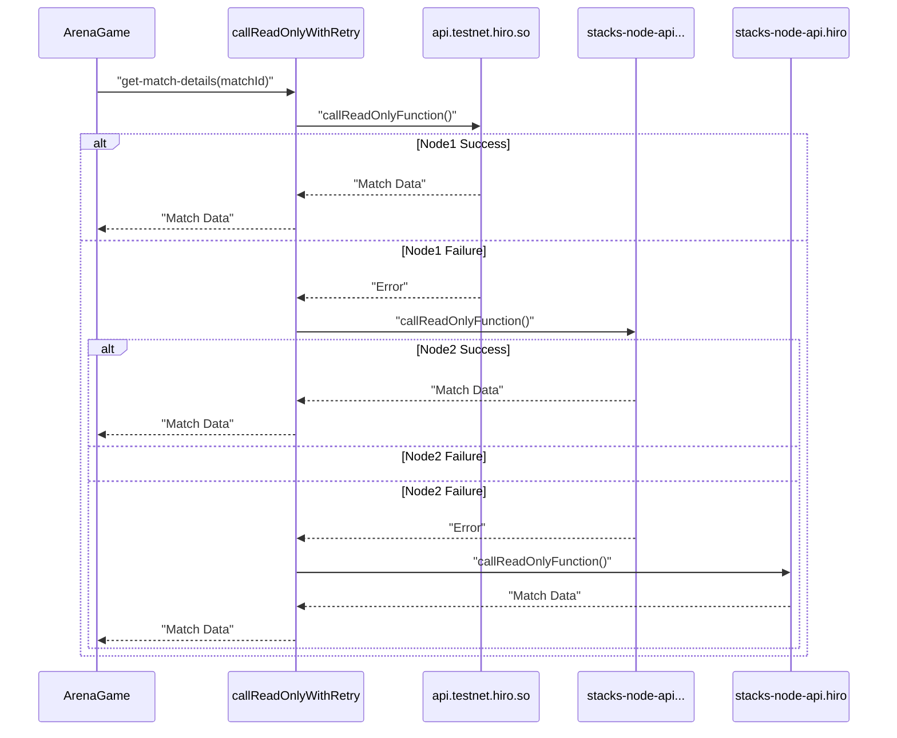
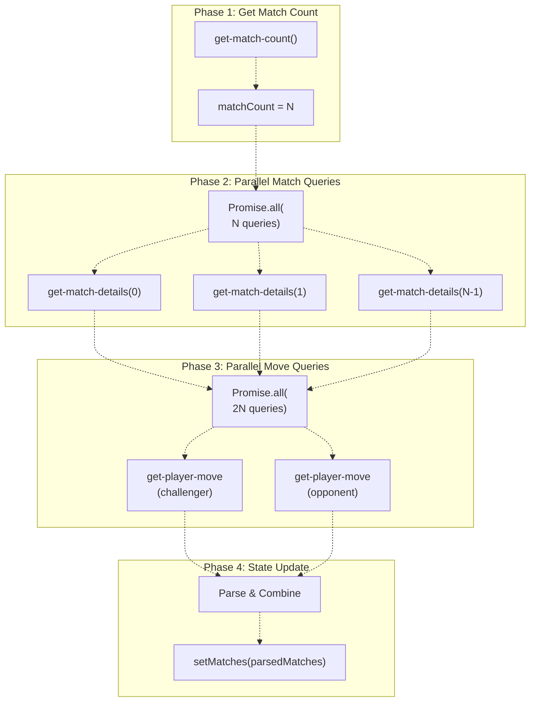
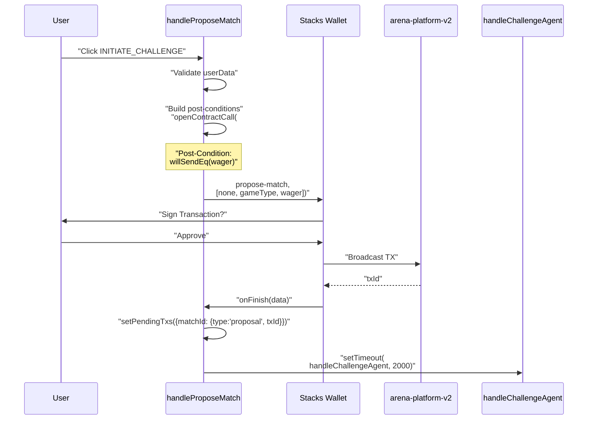
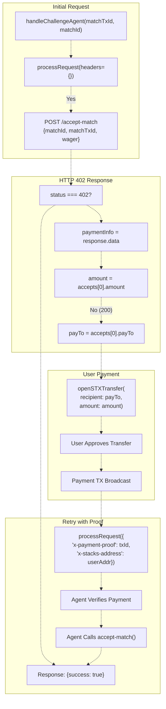
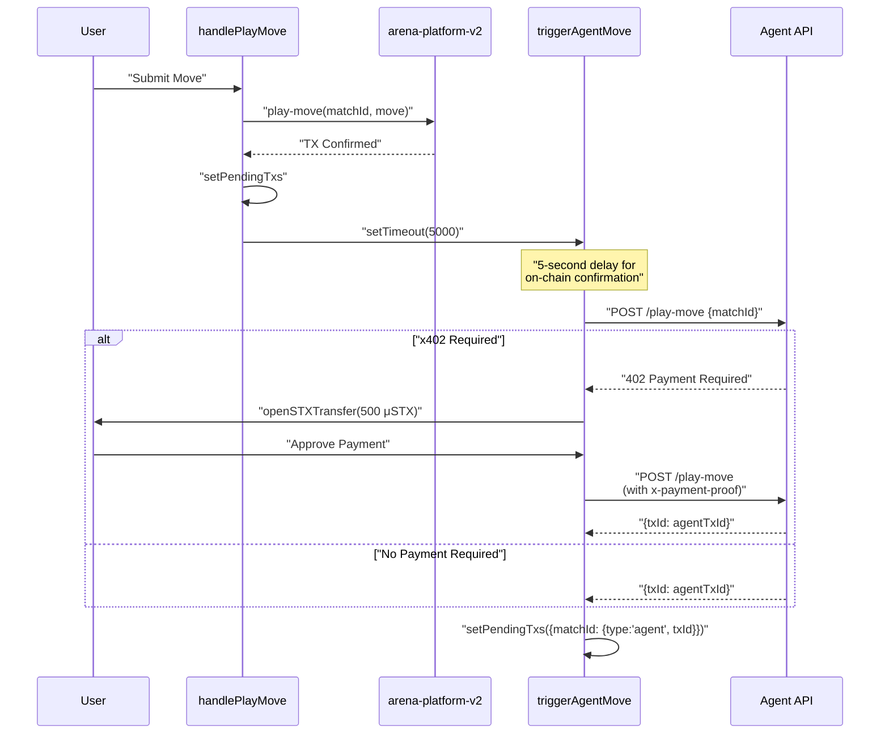
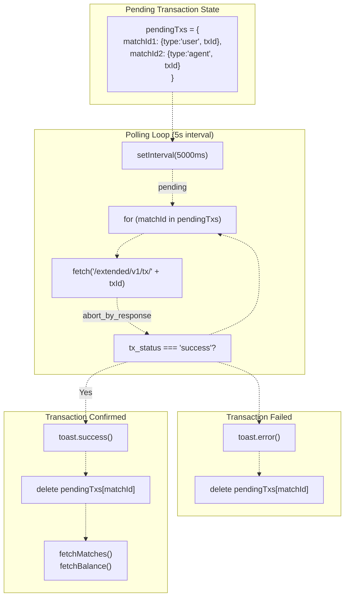
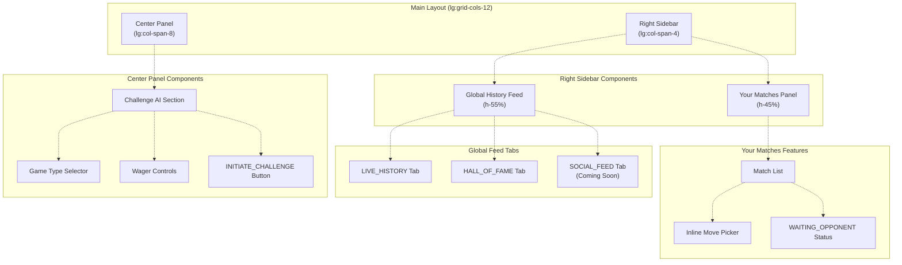

# ArenaGame Component

> **Relevant source files**
> * [README.md](https://github.com/HACK3R-CRYPTO/GameArenaStacks/blob/23ba68fb/README.md)
> * [frontend/src/components/Navigation.jsx](https://github.com/HACK3R-CRYPTO/GameArenaStacks/blob/23ba68fb/frontend/src/components/Navigation.jsx)
> * [frontend/src/pages/ArenaGame.jsx](https://github.com/HACK3R-CRYPTO/GameArenaStacks/blob/23ba68fb/frontend/src/pages/ArenaGame.jsx)

## Purpose and Scope

The `ArenaGame` component is the primary user interface for GameArenaStacks, implementing the complete match lifecycle from wallet connection to prize distribution. This component handles match proposals, move submissions, x402-based agent challenges, real-time transaction polling, and comprehensive match visualization. It serves as the integration point between the Stacks blockchain, the autonomous AI agent API, and the end user.

For wallet connectivity and BNS name resolution, see [Wallet Integration and Navigation](/HACK3R-CRYPTO/GameArenaStacks/2.2-wallet-integration-and-navigation). For the x402 protocol details, see [x402 Payment Middleware](/HACK3R-CRYPTO/GameArenaStacks/3.2-x402-payment-middleware). For smart contract interaction specifics, see [arena-platform-v2 Contract](/HACK3R-CRYPTO/GameArenaStacks/4.1-arena-platform-v2-contract).

## Component Architecture

The `ArenaGame` component is a React functional component that accepts `userSession` and `userData` props from the Stacks Connect authentication system. The component is located at [frontend/src/pages/ArenaGame.jsx L94-L911](https://github.com/HACK3R-CRYPTO/GameArenaStacks/blob/23ba68fb/frontend/src/pages/ArenaGame.jsx#L94-L911)

 and implements a stateful architecture with 10 distinct state variables, multiple asynchronous data fetching hooks, and x402 payment integration.

**Sources:** [frontend/src/pages/ArenaGame.jsx L1-L11](https://github.com/HACK3R-CRYPTO/GameArenaStacks/blob/23ba68fb/frontend/src/pages/ArenaGame.jsx#L1-L11)

 [frontend/src/pages/ArenaGame.jsx L94-L105](https://github.com/HACK3R-CRYPTO/GameArenaStacks/blob/23ba68fb/frontend/src/pages/ArenaGame.jsx#L94-L105)

## State Management Architecture

The component maintains game state through React hooks, with state variables managing everything from blockchain data to pending transactions. The following table documents each state variable and its role:

| State Variable | Type | Initial Value | Purpose |
| --- | --- | --- | --- |
| `stxBalance` | string | `'0'` | User's STX balance in human-readable format |
| `wager` | string | `'0.1'` | Current wager amount in STX for new matches |
| `selectedGameType` | number | `0` | Currently selected game type (0=RPS, 1=Dice, 2=Coin) |
| `matches` | array | `[]` | Array of match objects with full details and moves |
| `matchCount` | number | `0` | Total number of matches in the contract |
| `loading` | boolean | `false` | Loading state for async operations |
| `pendingTxs` | object | `{}` | Map of `matchId` to pending transaction metadata |
| `agentOnline` | boolean | `true` | Agent availability status (currently unused) |
| `showHelp` | boolean | `false` | Controls visibility of help overlay modal |
| `activeTab` | string | `'live'` | Active tab in the global feed ('live', 'hof', 'social') |



**Sources:** [frontend/src/pages/ArenaGame.jsx L95-L105](https://github.com/HACK3R-CRYPTO/GameArenaStacks/blob/23ba68fb/frontend/src/pages/ArenaGame.jsx#L95-L105)

 [frontend/src/pages/ArenaGame.jsx L256-L298](https://github.com/HACK3R-CRYPTO/GameArenaStacks/blob/23ba68fb/frontend/src/pages/ArenaGame.jsx#L256-L298)

## Configuration Constants

The component defines several configuration constants at the module level that control blockchain interaction and game logic:

### Blockchain Configuration

```javascript
const DEPLOYER_ADDRESS = import.meta.env.VITE_DEPLOYER_ADDRESS || 'ST3273FDNHADRB84GK2C0GWQQW9WXZGR1V5GAR0MA';
const ARENA_CONTRACT = `${DEPLOYER_ADDRESS}.arena-platform-v2`;
const AGENT_API_URL = import.meta.env.VITE_AGENT_API_URL || 'http://localhost:3000';
```

These constants are configured via environment variables with fallback defaults. The `DEPLOYER_ADDRESS` is the Stacks address that deployed the contracts, while `ARENA_CONTRACT` is the fully qualified contract identifier used in all read-only and transaction calls.

**Sources:** [frontend/src/pages/ArenaGame.jsx L10-L12](https://github.com/HACK3R-CRYPTO/GameArenaStacks/blob/23ba68fb/frontend/src/pages/ArenaGame.jsx#L10-L12)

### Multi-Node Failover Configuration

```javascript
const STACKS_NODES = [
    'https://api.testnet.hiro.so',
    'https://stacks-node-api.testnet.stacks.co',
    'https://stacks-node-api.testnet.hiro.so'
];
```

The component implements high-availability through automatic node rotation. The `STACKS_NODES` array lists three RPC endpoints that are tried sequentially on failure. This is implemented in the `callReadOnlyWithRetry` function.

**Sources:** [frontend/src/pages/ArenaGame.jsx L27-L32](https://github.com/HACK3R-CRYPTO/GameArenaStacks/blob/23ba68fb/frontend/src/pages/ArenaGame.jsx#L27-L32)

 [frontend/src/pages/ArenaGame.jsx L34-L50](https://github.com/HACK3R-CRYPTO/GameArenaStacks/blob/23ba68fb/frontend/src/pages/ArenaGame.jsx#L34-L50)

### Game Type Definitions

The `GAME_TYPES` constant defines all supported game modes:

| ID | Label | Icon | Status |
| --- | --- | --- | --- |
| 0 | Rock Paper Scissors | ✊ | Active |
| 1 | Dice Roll | 🎲 | Active |
| 2 | Coin Flip | 🪙 | Active |
| 3 | Tic Tac Toe | ❌ | Disabled (Coming Soon) |

**Sources:** [frontend/src/pages/ArenaGame.jsx L57-L62](https://github.com/HACK3R-CRYPTO/GameArenaStacks/blob/23ba68fb/frontend/src/pages/ArenaGame.jsx#L57-L62)

## Network Resilience Infrastructure

### Request Timeout Wrapper

The `fetchWithTimeout` utility enforces a 5-second timeout on all network requests to prevent hanging requests from degrading user experience:



**Sources:** [frontend/src/pages/ArenaGame.jsx L14-L25](https://github.com/HACK3R-CRYPTO/GameArenaStacks/blob/23ba68fb/frontend/src/pages/ArenaGame.jsx#L14-L25)

### Multi-Node Read-Only Call Retry

The `callReadOnlyWithRetry` function implements automatic failover across multiple Stacks RPC nodes. When a node fails, the function logs a warning and tries the next node in the `STACKS_NODES` array:



This pattern is used extensively in `fetchBalance` and `fetchMatches` to ensure blockchain data is always retrievable despite individual node failures.

**Sources:** [frontend/src/pages/ArenaGame.jsx L34-L50](https://github.com/HACK3R-CRYPTO/GameArenaStacks/blob/23ba68fb/frontend/src/pages/ArenaGame.jsx#L34-L50)

 [frontend/src/pages/ArenaGame.jsx L108-L122](https://github.com/HACK3R-CRYPTO/GameArenaStacks/blob/23ba68fb/frontend/src/pages/ArenaGame.jsx#L108-L122)

## Data Fetching Subsystem

### Balance Fetching with Retry

The `fetchBalance` callback queries the user's STX balance from multiple nodes using the `/extended/v1/address/{address}/balances` endpoint. The balance is converted from microSTX to STX (division by 1,000,000) and formatted to 2 decimal places:

**Sources:** [frontend/src/pages/ArenaGame.jsx L108-L122](https://github.com/HACK3R-CRYPTO/GameArenaStacks/blob/23ba68fb/frontend/src/pages/ArenaGame.jsx#L108-L122)

### Match Fetching with Parallel Queries

The `fetchMatches` callback implements a sophisticated parallel query system to load match data efficiently:



The function fetches the last 30 matches in reverse chronological order (newest first) and queries both challenger and opponent moves in parallel. This reduces the total fetch time from O(3N) sequential queries to approximately O(1) with three parallel batches.

**Sources:** [frontend/src/pages/ArenaGame.jsx L132-L240](https://github.com/HACK3R-CRYPTO/GameArenaStacks/blob/23ba68fb/frontend/src/pages/ArenaGame.jsx#L132-L240)

### Polling Strategy

Two distinct polling strategies are implemented:

1. **General State Polling**: A 60-second interval polls `fetchBalance()` and `fetchMatches()` for background updates [frontend/src/pages/ArenaGame.jsx L242-L254](https://github.com/HACK3R-CRYPTO/GameArenaStacks/blob/23ba68fb/frontend/src/pages/ArenaGame.jsx#L242-L254)
2. **Targeted Transaction Polling (BitSubs Pattern)**: A 5-second interval polls specific transaction IDs in `pendingTxs`, checking their status via the Hiro API `/extended/v1/tx/{txId}` endpoint. When a transaction confirms (status `success` or `abort_by_response`), it is removed from `pendingTxs` and the state is refreshed [frontend/src/pages/ArenaGame.jsx L256-L298](https://github.com/HACK3R-CRYPTO/GameArenaStacks/blob/23ba68fb/frontend/src/pages/ArenaGame.jsx#L256-L298)

**Sources:** [frontend/src/pages/ArenaGame.jsx L124-L130](https://github.com/HACK3R-CRYPTO/GameArenaStacks/blob/23ba68fb/frontend/src/pages/ArenaGame.jsx#L124-L130)

 [frontend/src/pages/ArenaGame.jsx L242-L298](https://github.com/HACK3R-CRYPTO/GameArenaStacks/blob/23ba68fb/frontend/src/pages/ArenaGame.jsx#L242-L298)

## Match Proposal Flow

### Transaction Construction

The `handleProposeMatch` function orchestrates on-chain match creation with the following sequence:



The function implements Stacks post-conditions to ensure trustless asset transfers. Specifically, it requires that the user will send exactly the wager amount in microSTX using `Pc.principal(userAddress).willSendEq(wagerAmount).ustx()` with post-condition mode 1 (Deny).

**Sources:** [frontend/src/pages/ArenaGame.jsx L300-L348](https://github.com/HACK3R-CRYPTO/GameArenaStacks/blob/23ba68fb/frontend/src/pages/ArenaGame.jsx#L300-L348)

### Post-Condition Enforcement

```javascript
const postConditions = [
    Pc.principal(userAddress)
        .willSendEq(Math.floor(parseFloat(wager) * 1000000))
        .ustx()
];
```

This post-condition guarantees that if the transaction execution differs from the expected STX transfer amount, the entire transaction will be rejected by the Stacks blockchain. This protects users from malicious contract upgrades or unexpected contract behavior.

**Sources:** [frontend/src/pages/ArenaGame.jsx L309-L314](https://github.com/HACK3R-CRYPTO/GameArenaStacks/blob/23ba68fb/frontend/src/pages/ArenaGame.jsx#L309-L314)

## x402 Payment Integration

### Agent Challenge Flow

The `handleChallengeAgent` function implements the x402 payment protocol for automated agent acceptance. It uses a recursive `processRequest` pattern that handles HTTP 402 responses:



The function uses closures to capture `matchTxId` and `predictedMatchId`, allowing the nested `processRequest` function to retry the request with payment proof headers after the user approves the STX transfer.

**Sources:** [frontend/src/pages/ArenaGame.jsx L350-L398](https://github.com/HACK3R-CRYPTO/GameArenaStacks/blob/23ba68fb/frontend/src/pages/ArenaGame.jsx#L350-L398)

### Agent Move Triggering

The `triggerAgentMove` function follows an identical x402 pattern but targets the `/play-move` endpoint. This is called after the user submits their move to signal the agent to calculate and submit its counter-move:



The 5-second delay before calling `triggerAgentMove` ensures the user's move transaction has propagated through the network before the agent queries it. This is part of the Fair Play Architecture described in [Fair Play Architecture](/HACK3R-CRYPTO/GameArenaStacks/8-fair-play-architecture).

**Sources:** [frontend/src/pages/ArenaGame.jsx L400-L445](https://github.com/HACK3R-CRYPTO/GameArenaStacks/blob/23ba68fb/frontend/src/pages/ArenaGame.jsx#L400-L445)

 [frontend/src/pages/ArenaGame.jsx L447-L482](https://github.com/HACK3R-CRYPTO/GameArenaStacks/blob/23ba68fb/frontend/src/pages/ArenaGame.jsx#L447-L482)

## Move Submission System

### Move Execution

The `handlePlayMove` function constructs and broadcasts a `play-move` transaction to the `arena-platform-v2` contract:

```javascript
await openContractCall({
    contractAddress: DEPLOYER_ADDRESS,
    contractName: 'arena-platform-v2',
    functionName: 'play-move',
    functionArgs: [
        Cl.uint(matchId),
        Cl.uint(move)
    ],
    network,
    onFinish: (data) => {
        setPendingTxs(prev => ({ ...prev, [matchId]: { type: 'user', txId: data.txId } }));
        setTimeout(() => { triggerAgentMove(matchId); }, 5000);
    }
});
```

The function integrates with the transaction polling system by adding the transaction to `pendingTxs` and then triggers the agent move after a 5-second delay. This ensures fair play by guaranteeing the user's move is on-chain before the agent responds.

**Sources:** [frontend/src/pages/ArenaGame.jsx L447-L482](https://github.com/HACK3R-CRYPTO/GameArenaStacks/blob/23ba68fb/frontend/src/pages/ArenaGame.jsx#L447-L482)

### Move Display Helpers

Two utility functions support move rendering:

1. **`getMoveData(gameType, move)`**: Converts numeric move values to human-readable names and emoji icons. For example, in Rock-Paper-Scissors (gameType 0), move 0 becomes `{name: 'ROCK', icon: '✊'}` [frontend/src/pages/ArenaGame.jsx L64-L78](https://github.com/HACK3R-CRYPTO/GameArenaStacks/blob/23ba68fb/frontend/src/pages/ArenaGame.jsx#L64-L78)
2. **`getMoveOptions(gameType)`**: Returns available move options for inline UI pickers. Rock-Paper-Scissors returns three buttons, Coin Flip returns two, and Dice Roll returns an empty array (uses custom RNG button) [frontend/src/pages/ArenaGame.jsx L80-L92](https://github.com/HACK3R-CRYPTO/GameArenaStacks/blob/23ba68fb/frontend/src/pages/ArenaGame.jsx#L80-L92)

**Sources:** [frontend/src/pages/ArenaGame.jsx L64-L92](https://github.com/HACK3R-CRYPTO/GameArenaStacks/blob/23ba68fb/frontend/src/pages/ArenaGame.jsx#L64-L92)

## Transaction Polling (BitSubs Pattern)

The component implements targeted transaction polling to provide real-time feedback without overwhelming the RPC nodes:



This approach is more efficient than polling all matches continuously. It only polls transactions that the user has initiated or that the agent is processing, minimizing API calls while maximizing responsiveness.

**Sources:** [frontend/src/pages/ArenaGame.jsx L256-L298](https://github.com/HACK3R-CRYPTO/GameArenaStacks/blob/23ba68fb/frontend/src/pages/ArenaGame.jsx#L256-L298)

## User Interface Structure

The component renders three primary UI sections in a responsive grid layout:



**Sources:** [frontend/src/pages/ArenaGame.jsx L484-L863](https://github.com/HACK3R-CRYPTO/GameArenaStacks/blob/23ba68fb/frontend/src/pages/ArenaGame.jsx#L484-L863)

### Challenge AI Panel

The center panel displays:

* Game type selector with 4 buttons (RPS, Dice, Coin, Tic-Tac-Toe disabled)
* Wager input with potential win calculation (wager × 1.96)
* "INITIATE_CHALLENGE" button with "POWERED_BY_X402" badge

**Sources:** [frontend/src/pages/ArenaGame.jsx L487-L574](https://github.com/HACK3R-CRYPTO/GameArenaStacks/blob/23ba68fb/frontend/src/pages/ArenaGame.jsx#L487-L574)

### Your Matches Section

Displays matches where the user is either challenger or opponent. Each match card shows:

* Game type icon and match ID
* Match status (Pending, Active, Completed)
* Wager amount in STX
* Move status or inline move picker for active matches
* Win/loss indicators with "X402_AUTH_PAYOUT" labels

For active matches where the user hasn't played, an inline move picker is rendered. For Dice Roll (gameType 1), this is a single "ROLL_DICE_RNG" button that generates a random roll. For other games, it displays buttons for each valid move option.

**Sources:** [frontend/src/pages/ArenaGame.jsx L577-L683](https://github.com/HACK3R-CRYPTO/GameArenaStacks/blob/23ba68fb/frontend/src/pages/ArenaGame.jsx#L577-L683)

### Global History Feed

A tabbed interface with three views:

1. **LIVE_HISTORY**: Shows the last 30 matches from all players with real-time updates. Displays both players' addresses, wager amount, revealed moves (if completed), and match status [frontend/src/pages/ArenaGame.jsx L796-L856](https://github.com/HACK3R-CRYPTO/GameArenaStacks/blob/23ba68fb/frontend/src/pages/ArenaGame.jsx#L796-L856)
2. **HALL_OF_FAME**: Aggregates wins by player address and displays a leaderboard with ranking badges (gold/silver/bronze for top 3). Identifies the agent with an "AGENT" badge and highlights the current user as "YOU" [frontend/src/pages/ArenaGame.jsx L724-L793](https://github.com/HACK3R-CRYPTO/GameArenaStacks/blob/23ba68fb/frontend/src/pages/ArenaGame.jsx#L724-L793)
3. **SOCIAL_FEED**: Currently shows a "COMING_SOON" overlay [frontend/src/pages/ArenaGame.jsx L714-L722](https://github.com/HACK3R-CRYPTO/GameArenaStacks/blob/23ba68fb/frontend/src/pages/ArenaGame.jsx#L714-L722)

**Sources:** [frontend/src/pages/ArenaGame.jsx L685-L858](https://github.com/HACK3R-CRYPTO/GameArenaStacks/blob/23ba68fb/frontend/src/pages/ArenaGame.jsx#L685-L858)

### Help Overlay

A modal triggered by clicking the help icon (HelpCircle) displays game rules for all three active game types:

* Rock-Paper-Scissors: Standard rules with winner-takes-pot explanation
* Dice Roll: Highest roll wins
* Coin Flip: Prediction-based game

The overlay includes a footer note about x402 protocol integration.

**Sources:** [frontend/src/pages/ArenaGame.jsx L861-L909](https://github.com/HACK3R-CRYPTO/GameArenaStacks/blob/23ba68fb/frontend/src/pages/ArenaGame.jsx#L861-L909)

## Axios Configuration

The component creates a configured Axios instance for agent API communication:

```javascript
const api = axios.create({ baseURL: AGENT_API_URL });
```

This instance is used in both `handleChallengeAgent` and `triggerAgentMove` to interact with the agent's Express API endpoints. The x402 payment flow automatically handles HTTP 402 responses through the recursive `processRequest` pattern.

**Sources:** [frontend/src/pages/ArenaGame.jsx L55](https://github.com/HACK3R-CRYPTO/GameArenaStacks/blob/23ba68fb/frontend/src/pages/ArenaGame.jsx#L55-L55)

 [frontend/src/pages/ArenaGame.jsx L350-L445](https://github.com/HACK3R-CRYPTO/GameArenaStacks/blob/23ba68fb/frontend/src/pages/ArenaGame.jsx#L350-L445)

## Integration Points

The `ArenaGame` component integrates with multiple external systems:

| System | Integration Method | Purpose |
| --- | --- | --- |
| Stacks Blockchain | `callReadOnlyFunction`, `openContractCall` | Match state queries and transaction broadcasts |
| Stacks Connect | `openSTXTransfer` | x402 micro-payments to agent |
| Hiro API | `fetch('/extended/v1/tx/{txId}')` | Transaction status polling |
| Agent API | `axios.post('/accept-match')`, `axios.post('/play-move')` | Agent challenge and move triggering |
| BNS API | (via Navigation component) | Name resolution for display |

The component is designed to operate entirely on Stacks Testnet, with the `network` constant set to `StacksTestnet({ url: STACKS_NODES[0] })`.

**Sources:** [frontend/src/pages/ArenaGame.jsx L3-L6](https://github.com/HACK3R-CRYPTO/GameArenaStacks/blob/23ba68fb/frontend/src/pages/ArenaGame.jsx#L3-L6)

 [frontend/src/pages/ArenaGame.jsx L52](https://github.com/HACK3R-CRYPTO/GameArenaStacks/blob/23ba68fb/frontend/src/pages/ArenaGame.jsx#L52-L52)