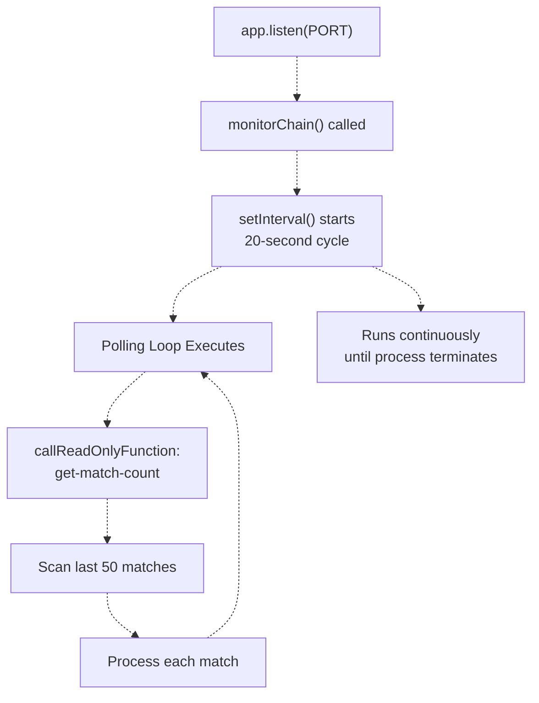
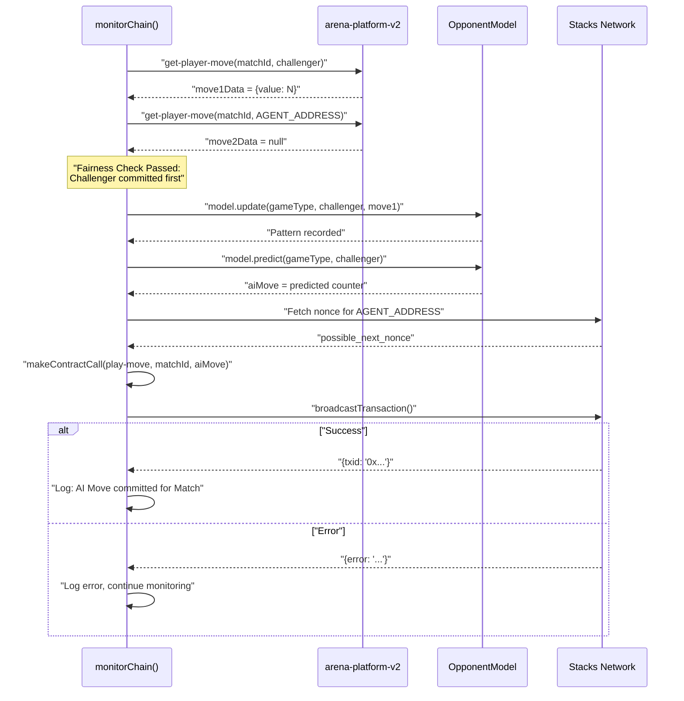
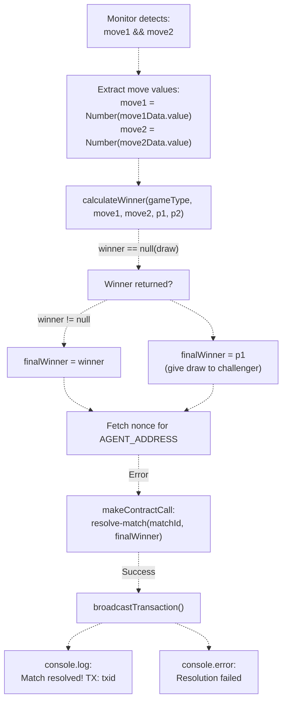
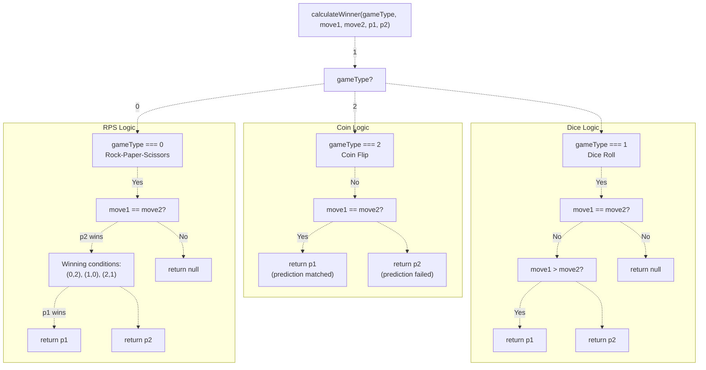
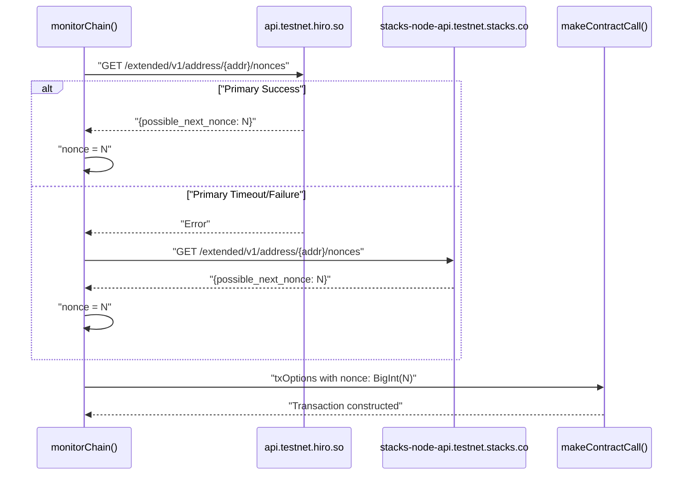
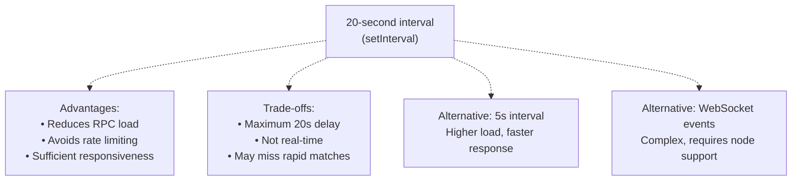
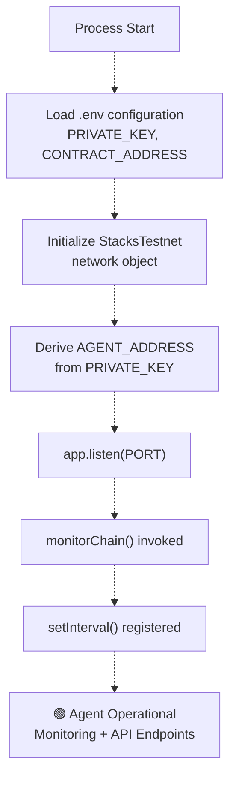

# Chain Monitoring and Auto-Resolution

> **Relevant source files**
> * [README.md](https://github.com/HACK3R-CRYPTO/GameArenaStacks/blob/23ba68fb/README.md)
> * [agent/.env.example](https://github.com/HACK3R-CRYPTO/GameArenaStacks/blob/23ba68fb/agent/.env.example)
> * [agent/src/ArenaAgent.ts](https://github.com/HACK3R-CRYPTO/GameArenaStacks/blob/23ba68fb/agent/src/ArenaAgent.ts)

**Purpose**: This document explains the autonomous blockchain monitoring system implemented by the AI agent. The `monitorChain` background process continuously polls the Stacks blockchain to detect match state changes and automatically executes agent moves and match resolutions. This page focuses on the monitoring loop, auto-play logic, and winner determination. For the AI strategy that determines which move to play, see [Markov Chain AI Strategy](/HACK3R-CRYPTO/GameArenaStacks/3.3-markov-chain-ai-strategy). For the HTTP endpoints that can manually trigger agent actions, see [Agent API Endpoints](/HACK3R-CRYPTO/GameArenaStacks/3.5-agent-api-endpoints).

**Scope**: Covers the [agent/src/ArenaAgent.ts L329-L475](https://github.com/HACK3R-CRYPTO/GameArenaStacks/blob/23ba68fb/agent/src/ArenaAgent.ts#L329-L475)

 background process, including match scanning, fairness verification, automatic move execution, and on-chain resolution.

---

## Overview

The chain monitoring system enables the agent to operate autonomously without manual intervention. Once started, the agent continuously scans the blockchain for matches requiring action and automatically:

1. Detects when a challenger has played their move
2. Executes the AI's counter-move after fairness verification
3. Resolves matches when both players have committed moves
4. Determines winners using game-specific logic

The system runs in a background interval that polls every 20 seconds, ensuring timely responses while minimizing RPC load.

**Sources**: [agent/src/ArenaAgent.ts L329-L481](https://github.com/HACK3R-CRYPTO/GameArenaStacks/blob/23ba68fb/agent/src/ArenaAgent.ts#L329-L481)

---

## System Architecture

### Monitoring Loop Initialization

The `monitorChain()` function is invoked when the Express server starts, establishing a perpetual background process:



**Initialization Flow**:

1. Server starts on the configured `PORT` (default: 3000)
2. `monitorChain()` is called as part of the `app.listen()` callback
3. `setInterval()` establishes a 20-second recurring timer
4. Each cycle queries `get-match-count` from the contract
5. Scans the last 50 matches to catch any missed due to RPC latency

**Sources**: [agent/src/ArenaAgent.ts L477-L481](https://github.com/HACK3R-CRYPTO/GameArenaStacks/blob/23ba68fb/agent/src/ArenaAgent.ts#L477-L481)

 [agent/src/ArenaAgent.ts L330-L334](https://github.com/HACK3R-CRYPTO/GameArenaStacks/blob/23ba68fb/agent/src/ArenaAgent.ts#L330-L334)

---

## Match Scanning Logic

### Query Pattern

The monitor scans matches in reverse chronological order (newest first) to prioritize recent activity:

| Step | Contract Function | Purpose |
| --- | --- | --- |
| 1 | `get-match-count()` | Retrieve total number of matches created |
| 2 | `get-match-details(matchId)` | Fetch match metadata for each ID in scan range |
| 3 | `get-player-move(matchId, principal)` | Query move commitments for both players |

The scan range is calculated as:

```javascript
const start = count - 1;           // Most recent match
const end = Math.max(0, count - 50); // Up to 50 matches back
```

**Sources**: [agent/src/ArenaAgent.ts L336-L360](https://github.com/HACK3R-CRYPTO/GameArenaStacks/blob/23ba68fb/agent/src/ArenaAgent.ts#L336-L360)

### Match State Detection

```css
#mermaid-tteiq95rd1j{font-family:ui-sans-serif,-apple-system,system-ui,Segoe UI,Helvetica;font-size:16px;fill:#333;}@keyframes edge-animation-frame{from{stroke-dashoffset:0;}}@keyframes dash{to{stroke-dashoffset:0;}}#mermaid-tteiq95rd1j .edge-animation-slow{stroke-dasharray:9,5!important;stroke-dashoffset:900;animation:dash 50s linear infinite;stroke-linecap:round;}#mermaid-tteiq95rd1j .edge-animation-fast{stroke-dasharray:9,5!important;stroke-dashoffset:900;animation:dash 20s linear infinite;stroke-linecap:round;}#mermaid-tteiq95rd1j .error-icon{fill:#dddddd;}#mermaid-tteiq95rd1j .error-text{fill:#222222;stroke:#222222;}#mermaid-tteiq95rd1j .edge-thickness-normal{stroke-width:1px;}#mermaid-tteiq95rd1j .edge-thickness-thick{stroke-width:3.5px;}#mermaid-tteiq95rd1j .edge-pattern-solid{stroke-dasharray:0;}#mermaid-tteiq95rd1j .edge-thickness-invisible{stroke-width:0;fill:none;}#mermaid-tteiq95rd1j .edge-pattern-dashed{stroke-dasharray:3;}#mermaid-tteiq95rd1j .edge-pattern-dotted{stroke-dasharray:2;}#mermaid-tteiq95rd1j .marker{fill:#999;stroke:#999;}#mermaid-tteiq95rd1j .marker.cross{stroke:#999;}#mermaid-tteiq95rd1j svg{font-family:ui-sans-serif,-apple-system,system-ui,Segoe UI,Helvetica;font-size:16px;}#mermaid-tteiq95rd1j p{margin:0;}#mermaid-tteiq95rd1j defs #statediagram-barbEnd{fill:#999;stroke:#999;}#mermaid-tteiq95rd1j g.stateGroup text{fill:#dddddd;stroke:none;font-size:10px;}#mermaid-tteiq95rd1j g.stateGroup text{fill:#333;stroke:none;font-size:10px;}#mermaid-tteiq95rd1j g.stateGroup .state-title{font-weight:bolder;fill:#333;}#mermaid-tteiq95rd1j g.stateGroup rect{fill:#ffffff;stroke:#dddddd;}#mermaid-tteiq95rd1j g.stateGroup line{stroke:#999;stroke-width:1;}#mermaid-tteiq95rd1j .transition{stroke:#999;stroke-width:1;fill:none;}#mermaid-tteiq95rd1j .stateGroup .composit{fill:#f4f4f4;border-bottom:1px;}#mermaid-tteiq95rd1j .stateGroup .alt-composit{fill:#e0e0e0;border-bottom:1px;}#mermaid-tteiq95rd1j .state-note{stroke:#e6d280;fill:#fff5ad;}#mermaid-tteiq95rd1j .state-note text{fill:#333;stroke:none;font-size:10px;}#mermaid-tteiq95rd1j .stateLabel .box{stroke:none;stroke-width:0;fill:#ffffff;opacity:0.5;}#mermaid-tteiq95rd1j .edgeLabel .label rect{fill:#ffffff;opacity:0.5;}#mermaid-tteiq95rd1j .edgeLabel{background-color:#ffffff;text-align:center;}#mermaid-tteiq95rd1j .edgeLabel p{background-color:#ffffff;}#mermaid-tteiq95rd1j .edgeLabel rect{opacity:0.5;background-color:#ffffff;fill:#ffffff;}#mermaid-tteiq95rd1j .edgeLabel .label text{fill:#333;}#mermaid-tteiq95rd1j .label div .edgeLabel{color:#333;}#mermaid-tteiq95rd1j .stateLabel text{fill:#333;font-size:10px;font-weight:bold;}#mermaid-tteiq95rd1j .node circle.state-start{fill:#999;stroke:#999;}#mermaid-tteiq95rd1j .node .fork-join{fill:#999;stroke:#999;}#mermaid-tteiq95rd1j .node circle.state-end{fill:#dddddd;stroke:#f4f4f4;stroke-width:1.5;}#mermaid-tteiq95rd1j .end-state-inner{fill:#f4f4f4;stroke-width:1.5;}#mermaid-tteiq95rd1j .node rect{fill:#ffffff;stroke:#dddddd;stroke-width:1px;}#mermaid-tteiq95rd1j .node polygon{fill:#ffffff;stroke:#dddddd;stroke-width:1px;}#mermaid-tteiq95rd1j #statediagram-barbEnd{fill:#999;}#mermaid-tteiq95rd1j .statediagram-cluster rect{fill:#ffffff;stroke:#dddddd;stroke-width:1px;}#mermaid-tteiq95rd1j .cluster-label,#mermaid-tteiq95rd1j .nodeLabel{color:#333;}#mermaid-tteiq95rd1j .statediagram-cluster rect.outer{rx:5px;ry:5px;}#mermaid-tteiq95rd1j .statediagram-state .divider{stroke:#dddddd;}#mermaid-tteiq95rd1j .statediagram-state .title-state{rx:5px;ry:5px;}#mermaid-tteiq95rd1j .statediagram-cluster.statediagram-cluster .inner{fill:#f4f4f4;}#mermaid-tteiq95rd1j .statediagram-cluster.statediagram-cluster-alt .inner{fill:#f8f8f8;}#mermaid-tteiq95rd1j .statediagram-cluster .inner{rx:0;ry:0;}#mermaid-tteiq95rd1j .statediagram-state rect.basic{rx:5px;ry:5px;}#mermaid-tteiq95rd1j .statediagram-state rect.divider{stroke-dasharray:10,10;fill:#f8f8f8;}#mermaid-tteiq95rd1j .note-edge{stroke-dasharray:5;}#mermaid-tteiq95rd1j .statediagram-note rect{fill:#fff5ad;stroke:#e6d280;stroke-width:1px;rx:0;ry:0;}#mermaid-tteiq95rd1j .statediagram-note rect{fill:#fff5ad;stroke:#e6d280;stroke-width:1px;rx:0;ry:0;}#mermaid-tteiq95rd1j .statediagram-note text{fill:#333;}#mermaid-tteiq95rd1j .statediagram-note .nodeLabel{color:#333;}#mermaid-tteiq95rd1j .statediagram .edgeLabel{color:red;}#mermaid-tteiq95rd1j #dependencyStart,#mermaid-tteiq95rd1j #dependencyEnd{fill:#999;stroke:#999;stroke-width:1;}#mermaid-tteiq95rd1j .statediagramTitleText{text-anchor:middle;font-size:18px;fill:#333;}#mermaid-tteiq95rd1j :root{--mermaid-font-family:"trebuchet ms",verdana,arial,sans-serif;}"get-match-details(i)""Extract status field""status !== 1(not ACTIVE)""status === 1(ACCEPTED)""get-player-move(i, challenger)""get-player-move(i, opponent)""move1 && move2""move1 && !move2 && p2==AGENT""!move1"QueryMatchCheckStatusSkipMatchQueryMovesFetchP1MoveFetchP2MoveAnalyzeStateBothMovedAgentNeedsMoveWaitingForChallengerTriggerResolutionExecuteAIMove
```

The monitor categorizes each match into one of four states based on move commitments:

1. **Not Active**: Status is not `1` (ACCEPTED) - skip processing
2. **Waiting for Challenger**: Challenger (`p1`) has not committed a move yet
3. **Agent Needs Move**: Challenger has moved, but agent (`p2`) has not
4. **Both Moved**: Both players have committed - trigger resolution

**Sources**: [agent/src/ArenaAgent.ts L361-L469](https://github.com/HACK3R-CRYPTO/GameArenaStacks/blob/23ba68fb/agent/src/ArenaAgent.ts#L361-L469)

---

## Automatic Agent Move Execution

### Fairness Verification

When the monitor detects the challenger has played, it enforces the Fair Play guarantee before executing the AI's move:



**Key Implementation Details**:

* **Fairness Condition**: Only proceeds if `move1Data.value` exists AND `move2Data` is null/undefined
* **Pattern Learning**: Calls `model.update(gameType, p1, challengerMove)` to record the opponent's move
* **AI Decision**: Invokes `model.predict(gameType, p1)` to generate the counter-move
* **Nonce Management**: Fetches fresh nonce from `${network.coreApiUrl}/extended/v1/address/${AGENT_ADDRESS}/nonces`

**Sources**: [agent/src/ArenaAgent.ts L435-L468](https://github.com/HACK3R-CRYPTO/GameArenaStacks/blob/23ba68fb/agent/src/ArenaAgent.ts#L435-L468)

 [agent/src/ArenaAgent.ts L441-L442](https://github.com/HACK3R-CRYPTO/GameArenaStacks/blob/23ba68fb/agent/src/ArenaAgent.ts#L441-L442)

### Transaction Construction for AI Moves

```javascript
const txOptions = {
    contractAddress: CONTRACT_ADDRESS,
    contractName: CONTRACT_NAME,
    functionName: 'play-move',
    functionArgs: [uintCV(i), uintCV(aiMove)],
    senderKey: PRIVATE_KEY,
    network,
    nonce: BigInt(possible_next_nonce),
    anchorMode: 1,              // AnchorMode.Any
    postConditionMode: 1        // PostConditionMode.Deny
};
```

The agent constructs transactions with:

* **Function**: `play-move` from the `arena-platform-v2` contract
* **Arguments**: Match ID (uint) and the AI's move (uint)
* **Nonce**: Manually fetched to ensure correct sequencing
* **Post-Condition Mode**: Deny (ensures no unexpected asset transfers)

**Sources**: [agent/src/ArenaAgent.ts L448-L458](https://github.com/HACK3R-CRYPTO/GameArenaStacks/blob/23ba68fb/agent/src/ArenaAgent.ts#L448-L458)

---

## Automatic Match Resolution

### Resolution Trigger Conditions

When both players have committed moves, the monitor automatically resolves the match:



**Resolution Logic**:

1. Detects both `move1Data` and `move2Data` have values
2. Extracts numeric move values from the contract response
3. Calls `calculateWinner()` with game type and move data
4. Handles draws by assigning the win to the challenger (for demo friendliness)
5. Constructs a `resolve-match` transaction with the winner's principal
6. Broadcasts the resolution to finalize the match on-chain

**Sources**: [agent/src/ArenaAgent.ts L392-L434](https://github.com/HACK3R-CRYPTO/GameArenaStacks/blob/23ba68fb/agent/src/ArenaAgent.ts#L392-L434)

---

## Winner Determination Logic

### calculateWinner Function

The `calculateWinner()` function implements game-specific rules for each of the three supported game types:



### Game-Specific Rules

| Game Type | ID | Win Condition | Draw Condition |
| --- | --- | --- | --- |
| **Rock-Paper-Scissors** | 0 | Rock (0) beats Scissors (2)Paper (1) beats Rock (0)Scissors (2) beats Paper (1) | Both players choose the same move |
| **Dice Roll** | 1 | Higher number wins (0-5 range) | Both players roll the same number |
| **Coin Flip** | 2 | Challenger's prediction (move1) matches agent's result (move2) | N/A (always has a winner) |

**Implementation Details**:

* **RPS**: Uses modulo arithmetic to determine winning combinations ``` if ((move1 === 0 && move2 === 2) || (move1 === 1 && move2 === 0) || (move1 === 2 && move2 === 1)) {     return p1; } ```
* **Dice**: Simple numerical comparison ``` return move1 > move2 ? p1 : p2; ```
* **Coin Flip**: Challenger wins if their prediction matches the agent's coin flip ``` return move1 === move2 ? p1 : p2; ```

**Sources**: [agent/src/ArenaAgent.ts L304-L327](https://github.com/HACK3R-CRYPTO/GameArenaStacks/blob/23ba68fb/agent/src/ArenaAgent.ts#L304-L327)

---

## Nonce Management

### Multi-Node Nonce Fetching

To ensure transaction reliability, the monitor implements a fallback strategy when fetching nonces:



**Nonce Fetching Strategy**:

For AI moves in the monitoring loop:

```javascript
const nonceRes = await fetch(`${network.coreApiUrl}/extended/v1/address/${AGENT_ADDRESS}/nonces`);
const { possible_next_nonce } = await nonceRes.json();
```

The nonce is then converted to `BigInt` and included in transaction options to ensure proper sequencing:

```yaml
nonce: BigInt(possible_next_nonce)
```

**Why Manual Nonce Management?**

The agent explicitly fetches and manages nonces rather than relying on `@stacks/transactions` auto-detection because:

1. The monitoring loop executes multiple transactions in quick succession
2. Auto-detection can cause race conditions when the mempool is slow to update
3. Manual management ensures each transaction uses a strictly incrementing nonce

**Sources**: [agent/src/ArenaAgent.ts L412-L413](https://github.com/HACK3R-CRYPTO/GameArenaStacks/blob/23ba68fb/agent/src/ArenaAgent.ts#L412-L413)

 [agent/src/ArenaAgent.ts L445-L446](https://github.com/HACK3R-CRYPTO/GameArenaStacks/blob/23ba68fb/agent/src/ArenaAgent.ts#L445-L446)

---

## Transaction Broadcasting Pattern

### Unified Transaction Construction

Both AI moves and match resolutions follow the same transaction pattern:

```javascript
const txOptions = {
    contractAddress: CONTRACT_ADDRESS,          // 'ST3V7NY32G2T67PVPBP3WVC1B228D7N2MCCAWW5F9'
    contractName: CONTRACT_NAME,                // 'arena-platform-v2'
    functionName: 'play-move' | 'resolve-match',
    functionArgs: [...],
    senderKey: PRIVATE_KEY,
    network,
    nonce: BigInt(possible_next_nonce),
    anchorMode: 1,                              // AnchorMode.Any
    postConditionMode: 1                        // PostConditionMode.Deny
};

const transaction = await makeContractCall(txOptions);
const broadcastResponse = await broadcastTransaction(transaction, network);
```

### Response Handling

| Broadcast Result | Action | Logging |
| --- | --- | --- |
| **Success** | Continue monitoring | `✅ AI Move committed for Match #${i}! TX: ${txid}` |
| **Error** | Log error but continue | `❌ AI Move failed: ${error}` |
| **Network Timeout** | Silent retry on next cycle | No logging (caught by outer try-catch) |

**Sources**: [agent/src/ArenaAgent.ts L427-L434](https://github.com/HACK3R-CRYPTO/GameArenaStacks/blob/23ba68fb/agent/src/ArenaAgent.ts#L427-L434)

 [agent/src/ArenaAgent.ts L460-L467](https://github.com/HACK3R-CRYPTO/GameArenaStacks/blob/23ba68fb/agent/src/ArenaAgent.ts#L460-L467)

---

## Error Handling and Resilience

### Silent Retry Strategy

The monitoring loop implements a fault-tolerant design where all errors are silently caught:

```
try {
    // ... match scanning and processing logic
} catch (e) {
    // Silently retry on next cycle
}
```

**Rationale**:

* RPC nodes can be temporarily unavailable
* Indexer delays may cause inconsistent state reads
* Network congestion can cause timeouts
* The 20-second cycle ensures automatic retry without manual intervention

### Logging Strategy

The monitor uses color-coded console logging for operational visibility:

| Color | Prefix | Purpose | Example |
| --- | --- | --- | --- |
| **Gray** | 🔍 | General monitoring | `Monitoring Stacks chain for matches...` |
| **Cyan** | ⚔️ | Match detection | `Match #42: Both played! Resolving Type 0...` |
| **Magenta** | 🤖 | AI decision | `AI decided move for Match 42 (Type 0): 2` |
| **Yellow** | 📢 | Resolution trigger | `Finalizing Match #42: Winner is ST1...` |
| **Green Bold** | ✅ | Success | `Match #42 resolved! TX: 0x...` |
| **Red** | ❌ | Error | `Resolution failed: BadNonce` |

**Sources**: [agent/src/ArenaAgent.ts L331](https://github.com/HACK3R-CRYPTO/GameArenaStacks/blob/23ba68fb/agent/src/ArenaAgent.ts#L331-L331)

 [agent/src/ArenaAgent.ts L398](https://github.com/HACK3R-CRYPTO/GameArenaStacks/blob/23ba68fb/agent/src/ArenaAgent.ts#L398-L398)

 [agent/src/ArenaAgent.ts L408](https://github.com/HACK3R-CRYPTO/GameArenaStacks/blob/23ba68fb/agent/src/ArenaAgent.ts#L408-L408)

 [agent/src/ArenaAgent.ts L433](https://github.com/HACK3R-CRYPTO/GameArenaStacks/blob/23ba68fb/agent/src/ArenaAgent.ts#L433-L433)

---

## Monitoring Interval Configuration

### Timing Trade-offs



**Current Configuration**: `setInterval(..., 20000)` (20 seconds)

**Performance Characteristics**:

* **Scan Window**: Last 50 matches per cycle (configurable via `count - 50`)
* **Maximum Response Delay**: 20 seconds from move confirmation to agent response
* **RPC Query Rate**: ~4-6 queries per cycle (1 count + 1-5 match details + moves)
* **Network Load**: Minimal (read-only queries, single node)

**Tuning Considerations**:

* Shorter intervals reduce response time but increase RPC costs
* Longer intervals risk missing time-sensitive matches
* The 50-match scan window prevents missed matches due to timing issues

**Sources**: [agent/src/ArenaAgent.ts L474](https://github.com/HACK3R-CRYPTO/GameArenaStacks/blob/23ba68fb/agent/src/ArenaAgent.ts#L474-L474)

 [agent/src/ArenaAgent.ts L348-L349](https://github.com/HACK3R-CRYPTO/GameArenaStacks/blob/23ba68fb/agent/src/ArenaAgent.ts#L348-L349)

---

## Integration with Agent Lifecycle

### Startup Sequence



**Lifecycle Components**:

1. **Environment Setup**: Loads configuration from `.env` file * `PRIVATE_KEY`: Agent's signing key * `CONTRACT_ADDRESS`: Deployed contract address * `PORT`: Express server port
2. **Network Initialization**: Creates `StacksTestnet` instance with API URL
3. **Address Derivation**: Computes agent's address from private key
4. **Server Start**: Express begins listening on configured port
5. **Monitor Start**: `monitorChain()` establishes the background interval
6. **Operational State**: Both API endpoints and monitoring loop are active

**Sources**: [agent/src/ArenaAgent.ts L40-L52](https://github.com/HACK3R-CRYPTO/GameArenaStacks/blob/23ba68fb/agent/src/ArenaAgent.ts#L40-L52)

 [agent/src/ArenaAgent.ts L477-L481](https://github.com/HACK3R-CRYPTO/GameArenaStacks/blob/23ba68fb/agent/src/ArenaAgent.ts#L477-L481)

---

## Summary

The chain monitoring system provides the agent with autonomous decision-making capabilities:

| Component | Responsibility | Key Functions |
| --- | --- | --- |
| **monitorChain()** | Background polling loop | Scans matches, triggers actions |
| **Match Scanner** | State detection | Queries contract for match details |
| **Fairness Enforcer** | Move validation | Ensures challenger plays first |
| **AI Executor** | Automated move playing | Calls `play-move` with AI decision |
| **Resolution Engine** | Winner determination | Calls `resolve-match` with calculated winner |
| **calculateWinner()** | Game logic | Implements rules for RPS, Dice, Coin |
| **Nonce Manager** | Transaction sequencing | Fetches and increments nonces |
| **Error Handler** | Resilience | Silent retry on failures |

The system operates continuously once started, requiring no manual intervention to accept matches, play moves, or resolve outcomes. This autonomous behavior, combined with the x402 payment protocol (see [x402 Payment Middleware](/HACK3R-CRYPTO/GameArenaStacks/3.2-x402-payment-middleware)), enables the agent to function as a self-sustaining economic participant in the GameArena ecosystem.

**Sources**: [agent/src/ArenaAgent.ts L329-L481](https://github.com/HACK3R-CRYPTO/GameArenaStacks/blob/23ba68fb/agent/src/ArenaAgent.ts#L329-L481)

 [README.md L60-L64](https://github.com/HACK3R-CRYPTO/GameArenaStacks/blob/23ba68fb/README.md#L60-L64)