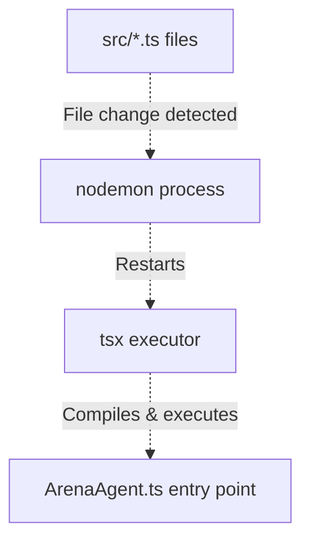
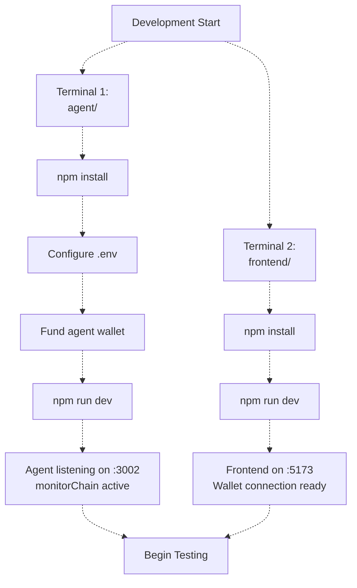
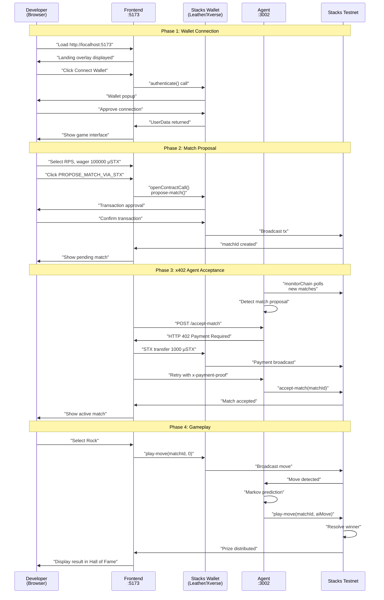
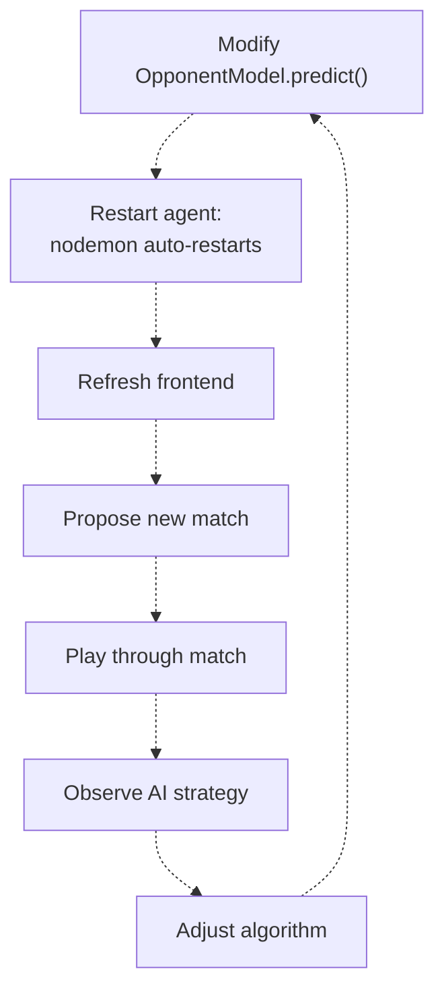
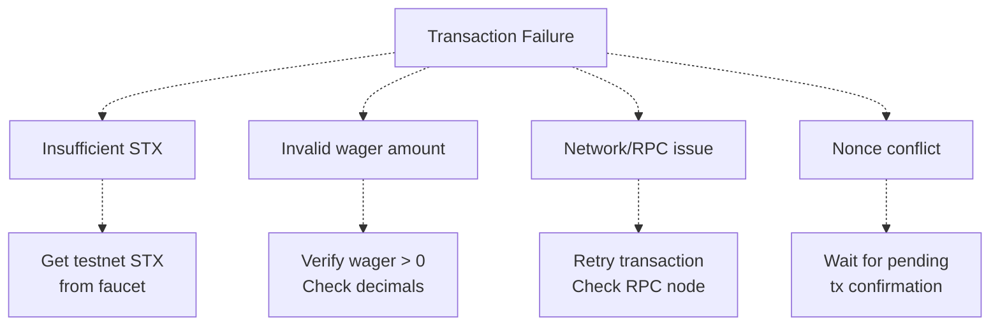

# Development and Testing Guide

> **Relevant source files**
> * [QUICKSTART.md](https://github.com/HACK3R-CRYPTO/GameArenaStacks/blob/23ba68fb/QUICKSTART.md)
> * [agent/nodemon.json](https://github.com/HACK3R-CRYPTO/GameArenaStacks/blob/23ba68fb/agent/nodemon.json)
> * [agent/src/debug_match.ts](https://github.com/HACK3R-CRYPTO/GameArenaStacks/blob/23ba68fb/agent/src/debug_match.ts)
> * [frontend/vite.config.js](https://github.com/HACK3R-CRYPTO/GameArenaStacks/blob/23ba68fb/frontend/vite.config.js)

This document provides comprehensive guidance for developers working on GameArenaStacks. It covers environment setup, development workflows, testing procedures, debugging utilities, and troubleshooting common issues. For contract deployment information, see [Contract Deployment](/HACK3R-CRYPTO/GameArenaStacks/4.3-contract-deployment). For agent-specific configuration details, see [Agent Setup and Configuration](/HACK3R-CRYPTO/GameArenaStacks/3.1-agent-setup-and-configuration).

---

## Prerequisites

The following tools and resources are required before beginning development:

| Requirement | Version | Purpose |
| --- | --- | --- |
| Node.js | 18+ | Runtime for both frontend and agent |
| npm | Bundled with Node.js | Package management |
| Stacks Wallet | Latest | Leather, Xverse, or Asigna for testing |
| Testnet STX | Variable | Funding matches and agent operations |
| Git | Any recent | Version control |

**Obtaining Testnet STX:**

* Stacks Testnet Faucet: [https://explorer.hiro.so/sandbox/faucet?chain=testnet](https://explorer.hiro.so/sandbox/faucet?chain=testnet)
* Required for: Agent wallet funding, user wallet funding, match wagering
* Recommended minimum: 10 STX for agent wallet, 5 STX for user wallet

**Sources**: [QUICKSTART.md L4-L7](https://github.com/HACK3R-CRYPTO/GameArenaStacks/blob/23ba68fb/QUICKSTART.md#L4-L7)

---

## Initial Repository Setup

### Cloning and Directory Structure

```
git clone https://github.com/HACK3R-CRYPTO/GameArenaStacks.git
cd GameArenaStacks
```

The repository contains three primary directories:

```markdown
GameArenaStacks/
├── frontend/          # React + Vite application
├── agent/             # Express + x402 autonomous agent
└── contracts/         # Clarity smart contracts
```

**Sources**: [QUICKSTART.md L11-L16](https://github.com/HACK3R-CRYPTO/GameArenaStacks/blob/23ba68fb/QUICKSTART.md#L11-L16)

---

## Agent Development Environment

### Installation and Configuration

```
cd agent
npm install
```

### Generating Agent Wallet

The agent requires its own Stacks wallet for autonomous transaction signing:

```
npx @stacks/cli make_keychain -t > agent_wallet.json
```

This generates a JSON file containing:

* `mnemonic`: 24-word seed phrase
* `keyInfo.privateKey`: Required for `.env` configuration
* `keyInfo.address`: Agent's Stacks address (must be funded)

### Environment Configuration

Create `.env` from template:

```
cp .env.example .env
```

Required environment variables:

| Variable | Description | Example |
| --- | --- | --- |
| `PRIVATE_KEY` | Agent's private key from `agent_wallet.json` | Hex string |
| `PORT` | Express server port | `3002` |
| `DEPLOYER` | Contract deployer address | Testnet address |
| `CONTRACT_NAME` | Arena platform contract name | `arena-platform-v2` |

**Funding the Agent Wallet:**

1. Copy the `address` value from `agent_wallet.json`
2. Visit the Stacks testnet faucet
3. Request 10+ STX to fund agent operations (match acceptance, moves, x402 payments)

**Sources**: [QUICKSTART.md L18-L43](https://github.com/HACK3R-CRYPTO/GameArenaStacks/blob/23ba68fb/QUICKSTART.md#L18-L43)

### Development Mode with Hot Reload

The agent uses `nodemon` with `tsx` for TypeScript execution with automatic reloading:

```
npm run dev
```

The `nodemon` configuration watches TypeScript files and restarts on changes:



**Configuration Details** ([agent/nodemon.json L1-L12](https://github.com/HACK3R-CRYPTO/GameArenaStacks/blob/23ba68fb/agent/nodemon.json#L1-L12)

):

* `watch`: Monitors `src/` directory
* `ext`: Watches `.ts` file extensions
* `ignore`: Excludes test files and `node_modules`
* `exec`: Runs `tsx src/ArenaAgent.ts` on changes

**Sources**: [agent/nodemon.json L1-L12](https://github.com/HACK3R-CRYPTO/GameArenaStacks/blob/23ba68fb/agent/nodemon.json#L1-L12)

 [QUICKSTART.md L40-L43](https://github.com/HACK3R-CRYPTO/GameArenaStacks/blob/23ba68fb/QUICKSTART.md#L40-L43)

---

## Frontend Development Environment

### Installation

```
cd frontend
npm install
```

### Key Dependencies

| Package | Version | Purpose |
| --- | --- | --- |
| `react` | 19.2.0 | UI framework |
| `vite` | 7.2.4 | Build tool and dev server |
| `@stacks/connect` | 7.8.3 | Wallet integration |
| `@stacks/transactions` | 6.13.0 | Transaction construction |
| `x402-stacks` | 2.0.1 | x402 payment client |
| `tailwindcss` | 4.1.18 | Styling framework |

### Development Server

```
npm run dev
```

Access at: [http://localhost:5173](http://localhost:5173)

**Sources**: [QUICKSTART.md L45-L57](https://github.com/HACK3R-CRYPTO/GameArenaStacks/blob/23ba68fb/QUICKSTART.md#L45-L57)

### Vite Configuration

The frontend uses custom Vite configuration to support Stacks libraries in browser environments:

**Polyfills Configuration** ([frontend/vite.config.js L7-L16](https://github.com/HACK3R-CRYPTO/GameArenaStacks/blob/23ba68fb/frontend/vite.config.js#L7-L16)

):

* `global` aliased to `globalThis` for Node.js compatibility
* `buffer` polyfill for cryptographic operations
* `process/browser` for environment variable access
* `esbuildOptions.define` ensures consistent global object

These polyfills are required because Stacks.js libraries were originally designed for Node.js environments and use Node.js-specific globals.

**Sources**: [frontend/vite.config.js L1-L25](https://github.com/HACK3R-CRYPTO/GameArenaStacks/blob/23ba68fb/frontend/vite.config.js#L1-L25)

---

## Running the Complete Development Stack

### Startup Sequence



### Verification Checklist

After starting both services, verify:

**Agent Service ([http://localhost:3002](http://localhost:3002)):**

* Server responds to health checks
* Console shows `monitorChain started`
* No errors in terminal output
* Agent wallet address has sufficient testnet STX

**Frontend Service ([http://localhost:5173](http://localhost:5173)):**

* Page loads without errors
* Browser console shows no critical errors
* Wallet connection button is visible
* Network requests use correct contract addresses

**Sources**: [QUICKSTART.md L18-L57](https://github.com/HACK3R-CRYPTO/GameArenaStacks/blob/23ba68fb/QUICKSTART.md#L18-L57)

---

## Complete Testing Workflow

### End-to-End Match Flow

The following sequence represents a complete development testing cycle:



### Manual Testing Steps

**1. Wallet Connection** ([QUICKSTART.md L61-L64](https://github.com/HACK3R-CRYPTO/GameArenaStacks/blob/23ba68fb/QUICKSTART.md#L61-L64)

):

* Click "Connect Wallet" button
* Select Leather, Xverse, or Asigna
* Approve connection request
* Verify wallet address appears in Navigation component

**2. Match Proposal** ([QUICKSTART.md L66-L70](https://github.com/HACK3R-CRYPTO/GameArenaStacks/blob/23ba68fb/QUICKSTART.md#L66-L70)

):

* Select game type: Rock-Paper-Scissors, Dice Roll, or Coin Flip
* Set wager amount (default: 100000 microSTX = 0.1 STX)
* Click "PROPOSE_MATCH_VIA_STX"
* Confirm transaction in wallet popup
* Wait for transaction confirmation (~30-60 seconds)

**3. Agent Acceptance** ([QUICKSTART.md L72-L75](https://github.com/HACK3R-CRYPTO/GameArenaStacks/blob/23ba68fb/QUICKSTART.md#L72-L75)

):

* Agent's `monitorChain` detects match automatically
* x402 payment flow initiates (1000 microSTX)
* Agent broadcasts `accept-match` transaction
* Match status updates to "Active"

**4. Gameplay** ([QUICKSTART.md L77-L81](https://github.com/HACK3R-CRYPTO/GameArenaStacks/blob/23ba68fb/QUICKSTART.md#L77-L81)

):

* Make move selection (Rock=0, Paper=1, Scissors=2)
* Click "Play Move" button
* Confirm transaction
* Agent responds with Markov Chain-predicted counter-move
* Match resolves on-chain
* Winner receives 98% of total pot
* Result displays in Hall of Fame component

**Sources**: [QUICKSTART.md L59-L81](https://github.com/HACK3R-CRYPTO/GameArenaStacks/blob/23ba68fb/QUICKSTART.md#L59-L81)

---

## Debugging Tools and Utilities

### Match State Inspector

The agent includes a debugging utility for inspecting on-chain match state:

**File**: `agent/src/debug_match.ts`

**Functionality** ([agent/src/debug_match.ts L9-L72](https://github.com/HACK3R-CRYPTO/GameArenaStacks/blob/23ba68fb/agent/src/debug_match.ts#L9-L72)

):

1. Queries `get-match-details` for match metadata
2. Retrieves `get-player-move` for both challenger and opponent
3. Displays raw contract response data in JSON format
4. Extracts player addresses from match details

**Usage**:

```markdown
cd agent
# Edit debug_match.ts to set matchId
npx tsx src/debug_match.ts
```

**Sample Output**:

```json
{
  "AGENT MOVE": { "value": { "value": 2 } },
  "Challenger": "ST1PQHQKV0RJXZFY1DGX8MNSNYVE3VGZJSRTPGZGM",
  "Opponent": "ST3273FDNHADRB84GK2C0GWQQW9WXZGR1V5GAR0MA",
  "CHALLENGER MOVE": { "value": { "value": 0 } }
}
```

**Key Functions Used**:

* `callReadOnlyFunction` from `@stacks/transactions`
* `cvToJSON` for Clarity value deserialization
* `uintCV`, `principalCV` for argument construction

**Sources**: [agent/src/debug_match.ts L1-L73](https://github.com/HACK3R-CRYPTO/GameArenaStacks/blob/23ba68fb/agent/src/debug_match.ts#L1-L73)

### Browser Developer Tools

**Frontend Debugging**:

Chrome DevTools provides several useful panels:

| Panel | Purpose | Key Information |
| --- | --- | --- |
| Console | JavaScript errors, logs | x402 payment flows, transaction IDs |
| Network | HTTP requests | Agent API calls, Stacks RPC queries |
| Application | Storage | Wallet connection state, cached data |
| React DevTools | Component state | ArenaGame state, match data |

**Common Debug Points**:

* `ArenaGame.jsx` console logs for transaction tracking
* `x402-stacks` payment verification logs
* Stacks Connect wallet interaction logs

**Agent Debugging**:

The Express server logs all requests and key operations:

```
[Express] POST /accept-match - matchId: 5
[x402] Payment required: 1000 microSTX
[x402] Payment verified: tx abc123...
[ArenaAgent] Accepting match 5
[monitorChain] Detected user move in match 5
[OpponentModel] Predicting counter-move
[ArenaAgent] Playing move 1 in match 5
```

**Sources**: [QUICKSTART.md L93-L106](https://github.com/HACK3R-CRYPTO/GameArenaStacks/blob/23ba68fb/QUICKSTART.md#L93-L106)

---

## Common Development Workflows

### Testing New Game Logic



**Workflow Steps**:

1. Edit `agent/src/ArenaAgent.ts` OpponentModel class
2. Save file (nodemon automatically restarts)
3. Propose new match from frontend
4. Play through match to test new strategy
5. Inspect agent logs for prediction logic
6. Iterate on algorithm

### Testing x402 Payment Flow

**Scenario: Verify payment verification logic**

1. Set breakpoint in `agent/src/ArenaAgent.ts` x402 middleware
2. Trigger match acceptance from frontend
3. Observe HTTP 402 response
4. Verify payment transaction on Stacks explorer
5. Confirm agent retries after payment proof
6. Validate `accept-match` transaction broadcast

### Testing Contract Interactions

**Scenario: Verify contract read operations**

The frontend uses `callReadOnlyWithRetry` for resilient contract queries:

```markdown
# Monitor network tab in Chrome DevTools
# Filter by: api.testnet.hiro.so
# Observe POST requests to /v2/contracts/call-read/
```

**Key Read-Only Functions**:

* `get-match-details(matchId)`
* `get-player-move(matchId, player)`
* `get-agent-profile(agentAddress)`
* `get-total-matches()`

**Sources**: [QUICKSTART.md L108-L130](https://github.com/HACK3R-CRYPTO/GameArenaStacks/blob/23ba68fb/QUICKSTART.md#L108-L130)

---

## Deployed Testnet Contracts

All development testing uses contracts deployed on Stacks Testnet:

| Contract | Address | Purpose |
| --- | --- | --- |
| Deployer | `ST3V7NY32G2T67PVPBP3WVC1B228D7N2MCCAWW5F9` | Contract owner |
| `arena-platform-v2` | `ST3V7NY32G2T67PVPBP3WVC1B228D7N2MCCAWW5F9.arena-platform-v2` | Game logic and wagering |
| `agent-registry` | `ST3V7NY32G2T67PVPBP3WVC1B228D7N2MCCAWW5F9.agent-registry` | Agent identity system |

**Explorer Links**:

* Deployer account: [https://explorer.hiro.so/address/ST3V7NY32G2T67PVPBP3WVC1B228D7N2MCCAWW5F9?chain=testnet](https://explorer.hiro.so/address/ST3V7NY32G2T67PVPBP3WVC1B228D7N2MCCAWW5F9?chain=testnet)
* Contract transactions: Filter by "Contract Call" type
* Match events: View contract events tab

**Sources**: [QUICKSTART.md L83-L89](https://github.com/HACK3R-CRYPTO/GameArenaStacks/blob/23ba68fb/QUICKSTART.md#L83-L89)

---

## Troubleshooting Common Issues

### Agent Not Responding

**Symptoms**:

* Match remains in "Proposed" state
* No agent acceptance transaction
* Frontend shows "Waiting for agent..."

**Diagnosis**:

| Check | Command/Action | Expected Result |
| --- | --- | --- |
| Agent running | `ps aux \| grep tsx` | Process found |
| Agent logs | Terminal output | "monitorChain started" |
| Agent wallet | Check balance on explorer | > 1 STX available |
| Network connectivity | `curl http://localhost:3002` | Server responds |

**Solutions**:

1. Restart agent: `npm run dev`
2. Fund agent wallet from faucet
3. Verify `.env` PRIVATE_KEY is correct
4. Check console for error messages

**Sources**: [QUICKSTART.md L93-L96](https://github.com/HACK3R-CRYPTO/GameArenaStacks/blob/23ba68fb/QUICKSTART.md#L93-L96)

### Transaction Failing

**Symptoms**:

* Wallet rejects transaction
* "Insufficient funds" error
* Transaction broadcast fails

**Common Causes**:



**Verification Steps**:

1. Check wallet balance > wager amount + fees
2. Verify wager is positive integer (microSTX)
3. Confirm network is set to "testnet"
4. Wait for pending transactions to confirm
5. Try alternative RPC node (frontend has built-in failover)

**Sources**: [QUICKSTART.md L98-L101](https://github.com/HACK3R-CRYPTO/GameArenaStacks/blob/23ba68fb/QUICKSTART.md#L98-L101)

### Wallet Connection Issues

**Symptoms**:

* "Connect Wallet" button unresponsive
* Wallet popup doesn't appear
* Connection disconnects immediately

**Solutions**:

1. **Browser Cache**: Clear cache and reload page
2. **Wallet Extension**: Ensure Leather/Xverse is installed and updated
3. **Network Selection**: Verify wallet is set to Testnet
4. **Try Alternative Wallet**: Test with different wallet provider
5. **Page Refresh**: Hard refresh (Ctrl+Shift+R / Cmd+Shift+R)

**Sources**: [QUICKSTART.md L103-L106](https://github.com/HACK3R-CRYPTO/GameArenaStacks/blob/23ba68fb/QUICKSTART.md#L103-L106)

### Development Environment Issues

**Node.js Version Mismatch**:

```python
# Check current version
node --version

# Should output: v18.x.x or higher
# If lower, install Node.js 18+ from nodejs.org
```

**Port Conflicts**:

```markdown
# Check if port 3002 is in use
lsof -i :3002

# Kill process if needed
kill -9 <PID>
```

**Dependency Installation Failures**:

```markdown
# Clear npm cache
npm cache clean --force

# Remove node_modules and reinstall
rm -rf node_modules package-lock.json
npm install
```

**Sources**: [QUICKSTART.md L4-L7](https://github.com/HACK3R-CRYPTO/GameArenaStacks/blob/23ba68fb/QUICKSTART.md#L4-L7)

---

## Development Best Practices

### Code Organization

**Agent Structure**:

```markdown
agent/src/
├── ArenaAgent.ts          # Main entry point, Express server
├── debug_match.ts         # Debugging utility
└── [future utilities]
```

**Frontend Structure**:

```javascript
frontend/src/
├── pages/
│   └── ArenaGame.jsx      # Main game component
├── components/
│   ├── Navigation.jsx     # Wallet integration
│   ├── Landing.jsx        # Entry overlay
│   ├── DocsModal.jsx      # Documentation
│   └── HallOfFame.jsx     # Results display
└── App.jsx                # Root component
```

### Testing Checklist

Before committing changes:

* Agent starts without errors (`npm run dev`)
* Frontend builds successfully (`npm run build`)
* Wallet connection works with Leather and Xverse
* Match proposal completes on-chain
* x402 payment flow functions correctly
* Agent accepts matches automatically
* Moves are recorded on-chain
* Match resolution distributes prizes correctly
* Hall of Fame displays results
* No console errors in browser

### Performance Monitoring

**Agent Performance**:

* Monitor `monitorChain` polling frequency (default: 30 seconds)
* Check transaction broadcast latency
* Verify Markov prediction computation time

**Frontend Performance**:

* Monitor Stacks RPC query response times
* Check transaction polling frequency
* Verify BitSubs subscription efficiency

**Sources**: [QUICKSTART.md L108-L130](https://github.com/HACK3R-CRYPTO/GameArenaStacks/blob/23ba68fb/QUICKSTART.md#L108-L130)

---

## Additional Resources

### Documentation References

| Resource | Description | Link Format |
| --- | --- | --- |
| Project Overview | High-level system architecture | [GameArenaStacks Overview](/HACK3R-CRYPTO/GameArenaStacks/1-gamearenastacks-overview) |
| Agent Configuration | Environment setup details | [Agent Setup and Configuration](/HACK3R-CRYPTO/GameArenaStacks/3.1-agent-setup-and-configuration) |
| x402 Protocol | Payment middleware documentation | [x402 Payment Middleware](/HACK3R-CRYPTO/GameArenaStacks/3.2-x402-payment-middleware) |
| Smart Contracts | Contract API reference | [arena-platform-v2 Contract](/HACK3R-CRYPTO/GameArenaStacks/4.1-arena-platform-v2-contract) |
| Match Lifecycle | Complete state transitions | [Match Lifecycle and State Management](/HACK3R-CRYPTO/GameArenaStacks/9-match-lifecycle-and-state-management) |

### External Documentation

* **Stacks Documentation**: [https://docs.stacks.co](https://docs.stacks.co)
* **x402 Protocol**: [https://x402stacks.xyz](https://x402stacks.xyz)
* **Stacks.js SDK**: [https://stacks.js.org](https://stacks.js.org)
* **Clarity Language**: [https://docs.stacks.co/clarity](https://docs.stacks.co/clarity)

### Support Channels

* **GitHub Repository**: [https://github.com/HACK3R-CRYPTO/GameArenaStacks](https://github.com/HACK3R-CRYPTO/GameArenaStacks)
* **Issue Tracker**: Report bugs and feature requests
* **Discussions**: Community support and questions

**Sources**: [QUICKSTART.md L132-L142](https://github.com/HACK3R-CRYPTO/GameArenaStacks/blob/23ba68fb/QUICKSTART.md#L132-L142)