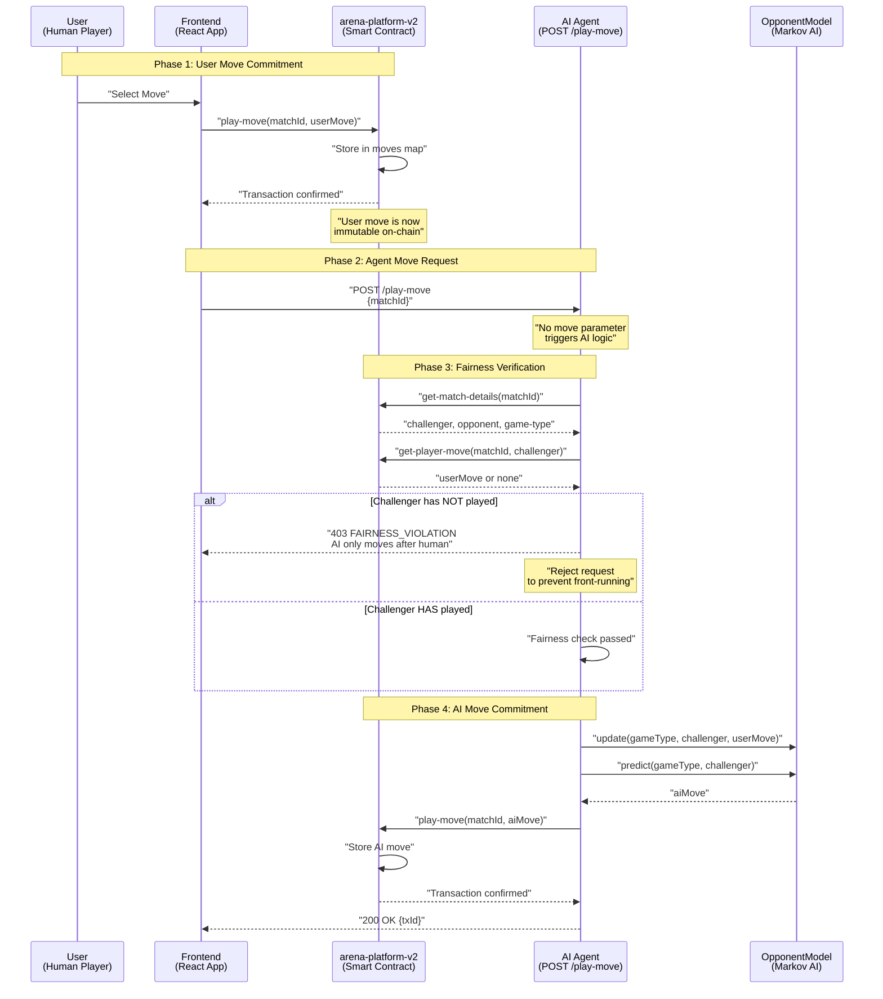
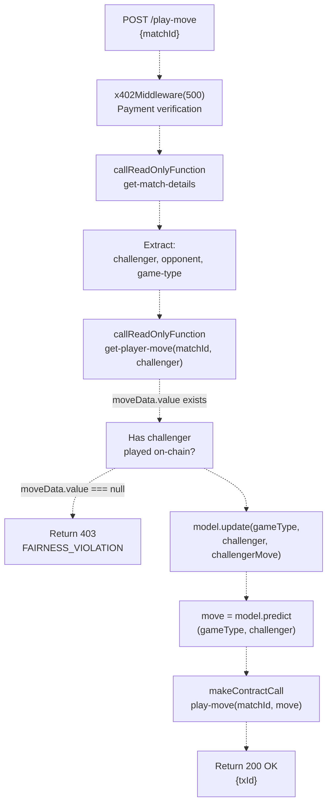
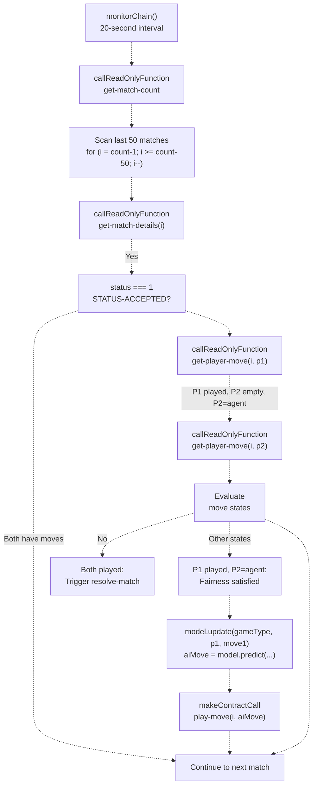
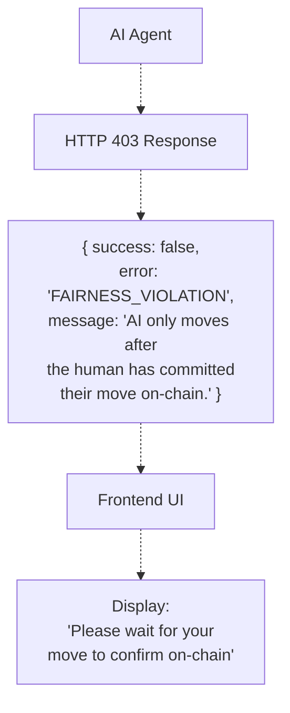

# Fair Play Architecture

> **Relevant source files**
> * [PROJECT_SUMMARY.md](https://github.com/HACK3R-CRYPTO/GameArenaStacks/blob/23ba68fb/PROJECT_SUMMARY.md)
> * [README.md](https://github.com/HACK3R-CRYPTO/GameArenaStacks/blob/23ba68fb/README.md)
> * [agent/.env.example](https://github.com/HACK3R-CRYPTO/GameArenaStacks/blob/23ba68fb/agent/.env.example)
> * [agent/src/ArenaAgent.ts](https://github.com/HACK3R-CRYPTO/GameArenaStacks/blob/23ba68fb/agent/src/ArenaAgent.ts)

## Purpose and Scope

This document describes the Fair Play Architecture implemented in GameArenaStacks to ensure trustless, exploit-free gameplay between human players and autonomous AI agents. Fair Play refers to the system's guarantee that the AI agent cannot front-run or manipulate game outcomes by observing user moves before committing its own move on-chain.

This document focuses on the technical mechanisms that enforce fairness during match execution. For information about the x402 payment protocol that monetizes agent services, see [x402 Monetization Protocol](/HACK3R-CRYPTO/GameArenaStacks/5-x402-monetization-protocol). For details about the Markov Chain AI strategy that generates moves, see [Markov Chain AI Strategy](/HACK3R-CRYPTO/GameArenaStacks/3.3-markov-chain-ai-strategy). For the complete match lifecycle including proposal and resolution phases, see [Match Lifecycle and State Management](/HACK3R-CRYPTO/GameArenaStacks/9-match-lifecycle-and-state-management).

---

## Fair Play Guarantees

The GameArenaStacks platform enforces the following fairness guarantees:

| Guarantee | Implementation | Enforcement Point |
| --- | --- | --- |
| **No Front-Running** | Agent waits for on-chain move confirmation | `/play-move` endpoint, `monitorChain` function |
| **Move Immutability** | Moves are committed to blockchain before opponent observes | `arena-platform-v2` contract state |
| **Transparent Verification** | All move checks query public contract state | `get-player-move` read-only function |
| **Automated Fairness** | Fairness checks happen automatically on every AI move | `FAIRNESS_VIOLATION` error response |

The architecture ensures that even though the AI agent has superior computational resources, it cannot exploit information asymmetry to gain an unfair advantage over human players.

**Sources:** [agent/src/ArenaAgent.ts L193-L224](https://github.com/HACK3R-CRYPTO/GameArenaStacks/blob/23ba68fb/agent/src/ArenaAgent.ts#L193-L224)

 [agent/src/ArenaAgent.ts L435-L468](https://github.com/HACK3R-CRYPTO/GameArenaStacks/blob/23ba68fb/agent/src/ArenaAgent.ts#L435-L468)

 [README.md L64](https://github.com/HACK3R-CRYPTO/GameArenaStacks/blob/23ba68fb/README.md#L64-L64)

---

## Fair Play Verification Flow

The following diagram illustrates the complete verification flow that enforces fairness when the AI agent attempts to make a move:



**Key Observation:** The critical fairness boundary occurs between Phase 2 and Phase 3. The agent refuses to proceed to Phase 4 (AI move commitment) until Phase 1 (user move commitment) is verifiably complete on-chain.

**Sources:** [agent/src/ArenaAgent.ts L186-L301](https://github.com/HACK3R-CRYPTO/GameArenaStacks/blob/23ba68fb/agent/src/ArenaAgent.ts#L186-L301)

 [agent/src/ArenaAgent.ts L193-L224](https://github.com/HACK3R-CRYPTO/GameArenaStacks/blob/23ba68fb/agent/src/ArenaAgent.ts#L193-L224)

---

## Fairness Check Implementation

The fairness check is implemented in two locations within the agent codebase: the `/play-move` API endpoint and the `monitorChain` background process.

### Endpoint Fairness Check

When the frontend requests an AI move via `POST /play-move`, the agent performs the following verification sequence:



The implementation at [agent/src/ArenaAgent.ts L193-L224](https://github.com/HACK3R-CRYPTO/GameArenaStacks/blob/23ba68fb/agent/src/ArenaAgent.ts#L193-L224)

 executes this check:

| Step | Function Call | Purpose |
| --- | --- | --- |
| 1 | `callReadOnlyFunction('get-match-details', [uintCV(matchId)])` | Retrieve match metadata including `challenger` address |
| 2 | `callReadOnlyFunction('get-player-move', [uintCV(matchId), principalCV(challenger)])` | Query challenger's move from contract state |
| 3 | Check `moveData.value === null` | Verify move exists on-chain |
| 4 | Return `403 FAIRNESS_VIOLATION` if null | Reject request with error message |
| 5 | Proceed to AI logic if move exists | Continue with Markov Chain prediction |

**Sources:** [agent/src/ArenaAgent.ts L193-L224](https://github.com/HACK3R-CRYPTO/GameArenaStacks/blob/23ba68fb/agent/src/ArenaAgent.ts#L193-L224)

 [agent/src/ArenaAgent.ts L206-L215](https://github.com/HACK3R-CRYPTO/GameArenaStacks/blob/23ba68fb/agent/src/ArenaAgent.ts#L206-L215)

### Chain Monitor Fairness Check

The `monitorChain` function implements a similar check when automatically responding to matches. This background process runs every 20 seconds and scans for matches where the challenger has played but the agent has not:



The conditional logic at [agent/src/ArenaAgent.ts L435-L468](https://github.com/HACK3R-CRYPTO/GameArenaStacks/blob/23ba68fb/agent/src/ArenaAgent.ts#L435-L468)

 ensures the agent only commits its move when:

1. The match status is `STATUS-ACCEPTED` (value `1`)
2. Player 1 (challenger) has a move recorded on-chain
3. Player 2 (agent) does not yet have a move recorded
4. Player 2's address matches `AGENT_ADDRESS`

**Sources:** [agent/src/ArenaAgent.ts L330-L475](https://github.com/HACK3R-CRYPTO/GameArenaStacks/blob/23ba68fb/agent/src/ArenaAgent.ts#L330-L475)

 [agent/src/ArenaAgent.ts L435-L468](https://github.com/HACK3R-CRYPTO/GameArenaStacks/blob/23ba68fb/agent/src/ArenaAgent.ts#L435-L468)

---

## Contract State Queries for Fairness

Both fairness checks rely on read-only contract queries to verify on-chain state. The following table maps the queries to their contract functions:

| Contract Function | Parameters | Return Value | Purpose |
| --- | --- | --- | --- |
| `get-match-details` | `(uint matchId)` | `(optional {challenger: principal, opponent: (optional principal), status: uint, game-type: uint, ...})` | Retrieve match metadata |
| `get-player-move` | `(uint matchId) (principal player)` | `(optional uint)` | Check if player has committed a move |
| `get-match-count` | None | `uint` | Get total number of matches for scanning |

The agent uses `callReadOnlyFunction` from `@stacks/transactions` to query these functions without broadcasting transactions. This allows zero-cost verification of on-chain state before committing to any action.

**Example Query Structure:**

```javascript
const challengerMoveRes = await callReadOnlyFunction({
    contractAddress: CONTRACT_ADDRESS,
    contractName: CONTRACT_NAME,
    functionName: 'get-player-move',
    functionArgs: [uintCV(matchId), principalCV(challenger)],
    network,
    senderAddress: AGENT_ADDRESS,
});
const moveData = cvToJSON(challengerMoveRes).value;
```

The returned `moveData.value` will be:

* `null` if the player has not committed a move (fairness violation)
* A numeric value (0-5 depending on game type) if the move exists on-chain

**Sources:** [agent/src/ArenaAgent.ts L207-L215](https://github.com/HACK3R-CRYPTO/GameArenaStacks/blob/23ba68fb/agent/src/ArenaAgent.ts#L207-L215)

 [agent/src/ArenaAgent.ts L372-L387](https://github.com/HACK3R-CRYPTO/GameArenaStacks/blob/23ba68fb/agent/src/ArenaAgent.ts#L372-L387)

---

## Error Handling and User Feedback

When the fairness check fails, the agent returns a structured error response that the frontend can display to the user:



The error code `FAIRNESS_VIOLATION` is a domain-specific identifier that allows the frontend to distinguish this error from other failure modes (e.g., network errors, contract errors, payment failures). The message provides clear guidance to users about why their request was rejected.

**Sources:** [agent/src/ArenaAgent.ts L219-L223](https://github.com/HACK3R-CRYPTO/GameArenaStacks/blob/23ba68fb/agent/src/ArenaAgent.ts#L219-L223)

---

## Move Sequencing Guarantees

The Fair Play Architecture enforces strict move sequencing through the combination of contract state and agent logic:

### Sequencing Rules

| Player | Move Order | Enforcement Mechanism | Blockchain State Required |
| --- | --- | --- | --- |
| Challenger (Human) | Always moves first | Frontend allows move submission immediately after match acceptance | Match status = `STATUS-ACCEPTED` |
| Opponent (AI Agent) | Always moves second | Agent checks for challenger's on-chain move before proceeding | Challenger move exists in contract `moves` map |

### State Transitions

```css
#mermaid-0hkef2nuq4s{font-family:ui-sans-serif,-apple-system,system-ui,Segoe UI,Helvetica;font-size:16px;fill:#333;}@keyframes edge-animation-frame{from{stroke-dashoffset:0;}}@keyframes dash{to{stroke-dashoffset:0;}}#mermaid-0hkef2nuq4s .edge-animation-slow{stroke-dasharray:9,5!important;stroke-dashoffset:900;animation:dash 50s linear infinite;stroke-linecap:round;}#mermaid-0hkef2nuq4s .edge-animation-fast{stroke-dasharray:9,5!important;stroke-dashoffset:900;animation:dash 20s linear infinite;stroke-linecap:round;}#mermaid-0hkef2nuq4s .error-icon{fill:#dddddd;}#mermaid-0hkef2nuq4s .error-text{fill:#222222;stroke:#222222;}#mermaid-0hkef2nuq4s .edge-thickness-normal{stroke-width:1px;}#mermaid-0hkef2nuq4s .edge-thickness-thick{stroke-width:3.5px;}#mermaid-0hkef2nuq4s .edge-pattern-solid{stroke-dasharray:0;}#mermaid-0hkef2nuq4s .edge-thickness-invisible{stroke-width:0;fill:none;}#mermaid-0hkef2nuq4s .edge-pattern-dashed{stroke-dasharray:3;}#mermaid-0hkef2nuq4s .edge-pattern-dotted{stroke-dasharray:2;}#mermaid-0hkef2nuq4s .marker{fill:#999;stroke:#999;}#mermaid-0hkef2nuq4s .marker.cross{stroke:#999;}#mermaid-0hkef2nuq4s svg{font-family:ui-sans-serif,-apple-system,system-ui,Segoe UI,Helvetica;font-size:16px;}#mermaid-0hkef2nuq4s p{margin:0;}#mermaid-0hkef2nuq4s defs #statediagram-barbEnd{fill:#999;stroke:#999;}#mermaid-0hkef2nuq4s g.stateGroup text{fill:#dddddd;stroke:none;font-size:10px;}#mermaid-0hkef2nuq4s g.stateGroup text{fill:#333;stroke:none;font-size:10px;}#mermaid-0hkef2nuq4s g.stateGroup .state-title{font-weight:bolder;fill:#333;}#mermaid-0hkef2nuq4s g.stateGroup rect{fill:#ffffff;stroke:#dddddd;}#mermaid-0hkef2nuq4s g.stateGroup line{stroke:#999;stroke-width:1;}#mermaid-0hkef2nuq4s .transition{stroke:#999;stroke-width:1;fill:none;}#mermaid-0hkef2nuq4s .stateGroup .composit{fill:#f4f4f4;border-bottom:1px;}#mermaid-0hkef2nuq4s .stateGroup .alt-composit{fill:#e0e0e0;border-bottom:1px;}#mermaid-0hkef2nuq4s .state-note{stroke:#e6d280;fill:#fff5ad;}#mermaid-0hkef2nuq4s .state-note text{fill:#333;stroke:none;font-size:10px;}#mermaid-0hkef2nuq4s .stateLabel .box{stroke:none;stroke-width:0;fill:#ffffff;opacity:0.5;}#mermaid-0hkef2nuq4s .edgeLabel .label rect{fill:#ffffff;opacity:0.5;}#mermaid-0hkef2nuq4s .edgeLabel{background-color:#ffffff;text-align:center;}#mermaid-0hkef2nuq4s .edgeLabel p{background-color:#ffffff;}#mermaid-0hkef2nuq4s .edgeLabel rect{opacity:0.5;background-color:#ffffff;fill:#ffffff;}#mermaid-0hkef2nuq4s .edgeLabel .label text{fill:#333;}#mermaid-0hkef2nuq4s .label div .edgeLabel{color:#333;}#mermaid-0hkef2nuq4s .stateLabel text{fill:#333;font-size:10px;font-weight:bold;}#mermaid-0hkef2nuq4s .node circle.state-start{fill:#999;stroke:#999;}#mermaid-0hkef2nuq4s .node .fork-join{fill:#999;stroke:#999;}#mermaid-0hkef2nuq4s .node circle.state-end{fill:#dddddd;stroke:#f4f4f4;stroke-width:1.5;}#mermaid-0hkef2nuq4s .end-state-inner{fill:#f4f4f4;stroke-width:1.5;}#mermaid-0hkef2nuq4s .node rect{fill:#ffffff;stroke:#dddddd;stroke-width:1px;}#mermaid-0hkef2nuq4s .node polygon{fill:#ffffff;stroke:#dddddd;stroke-width:1px;}#mermaid-0hkef2nuq4s #statediagram-barbEnd{fill:#999;}#mermaid-0hkef2nuq4s .statediagram-cluster rect{fill:#ffffff;stroke:#dddddd;stroke-width:1px;}#mermaid-0hkef2nuq4s .cluster-label,#mermaid-0hkef2nuq4s .nodeLabel{color:#333;}#mermaid-0hkef2nuq4s .statediagram-cluster rect.outer{rx:5px;ry:5px;}#mermaid-0hkef2nuq4s .statediagram-state .divider{stroke:#dddddd;}#mermaid-0hkef2nuq4s .statediagram-state .title-state{rx:5px;ry:5px;}#mermaid-0hkef2nuq4s .statediagram-cluster.statediagram-cluster .inner{fill:#f4f4f4;}#mermaid-0hkef2nuq4s .statediagram-cluster.statediagram-cluster-alt .inner{fill:#f8f8f8;}#mermaid-0hkef2nuq4s .statediagram-cluster .inner{rx:0;ry:0;}#mermaid-0hkef2nuq4s .statediagram-state rect.basic{rx:5px;ry:5px;}#mermaid-0hkef2nuq4s .statediagram-state rect.divider{stroke-dasharray:10,10;fill:#f8f8f8;}#mermaid-0hkef2nuq4s .note-edge{stroke-dasharray:5;}#mermaid-0hkef2nuq4s .statediagram-note rect{fill:#fff5ad;stroke:#e6d280;stroke-width:1px;rx:0;ry:0;}#mermaid-0hkef2nuq4s .statediagram-note rect{fill:#fff5ad;stroke:#e6d280;stroke-width:1px;rx:0;ry:0;}#mermaid-0hkef2nuq4s .statediagram-note text{fill:#333;}#mermaid-0hkef2nuq4s .statediagram-note .nodeLabel{color:#333;}#mermaid-0hkef2nuq4s .statediagram .edgeLabel{color:red;}#mermaid-0hkef2nuq4s #dependencyStart,#mermaid-0hkef2nuq4s #dependencyEnd{fill:#999;stroke:#999;stroke-width:1;}#mermaid-0hkef2nuq4s .statediagramTitleText{text-anchor:middle;font-size:18px;fill:#333;}#mermaid-0hkef2nuq4s :root{--mermaid-font-family:"trebuchet ms",verdana,arial,sans-serif;}"accept-match() confirmed""Challenger calls play-move()""Transaction confirmed""Agent detects or receives request""Query get-player-move(challenger)""Move = null""Move exists""Retry after confirmation""AI generates move""Agent's play-move() confirmed""Both moves immutable""Winner determined"MatchAcceptedChallengerCommittingChallengerMoveOnChainAgentCheckingFairnessCheckAgentRejectedAgentPredictingAgentCommittingBothMovesOnChainResolvingCritical fairness boundary:Agent cannot proceed withoutchallenger's on-chain commitment
```

The state machine demonstrates that there is no code path allowing the agent to reach `AgentCommitting` without first passing through `ChallengerMoveOnChain` and `FairnessCheck`. This architectural constraint is enforced at the application layer (agent code) rather than the contract layer, but it is verifiable by anyone through the agent's open-source implementation.

**Sources:** [agent/src/ArenaAgent.ts L193-L301](https://github.com/HACK3R-CRYPTO/GameArenaStacks/blob/23ba68fb/agent/src/ArenaAgent.ts#L193-L301)

 [agent/src/ArenaAgent.ts L435-L468](https://github.com/HACK3R-CRYPTO/GameArenaStacks/blob/23ba68fb/agent/src/ArenaAgent.ts#L435-L468)

---

## Security Properties

The Fair Play Architecture provides the following cryptographic and architectural security properties:

### Information Asymmetry Prevention

| Attack Vector | Mitigation | Implementation |
| --- | --- | --- |
| **Front-Running** | Agent cannot observe user move before commitment | User move must exist on blockchain before agent queries |
| **Move Prediction** | AI prediction occurs after user commitment | `model.predict()` only called after fairness check passes |
| **Transaction Ordering** | Blockchain state is source of truth | Agent queries immutable contract state, not pending transactions |
| **Time-Based Attacks** | Agent waits for block confirmation | No mempool monitoring; only confirmed blocks are queried |

### Verification Properties

Any observer can verify fair play by:

1. Monitoring the blockchain transaction history for a match
2. Confirming the challenger's `play-move` transaction has a lower block height than the agent's
3. Observing that the agent's transaction timestamp is after the challenger's transaction is confirmed

The agent's source code at [agent/src/ArenaAgent.ts](https://github.com/HACK3R-CRYPTO/GameArenaStacks/blob/23ba68fb/agent/src/ArenaAgent.ts)

 provides full transparency into the fairness implementation, allowing third-party audits.

**Sources:** [agent/src/ArenaAgent.ts L193-L224](https://github.com/HACK3R-CRYPTO/GameArenaStacks/blob/23ba68fb/agent/src/ArenaAgent.ts#L193-L224)

 [README.md L64](https://github.com/HACK3R-CRYPTO/GameArenaStacks/blob/23ba68fb/README.md#L64-L64)

---

## Integration with Markov AI

The Fair Play Architecture directly integrates with the Markov Chain AI strategy. The sequencing ensures that:

1. **Learning Occurs After Commitment:** The `model.update()` call at [agent/src/ArenaAgent.ts L228](https://github.com/HACK3R-CRYPTO/GameArenaStacks/blob/23ba68fb/agent/src/ArenaAgent.ts#L228-L228)  only occurs after the fairness check confirms the user's move is on-chain.
2. **Prediction Cannot Leak:** The `model.predict()` call at [agent/src/ArenaAgent.ts L231](https://github.com/HACK3R-CRYPTO/GameArenaStacks/blob/23ba68fb/agent/src/ArenaAgent.ts#L231-L231)  generates the counter-strategy only after the user's move is immutable.
3. **No Information Advantage:** Even though the AI has learned patterns from previous matches, it cannot exploit knowledge of the current user move until that move is committed to the blockchain.

This separation ensures that the Markov Chain's strategic advantage comes from pattern recognition across multiple matches, not from information asymmetry within a single match.

**Sources:** [agent/src/ArenaAgent.ts L226-L232](https://github.com/HACK3R-CRYPTO/GameArenaStacks/blob/23ba68fb/agent/src/ArenaAgent.ts#L226-L232)

 [agent/src/ArenaAgent.ts L440-L442](https://github.com/HACK3R-CRYPTO/GameArenaStacks/blob/23ba68fb/agent/src/ArenaAgent.ts#L440-L442)

---

## Monitoring and Observability

The agent logs fairness check events for monitoring and debugging:

```javascript
console.log(chalk.yellow(`⚠️ Fairness Check Failed: Challenger ${challenger} has not played for match #${matchId} yet.`));
```

These logs allow operators to:

* Verify the agent is correctly rejecting premature move requests
* Debug timing issues between transaction confirmation and API requests
* Monitor the rate of fairness check failures as an indicator of network latency

The `chalk` color-coded output distinguishes fairness violations (yellow) from successful operations (green) and critical errors (red).

**Sources:** [agent/src/ArenaAgent.ts L218](https://github.com/HACK3R-CRYPTO/GameArenaStacks/blob/23ba68fb/agent/src/ArenaAgent.ts#L218-L218)

---

## Comparison with Alternative Architectures

Alternative approaches to ensuring fairness, and why they were not adopted:

| Approach | Trade-offs | Why Not Used |
| --- | --- | --- |
| **Commit-Reveal Scheme** | Cryptographic guarantee, but requires two-phase user interaction | Increases user friction; requires hashing logic in frontend |
| **Contract-Enforced Sequencing** | Strongest guarantee, but complex contract logic | Would increase gas costs and contract complexity |
| **Trusted Execution Environment (TEE)** | Hardware-based guarantee, but requires specialized infrastructure | Not supported on Stacks; introduces centralization |
| **Application-Layer Verification** | Simple to implement, transparent through open source | **Chosen approach** - balances security and UX |

The current architecture was selected because it provides sufficient security guarantees for the hackathon scope while maintaining simplicity and transparency. Future iterations could implement commit-reveal for additional cryptographic guarantees.

**Sources:** [agent/src/ArenaAgent.ts L193-L224](https://github.com/HACK3R-CRYPTO/GameArenaStacks/blob/23ba68fb/agent/src/ArenaAgent.ts#L193-L224)

 [README.md L64](https://github.com/HACK3R-CRYPTO/GameArenaStacks/blob/23ba68fb/README.md#L64-L64)

---

## Summary

The Fair Play Architecture in GameArenaStacks ensures trustless gameplay through:

1. **On-Chain Move Verification:** Agent queries blockchain state to confirm user moves before responding
2. **Fairness-Violation Rejection:** Agent returns HTTP 403 errors when users attempt to trigger AI moves prematurely
3. **Automated Monitoring:** Background `monitorChain` process enforces fairness for autonomous agent responses
4. **Transparent Implementation:** Open-source agent code allows third-party verification of fairness logic
5. **Sequencing Guarantees:** Move ordering is enforced through state machine constraints in agent code

This architecture demonstrates how autonomous AI agents can participate in competitive gaming without requiring trusted intermediaries or complex cryptographic protocols, relying instead on blockchain immutability and transparent application logic.

**Sources:** [agent/src/ArenaAgent.ts L54-L60](https://github.com/HACK3R-CRYPTO/GameArenaStacks/blob/23ba68fb/agent/src/ArenaAgent.ts#L54-L60)

 [agent/src/ArenaAgent.ts L193-L224](https://github.com/HACK3R-CRYPTO/GameArenaStacks/blob/23ba68fb/agent/src/ArenaAgent.ts#L193-L224)

 [agent/src/ArenaAgent.ts L330-L475](https://github.com/HACK3R-CRYPTO/GameArenaStacks/blob/23ba68fb/agent/src/ArenaAgent.ts#L330-L475)

 [README.md L64](https://github.com/HACK3R-CRYPTO/GameArenaStacks/blob/23ba68fb/README.md#L64-L64)