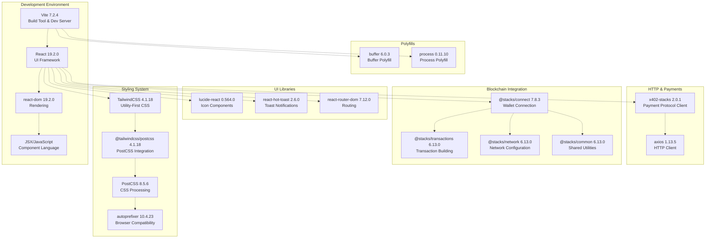
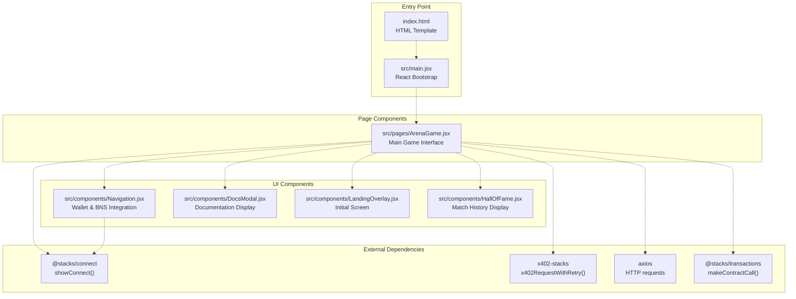
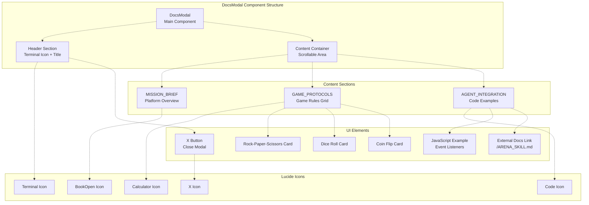
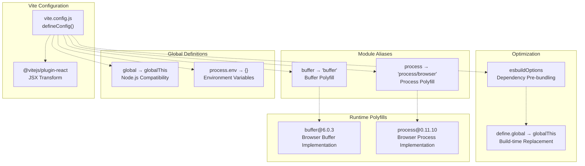
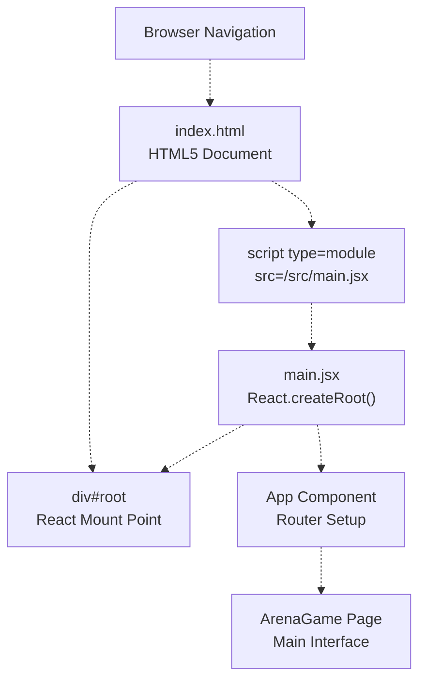
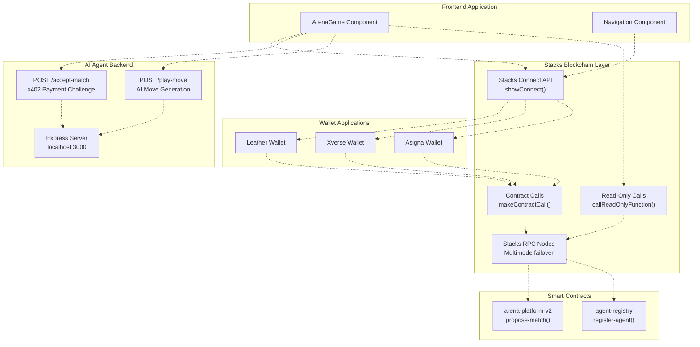

# Frontend Application

> **Relevant source files**
> * [frontend/index.html](https://github.com/HACK3R-CRYPTO/GameArenaStacks/blob/23ba68fb/frontend/index.html)
> * [frontend/package.json](https://github.com/HACK3R-CRYPTO/GameArenaStacks/blob/23ba68fb/frontend/package.json)
> * [frontend/src/components/DocsModal.jsx](https://github.com/HACK3R-CRYPTO/GameArenaStacks/blob/23ba68fb/frontend/src/components/DocsModal.jsx)
> * [frontend/vite.config.js](https://github.com/HACK3R-CRYPTO/GameArenaStacks/blob/23ba68fb/frontend/vite.config.js)

## Purpose and Scope

This document describes the React-based frontend application that provides the user interface for GameArenaStacks. The frontend is responsible for wallet connectivity, match proposal and gameplay interactions, x402 payment flow orchestration, and displaying game state from the Stacks blockchain.

For detailed information about specific components, see:

* ArenaGame component and match flows: [ArenaGame Component](/HACK3R-CRYPTO/GameArenaStacks/2.1-arenagame-component)
* Wallet integration and BNS resolution: [Wallet Integration and Navigation](/HACK3R-CRYPTO/GameArenaStacks/2.2-wallet-integration-and-navigation)
* UI components (Landing, Docs, Hall of Fame): [User Interface Components](/HACK3R-CRYPTO/GameArenaStacks/2.3-user-interface-components)
* Build configuration and tooling: [Frontend Build and Configuration](/HACK3R-CRYPTO/GameArenaStacks/2.4-frontend-build-and-configuration)
* Transaction polling and state management: [Transaction Management and State Polling](/HACK3R-CRYPTO/GameArenaStacks/2.5-transaction-management-and-state-polling)

## Technology Stack

The frontend application is built using modern web technologies optimized for blockchain integration and real-time user interactions.

### Core Framework and Build System



**Technology Stack Dependency Graph**

The application uses Vite 7.2.4 as its build tool and development server, providing fast hot module replacement (HMR) and optimized production builds. React 19.2.0 serves as the UI framework with JSX for component composition.

**Sources:** [frontend/package.json L1-L37](https://github.com/HACK3R-CRYPTO/GameArenaStacks/blob/23ba68fb/frontend/package.json#L1-L37)

### Dependency Categories

| Category | Purpose | Key Packages |
| --- | --- | --- |
| **Core Framework** | UI rendering and reactivity | `react@19.2.0`, `react-dom@19.2.0` |
| **Build Tooling** | Development server and bundling | `vite@7.2.4`, `@vitejs/plugin-react@5.1.1` |
| **Styling** | CSS framework and processing | `tailwindcss@4.1.18`, `@tailwindcss/postcss@4.1.18`, `postcss@8.5.6` |
| **Blockchain** | Stacks network integration | `@stacks/connect@7.8.3`, `@stacks/transactions@6.13.0`, `@stacks/network@6.13.0` |
| **Payments** | x402 micropayment protocol | `x402-stacks@2.0.1` |
| **HTTP** | API communication | `axios@1.13.5` |
| **UI Components** | Icons and notifications | `lucide-react@0.564.0`, `react-hot-toast@2.6.0` |
| **Routing** | Client-side navigation | `react-router-dom@7.12.0` |
| **Polyfills** | Browser compatibility | `buffer@6.0.3`, `process@0.11.10` |

**Sources:** [frontend/package.json L12-L27](https://github.com/HACK3R-CRYPTO/GameArenaStacks/blob/23ba68fb/frontend/package.json#L12-L27)

## Application Structure

The frontend follows a component-based architecture with clear separation between UI components, blockchain interaction logic, and state management.



**Component Hierarchy and Integration Points**

The application entry point is [frontend/index.html L1-L13](https://github.com/HACK3R-CRYPTO/GameArenaStacks/blob/23ba68fb/frontend/index.html#L1-L13)

 which loads the React application through [frontend/src/main.jsx](https://github.com/HACK3R-CRYPTO/GameArenaStacks/blob/23ba68fb/frontend/src/main.jsx)

 The main interface component is `ArenaGame`, which orchestrates wallet connections, match proposals, gameplay interactions, and x402 payment flows.

**Sources:** [frontend/index.html L1-L13](https://github.com/HACK3R-CRYPTO/GameArenaStacks/blob/23ba68fb/frontend/index.html#L1-L13)

### Component Responsibilities

| Component | File Path | Primary Responsibilities |
| --- | --- | --- |
| **ArenaGame** | `src/pages/ArenaGame.jsx` | Match proposal, move submission, x402 payment orchestration, game state management, transaction polling |
| **Navigation** | `src/components/Navigation.jsx` | Wallet connection via Stacks Connect, BNS name resolution, user identity display |
| **DocsModal** | `src/components/DocsModal.jsx` | Game rules display, integration examples, system documentation |
| **LandingOverlay** | `src/components/LandingOverlay.jsx` | Initial landing screen, system initialization prompts |
| **HallOfFame** | `src/components/HallOfFame.jsx` | Historical match display, winner showcase, statistics |

**Sources:** [frontend/src/components/DocsModal.jsx L1-L127](https://github.com/HACK3R-CRYPTO/GameArenaStacks/blob/23ba68fb/frontend/src/components/DocsModal.jsx#L1-L127)

## DocsModal Component

The `DocsModal` component provides in-app documentation for users, explaining game rules, AI behavior, and integration examples for developers.



**DocsModal Internal Structure**

The component uses a modal overlay pattern with fixed positioning (`fixed inset-0 z-[200]`) and backdrop blur (`bg-black/80 backdrop-blur-sm`). The modal is conditionally rendered based on the `isOpen` prop [frontend/src/components/DocsModal.jsx L5](https://github.com/HACK3R-CRYPTO/GameArenaStacks/blob/23ba68fb/frontend/src/components/DocsModal.jsx#L5-L5)

### Key Features

**Header Section** [frontend/src/components/DocsModal.jsx L10-L22](https://github.com/HACK3R-CRYPTO/GameArenaStacks/blob/23ba68fb/frontend/src/components/DocsModal.jsx#L10-L22)

* Displays "SYSTEM_MANUAL_V1.0" with Terminal icon from `lucide-react`
* Close button triggers `onClose` callback
* Styled with purple accent (`text-purple-400`)

**Mission Brief** [frontend/src/components/DocsModal.jsx L27-L44](https://github.com/HACK3R-CRYPTO/GameArenaStacks/blob/23ba68fb/frontend/src/components/DocsModal.jsx#L27-L44)

* Explains platform purpose: "competitive 1v1 wagering platform"
* Highlights key features: * Direct AI challenges (no waiting) * 98% winner payout * Markov Chain learning * Human advantage: **YOU WIN ALL TIES**

**Game Protocols Grid** [frontend/src/components/DocsModal.jsx L46-L75](https://github.com/HACK3R-CRYPTO/GameArenaStacks/blob/23ba68fb/frontend/src/components/DocsModal.jsx#L46-L75)

Three game cards displayed in a responsive grid (`grid-cols-1 md:grid-cols-3`):

| Game | Emoji | Rules | AI Strategy |
| --- | --- | --- | --- |
| Rock-Paper-Scissors | ✊ | 0=Rock, 1=Paper, 2=Scissors | Analyzes previous moves for prediction |
| Dice Roll | 🎲 | Roll 1-6, higher wins | Pure chance with 50/50 logic; ties favor human |
| Coin Flip | 🪙 | Heads(0) or Tails(1) | Pattern recognition in choices |

**Agent Integration Section** [frontend/src/components/DocsModal.jsx L77-L118](https://github.com/HACK3R-CRYPTO/GameArenaStacks/blob/23ba68fb/frontend/src/components/DocsModal.jsx#L77-L118)

Provides JavaScript code example demonstrating:

1. Event listener setup with `watchEvent`
2. Match acceptance with `writeContract`
3. Move submission with `playMove`

The code example uses Viem-style syntax but documents the Stacks contract interaction pattern. It links to full documentation at `/ARENA_SKILL.md` [frontend/src/components/DocsModal.jsx L111](https://github.com/HACK3R-CRYPTO/GameArenaStacks/blob/23ba68fb/frontend/src/components/DocsModal.jsx#L111-L111)

**Sources:** [frontend/src/components/DocsModal.jsx L1-L127](https://github.com/HACK3R-CRYPTO/GameArenaStacks/blob/23ba68fb/frontend/src/components/DocsModal.jsx#L1-L127)

## Build Configuration

The Vite configuration provides essential polyfills and aliases required for Stacks blockchain libraries to function in a browser environment.



**Vite Build Configuration Architecture**

### Configuration Details

**React Plugin** [frontend/vite.config.js L6](https://github.com/HACK3R-CRYPTO/GameArenaStacks/blob/23ba68fb/frontend/vite.config.js#L6-L6)

* Enables JSX transformation and Fast Refresh for React components
* Automatically imports React in JSX files

**Global Definitions** [frontend/vite.config.js L7-L10](https://github.com/HACK3R-CRYPTO/GameArenaStacks/blob/23ba68fb/frontend/vite.config.js#L7-L10)

```
define: {
  'global': 'globalThis',
  'process.env': {},
}
```

These definitions replace Node.js global variables with browser-compatible equivalents. The `@stacks` libraries expect `global` to be available, so it's aliased to the standard `globalThis`.

**Module Resolution Aliases** [frontend/vite.config.js L11-L16](https://github.com/HACK3R-CRYPTO/GameArenaStacks/blob/23ba68fb/frontend/vite.config.js#L11-L16)

```yaml
resolve: {
  alias: {
    buffer: 'buffer',
    process: 'process/browser',
  },
}
```

Maps Node.js core modules to browser-compatible polyfill packages. The `buffer` package [frontend/package.json L19](https://github.com/HACK3R-CRYPTO/GameArenaStacks/blob/23ba68fb/frontend/package.json#L19-L19)

 provides a JavaScript implementation of Node's Buffer class, while `process` [frontend/package.json L21](https://github.com/HACK3R-CRYPTO/GameArenaStacks/blob/23ba68fb/frontend/package.json#L21-L21)

 emulates the process global.

**Optimization Configuration** [frontend/vite.config.js L17-L23](https://github.com/HACK3R-CRYPTO/GameArenaStacks/blob/23ba68fb/frontend/vite.config.js#L17-L23)

```yaml
optimizeDeps: {
  esbuildOptions: {
    define: {
      global: 'globalThis'
    },
  },
}
```

Ensures that during dependency pre-bundling with esbuild, the `global` variable is consistently defined as `globalThis`.

### Why These Polyfills Are Required

The Stacks blockchain libraries (`@stacks/connect`, `@stacks/transactions`, etc.) were originally designed for Node.js environments and rely on Node.js-specific APIs. When running in a browser:

1. **Buffer**: Required for binary data manipulation in transaction construction
2. **Process**: Some libraries check `process.env` for configuration
3. **Global**: Libraries expect `global.Buffer` or similar Node.js globals

Without these polyfills, the application would encounter runtime errors like "Buffer is not defined" or "global is not defined" when interacting with Stacks wallets or constructing transactions.

**Sources:** [frontend/vite.config.js L1-L24](https://github.com/HACK3R-CRYPTO/GameArenaStacks/blob/23ba68fb/frontend/vite.config.js#L1-L24)

 [frontend/package.json L19-L21](https://github.com/HACK3R-CRYPTO/GameArenaStacks/blob/23ba68fb/frontend/package.json#L19-L21)

## Development and Production Scripts

The `package.json` defines npm scripts for development, building, and deployment workflows.

| Script | Command | Purpose |
| --- | --- | --- |
| `dev` | `vite` | Starts development server with HMR on `http://localhost:5173` (default) |
| `build` | `vite build` | Creates production-optimized bundle in `dist/` directory |
| `preview` | `vite preview` | Serves production build locally for testing |
| `lint` | `eslint .` | Runs ESLint to check code quality and style |

**Development Workflow:**

1. Run `npm run dev` to start the development server
2. Edit components in `src/` with hot reload
3. Run `npm run lint` to check for issues
4. Run `npm run build` to create production bundle
5. Run `npm run preview` to test production build locally

**Sources:** [frontend/package.json L6-L10](https://github.com/HACK3R-CRYPTO/GameArenaStacks/blob/23ba68fb/frontend/package.json#L6-L10)

## Entry Point and HTML Template

The application entry point is a minimal HTML template that loads the React application.



**Application Bootstrap Flow**

The HTML template [frontend/index.html L1-L13](https://github.com/HACK3R-CRYPTO/GameArenaStacks/blob/23ba68fb/frontend/index.html#L1-L13)

 provides:

1. **Document Metadata** [frontend/index.html L3-L7](https://github.com/HACK3R-CRYPTO/GameArenaStacks/blob/23ba68fb/frontend/index.html#L3-L7) * UTF-8 character encoding * Vite SVG favicon * Responsive viewport configuration * Title: "GameArena Stacks - x402 AI Gaming Platform"
2. **React Mount Point** [frontend/index.html L10](https://github.com/HACK3R-CRYPTO/GameArenaStacks/blob/23ba68fb/frontend/index.html#L10-L10) * `<div id="root"></div>` where the React application renders
3. **Module Script** [frontend/index.html L11](https://github.com/HACK3R-CRYPTO/GameArenaStacks/blob/23ba68fb/frontend/index.html#L11-L11) * Loads `src/main.jsx` as ES module * Vite transforms this during development and build

The `main.jsx` file (not provided in sources but referenced) bootstraps React, sets up routing with `react-router-dom`, and renders the application into the `#root` div.

**Sources:** [frontend/index.html L1-L13](https://github.com/HACK3R-CRYPTO/GameArenaStacks/blob/23ba68fb/frontend/index.html#L1-L13)

## Integration with Backend Systems

The frontend communicates with multiple backend systems to provide complete functionality.



**Frontend Integration Architecture**

### Stacks Connect Integration

The frontend uses `@stacks/connect@7.8.3` [frontend/package.json L14](https://github.com/HACK3R-CRYPTO/GameArenaStacks/blob/23ba68fb/frontend/package.json#L14-L14)

 to interact with Stacks wallets. This library provides:

* `showConnect()`: Displays wallet connection modal
* `openContractCall()`: Prompts user to sign transactions
* `openSTXTransfer()`: Initiates STX transfers
* Wallet detection and connection management

Supported wallets include Leather (formerly Hiro Wallet), Xverse, and Asigna. The wallet handles transaction signing and broadcasting to the Stacks network.

### x402 Payment Protocol

The frontend implements x402 micropayment flows using `x402-stacks@2.0.1` [frontend/package.json L26](https://github.com/HACK3R-CRYPTO/GameArenaStacks/blob/23ba68fb/frontend/package.json#L26-L26)

 The typical flow:

1. Frontend sends request to agent endpoint (e.g., `/accept-match`)
2. Agent returns HTTP 402 Payment Required with payment details
3. Frontend automatically initiates STX transfer
4. Frontend retries request with payment proof header
5. Agent verifies payment and processes request

This protocol enables the AI agent to monetize its services without manual payment coordination. For details on x402 implementation, see [x402 Monetization Protocol](/HACK3R-CRYPTO/GameArenaStacks/5-x402-monetization-protocol).

### Blockchain Read Operations

The frontend queries contract state using read-only function calls:

* Match status queries
* Player move retrieval
* Agent registry lookups
* Historical match data

These operations use the `@stacks/transactions` library to construct read-only calls that don't require wallet signatures or transaction fees.

### Multi-Node Resilience

The frontend implements failover logic across multiple Stacks RPC nodes to ensure high availability. If the primary node (`api.testnet.hiro.so`) fails or times out, the application automatically retries against backup nodes. For implementation details, see [Multi-Node Failover and Reliability](/HACK3R-CRYPTO/GameArenaStacks/6.1-multi-node-failover-and-reliability).

**Sources:** [frontend/package.json L12-L27](https://github.com/HACK3R-CRYPTO/GameArenaStacks/blob/23ba68fb/frontend/package.json#L12-L27)

## State Management Patterns

The frontend application uses React's built-in state management without external libraries like Redux or Zustand. State is managed through:

1. **Component State** (`useState`): Local UI state like modal visibility, form inputs
2. **Effect Hooks** (`useEffect`): Side effects like transaction polling, event listeners
3. **Context** (likely): Shared state for wallet connection status across components
4. **Props**: Data flow from parent to child components

The `ArenaGame` component serves as the primary state coordinator, managing:

* Active match data
* Pending transactions
* User move selections
* Agent interaction status
* x402 payment states

Transaction state is synchronized with the blockchain through polling mechanisms documented in [Transaction Management and State Polling](/HACK3R-CRYPTO/GameArenaStacks/2.5-transaction-management-and-state-polling).

**Sources:** [frontend/package.json L22-L23](https://github.com/HACK3R-CRYPTO/GameArenaStacks/blob/23ba68fb/frontend/package.json#L22-L23)

## UI Framework and Styling

The application uses TailwindCSS 4.1.18 [frontend/package.json L34](https://github.com/HACK3R-CRYPTO/GameArenaStacks/blob/23ba68fb/frontend/package.json#L34-L34)

 as its primary styling framework, with PostCSS for processing.

### Tailwind Configuration

The styling system uses the modern `@tailwindcss/postcss` integration [frontend/package.json L17](https://github.com/HACK3R-CRYPTO/GameArenaStacks/blob/23ba68fb/frontend/package.json#L17-L17)

 which provides:

* Utility-first CSS classes
* Responsive design utilities
* Dark theme support (application uses dark mode)
* Custom scrollbar styling (`custom-scrollbar` class)

### Design System Patterns

Based on the DocsModal component [frontend/src/components/DocsModal.jsx L8-L122](https://github.com/HACK3R-CRYPTO/GameArenaStacks/blob/23ba68fb/frontend/src/components/DocsModal.jsx#L8-L122)

 the application follows these design patterns:

**Color Palette:**

* Background: `bg-[#050505]`, `bg-[#0a0a0a]`, `bg-black/80`
* Borders: `border-white/10`, `border-white/5`
* Text: `text-white`, `text-gray-300`, `text-gray-400`, `text-gray-500`
* Accents: `text-purple-400`, `text-green-500`, `text-blue-500`, `border-purple-500/20`

**Typography:**

* Font: `font-mono` (monospace) for technical aesthetic
* Headings: `text-xl font-bold`
* Body: `text-sm` or `text-xs`
* Code: `font-mono text-xs`

**Layout Patterns:**

* Modal overlays with backdrop blur
* Responsive grids: `grid-cols-1 md:grid-cols-3`
* Flexbox for component alignment
* Fixed positioning for overlays: `fixed inset-0 z-[200]`

**Interactive Elements:**

* Hover states: `hover:text-white`, `hover:border-blue-500/30`
* Transitions: `transition-colors`
* Custom z-index layers for modals and overlays

The dark theme with purple/green/blue accents creates a futuristic, gaming-oriented aesthetic that aligns with the "Arena AI Champion" branding.

**Sources:** [frontend/package.json L17](https://github.com/HACK3R-CRYPTO/GameArenaStacks/blob/23ba68fb/frontend/package.json#L17-L17)

 [frontend/package.json L30](https://github.com/HACK3R-CRYPTO/GameArenaStacks/blob/23ba68fb/frontend/package.json#L30-L30)

 [frontend/package.json L34](https://github.com/HACK3R-CRYPTO/GameArenaStacks/blob/23ba68fb/frontend/package.json#L34-L34)

 [frontend/src/components/DocsModal.jsx L8-L122](https://github.com/HACK3R-CRYPTO/GameArenaStacks/blob/23ba68fb/frontend/src/components/DocsModal.jsx#L8-L122)

## Icon System

The application uses `lucide-react@0.564.0` [frontend/package.json L20](https://github.com/HACK3R-CRYPTO/GameArenaStacks/blob/23ba68fb/frontend/package.json#L20-L20)

 for consistent iconography. Icons are imported as React components:

```javascript
import { X, Terminal, Code, BookOpen, Calculator } from 'lucide-react';
```

Icons used in DocsModal [frontend/src/components/DocsModal.jsx L2](https://github.com/HACK3R-CRYPTO/GameArenaStacks/blob/23ba68fb/frontend/src/components/DocsModal.jsx#L2-L2)

:

* `Terminal`: System/command-line aesthetic
* `X`: Close buttons
* `BookOpen`: Documentation sections
* `Calculator`: Game rules/protocols
* `Code`: Developer integration examples

Icons accept `size` prop for consistent sizing (typically 18-20px) and inherit text color for theming.

**Sources:** [frontend/package.json L20](https://github.com/HACK3R-CRYPTO/GameArenaStacks/blob/23ba68fb/frontend/package.json#L20-L20)

 [frontend/src/components/DocsModal.jsx L2](https://github.com/HACK3R-CRYPTO/GameArenaStacks/blob/23ba68fb/frontend/src/components/DocsModal.jsx#L2-L2)

## Notification System

The application uses `react-hot-toast@2.6.0` [frontend/package.json L24](https://github.com/HACK3R-CRYPTO/GameArenaStacks/blob/23ba68fb/frontend/package.json#L24-L24)

 for user notifications. This library provides:

* Toast notifications for transaction status
* Success/error/loading states
* Customizable appearance and positioning
* Auto-dismiss functionality
* Promise-based API for async operations

Typical use cases:

* "Transaction submitted" messages
* "Waiting for confirmation..." loaders
* "Match accepted!" success toasts
* "Transaction failed" error messages
* x402 payment status updates

**Sources:** [frontend/package.json L24](https://github.com/HACK3R-CRYPTO/GameArenaStacks/blob/23ba68fb/frontend/package.json#L24-L24)

## Routing Configuration

The application uses `react-router-dom@7.12.0` [frontend/package.json L25](https://github.com/HACK3R-CRYPTO/GameArenaStacks/blob/23ba68fb/frontend/package.json#L25-L25)

 for client-side navigation. While specific routes aren't visible in the provided files, the typical structure likely includes:

* `/` - Landing page with LandingOverlay
* `/game` or `/arena` - Main ArenaGame interface
* Potential additional routes for match history, leaderboards, or agent management

The router enables deep linking to specific match states and browser history integration.

**Sources:** [frontend/package.json L25](https://github.com/HACK3R-CRYPTO/GameArenaStacks/blob/23ba68fb/frontend/package.json#L25-L25)

## Summary

The Frontend Application is a modern React 19 application built with Vite 7 that provides the user interface for GameArenaStacks. It integrates with Stacks blockchain wallets via Stacks Connect, implements x402 micropayment protocols for agent interactions, and uses TailwindCSS for a dark, gaming-oriented aesthetic.

Key architectural decisions:

1. **Vite over Create React App**: Faster development with modern ESM-based tooling
2. **Polyfills for blockchain libraries**: Browser compatibility for Node.js-based Stacks SDKs
3. **x402-stacks integration**: Automated micropayment flows for agent services
4. **Multi-component architecture**: Separation of concerns between game logic, UI, and blockchain interactions
5. **Dark theme with monospace fonts**: Creates a technical, gaming aesthetic

The frontend serves as the primary entry point for users, orchestrating complex flows involving wallet connections, contract calls, agent payments, and real-time state synchronization with the Stacks blockchain.

**Sources:** [frontend/package.json L1-L37](https://github.com/HACK3R-CRYPTO/GameArenaStacks/blob/23ba68fb/frontend/package.json#L1-L37)

 [frontend/index.html L1-L13](https://github.com/HACK3R-CRYPTO/GameArenaStacks/blob/23ba68fb/frontend/index.html#L1-L13)

 [frontend/vite.config.js L1-L24](https://github.com/HACK3R-CRYPTO/GameArenaStacks/blob/23ba68fb/frontend/vite.config.js#L1-L24)

 [frontend/src/components/DocsModal.jsx L1-L127](https://github.com/HACK3R-CRYPTO/GameArenaStacks/blob/23ba68fb/frontend/src/components/DocsModal.jsx#L1-L127)