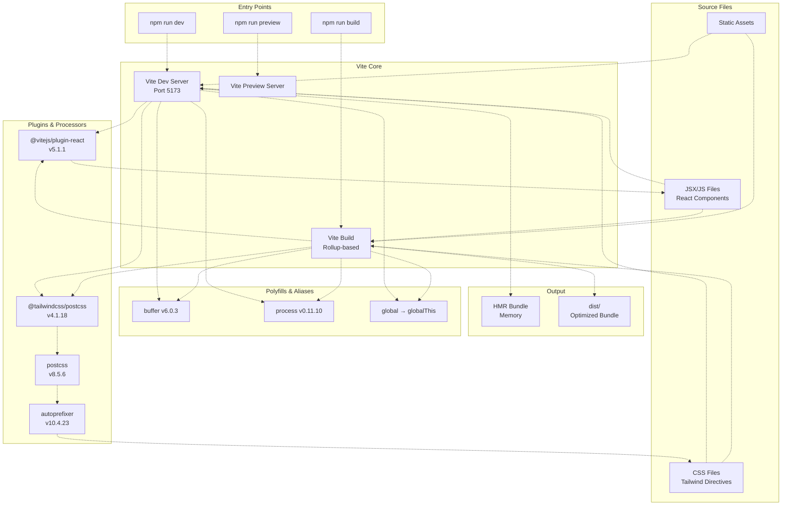
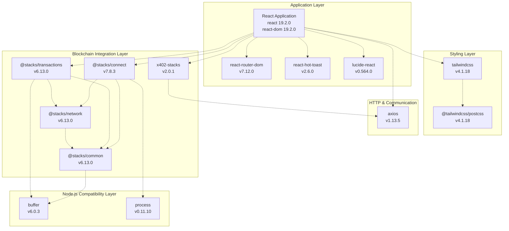
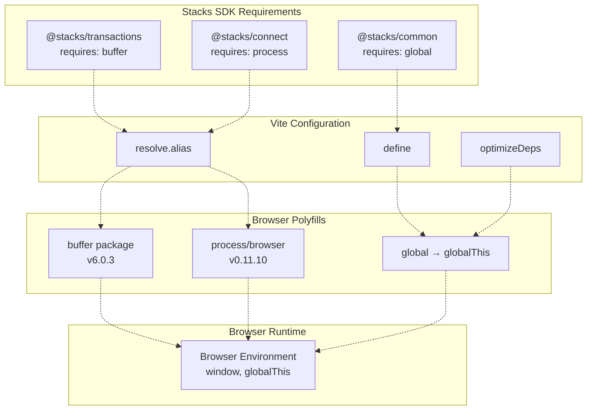
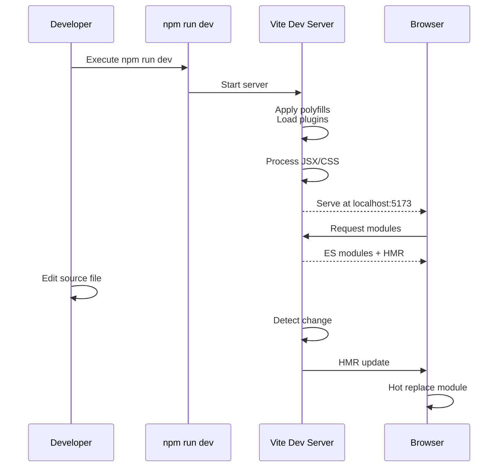
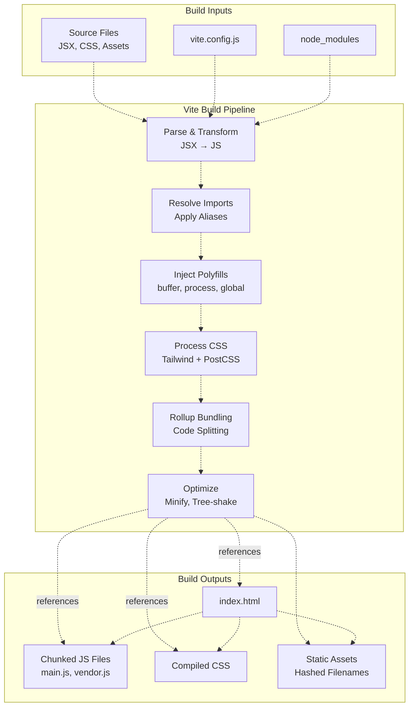

# Frontend Build and Configuration

> **Relevant source files**
> * [frontend/package-lock.json](https://github.com/HACK3R-CRYPTO/GameArenaStacks/blob/23ba68fb/frontend/package-lock.json)
> * [frontend/package.json](https://github.com/HACK3R-CRYPTO/GameArenaStacks/blob/23ba68fb/frontend/package.json)
> * [frontend/vite.config.js](https://github.com/HACK3R-CRYPTO/GameArenaStacks/blob/23ba68fb/frontend/vite.config.js)

This document describes the frontend build system, its configuration, dependencies, and the development pipeline. The frontend uses **Vite** as its build tool with React 19 and Tailwind CSS 4. This page focuses specifically on build tooling and configuration; for information about frontend components and UI structure, see [Frontend Application](/HACK3R-CRYPTO/GameArenaStacks/2-frontend-application), and for transaction management patterns, see [Transaction Management and State Polling](/HACK3R-CRYPTO/GameArenaStacks/2.5-transaction-management-and-state-polling).

## Overview

The frontend is configured as an ES module-based React application built with Vite 7.2.4. The build system includes special provisions for browser compatibility with blockchain libraries that require Node.js polyfills.

**Sources:** [frontend/package.json L1-L37](https://github.com/HACK3R-CRYPTO/GameArenaStacks/blob/23ba68fb/frontend/package.json#L1-L37)

 [frontend/vite.config.js L1-L24](https://github.com/HACK3R-CRYPTO/GameArenaStacks/blob/23ba68fb/frontend/vite.config.js#L1-L24)

---

## Build Tool Architecture



The build system uses **Vite 7.2.4** as the primary build tool, which provides:

* Fast development server with Hot Module Replacement (HMR)
* Rollup-based production builds with automatic code splitting
* Native ES module support in development
* Optimized bundling for production

**Sources:** [frontend/package.json L6-L10](https://github.com/HACK3R-CRYPTO/GameArenaStacks/blob/23ba68fb/frontend/package.json#L6-L10)

 [frontend/vite.config.js L1-L24](https://github.com/HACK3R-CRYPTO/GameArenaStacks/blob/23ba68fb/frontend/vite.config.js#L1-L24)

---

## Dependency Categories

The frontend has a clearly stratified dependency structure organized by functional category:

| Category | Key Packages | Version | Purpose |
| --- | --- | --- | --- |
| **Build Tool** | vite | 7.2.4 | Development server and bundler |
| **UI Framework** | react, react-dom | 19.2.0 | Component-based UI library |
| **Routing** | react-router-dom | 7.12.0 | Client-side navigation |
| **Styling** | tailwindcss, @tailwindcss/postcss | 4.1.18 | Utility-first CSS framework |
| **Blockchain** | @stacks/connect, @stacks/transactions, @stacks/network, @stacks/common | 6.13.0 - 7.8.3 | Stacks blockchain integration |
| **HTTP/Payments** | axios, x402-stacks | 1.13.5, 2.0.1 | HTTP client and x402 protocol |
| **UI Components** | lucide-react, react-hot-toast | 0.564.0, 2.6.0 | Icons and notifications |
| **Node Polyfills** | buffer, process | 6.0.3, 0.11.10 | Browser compatibility for blockchain libs |
| **Linting** | eslint, eslint-plugin-react | 9.39.1, 7.37.0 | Code quality enforcement |

**Sources:** [frontend/package.json L12-L26](https://github.com/HACK3R-CRYPTO/GameArenaStacks/blob/23ba68fb/frontend/package.json#L12-L26)

 [frontend/package.json L28-L35](https://github.com/HACK3R-CRYPTO/GameArenaStacks/blob/23ba68fb/frontend/package.json#L28-L35)

---

## Dependency Graph



**Dependencies are organized in layers**:

1. **Application Layer**: Core React framework and UI utilities
2. **Blockchain Integration Layer**: Stacks SDK packages for wallet and transaction management
3. **HTTP & Communication**: HTTP client for agent interaction
4. **Node.js Compatibility Layer**: Polyfills enabling blockchain libraries in browser
5. **Styling Layer**: Tailwind CSS infrastructure

**Sources:** [frontend/package.json L12-L26](https://github.com/HACK3R-CRYPTO/GameArenaStacks/blob/23ba68fb/frontend/package.json#L12-L26)

---

## Vite Configuration Details

The [frontend/vite.config.js L1-L24](https://github.com/HACK3R-CRYPTO/GameArenaStacks/blob/23ba68fb/frontend/vite.config.js#L1-L24)

 file contains critical browser compatibility configurations:

### Plugin Configuration

```yaml
plugins: [react()]
```

The `@vitejs/plugin-react` plugin enables:

* Fast Refresh for React components
* JSX transformation
* React DevTools integration

**Sources:** [frontend/vite.config.js L6](https://github.com/HACK3R-CRYPTO/GameArenaStacks/blob/23ba68fb/frontend/vite.config.js#L6-L6)

### Global Polyfills

```
define: {
  'global': 'globalThis',
  'process.env': {},
}
```

These definitions provide browser compatibility for blockchain libraries:

* **`global → globalThis`**: Maps Node.js `global` to browser `globalThis`
* **`process.env → {}`**: Provides empty environment object

**Sources:** [frontend/vite.config.js L7-L10](https://github.com/HACK3R-CRYPTO/GameArenaStacks/blob/23ba68fb/frontend/vite.config.js#L7-L10)

### Module Resolution Aliases

```yaml
resolve: {
  alias: {
    buffer: 'buffer',
    process: 'process/browser',
  },
}
```

Module aliases redirect Node.js core modules to browser-compatible polyfills:

* **`buffer`**: Resolves to `buffer` package (v6.0.3)
* **`process`**: Resolves to `process/browser` from `process` package (v0.11.10)

**Sources:** [frontend/vite.config.js L11-L16](https://github.com/HACK3R-CRYPTO/GameArenaStacks/blob/23ba68fb/frontend/vite.config.js#L11-L16)

### ESBuild Optimization

```yaml
optimizeDeps: {
  esbuildOptions: {
    define: {
      global: 'globalThis'
    },
  },
}
```

This ensures pre-bundled dependencies also use `globalThis` instead of `global`, providing consistent polyfill behavior across all dependencies.

**Sources:** [frontend/vite.config.js L17-L23](https://github.com/HACK3R-CRYPTO/GameArenaStacks/blob/23ba68fb/frontend/vite.config.js#L17-L23)

---

## Browser Compatibility Layer



The Stacks blockchain SDKs (`@stacks/transactions`, `@stacks/connect`, `@stacks/common`) were originally designed for Node.js environments and expect Node.js globals (`buffer`, `process`, `global`). The Vite configuration bridges this gap:

1. **Module Aliasing**: Redirects `buffer` and `process` imports to browser-compatible polyfill packages
2. **Global Definition**: Maps `global` to browser's `globalThis`
3. **Process Environment**: Provides empty `process.env` object
4. **Dependency Pre-bundling**: Applies polyfills during Vite's dependency optimization phase

**Sources:** [frontend/vite.config.js L7-L23](https://github.com/HACK3R-CRYPTO/GameArenaStacks/blob/23ba68fb/frontend/vite.config.js#L7-L23)

 [frontend/package.json L19-L20](https://github.com/HACK3R-CRYPTO/GameArenaStacks/blob/23ba68fb/frontend/package.json#L19-L20)

---

## Build Scripts

The [frontend/package.json L6-L10](https://github.com/HACK3R-CRYPTO/GameArenaStacks/blob/23ba68fb/frontend/package.json#L6-L10)

 defines four npm scripts:

| Script | Command | Purpose |
| --- | --- | --- |
| `dev` | `vite` | Start development server with HMR on port 5173 |
| `build` | `vite build` | Create optimized production bundle in `dist/` |
| `lint` | `eslint .` | Run ESLint on all source files |
| `preview` | `vite preview` | Preview production build locally |

### Development Workflow



**Development Mode Features**:

* **Hot Module Replacement (HMR)**: Changes reflect instantly without full page reload
* **Fast Startup**: Vite only transforms modules on-demand
* **Native ES Modules**: Browser imports modules directly during development
* **Source Maps**: Full source map support for debugging

**Sources:** [frontend/package.json L7](https://github.com/HACK3R-CRYPTO/GameArenaStacks/blob/23ba68fb/frontend/package.json#L7-L7)

---

## Production Build Process



### Build Command Execution

Running `npm run build` performs:

1. **Transformation**: JSX/TSX files transformed to JavaScript
2. **Polyfill Injection**: Node.js polyfills injected per configuration
3. **CSS Processing**: Tailwind CSS compiled and purged
4. **Bundling**: Rollup creates optimized chunks with code splitting
5. **Minification**: JavaScript and CSS minified
6. **Tree Shaking**: Unused code eliminated
7. **Asset Hashing**: Static assets receive content hashes for caching

**Output Location**: All production files are written to `dist/` directory.

**Sources:** [frontend/package.json L8](https://github.com/HACK3R-CRYPTO/GameArenaStacks/blob/23ba68fb/frontend/package.json#L8-L8)

 [frontend/vite.config.js L1-L24](https://github.com/HACK3R-CRYPTO/GameArenaStacks/blob/23ba68fb/frontend/vite.config.js#L1-L24)

---

## ESLint Configuration

The project uses ESLint 9.39.1 with React-specific rules via `eslint-plugin-react` 7.37.0. Running `npm run lint` performs static code analysis to enforce code quality standards.

**Sources:** [frontend/package.json L9](https://github.com/HACK3R-CRYPTO/GameArenaStacks/blob/23ba68fb/frontend/package.json#L9-L9)

 [frontend/package.json L31-L32](https://github.com/HACK3R-CRYPTO/GameArenaStacks/blob/23ba68fb/frontend/package.json#L31-L32)

---

## Key Version Specifications

### React 19.2.0

The frontend uses the latest React 19 with concurrent features and improved server component support. This version requires `react-dom` 19.2.0 for browser rendering.

**Sources:** [frontend/package.json L22-L23](https://github.com/HACK3R-CRYPTO/GameArenaStacks/blob/23ba68fb/frontend/package.json#L22-L23)

### Stacks SDK 6.13.0 - 7.8.3

The Stacks packages use mixed versions:

* `@stacks/connect`: v7.8.3 (latest wallet integration)
* `@stacks/transactions`: v6.13.0 (transaction construction)
* `@stacks/network`: v6.13.0 (network utilities)
* `@stacks/common`: v6.13.0 (shared utilities)

The `@stacks/connect` package at v7.8.3 internally depends on compatible versions of other packages through its own dependency tree.

**Sources:** [frontend/package.json L13-L16](https://github.com/HACK3R-CRYPTO/GameArenaStacks/blob/23ba68fb/frontend/package.json#L13-L16)

### x402-stacks 2.0.1

The `x402-stacks` package provides client-side HTTP 402 payment protocol implementation. This version matches the agent's x402 middleware version, ensuring protocol compatibility.

**Sources:** [frontend/package.json L26](https://github.com/HACK3R-CRYPTO/GameArenaStacks/blob/23ba68fb/frontend/package.json#L26-L26)

---

## Module System Configuration

The [frontend/package.json L5](https://github.com/HACK3R-CRYPTO/GameArenaStacks/blob/23ba68fb/frontend/package.json#L5-L5)

 specifies `"type": "module"`, making the entire package an ES module. This configuration:

* Enables top-level `import`/`export` syntax
* Makes `.js` files treated as ES modules by default
* Aligns with Vite's native ES module handling
* Requires explicit `.cjs` extension for CommonJS files

**Sources:** [frontend/package.json L5](https://github.com/HACK3R-CRYPTO/GameArenaStacks/blob/23ba68fb/frontend/package.json#L5-L5)

---

## Build Output Structure

After running `npm run build`, the `dist/` directory contains:

```
dist/
├── index.html          (Entry HTML with hashed script references)
├── assets/
│   ├── index-[hash].js    (Main application bundle)
│   ├── vendor-[hash].js   (Third-party dependencies)
│   ├── index-[hash].css   (Compiled Tailwind CSS)
│   └── [asset]-[hash].*   (Static assets with content hashing)
```

The production bundle includes:

* **Code Splitting**: Vendor libraries separated from application code
* **Content Hashing**: Asset filenames include content hashes for cache busting
* **Minification**: All JavaScript and CSS minified
* **Source Maps**: Optional source maps for production debugging (not enabled by default)

**Sources:** [frontend/package.json L8](https://github.com/HACK3R-CRYPTO/GameArenaStacks/blob/23ba68fb/frontend/package.json#L8-L8)