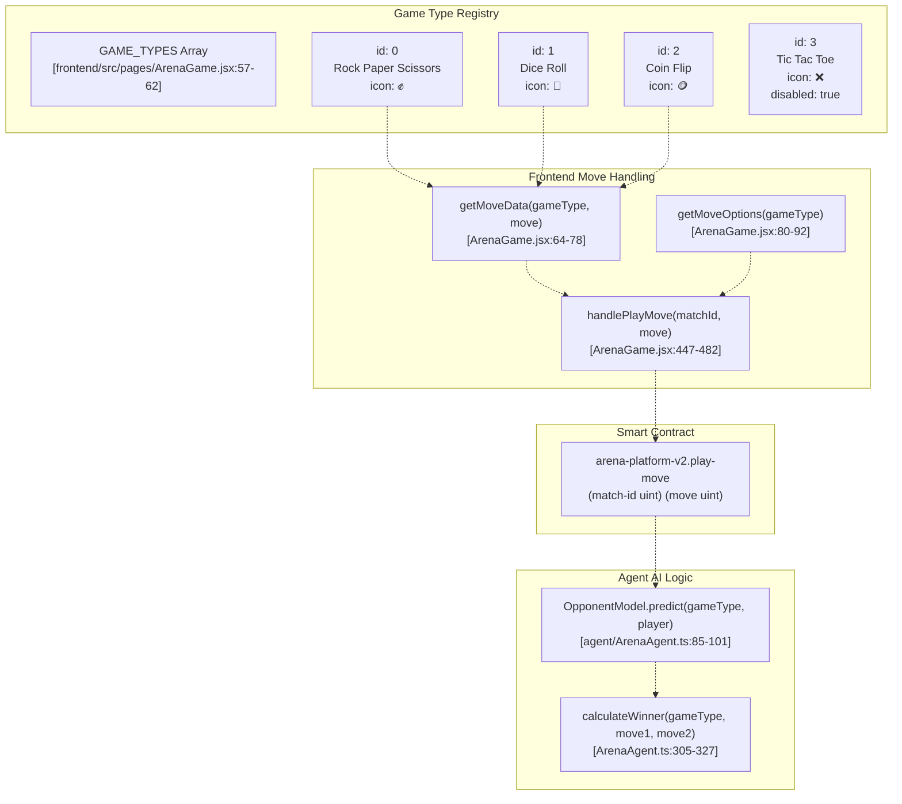
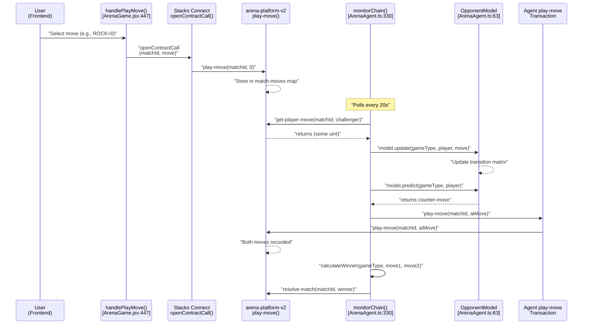

# Game Types and Rules

> **Relevant source files**
> * [agent/.env.example](https://github.com/HACK3R-CRYPTO/GameArenaStacks/blob/23ba68fb/agent/.env.example)
> * [agent/src/ArenaAgent.ts](https://github.com/HACK3R-CRYPTO/GameArenaStacks/blob/23ba68fb/agent/src/ArenaAgent.ts)
> * [frontend/index.html](https://github.com/HACK3R-CRYPTO/GameArenaStacks/blob/23ba68fb/frontend/index.html)
> * [frontend/src/components/DocsModal.jsx](https://github.com/HACK3R-CRYPTO/GameArenaStacks/blob/23ba68fb/frontend/src/components/DocsModal.jsx)
> * [frontend/src/components/Navigation.jsx](https://github.com/HACK3R-CRYPTO/GameArenaStacks/blob/23ba68fb/frontend/src/components/Navigation.jsx)
> * [frontend/src/pages/ArenaGame.jsx](https://github.com/HACK3R-CRYPTO/GameArenaStacks/blob/23ba68fb/frontend/src/pages/ArenaGame.jsx)

## Purpose and Scope

This document specifies the game types available in the GameArenaStacks platform, their rules, move encoding schemes, and winner determination logic. For information about the AI strategies that execute these games, see [Markov Chain AI Strategy](/HACK3R-CRYPTO/GameArenaStacks/3.3-markov-chain-ai-strategy). For details on how matches progress through their lifecycle, see [Match Lifecycle and State Management](/HACK3R-CRYPTO/GameArenaStacks/9-match-lifecycle-and-state-management). For the Fair Play mechanisms that prevent front-running, see [Fair Play Architecture](/HACK3R-CRYPTO/GameArenaStacks/8-fair-play-architecture).

---

## Game Type System Overview

The GameArenaStacks platform implements multiple game types within a unified wagering framework. Each game type has a unique numeric identifier, specific move encoding, and winner determination algorithm. The system is designed to be extensible, with one game type (Tic Tac Toe) currently marked for future implementation.



**Sources**: [frontend/src/pages/ArenaGame.jsx L57-L92](https://github.com/HACK3R-CRYPTO/GameArenaStacks/blob/23ba68fb/frontend/src/pages/ArenaGame.jsx#L57-L92)

 [agent/src/ArenaAgent.ts L62-L102](https://github.com/HACK3R-CRYPTO/GameArenaStacks/blob/23ba68fb/agent/src/ArenaAgent.ts#L62-L102)

 [agent/src/ArenaAgent.ts L305-L327](https://github.com/HACK3R-CRYPTO/GameArenaStacks/blob/23ba68fb/agent/src/ArenaAgent.ts#L305-L327)

---

## Game Type 0: Rock-Paper-Scissors

### Rules

Rock-Paper-Scissors is a classic simultaneous-move game where:

* **Rock (0)** beats Scissors (2)
* **Paper (1)** beats Rock (0)
* **Scissors (2)** beats Paper (1)
* Identical moves result in a draw

### Move Encoding

| Move Name | Numeric Value | Icon | UI Label |
| --- | --- | --- | --- |
| ROCK | 0 | ✊ | ROCK |
| PAPER | 1 | ✋ | PAPER |
| SCISSORS | 2 | ✌️ | SCISSORS |

### Frontend Implementation

The move options are defined in `getMoveOptions()` for Rock-Paper-Scissors:

```
if (gameType === 0) return [
    { value: 0, label: 'ROCK', icon: '✊' },
    { value: 1, label: 'PAPER', icon: '✋' },
    { value: 2, label: 'SCISSORS', icon: '✌️' }
];
```

**Sources**: [frontend/src/pages/ArenaGame.jsx L81-L85](https://github.com/HACK3R-CRYPTO/GameArenaStacks/blob/23ba68fb/frontend/src/pages/ArenaGame.jsx#L81-L85)

 [frontend/src/pages/ArenaGame.jsx L66-L70](https://github.com/HACK3R-CRYPTO/GameArenaStacks/blob/23ba68fb/frontend/src/pages/ArenaGame.jsx#L66-L70)

### Winner Determination

The `calculateWinner()` function implements the classic RPS logic:

```
if (gameType === 0) { // Rock-Paper-Scissors
    if (move1 === move2) return null; // Draw
    // 0: Rock, 1: Paper, 2: Scissors
    if ((move1 === 0 && move2 === 2) || (move1 === 1 && move2 === 0) || (move1 === 2 && move2 === 1)) {
        return p1;
    }
    return p2;
}
```

**Draw Handling**: When both players make the same move, the function returns `null`, which is then resolved to favor the challenger (p1) in the resolution logic at [agent/src/ArenaAgent.ts L401-L407](https://github.com/HACK3R-CRYPTO/GameArenaStacks/blob/23ba68fb/agent/src/ArenaAgent.ts#L401-L407)

**Sources**: [agent/src/ArenaAgent.ts L306-L313](https://github.com/HACK3R-CRYPTO/GameArenaStacks/blob/23ba68fb/agent/src/ArenaAgent.ts#L306-L313)

### AI Strategy

The `OpponentModel` class implements a **counter-prediction strategy** for RPS:

```
if (gameType === 0) return (predictedMove + 1) % 3; // RPS: counter predicted move
```

This means the AI:

1. Uses a first-order Markov Chain to predict the opponent's next move based on their last move
2. Counters that prediction by playing `(predicted + 1) % 3`
3. If no pattern data exists, plays randomly

**Sources**: [agent/src/ArenaAgent.ts L98](https://github.com/HACK3R-CRYPTO/GameArenaStacks/blob/23ba68fb/agent/src/ArenaAgent.ts#L98-L98)

---

## Game Type 1: Dice Roll

### Rules

Dice Roll is a pure chance game where:

* Each player rolls a die showing 1-6
* **Higher number wins**
* Identical rolls result in a draw (favoring challenger in resolution)

### Move Encoding

Dice values are stored as **zero-indexed** (0-5 internally), but displayed as 1-6 to users.

| Display Value | Internal Encoding | Icon |
| --- | --- | --- |
| 1 | 0 | 🎲 |
| 2 | 1 | 🎲 |
| 3 | 2 | 🎲 |
| 4 | 3 | 🎲 |
| 5 | 4 | 🎲 |
| 6 | 5 | 🎲 |

### Frontend Implementation

The frontend presents a single "ROLL_DICE_RNG" button that generates a random roll:

```javascript
<button
    onClick={() => {
        const roll = Math.floor(Math.random() * 6);
        handlePlayMove(m.id, roll);
    }}
    className="w-full bg-purple-900/40 hover:bg-purple-600 text-purple-200 hover:text-white text-[9px] font-black py-2 rounded-sm border border-purple-500/30 flex items-center justify-center gap-2 transition-all shadow-[0_0_10px_rgba(147,51,234,0.15)] uppercase tracking-widest group-hover:shadow-[0_0_20px_rgba(147,51,234,0.4)]"
>
    <span className="text-lg animate-bounce">🎲</span> ROLL_DICE_RNG
</button>
```

The display conversion from internal (0-5) to user-facing (1-6) occurs in `getMoveData()`:

```
if (gameType === 1) { // Dice
    return { name: (parseInt(move) + 1).toString(), icon: '🎲' };
}
```

**Sources**: [frontend/src/pages/ArenaGame.jsx L656-L664](https://github.com/HACK3R-CRYPTO/GameArenaStacks/blob/23ba68fb/frontend/src/pages/ArenaGame.jsx#L656-L664)

 [frontend/src/pages/ArenaGame.jsx L71-L73](https://github.com/HACK3R-CRYPTO/GameArenaStacks/blob/23ba68fb/frontend/src/pages/ArenaGame.jsx#L71-L73)

### Winner Determination

```
if (gameType === 1) { // Dice Roll: Higher Number Wins
    if (move1 === move2) return null; // Draw
    return move1 > move2 ? p1 : p2;
}
```

**Sources**: [agent/src/ArenaAgent.ts L315-L318](https://github.com/HACK3R-CRYPTO/GameArenaStacks/blob/23ba68fb/agent/src/ArenaAgent.ts#L315-L318)

### AI Strategy

The AI employs a **biased strategy** favoring high rolls:

```
if (gameType === 1) return Math.random() > 0.3 ? 5 : Math.floor(Math.random() * 6); // Dice: favor 6
```

This results in:

* **70% chance** of rolling 6 (value 5 internally)
* **30% chance** of a uniform random roll (0-5)

This bias gives the AI a statistical advantage over purely random human rolls, though it remains detectable by pattern-aware players.

**Sources**: [agent/src/ArenaAgent.ts L99](https://github.com/HACK3R-CRYPTO/GameArenaStacks/blob/23ba68fb/agent/src/ArenaAgent.ts#L99-L99)

---

## Game Type 2: Coin Flip

### Rules

Coin Flip operates as a **prediction game**:

* Player 1 (challenger) makes a prediction: Heads (0) or Tails (1)
* Player 2 (agent/opponent) provides the "coin flip" result
* **Challenger wins if their prediction matches the result**
* Otherwise, Player 2 wins

This design is asymmetric: the challenger predicts, and the opponent's "move" determines the outcome.

### Move Encoding

| Move Name | Numeric Value | Icon | Semantic Meaning |
| --- | --- | --- | --- |
| HEADS | 0 | 🪙 | Prediction: Heads / Result: Heads |
| TAILS | 1 | 🪙 | Prediction: Tails / Result: Tails |

### Frontend Implementation

```
if (gameType === 2) return [
    { value: 0, label: 'HEADS', icon: '🪙' },
    { value: 1, label: 'TAILS', icon: '🪙' }
];
```

Display logic:

```
if (gameType === 2) { // Coin
    return { name: parseInt(move) === 0 ? 'HEADS' : 'TAILS', icon: '🪙' };
}
```

**Sources**: [frontend/src/pages/ArenaGame.jsx L87-L90](https://github.com/HACK3R-CRYPTO/GameArenaStacks/blob/23ba68fb/frontend/src/pages/ArenaGame.jsx#L87-L90)

 [frontend/src/pages/ArenaGame.jsx L74-L76](https://github.com/HACK3R-CRYPTO/GameArenaStacks/blob/23ba68fb/frontend/src/pages/ArenaGame.jsx#L74-L76)

### Winner Determination

```
if (gameType === 2) { // Coin Flip: Prediction Game
    // 0: Heads, 1: Tails
    // Challenger (p1) wins if their prediction (move1) matches the result (move2)
    return move1 === move2 ? p1 : p2;
}
```

**Sources**: [agent/src/ArenaAgent.ts L320-L324](https://github.com/HACK3R-CRYPTO/GameArenaStacks/blob/23ba68fb/agent/src/ArenaAgent.ts#L320-L324)

### AI Strategy

The AI uses an **adaptive prediction strategy**:

```
return Math.random() > 0.5 ? predictedMove : 1 - predictedMove; // Coinflip: adaptive
```

This means:

* 50% chance: Play the predicted move (based on Markov analysis)
* 50% chance: Play the opposite of the predicted move

This strategy makes the AI harder to pattern-match than pure prediction or pure randomness.

**Sources**: [agent/src/ArenaAgent.ts L100](https://github.com/HACK3R-CRYPTO/GameArenaStacks/blob/23ba68fb/agent/src/ArenaAgent.ts#L100-L100)

---

## Game Type 3: Tic Tac Toe (Future)

Tic Tac Toe is registered in the `GAME_TYPES` array but marked as `disabled: true`. It appears in the UI with a "COMING_SOON" overlay:

```html
{g.disabled && (
    <div className="absolute inset-0 bg-black/60 flex items-center justify-center z-10 backdrop-blur-[1px]">
        <span className="text-[8px] font-black uppercase text-white bg-purple-600 px-2 py-0.5 rounded-sm transform -rotate-12 shadow-lg">COMING_SOON</span>
    </div>
)}
```

**Sources**: [frontend/src/pages/ArenaGame.jsx L522-L526](https://github.com/HACK3R-CRYPTO/GameArenaStacks/blob/23ba68fb/frontend/src/pages/ArenaGame.jsx#L522-L526)

---

## Move Data Flow and State Transitions

The following diagram illustrates how move data flows from user input through contract storage to AI strategy computation:



**Sources**: [frontend/src/pages/ArenaGame.jsx L447-L482](https://github.com/HACK3R-CRYPTO/GameArenaStacks/blob/23ba68fb/frontend/src/pages/ArenaGame.jsx#L447-L482)

 [agent/src/ArenaAgent.ts L330-L475](https://github.com/HACK3R-CRYPTO/GameArenaStacks/blob/23ba68fb/agent/src/ArenaAgent.ts#L330-L475)

 [agent/src/ArenaAgent.ts L85-L101](https://github.com/HACK3R-CRYPTO/GameArenaStacks/blob/23ba68fb/agent/src/ArenaAgent.ts#L85-L101)

---

## Game-Specific AI Strategy Matrix

The table below summarizes the AI's strategic approach for each game type:

| Game Type | ID | AI Strategy | Implementation | Fairness Guarantee |
| --- | --- | --- | --- | --- |
| Rock-Paper-Scissors | 0 | **Counter-Prediction**: Markov Chain predicts next move, plays counter `(predicted + 1) % 3` | [ArenaAgent.ts L98](https://github.com/HACK3R-CRYPTO/GameArenaStacks/blob/23ba68fb/ArenaAgent.ts#L98-L98) | Agent waits for on-chain move commitment |
| Dice Roll | 1 | **Biased High Roll**: 70% chance of rolling 6, 30% random | [ArenaAgent.ts L99](https://github.com/HACK3R-CRYPTO/GameArenaStacks/blob/23ba68fb/ArenaAgent.ts#L99-L99) | Both rolls are predetermined (no manipulation) |
| Coin Flip | 2 | **Adaptive**: 50% plays prediction, 50% plays opposite | [ArenaAgent.ts L100](https://github.com/HACK3R-CRYPTO/GameArenaStacks/blob/23ba68fb/ArenaAgent.ts#L100-L100) | Challenger predicts first, agent reveals after |
| Tic Tac Toe | 3 | *(Not Implemented)* | N/A | N/A |

**Sources**: [agent/src/ArenaAgent.ts L85-L101](https://github.com/HACK3R-CRYPTO/GameArenaStacks/blob/23ba68fb/agent/src/ArenaAgent.ts#L85-L101)

---

## Move Validation and Bounds Checking

The system performs implicit bounds checking through the `OpponentModel` class:

```javascript
const size = gameType === 0 ? 3 : gameType === 1 ? 6 : 2;
if (!this.transitions[gameType][player]) {
    this.transitions[gameType][player] = Array.from({ length: size }, () => Array(size).fill(0));
}
```

This ensures:

* **RPS (gameType 0)**: Moves must be 0-2
* **Dice (gameType 1)**: Moves must be 0-5
* **Coin Flip (gameType 2)**: Moves must be 0-1

Invalid moves are either rejected by the frontend UI (which only presents valid options) or by the smart contract's internal validation logic.

**Sources**: [agent/src/ArenaAgent.ts L70-L72](https://github.com/HACK3R-CRYPTO/GameArenaStacks/blob/23ba68fb/agent/src/ArenaAgent.ts#L70-L72)

---

## Draw Resolution Policy

When `calculateWinner()` returns `null` (indicating a draw), the `monitorChain()` function implements a **challenger-favored resolution**:

```javascript
if (!winner) {
    console.log(chalk.yellow(`🤝 Match #${i}: It's a draw! (Resolving for AI by default to be safe, but should handle properly)`));
}

// For a tie, give it to the user (p1) to be friendly in hackathon demo
const finalWinner = winner || p1;
```

This means:

* **All draws favor the challenger (p1)**, typically the human player
* This provides a slight statistical edge to human players
* The policy is explicitly designed for demonstration purposes (see comment at line 406)

**Sources**: [agent/src/ArenaAgent.ts L401-L407](https://github.com/HACK3R-CRYPTO/GameArenaStacks/blob/23ba68fb/agent/src/ArenaAgent.ts#L401-L407)

---

## Game Type Extension Pattern

To add a new game type to the system, developers must:

1. **Register in `GAME_TYPES` array**: Add entry with unique `id`, `label`, and `icon` [frontend/src/pages/ArenaGame.jsx L57-L62](https://github.com/HACK3R-CRYPTO/GameArenaStacks/blob/23ba68fb/frontend/src/pages/ArenaGame.jsx#L57-L62)
2. **Implement `getMoveData()` case**: Define how moves map to names/icons [frontend/src/pages/ArenaGame.jsx L64-L78](https://github.com/HACK3R-CRYPTO/GameArenaStacks/blob/23ba68fb/frontend/src/pages/ArenaGame.jsx#L64-L78)
3. **Implement `getMoveOptions()` case**: Specify available move options [frontend/src/pages/ArenaGame.jsx L80-L92](https://github.com/HACK3R-CRYPTO/GameArenaStacks/blob/23ba68fb/frontend/src/pages/ArenaGame.jsx#L80-L92)
4. **Define AI strategy in `OpponentModel.predict()`**: Add game-specific logic [agent/src/ArenaAgent.ts L85-L101](https://github.com/HACK3R-CRYPTO/GameArenaStacks/blob/23ba68fb/agent/src/ArenaAgent.ts#L85-L101)
5. **Implement winner logic in `calculateWinner()`**: Define winning conditions [agent/src/ArenaAgent.ts L305-L327](https://github.com/HACK3R-CRYPTO/GameArenaStacks/blob/23ba68fb/agent/src/ArenaAgent.ts#L305-L327)
6. **Update smart contract**: Add any game-specific validation in the Clarity contract

**Sources**: [frontend/src/pages/ArenaGame.jsx L57-L92](https://github.com/HACK3R-CRYPTO/GameArenaStacks/blob/23ba68fb/frontend/src/pages/ArenaGame.jsx#L57-L92)

 [agent/src/ArenaAgent.ts L85-L101](https://github.com/HACK3R-CRYPTO/GameArenaStacks/blob/23ba68fb/agent/src/ArenaAgent.ts#L85-L101)

 [agent/src/ArenaAgent.ts L305-L327](https://github.com/HACK3R-CRYPTO/GameArenaStacks/blob/23ba68fb/agent/src/ArenaAgent.ts#L305-L327)