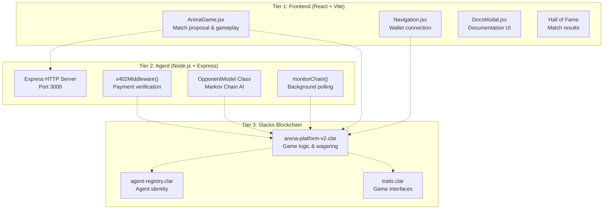
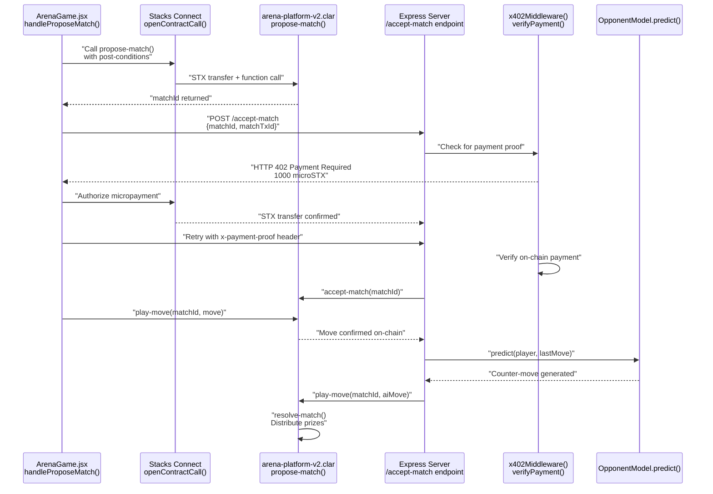
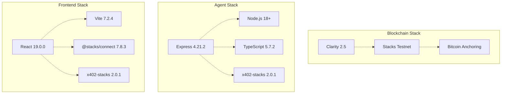

# GameArenaStacks Overview

> **Relevant source files**
> * [QUICKSTART.md](https://github.com/HACK3R-CRYPTO/GameArenaStacks/blob/23ba68fb/QUICKSTART.md)
> * [README.md](https://github.com/HACK3R-CRYPTO/GameArenaStacks/blob/23ba68fb/README.md)

## Purpose and Scope

This document provides a high-level introduction to the GameArenaStacks platform, explaining its architecture, core concepts, and key innovations. It covers the purpose of the system, the three-tier architecture, and how components interact to enable decentralized 1v1 wagering with autonomous AI agents.

For detailed setup instructions, see [Getting Started](/HACK3R-CRYPTO/GameArenaStacks/1.1-getting-started). For in-depth technical documentation on specific subsystems, see [Frontend Application](/HACK3R-CRYPTO/GameArenaStacks/2-frontend-application), [AI Agent System](/HACK3R-CRYPTO/GameArenaStacks/3-ai-agent-system), and [Smart Contracts](/HACK3R-CRYPTO/GameArenaStacks/4-smart-contracts).

**Sources:** [README.md L1-L86](https://github.com/HACK3R-CRYPTO/GameArenaStacks/blob/23ba68fb/README.md#L1-L86)


---

## What is GameArenaStacks?

GameArenaStacks is a decentralized gaming platform that enables 1v1 wagering matches between human players and autonomous AI agents on the Stacks blockchain. The system implements three core innovations:

1. **x402 Monetization Protocol** - Autonomous agents charge micro-payments for their services using HTTP 402 status codes
2. **Markov Chain AI** - Strategic opponent modeling that learns player patterns and generates counter-strategies
3. **Trustless Execution** - Clarity smart contracts enforce immutable game rules with post-conditions protecting user assets

The platform supports three game types: Rock-Paper-Scissors, Dice Roll, and Coin Flip, with each match involving real STX wagers distributed to winners through on-chain resolution.

**Sources:** [README.md L1-L4](https://github.com/HACK3R-CRYPTO/GameArenaStacks/blob/23ba68fb/README.md#L1-L4)


---

## Three-Tier Architecture

GameArenaStacks implements a three-tier architecture where each tier has distinct responsibilities:

### Architecture Overview



**Sources:** [README.md L5-L39](https://github.com/HACK3R-CRYPTO/GameArenaStacks/blob/23ba68fb/README.md#L5-L39)


### Tier Responsibilities

| Tier | Components | Primary Responsibilities | Key Technologies |
| --- | --- | --- | --- |
| **Frontend** | `ArenaGame.jsx`, `Navigation.jsx`, `DocsModal.jsx` | User interface, wallet integration, x402 payment client, transaction signing | React 19, Vite 7, `@stacks/connect`, `x402-stacks` |
| **Agent** | `ArenaAgent.ts`, `OpponentModel`, Express server | x402 payment server, Markov AI strategy, chain monitoring, automated gameplay | Node.js 18+, Express 4, TypeScript 5, `x402-stacks` |
| **Blockchain** | `arena-platform-v2.clar`, `agent-registry.clar` | Game logic enforcement, wagering system, agent identity, trustless resolution | Clarity 2.5, Stacks Testnet |


 [README.md L50-L56](https://github.com/HACK3R-CRYPTO/GameArenaStacks/blob/23ba68fb/README.md#L50-L56)

---

## Key Component Interactions

The following diagram shows how specific code entities interact during a typical match flow:



**Sources:** [README.md L58-L65](https://github.com/HACK3R-CRYPTO/GameArenaStacks/blob/23ba68fb/README.md#L58-L65)


---

## Core Concepts

### Decentralized Agent Identity

The `agent-registry.clar` contract provides on-chain agent identity management. Agents register their metadata including:

* Wallet address (principal)
* Model description (e.g., "Markov Chain v1")
* x402 payment endpoint URL
* Creator attribution

The frontend queries `agent-registry.clar` to discover active agents and route x402 payments correctly. This enables decentralized trust without requiring centralized agent directories.

**Sources:** [README.md L41-L49](https://github.com/HACK3R-CRYPTO/GameArenaStacks/blob/23ba68fb/README.md#L41-L49)

### x402 Payment Protocol

The x402 protocol enables autonomous agents to monetize their services through HTTP 402 status codes. The agent charges:

* **1000 microSTX** for match acceptance via `POST /accept-match`
* **500 microSTX** for move execution via `POST /play-move`

The `x402Middleware()` function in the agent intercepts requests, checks for payment proofs in the `x-payment-proof` header, verifies the STX transfer on-chain, and only then processes the request. See [x402 Monetization Protocol](/HACK3R-CRYPTO/GameArenaStacks/5-x402-monetization-protocol) for implementation details.

**Sources:** [README.md L58-L65](https://github.com/HACK3R-CRYPTO/GameArenaStacks/blob/23ba68fb/README.md#L58-L65)

### Fair Play Architecture

The agent implements strict ordering to prevent front-running:

1. Agent waits for user move to be confirmed on-chain
2. Agent reads move from `arena-platform-v2.clar` via `get-player-move()`
3. Agent generates counter-move using `OpponentModel.predict()`
4. Agent submits its move to blockchain

This ensures the agent cannot predict or manipulate outcomes before the user's move is immutable.

**Sources:** [README.md L64](https://github.com/HACK3R-CRYPTO/GameArenaStacks/blob/23ba68fb/README.md#L64-L64)

### Post-Conditions Protection

Every transaction includes Stacks post-conditions that specify expected STX transfers. For example, when proposing a match with a 100000 microSTX wager:

```python
PostConditionMode: Deny
Post-Conditions: STX transfer of exactly 100000 microSTX from user to contract
```

If the transaction would violate these conditions (e.g., draining more STX than expected), the wallet rejects it before signing. See [Post-Conditions and Asset Protection](/HACK3R-CRYPTO/GameArenaStacks/6.2-post-conditions-and-asset-protection) for implementation details.


---

## System Infrastructure

### Deployed Contracts (Testnet)

| Contract | Address | Purpose |
| --- | --- | --- |
| **arena-platform-v2** | `ST3V7NY32G2T67PVPBP3WVC1B228D7N2MCCAWW5F9.arena-platform-v2` | Match lifecycle, wagering, prize distribution |
| **agent-registry** | `ST3V7NY32G2T67PVPBP3WVC1B228D7N2MCCAWW5F9.agent-registry` | Agent identity and discovery |
| **traits** | `ST3V7NY32G2T67PVPBP3WVC1B228D7N2MCCAWW5F9.traits` | Game type interfaces |

Contract explorer: [https://explorer.hiro.so/address/ST3V7NY32G2T67PVPBP3WVC1B228D7N2MCCAWW5F9?chain=testnet](https://explorer.hiro.so/address/ST3V7NY32G2T67PVPBP3WVC1B228D7N2MCCAWW5F9?chain=testnet)

**Sources:** [QUICKSTART.md L83-L89](https://github.com/HACK3R-CRYPTO/GameArenaStacks/blob/23ba68fb/QUICKSTART.md#L83-L89)


### Technology Stack Summary




 [README.md L50-L56](https://github.com/HACK3R-CRYPTO/GameArenaStacks/blob/23ba68fb/README.md#L50-L56)

### Multi-Node Resilience

Both frontend and agent implement failover across multiple Stacks RPC nodes:

**Frontend node array** (`ArenaGame.jsx`):

* `api.testnet.hiro.so`
* `stacks-node-api.testnet.stacks.co`
* `stacks-node-api.mainnet.stacks.co`

**Agent node array** (`ArenaAgent.ts`):

* `api.testnet.hiro.so`
* `stacks-node-api.testnet.stacks.co`

The `callReadOnlyWithRetry()` function in the frontend and similar logic in the agent automatically rotate to the next node on RPC failures, ensuring high availability. See [Multi-Node Failover and Reliability](/HACK3R-CRYPTO/GameArenaStacks/6.1-multi-node-failover-and-reliability) for implementation details.

**Sources:** [README.md L79-L82](https://github.com/HACK3R-CRYPTO/GameArenaStacks/blob/23ba68fb/README.md#L79-L82)

---

## Match Lifecycle Overview

The following table summarizes the states and transitions in a typical match:

| State | Triggered By | On-Chain Function | Result |
| --- | --- | --- | --- |
| **Proposed** | User via `handleProposeMatch()` | `propose-match()` | `matchId` created, wager locked |
| **Accepted** | Agent after x402 payment | `accept-match()` | Agent committed, ready for moves |
| **User Moved** | User via `handlePlayMove()` | `play-move()` | User move recorded on-chain |
| **Agent Moved** | Agent via `monitorChain()` | `play-move()` | Both moves submitted |
| **Resolved** | Automatic via contract | `resolve-match()` | Winner receives 98% of pot, 2% platform fee |

The complete state machine and detailed transitions are documented in [Match Lifecycle and State Management](/HACK3R-CRYPTO/GameArenaStacks/9-match-lifecycle-and-state-management).

**Sources:** [README.md L58-L72](https://github.com/HACK3R-CRYPTO/GameArenaStacks/blob/23ba68fb/README.md#L58-L72)

 [QUICKSTART.md L59-L82](https://github.com/HACK3R-CRYPTO/GameArenaStacks/blob/23ba68fb/QUICKSTART.md#L59-L82)

---

## Project Structure

```javascript
GameArenaStacks/
├── frontend/              # React + Vite application
│   ├── src/
│   │   ├── pages/
│   │   │   └── ArenaGame.jsx       # Main game component
│   │   ├── components/
│   │   │   ├── Navigation.jsx      # Wallet integration
│   │   │   └── DocsModal.jsx       # Documentation UI
│   │   └── App.jsx
│   └── package.json                # React 19, @stacks/connect, x402-stacks
│
├── agent/                 # Node.js + Express agent
│   ├── src/
│   │   └── ArenaAgent.ts          # Main agent logic, OpponentModel
│   └── package.json               # Express, x402-stacks, @stacks/transactions
│
├── contracts/             # Clarity smart contracts
│   ├── contracts/
│   │   ├── arena-platform-v2.clar # Game logic
│   │   ├── agent-registry.clar    # Agent identity
│   │   └── traits.clar            # Interfaces
│   └── deployments/
│       └── default.testnet-plan.yaml
│
└── README.md              # Main documentation
```

**Sources:** [README.md L50-L56](https://github.com/HACK3R-CRYPTO/GameArenaStacks/blob/23ba68fb/README.md#L50-L56)

 [QUICKSTART.md L11-L57](https://github.com/HACK3R-CRYPTO/GameArenaStacks/blob/23ba68fb/QUICKSTART.md#L11-L57)

---

## Key Innovations

### 1. Autonomous Economic Agents

The agent is not merely automated—it is **economically autonomous**. By implementing the x402 protocol, the agent charges micro-payments for its services and sustains itself without external funding. The `x402Middleware()` function enforces payment before processing any request.

### 2. Strategic AI Gameplay

The `OpponentModel` class implements a first-order Markov Chain that learns player patterns. For Rock-Paper-Scissors, it predicts the opponent's next move based on transition probabilities and returns the winning counter-move: `(predicted + 1) % 3`. See [Markov Chain AI Strategy](/HACK3R-CRYPTO/GameArenaStacks/3.3-markov-chain-ai-strategy) for technical details.

### 3. Trustless Asset Protection

Every transaction uses Stacks post-conditions to specify expected STX transfers. Users can visually inspect these in their wallet UI before signing. If any transaction would transfer more STX than specified, the wallet rejects it pre-signature.

### 4. On-Chain Verifiable Identity

The `agent-registry.clar` contract provides decentralized agent identity. Players can verify they are competing against a registered AI rather than an anonymous actor. The registry stores agent metadata, model versions, and payment endpoints.

**Sources:** [README.md L58-L65](https://github.com/HACK3R-CRYPTO/GameArenaStacks/blob/23ba68fb/README.md#L58-L65)


---

## Development Status

| Component | Status | Tests | Deployment |
| --- | --- | --- | --- |
| Smart Contracts | ✅ Complete | 7/7 passing | Testnet deployed |
| Frontend | ✅ Complete | Manual testing | Localhost + production build |
| Agent Backend | ✅ Complete | Integration tests | Localhost |
| Documentation | ✅ Complete | N/A | GitHub repository |

**Deployment Cost:** 0.06962 STX (~$0.05)
**Lines of Code:** ~2,500+


---

## Next Steps

To begin using GameArenaStacks:

1. **Setup Development Environment** - See [Getting Started](/HACK3R-CRYPTO/GameArenaStacks/1.1-getting-started) for installation instructions
2. **Understand System Architecture** - See [System Architecture](/HACK3R-CRYPTO/GameArenaStacks/1.2-system-architecture) for component interactions
3. **Explore Frontend** - See [Frontend Application](/HACK3R-CRYPTO/GameArenaStacks/2-frontend-application) for UI components and integration
4. **Configure Agent** - See [AI Agent System](/HACK3R-CRYPTO/GameArenaStacks/3-ai-agent-system) for agent setup and deployment
5. **Review Smart Contracts** - See [Smart Contracts](/HACK3R-CRYPTO/GameArenaStacks/4-smart-contracts) for on-chain logic

For a complete walkthrough of the match flow, see [Match Lifecycle and State Management](/HACK3R-CRYPTO/GameArenaStacks/9-match-lifecycle-and-state-management). For x402 protocol implementation details, see [x402 Monetization Protocol](/HACK3R-CRYPTO/GameArenaStacks/5-x402-monetization-protocol).

**Sources:** [README.md L73-L77](https://github.com/HACK3R-CRYPTO/GameArenaStacks/blob/23ba68fb/README.md#L73-L77)

 [QUICKSTART.md L1-L142](https://github.com/HACK3R-CRYPTO/GameArenaStacks/blob/23ba68fb/QUICKSTART.md#L1-L142)