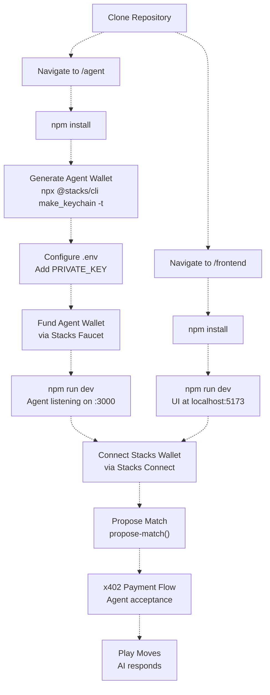
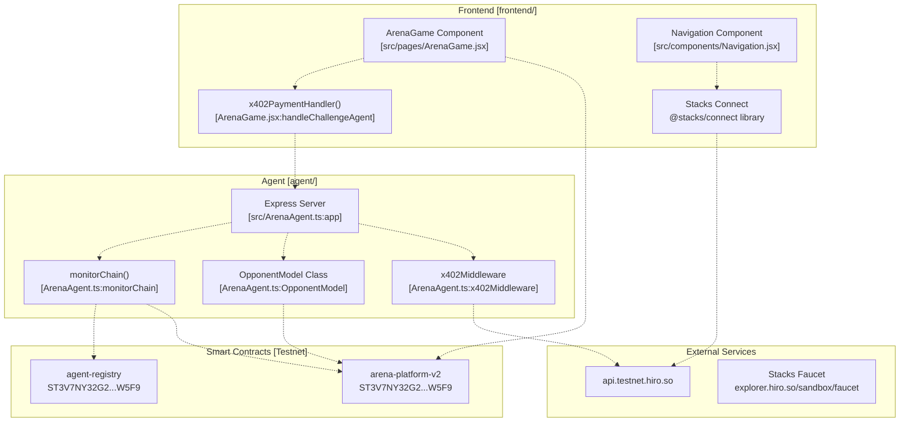
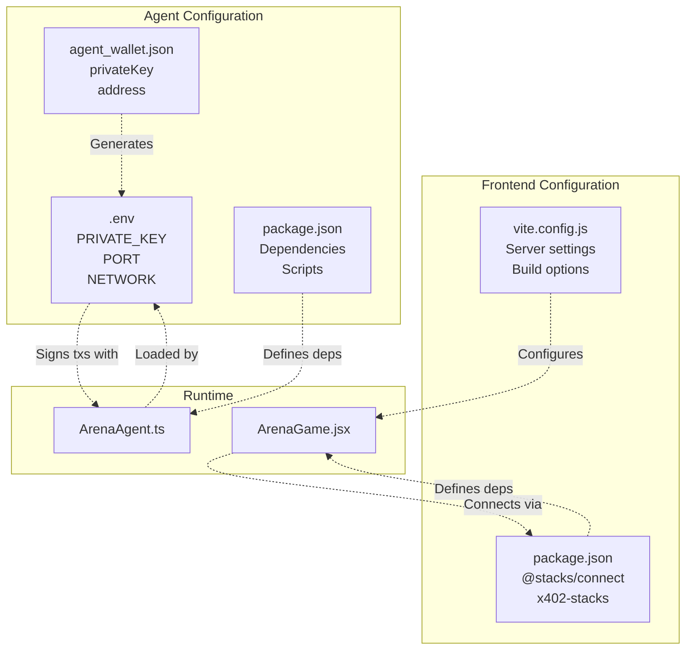

# Getting Started

> **Relevant source files**
> * [QUICKSTART.md](https://github.com/HACK3R-CRYPTO/GameArenaStacks/blob/23ba68fb/QUICKSTART.md)
> * [README.md](https://github.com/HACK3R-CRYPTO/GameArenaStacks/blob/23ba68fb/README.md)
> * [agent/README.md](https://github.com/HACK3R-CRYPTO/GameArenaStacks/blob/23ba68fb/agent/README.md)

This page provides quickstart instructions for setting up and running the GameArenaStacks platform locally. It covers installation of the frontend application, configuration and deployment of the AI agent, and connection to the deployed testnet smart contracts. For detailed information about the system architecture, see [System Architecture](/HACK3R-CRYPTO/GameArenaStacks/1.2-system-architecture). For specific agent configuration options, see [Agent Setup and Configuration](/HACK3R-CRYPTO/GameArenaStacks/3.1-agent-setup-and-configuration).

**Scope**: This guide assumes you want to run the full stack locally (frontend + agent) against existing testnet smart contracts. It does not cover contract deployment; the contracts are already deployed and accessible on Stacks testnet.

## Prerequisites

Before beginning setup, ensure your development environment meets these requirements:

| Requirement | Version | Purpose |
| --- | --- | --- |
| Node.js | 18+ | Runtime for frontend and agent |
| npm | 8+ | Package management |
| Stacks Wallet | Any | Leather, Xverse, or Asigna for transaction signing |
| Testnet STX | ~5 STX | For agent wallet funding and testing |

**Sources**: [QUICKSTART.md L3-L7](https://github.com/HACK3R-CRYPTO/GameArenaStacks/blob/23ba68fb/QUICKSTART.md#L3-L7)

## Setup Flow Overview

The following diagram illustrates the complete setup sequence:



**Title**: Complete Setup and Testing Flow

**Sources**: [QUICKSTART.md L9-L81](https://github.com/HACK3R-CRYPTO/GameArenaStacks/blob/23ba68fb/QUICKSTART.md#L9-L81)

 [README.md L73-L77](https://github.com/HACK3R-CRYPTO/GameArenaStacks/blob/23ba68fb/README.md#L73-L77)

## Repository Setup

Clone the repository and navigate to the project root:

```
git clone https://github.com/HACK3R-CRYPTO/GameArenaStacks.git
cd GameArenaStacks
```

The repository structure contains three primary directories:

* `agent/` - Autonomous AI agent with x402 monetization
* `frontend/` - React application with Stacks Connect integration
* `contracts/` - Clarity smart contracts (already deployed to testnet)

**Sources**: [QUICKSTART.md L13-L16](https://github.com/HACK3R-CRYPTO/GameArenaStacks/blob/23ba68fb/QUICKSTART.md#L13-L16)

## Agent Setup

The agent must be configured and running before the frontend can interact with it. The agent requires its own funded Stacks wallet to sign transactions.

### Agent Installation

Navigate to the agent directory and install dependencies:

```
cd agent
npm install
```

**Sources**: [QUICKSTART.md L19-L24](https://github.com/HACK3R-CRYPTO/GameArenaStacks/blob/23ba68fb/QUICKSTART.md#L19-L24)

### Wallet Generation

Generate a new Stacks wallet for the agent:

```
npx @stacks/cli make_keychain -t > agent_wallet.json
```

This creates a JSON file with the following structure:

```json
{
  "mnemonic": "...",
  "keyInfo": {
    "privateKey": "your_private_key_here",
    "address": "ST...",
    "btcAddress": "...",
    "index": 0
  }
}
```

**Important**: The `address` field will be needed for funding, and the `privateKey` field must be added to the agent's environment configuration.

**Sources**: [QUICKSTART.md L26-L33](https://github.com/HACK3R-CRYPTO/GameArenaStacks/blob/23ba68fb/QUICKSTART.md#L26-L33)

### Environment Configuration

Create the agent's environment file:

```
cp .env.example .env
```

Edit `.env` and add the private key from `agent_wallet.json`:

```
PRIVATE_KEY=your_private_key_here
PORT=3000
NETWORK=testnet
```

The agent uses this private key to sign transactions when accepting matches and playing moves. The configuration is loaded by [agent/src/ArenaAgent.ts](https://github.com/HACK3R-CRYPTO/GameArenaStacks/blob/23ba68fb/agent/src/ArenaAgent.ts)

 at startup.

**Sources**: [QUICKSTART.md L29-L34](https://github.com/HACK3R-CRYPTO/GameArenaStacks/blob/23ba68fb/QUICKSTART.md#L29-L34)

 [agent/README.md L40](https://github.com/HACK3R-CRYPTO/GameArenaStacks/blob/23ba68fb/agent/README.md#L40-L40)

### Agent Wallet Funding

The agent wallet must have testnet STX to pay transaction fees:

1. Copy the `address` value from `agent_wallet.json`
2. Visit the [Stacks Testnet Faucet](https://explorer.hiro.so/sandbox/faucet?chain=testnet)
3. Request testnet STX (recommended: 5 STX minimum)
4. Wait for confirmation (typically 1-2 minutes)

**Sources**: [QUICKSTART.md L36-L38](https://github.com/HACK3R-CRYPTO/GameArenaStacks/blob/23ba68fb/QUICKSTART.md#L36-L38)

### Starting the Agent

Start the agent in development mode:

```
npm run dev
```

Expected output:

```
x402 middleware initialized for arena-platform-v2
OpponentModel loaded for Rock-Paper-Scissors
Agent listening on port 3000
Chain monitor started (polling every 15s)
```

The agent exposes these HTTP endpoints:

* `POST /accept-match` - Accept a proposed match (requires x402 payment)
* `POST /play-move` - Execute an AI move (requires x402 payment)

Both endpoints are protected by the x402 middleware implemented in [agent/src/ArenaAgent.ts](https://github.com/HACK3R-CRYPTO/GameArenaStacks/blob/23ba68fb/agent/src/ArenaAgent.ts)

**Sources**: [QUICKSTART.md L40-L43](https://github.com/HACK3R-CRYPTO/GameArenaStacks/blob/23ba68fb/QUICKSTART.md#L40-L43)

 [agent/README.md L8-L12](https://github.com/HACK3R-CRYPTO/GameArenaStacks/blob/23ba68fb/agent/README.md#L8-L12)

 [agent/README.md L34-L38](https://github.com/HACK3R-CRYPTO/GameArenaStacks/blob/23ba68fb/agent/README.md#L34-L38)

## Frontend Setup

The frontend is a React application built with Vite that connects to Stacks wallets and communicates with the agent via x402.

### Frontend Installation

Navigate to the frontend directory and install dependencies:

```
cd frontend
npm install
```

**Sources**: [QUICKSTART.md L45-L54](https://github.com/HACK3R-CRYPTO/GameArenaStacks/blob/23ba68fb/QUICKSTART.md#L45-L54)

### Starting the Development Server

Start the Vite development server:

```
npm run dev
```

The application will be available at [http://localhost:5173](http://localhost:5173).

Expected console output:

```
VITE v7.2.4  ready in 523 ms

➜  Local:   http://localhost:5173/
➜  Network: use --host to expose
```

The frontend configuration is defined in [frontend/vite.config.js](https://github.com/HACK3R-CRYPTO/GameArenaStacks/blob/23ba68fb/frontend/vite.config.js)

 and uses [frontend/package.json](https://github.com/HACK3R-CRYPTO/GameArenaStacks/blob/23ba68fb/frontend/package.json)

 for dependency management.

**Sources**: [QUICKSTART.md L52-L57](https://github.com/HACK3R-CRYPTO/GameArenaStacks/blob/23ba68fb/QUICKSTART.md#L52-L57)

## Component Architecture with Code Entities

The following diagram maps system components to their actual code entities:



**Title**: Component Architecture with Code Entity Mapping

**Sources**: [README.md L9-L39](https://github.com/HACK3R-CRYPTO/GameArenaStacks/blob/23ba68fb/README.md#L9-L39)

 [QUICKSTART.md L108-L121](https://github.com/HACK3R-CRYPTO/GameArenaStacks/blob/23ba68fb/QUICKSTART.md#L108-L121)

 [agent/README.md L1-L41](https://github.com/HACK3R-CRYPTO/GameArenaStacks/blob/23ba68fb/agent/README.md#L1-L41)

## Deployed Testnet Contracts

The smart contracts are already deployed to Stacks testnet and do not require local deployment:

| Contract | Address | Purpose |
| --- | --- | --- |
| Deployer Account | `ST3V7NY32G2T67PVPBP3WVC1B228D7N2MCCAWW5F9` | Contract owner |
| `arena-platform-v2` | `ST3V7NY32G2T67PVPBP3WVC1B228D7N2MCCAWW5F9.arena-platform-v2` | Game logic, wagering, resolution |
| `agent-registry` | `ST3V7NY32G2T67PVPBP3WVC1B228D7N2MCCAWW5F9.agent-registry` | Agent identity and discovery |

View contracts on [Stacks Explorer](https://explorer.hiro.so/address/ST3V7NY32G2T67PVPBP3WVC1B228D7N2MCCAWW5F9?chain=testnet).

The frontend references these contracts in [frontend/src/pages/ArenaGame.jsx](https://github.com/HACK3R-CRYPTO/GameArenaStacks/blob/23ba68fb/frontend/src/pages/ArenaGame.jsx)

 via the `CONTRACT_ADDRESS` and `CONTRACT_NAME` constants.

**Sources**: [QUICKSTART.md L83-L89](https://github.com/HACK3R-CRYPTO/GameArenaStacks/blob/23ba68fb/QUICKSTART.md#L83-L89)

 [README.md L43-L48](https://github.com/HACK3R-CRYPTO/GameArenaStacks/blob/23ba68fb/README.md#L43-L48)

## Testing the Complete Flow

Once both agent and frontend are running, test the end-to-end flow:

### 1. Wallet Connection

1. Click "Connect Wallet" in the navigation bar
2. Select your Stacks wallet (Leather, Xverse, or Asigna)
3. Approve the connection request
4. Your address should appear in the navigation bar

The wallet connection is handled by [frontend/src/components/Navigation.jsx](https://github.com/HACK3R-CRYPTO/GameArenaStacks/blob/23ba68fb/frontend/src/components/Navigation.jsx)

 using the `@stacks/connect` library.

**Sources**: [QUICKSTART.md L61-L64](https://github.com/HACK3R-CRYPTO/GameArenaStacks/blob/23ba68fb/QUICKSTART.md#L61-L64)

### 2. Match Proposal

1. Select a game type from the dropdown: * Rock Paper Scissors (gameType: 1) * Dice Roll (gameType: 2) * Coin Flip (gameType: 3)
2. Set wager amount (default: 100000 microSTX = 0.1 STX)
3. Click "PROPOSE_MATCH_VIA_STX"
4. Confirm the transaction in your wallet

The proposal is submitted via the `handleProposeMatch()` function in [frontend/src/pages/ArenaGame.jsx](https://github.com/HACK3R-CRYPTO/GameArenaStacks/blob/23ba68fb/frontend/src/pages/ArenaGame.jsx)

 which calls the `propose-match` function in the `arena-platform-v2` contract.

**Sources**: [QUICKSTART.md L66-L70](https://github.com/HACK3R-CRYPTO/GameArenaStacks/blob/23ba68fb/QUICKSTART.md#L66-L70)

### 3. Agent Acceptance (x402 Flow)

The agent automatically detects the new match via its chain monitor and processes it:

1. Agent's `monitorChain()` function polls for new matches
2. When detected, agent sends HTTP 402 Payment Required
3. Frontend's `handleChallengeAgent()` triggers x402 payment flow
4. User authorizes micro-payment (1000 microSTX)
5. Agent verifies payment and calls `accept-match()` on-chain

This flow is orchestrated by [agent/src/ArenaAgent.ts](https://github.com/HACK3R-CRYPTO/GameArenaStacks/blob/23ba68fb/agent/src/ArenaAgent.ts#LNaN-LNaN)

 and [frontend/src/pages/ArenaGame.jsx](https://github.com/HACK3R-CRYPTO/GameArenaStacks/blob/23ba68fb/frontend/src/pages/ArenaGame.jsx#LNaN-LNaN)

**Sources**: [QUICKSTART.md L72-L76](https://github.com/HACK3R-CRYPTO/GameArenaStacks/blob/23ba68fb/QUICKSTART.md#L72-L76)

 [agent/README.md L8-L12](https://github.com/HACK3R-CRYPTO/GameArenaStacks/blob/23ba68fb/agent/README.md#L8-L12)

### 4. Gameplay

1. User selects their move (Rock/Paper/Scissors, Dice number, or Coin side)
2. Frontend calls `play-move()` with post-conditions for asset protection
3. Agent's `OpponentModel` predicts counter-move using Markov Chain
4. Agent submits counter-move to contract
5. Contract resolves winner and distributes prize (98% to winner, 2% platform fee)

The move submission is handled by [frontend/src/pages/ArenaGame.jsx](https://github.com/HACK3R-CRYPTO/GameArenaStacks/blob/23ba68fb/frontend/src/pages/ArenaGame.jsx#LNaN-LNaN)

 and the AI strategy is implemented in [agent/src/ArenaAgent.ts](https://github.com/HACK3R-CRYPTO/GameArenaStacks/blob/23ba68fb/agent/src/ArenaAgent.ts#LNaN-LNaN)

**Sources**: [QUICKSTART.md L77-L81](https://github.com/HACK3R-CRYPTO/GameArenaStacks/blob/23ba68fb/QUICKSTART.md#L77-L81)

 [agent/README.md L14-L23](https://github.com/HACK3R-CRYPTO/GameArenaStacks/blob/23ba68fb/agent/README.md#L14-L23)

## Configuration Reference

The following diagram shows the relationship between configuration files:



**Title**: Configuration File Dependencies

**Sources**: [QUICKSTART.md L29-L34](https://github.com/HACK3R-CRYPTO/GameArenaStacks/blob/23ba68fb/QUICKSTART.md#L29-L34)

 [agent/README.md L40](https://github.com/HACK3R-CRYPTO/GameArenaStacks/blob/23ba68fb/agent/README.md#L40-L40)

## Troubleshooting

### Agent Not Responding

**Symptoms**: Frontend shows "Agent unavailable" or x402 requests timeout.

**Solutions**:

* Verify agent is running: Check for "Agent listening on port 3000" in terminal
* Confirm agent wallet has testnet STX: Check address on [Stacks Explorer](https://explorer.hiro.so/?chain=testnet)
* Review agent logs: Look for errors in the agent terminal output
* Check agent registration: Verify agent is registered in `agent-registry` contract

**Sources**: [QUICKSTART.md L93-L96](https://github.com/HACK3R-CRYPTO/GameArenaStacks/blob/23ba68fb/QUICKSTART.md#L93-L96)

### Transaction Failures

**Symptoms**: Wallet transaction rejected or "Insufficient funds" error.

**Solutions**:

* Ensure wallet has sufficient testnet STX (minimum 1 STX for testing)
* Verify wager amount is greater than 0
* Confirm network is set to testnet in wallet settings
* Check that contract address matches deployed testnet contracts

The frontend implements post-conditions in [frontend/src/pages/ArenaGame.jsx](https://github.com/HACK3R-CRYPTO/GameArenaStacks/blob/23ba68fb/frontend/src/pages/ArenaGame.jsx#LNaN-LNaN)

 to protect against unexpected asset transfers.

**Sources**: [QUICKSTART.md L98-L101](https://github.com/HACK3R-CRYPTO/GameArenaStacks/blob/23ba68fb/QUICKSTART.md#L98-L101)

### Wallet Connection Issues

**Symptoms**: "Connect Wallet" button unresponsive or wallet popup doesn't appear.

**Solutions**:

* Refresh the browser page
* Clear browser cache and local storage
* Try a different Stacks wallet (Leather/Xverse/Asigna)
* Ensure wallet extension is installed and unlocked
* Check browser console for errors

The wallet integration is implemented in [frontend/src/components/Navigation.jsx](https://github.com/HACK3R-CRYPTO/GameArenaStacks/blob/23ba68fb/frontend/src/components/Navigation.jsx)

 using the Stacks Connect protocol.

**Sources**: [QUICKSTART.md L103-L106](https://github.com/HACK3R-CRYPTO/GameArenaStacks/blob/23ba68fb/QUICKSTART.md#L103-L106)

### Chain Monitor Not Detecting Matches

**Symptoms**: Agent doesn't automatically accept matches or make moves.

**Solutions**:

* Verify `NETWORK=testnet` in agent's `.env` file
* Check that Hiro API is accessible: Visit [api.testnet.hiro.so/extended/v1/status](https://api.testnet.hiro.so/extended/v1/status)
* Review chain monitor logs for polling errors
* Ensure agent wallet has sufficient STX for transaction fees

The chain monitor implementation is in [agent/src/ArenaAgent.ts](https://github.com/HACK3R-CRYPTO/GameArenaStacks/blob/23ba68fb/agent/src/ArenaAgent.ts#LNaN-LNaN)

 and polls every 15 seconds by default.

**Sources**: [agent/README.md L30](https://github.com/HACK3R-CRYPTO/GameArenaStacks/blob/23ba68fb/agent/README.md#L30-L30)

## Next Steps

After successfully setting up and testing the basic flow:

* **Explore Game Types**: Try all three game types and observe the AI's adaptive strategies (see [Game Types and Rules](/HACK3R-CRYPTO/GameArenaStacks/7-game-types-and-rules))
* **Review Architecture**: Understand the three-tier system design (see [System Architecture](/HACK3R-CRYPTO/GameArenaStacks/1.2-system-architecture))
* **Study x402 Integration**: Learn how machine-to-machine payments work (see [x402 Monetization Protocol](/HACK3R-CRYPTO/GameArenaStacks/5-x402-monetization-protocol))
* **Examine Smart Contracts**: Review the Clarity contract implementations (see [Smart Contracts](/HACK3R-CRYPTO/GameArenaStacks/4-smart-contracts))
* **Configure Agent Strategy**: Modify the Markov Chain parameters (see [Markov Chain AI Strategy](/HACK3R-CRYPTO/GameArenaStacks/3.3-markov-chain-ai-strategy))

**Sources**: [README.md L50-L56](https://github.com/HACK3R-CRYPTO/GameArenaStacks/blob/23ba68fb/README.md#L50-L56)

 [QUICKSTART.md L131-L141](https://github.com/HACK3R-CRYPTO/GameArenaStacks/blob/23ba68fb/QUICKSTART.md#L131-L141)