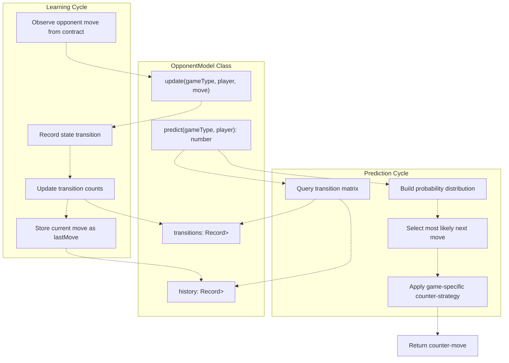
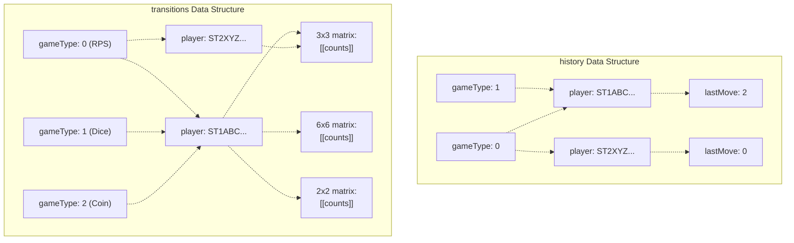
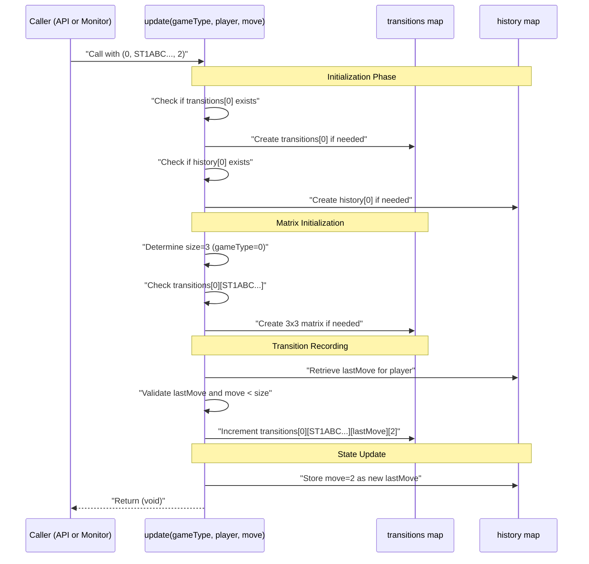
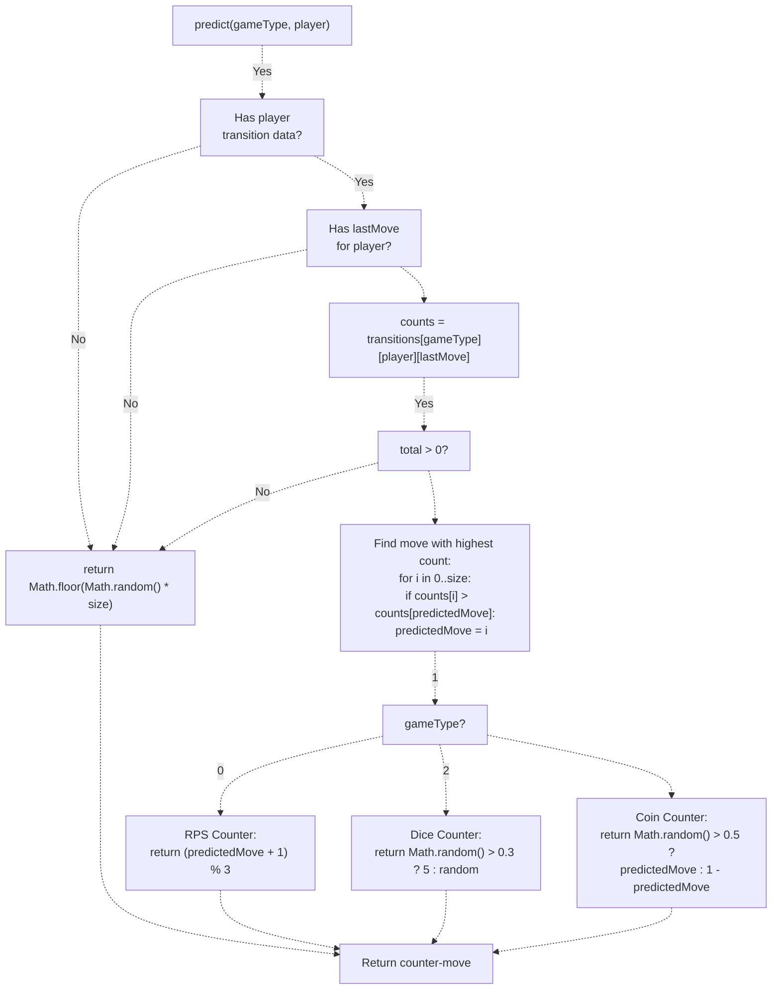
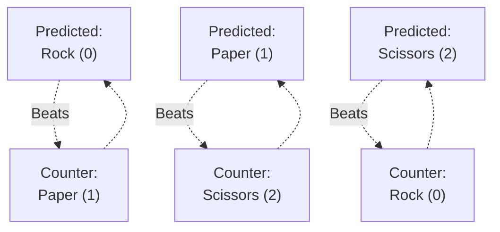
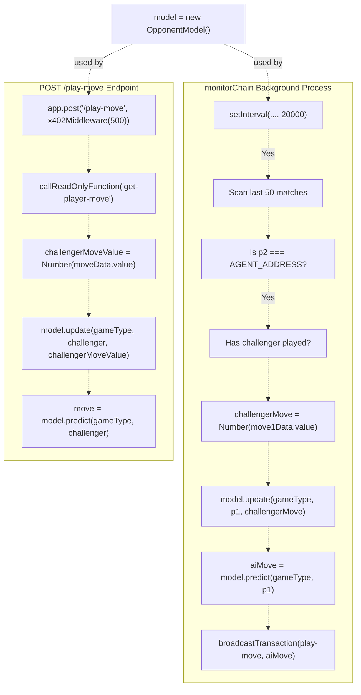
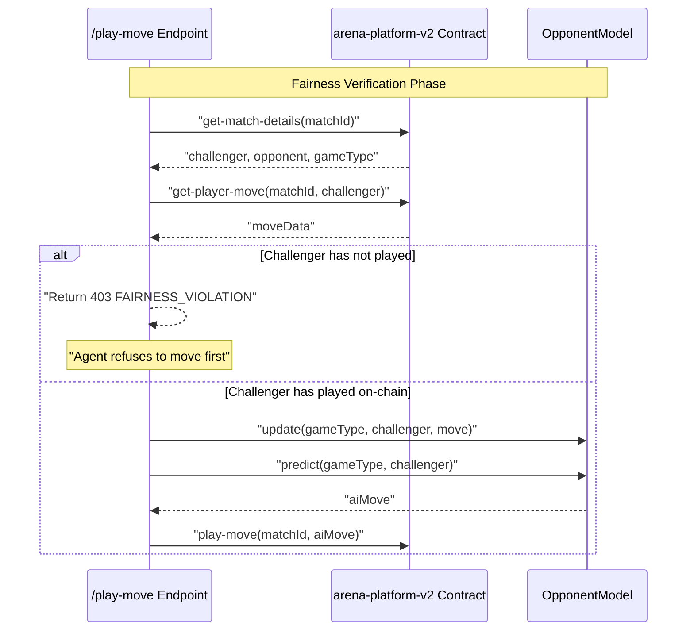

# Markov Chain AI Strategy

> **Relevant source files**
> * [PROJECT_SUMMARY.md](https://github.com/HACK3R-CRYPTO/GameArenaStacks/blob/23ba68fb/PROJECT_SUMMARY.md)
> * [agent/.env.example](https://github.com/HACK3R-CRYPTO/GameArenaStacks/blob/23ba68fb/agent/.env.example)
> * [agent/README.md](https://github.com/HACK3R-CRYPTO/GameArenaStacks/blob/23ba68fb/agent/README.md)
> * [agent/src/ArenaAgent.ts](https://github.com/HACK3R-CRYPTO/GameArenaStacks/blob/23ba68fb/agent/src/ArenaAgent.ts)

This document describes the `OpponentModel` class and its implementation of first-order Markov Chain pattern recognition for strategic gameplay in the GameArena agent. The Markov Chain system learns opponent behavior patterns and generates counter-moves for Rock-Paper-Scissors, Dice Roll, and Coin Flip games.

For information about how the agent accepts matches and manages API endpoints, see [Agent API Endpoints](/HACK3R-CRYPTO/GameArenaStacks/3.5-agent-api-endpoints). For details on how the Markov predictions are triggered during chain monitoring, see [Chain Monitoring and Auto-Resolution](/HACK3R-CRYPTO/GameArenaStacks/3.4-chain-monitoring-and-auto-resolution).

**Sources:** [agent/src/ArenaAgent.ts L54-L61](https://github.com/HACK3R-CRYPTO/GameArenaStacks/blob/23ba68fb/agent/src/ArenaAgent.ts#L54-L61)

## System Overview

The Markov Chain AI operates as a pattern recognition engine that maintains transition probability matrices for each opponent across different game types. The system follows a learning-prediction cycle where every opponent move updates the transition matrix, and predictions are generated by analyzing historical patterns to produce optimal counter-strategies.



**Sources:** [agent/src/ArenaAgent.ts L62-L102](https://github.com/HACK3R-CRYPTO/GameArenaStacks/blob/23ba68fb/agent/src/ArenaAgent.ts#L62-L102)

## OpponentModel Class Architecture

The `OpponentModel` class is instantiated as a singleton at module scope and maintains state across all matches. The class tracks two primary data structures: transition matrices and move history.

### Data Structure Organization

| Field | Type | Purpose |
| --- | --- | --- |
| `transitions` | `Record<number, Record<string, number[][]>>` | Three-dimensional nested structure: gameType → player address → transition matrix |
| `history` | `Record<number, Record<string, number>>` | Two-dimensional structure: gameType → player address → last move |

The transition matrix for each player is a 2D array where `transitions[gameType][player][lastMove][currentMove]` stores the count of times a player transitioned from `lastMove` to `currentMove`. Matrix dimensions depend on game type:

* **Rock-Paper-Scissors (gameType=0)**: 3×3 matrix (0=Rock, 1=Paper, 2=Scissors)
* **Dice Roll (gameType=1)**: 6×6 matrix (0-5 representing dice values)
* **Coin Flip (gameType=2)**: 2×2 matrix (0=Heads, 1=Tails)



**Sources:** [agent/src/ArenaAgent.ts L63-L65](https://github.com/HACK3R-CRYPTO/GameArenaStacks/blob/23ba68fb/agent/src/ArenaAgent.ts#L63-L65)

## Learning Process: The update Method

The `update` method records opponent behavior patterns by incrementing transition counts. The method is called whenever an opponent's move is observed, either through the `/play-move` endpoint or the `monitorChain` background process.

### Update Method Algorithm



The method performs validation to ensure array bounds are respected:

1. **Boundary Check**: Only records transitions if both `lastMove` and `move` are within valid range (`< size`)
2. **Initialization Guard**: Creates nested data structures on-demand to avoid null reference errors
3. **Safe Increment**: Uses nullish coalescing (`row[move] || 0`) to handle uninitialized cells

**Sources:** [agent/src/ArenaAgent.ts L67-L83](https://github.com/HACK3R-CRYPTO/GameArenaStacks/blob/23ba68fb/agent/src/ArenaAgent.ts#L67-L83)

## Prediction and Counter-Strategy: The predict Method

The `predict` method generates the agent's next move by analyzing transition probabilities and applying game-specific counter-strategies. The method implements a two-stage pipeline: probability prediction followed by counter-move transformation.

### Prediction Pipeline



**Sources:** [agent/src/ArenaAgent.ts L85-L101](https://github.com/HACK3R-CRYPTO/GameArenaStacks/blob/23ba68fb/agent/src/ArenaAgent.ts#L85-L101)

## Game-Specific Counter-Strategies

Each game type implements a unique counter-strategy based on the predicted opponent move. The strategies are designed to exploit patterns in opponent behavior while maintaining unpredictability.

### Counter-Strategy Matrix

| Game Type | Strategy | Implementation | Example |
| --- | --- | --- | --- |
| Rock-Paper-Scissors (0) | Deterministic Counter | `(predictedMove + 1) % 3` | If predict Rock(0) → play Paper(1) |
| Dice Roll (1) | Weighted Random | `Math.random() > 0.3 ? 5 : random` | 70% chance roll 6, 30% random |
| Coin Flip (2) | Adaptive Prediction | `Math.random() > 0.5 ? predicted : opposite` | 50% match prediction, 50% opposite |

### Rock-Paper-Scissors Strategy

The RPS strategy implements a **deterministic counter-pick** logic. If the Markov model predicts the opponent will play Rock (0), the agent plays Paper (1). The modulo operation ensures circular logic:

* Predicted: Rock (0) → Counter: Paper (1)
* Predicted: Paper (1) → Counter: Scissors (2)
* Predicted: Scissors (2) → Counter: Rock (0)



**Sources:** [agent/src/ArenaAgent.ts L98](https://github.com/HACK3R-CRYPTO/GameArenaStacks/blob/23ba68fb/agent/src/ArenaAgent.ts#L98-L98)

### Dice Roll Strategy

The Dice strategy implements a **risk-reward optimization** where the agent heavily favors rolling the maximum value (5, representing a 6 on a standard die). This strategy assumes:

1. Higher numbers win in dice roll games
2. A 70/30 split provides competitive advantage while maintaining some unpredictability
3. The random 30% prevents complete predictability

**Sources:** [agent/src/ArenaAgent.ts L99](https://github.com/HACK3R-CRYPTO/GameArenaStacks/blob/23ba68fb/agent/src/ArenaAgent.ts#L99-L99)

### Coin Flip Strategy

The Coin Flip strategy implements an **adaptive mirroring** approach. The agent has a 50% chance to either match the predicted move or play the opposite. This creates uncertainty in the agent's behavior while still leveraging learned patterns.

**Sources:** [agent/src/ArenaAgent.ts L100](https://github.com/HACK3R-CRYPTO/GameArenaStacks/blob/23ba68fb/agent/src/ArenaAgent.ts#L100-L100)

## Integration with Agent System

The `OpponentModel` is instantiated as a module-level singleton and integrated into multiple agent subsystems. The integration points demonstrate how pattern learning and prediction are triggered during the agent lifecycle.

### Integration Architecture



**Sources:** [agent/src/ArenaAgent.ts L104](https://github.com/HACK3R-CRYPTO/GameArenaStacks/blob/23ba68fb/agent/src/ArenaAgent.ts#L104-L104)

 [agent/src/ArenaAgent.ts L186-L240](https://github.com/HACK3R-CRYPTO/GameArenaStacks/blob/23ba68fb/agent/src/ArenaAgent.ts#L186-L240)

 [agent/src/ArenaAgent.ts L330-L475](https://github.com/HACK3R-CRYPTO/GameArenaStacks/blob/23ba68fb/agent/src/ArenaAgent.ts#L330-L475)

### API Endpoint Integration

When the `/play-move` endpoint receives a request without a `move` parameter, it triggers the AI prediction pipeline. The endpoint performs a **fairness check** by querying the contract to ensure the challenger has already committed their move on-chain before the agent responds.

Key integration points in [agent/src/ArenaAgent.ts L186-L240](https://github.com/HACK3R-CRYPTO/GameArenaStacks/blob/23ba68fb/agent/src/ArenaAgent.ts#L186-L240)

:

1. **Line 191-237**: AI prediction is triggered when `move === undefined`
2. **Line 194-224**: Fairness verification queries `get-player-move` for the challenger
3. **Line 228**: Pattern learning via `model.update(gameType, challenger, challengerMoveValue)`
4. **Line 231**: Counter-move generation via `model.predict(gameType, challenger)`

**Sources:** [agent/src/ArenaAgent.ts L186-L240](https://github.com/HACK3R-CRYPTO/GameArenaStacks/blob/23ba68fb/agent/src/ArenaAgent.ts#L186-L240)

### Chain Monitor Integration

The `monitorChain` background process continuously polls the blockchain for active matches where the agent is the opponent. When it detects that a challenger has played but the agent hasn't, it automatically triggers pattern learning and move execution.

Key integration points in [agent/src/ArenaAgent.ts L330-L475](https://github.com/HACK3R-CRYPTO/GameArenaStacks/blob/23ba68fb/agent/src/ArenaAgent.ts#L330-L475)

:

1. **Line 367**: Matches are filtered to `status === 1` (ACCEPTED)
2. **Line 435-442**: Agent detects challenger move and triggers AI pipeline
3. **Line 441**: Pattern learning via `model.update(gameType, p1, challengerMove)`
4. **Line 442**: Counter-move generation via `model.predict(gameType, p1)`
5. **Line 448-467**: AI move is broadcast to the contract via `play-move` transaction

This automated pipeline ensures the agent responds to matches without manual intervention, demonstrating autonomous gameplay.

**Sources:** [agent/src/ArenaAgent.ts L330-L475](https://github.com/HACK3R-CRYPTO/GameArenaStacks/blob/23ba68fb/agent/src/ArenaAgent.ts#L330-L475)

## Pattern Learning Example

The following example demonstrates how the Markov model learns and adapts to a Rock-Paper-Scissors opponent over multiple rounds.

### Learning Progression

| Round | Opponent Move | Agent Action | Transition Matrix State (for opponent) |
| --- | --- | --- | --- |
| 1 | Rock (0) | `update(0, opponent, 0)` | `history[0][opponent] = 0` (no prior state) |
| 2 | Paper (1) | `update(0, opponent, 1)` | `transitions[0][opponent][0][1] += 1` (Rock→Paper) |
| 3 | Paper (1) | `update(0, opponent, 1)` | `transitions[0][opponent][1][1] += 1` (Paper→Paper) |
| 4 | Scissors (2) | `update(0, opponent, 2)` | `transitions[0][opponent][1][2] += 1` (Paper→Scissors) |
| 5 | - | `predict(0, opponent)` | Predicts Paper (1) → Returns Scissors (2) |

After round 4, the transition matrix for this opponent shows:

```
R  P  S
R  [ 0, 1, 0 ]  (After Rock, played Paper once)
P  [ 0, 1, 1 ]  (After Paper, played Paper once, Scissors once)
S  [ 0, 0, 0 ]  (No data after Scissors yet)
```

In round 5, the `predict` method:

1. Looks at `lastMove = 2` (Scissors)
2. Finds `transitions[0][opponent][2] = [0, 0, 0]` (no data)
3. Falls back to random move

As more rounds are played, the matrix becomes more populated, enabling increasingly accurate predictions.

**Sources:** [agent/src/ArenaAgent.ts L67-L101](https://github.com/HACK3R-CRYPTO/GameArenaStacks/blob/23ba68fb/agent/src/ArenaAgent.ts#L67-L101)

## Fair Play Guarantee

The Markov AI strictly enforces fair play by refusing to generate moves until the opponent's move is confirmed on-chain. This prevents front-running attacks where the agent could see a pending transaction and respond strategically before it's finalized.



The fairness check at [agent/src/ArenaAgent.ts L217-L224](https://github.com/HACK3R-CRYPTO/GameArenaStacks/blob/23ba68fb/agent/src/ArenaAgent.ts#L217-L224)

 returns HTTP 403 with error code `FAIRNESS_VIOLATION` if the challenger hasn't committed their move. This ensures:

1. **No Front-Running**: Agent cannot observe and counter pending transactions
2. **Transparent AI**: All AI decisions are based on immutable on-chain data
3. **Trust Building**: Users can verify the agent plays fairly by inspecting contract state

**Sources:** [agent/src/ArenaAgent.ts L194-L224](https://github.com/HACK3R-CRYPTO/GameArenaStacks/blob/23ba68fb/agent/src/ArenaAgent.ts#L194-L224)

## Memory and State Persistence

The `OpponentModel` maintains state in-memory for the duration of the agent process. Key characteristics:

| Aspect | Behavior | Implication |
| --- | --- | --- |
| **Scope** | Module-level singleton | Single model instance serves all matches |
| **Persistence** | In-memory only | Pattern data lost on agent restart |
| **Isolation** | Per-opponent tracking | Each player address has separate transition matrices |
| **Game Type Separation** | Per-gameType isolation | RPS patterns don't affect Dice patterns |

The lack of persistent storage means the agent "forgets" learned patterns on restart, starting fresh with each deployment. For production systems, the model could be extended to serialize state to disk or a database.

**Sources:** [agent/src/ArenaAgent.ts L104](https://github.com/HACK3R-CRYPTO/GameArenaStacks/blob/23ba68fb/agent/src/ArenaAgent.ts#L104-L104)

## Performance Characteristics

The Markov Chain implementation is optimized for real-time gameplay with minimal computational overhead:

### Time Complexity

* **update(gameType, player, move)**: O(1) - Direct array access and increment
* **predict(gameType, player)**: O(size) - Linear scan to find max count, where size ≤ 6

### Space Complexity

Per opponent per game type:

* **Rock-Paper-Scissors**: 3×3 matrix = 9 integers
* **Dice Roll**: 6×6 matrix = 36 integers
* **Coin Flip**: 2×2 matrix = 4 integers

For N opponents across M game types, total space is O(N × M × size²), which remains negligible even with thousands of opponents.

**Sources:** [agent/src/ArenaAgent.ts L63-L101](https://github.com/HACK3R-CRYPTO/GameArenaStacks/blob/23ba68fb/agent/src/ArenaAgent.ts#L63-L101)