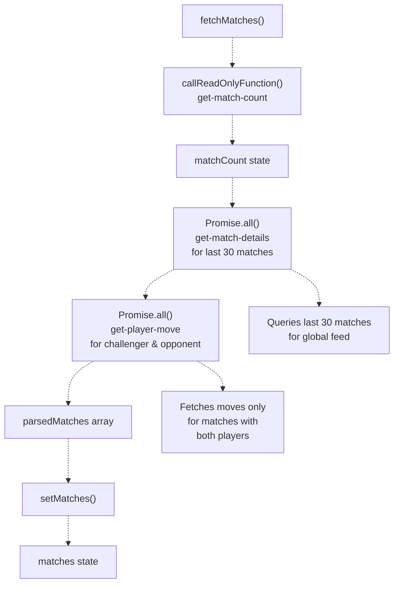
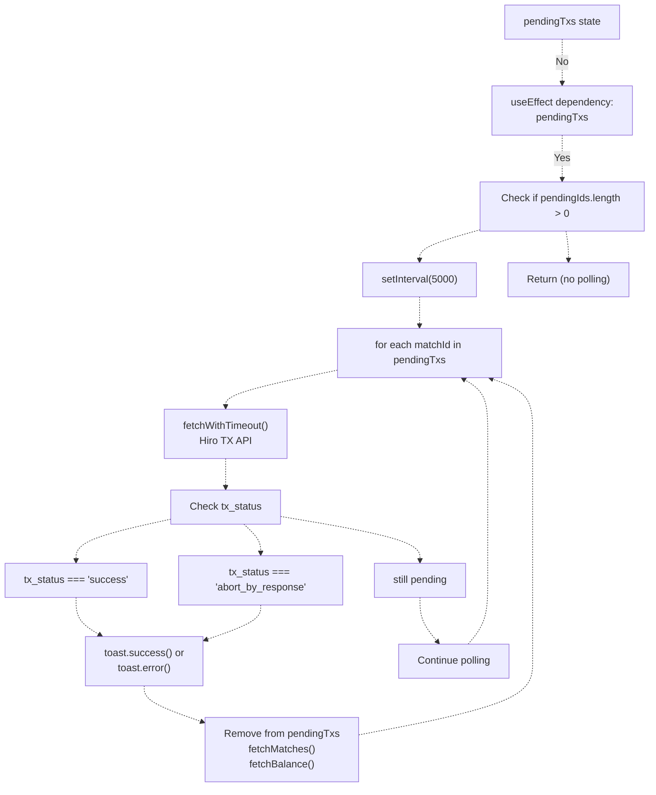
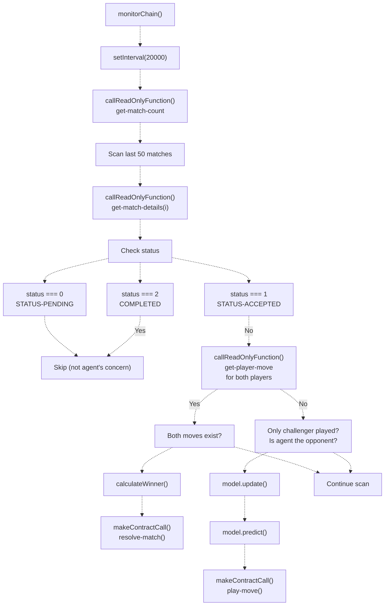
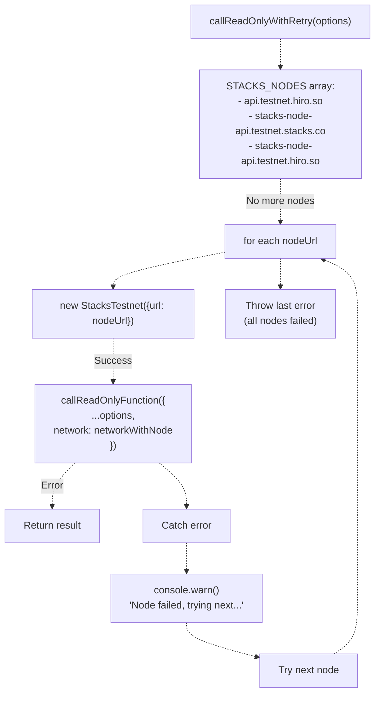
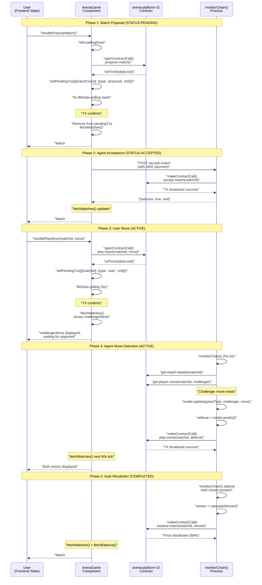

# Match Lifecycle and State Management

> **Relevant source files**
> * [.gitignore](https://github.com/HACK3R-CRYPTO/GameArenaStacks/blob/23ba68fb/.gitignore)
> * [README.md](https://github.com/HACK3R-CRYPTO/GameArenaStacks/blob/23ba68fb/README.md)
> * [agent/.env.example](https://github.com/HACK3R-CRYPTO/GameArenaStacks/blob/23ba68fb/agent/.env.example)
> * [agent/src/ArenaAgent.ts](https://github.com/HACK3R-CRYPTO/GameArenaStacks/blob/23ba68fb/agent/src/ArenaAgent.ts)
> * [frontend/src/components/Navigation.jsx](https://github.com/HACK3R-CRYPTO/GameArenaStacks/blob/23ba68fb/frontend/src/components/Navigation.jsx)
> * [frontend/src/pages/ArenaGame.jsx](https://github.com/HACK3R-CRYPTO/GameArenaStacks/blob/23ba68fb/frontend/src/pages/ArenaGame.jsx)
> * [temp_snippet.txt](https://github.com/HACK3R-CRYPTO/GameArenaStacks/blob/23ba68fb/temp_snippet.txt)

## Purpose and Scope

This document describes the complete lifecycle of a match in GameArenaStacks, from initial proposal through final resolution, and the state management patterns used to track and synchronize match state across the three-tier architecture. It covers:

* Match state enumeration and transitions on-chain
* Frontend state management using React hooks and the BitSubs polling pattern
* Agent chain monitoring and auto-resolution logic
* State synchronization mechanisms between frontend, agent, and blockchain

For information about the smart contract implementation of match logic, see [arena-platform-v2 Contract](/HACK3R-CRYPTO/GameArenaStacks/4.1-arena-platform-v2-contract). For details on x402 payment flows that occur during the lifecycle, see [x402 Payment Middleware](/HACK3R-CRYPTO/GameArenaStacks/3.2-x402-payment-middleware). For agent AI strategy execution, see [Markov Chain AI Strategy](/HACK3R-CRYPTO/GameArenaStacks/3.3-markov-chain-ai-strategy).

---

## Match State Model

### On-Chain State Enumeration

Matches in the `arena-platform-v2` contract progress through three discrete states represented as unsigned integers:

| State Value | State Name | Description |
| --- | --- | --- |
| `0` | `STATUS-PENDING` | Match proposed but not yet accepted by opponent |
| `1` | `STATUS-ACCEPTED` | Both players confirmed, waiting for moves |
| `2` | `STATUS-COMPLETED` | Both moves played, winner determined and prize distributed |

The match state is stored in the `matches` map as part of the match tuple structure. State transitions are enforced by the smart contract's function guards to ensure only valid state progressions occur.

**Sources:** [contracts/arena-platform-v2.clar](https://github.com/HACK3R-CRYPTO/GameArenaStacks/blob/23ba68fb/contracts/arena-platform-v2.clar)

 [frontend/src/pages/ArenaGame.jsx L183-L184](https://github.com/HACK3R-CRYPTO/GameArenaStacks/blob/23ba68fb/frontend/src/pages/ArenaGame.jsx#L183-L184)

### State Transition Diagram

```css
#mermaid-jlcm5g16cop{font-family:ui-sans-serif,-apple-system,system-ui,Segoe UI,Helvetica;font-size:16px;fill:#333;}@keyframes edge-animation-frame{from{stroke-dashoffset:0;}}@keyframes dash{to{stroke-dashoffset:0;}}#mermaid-jlcm5g16cop .edge-animation-slow{stroke-dasharray:9,5!important;stroke-dashoffset:900;animation:dash 50s linear infinite;stroke-linecap:round;}#mermaid-jlcm5g16cop .edge-animation-fast{stroke-dasharray:9,5!important;stroke-dashoffset:900;animation:dash 20s linear infinite;stroke-linecap:round;}#mermaid-jlcm5g16cop .error-icon{fill:#dddddd;}#mermaid-jlcm5g16cop .error-text{fill:#222222;stroke:#222222;}#mermaid-jlcm5g16cop .edge-thickness-normal{stroke-width:1px;}#mermaid-jlcm5g16cop .edge-thickness-thick{stroke-width:3.5px;}#mermaid-jlcm5g16cop .edge-pattern-solid{stroke-dasharray:0;}#mermaid-jlcm5g16cop .edge-thickness-invisible{stroke-width:0;fill:none;}#mermaid-jlcm5g16cop .edge-pattern-dashed{stroke-dasharray:3;}#mermaid-jlcm5g16cop .edge-pattern-dotted{stroke-dasharray:2;}#mermaid-jlcm5g16cop .marker{fill:#999;stroke:#999;}#mermaid-jlcm5g16cop .marker.cross{stroke:#999;}#mermaid-jlcm5g16cop svg{font-family:ui-sans-serif,-apple-system,system-ui,Segoe UI,Helvetica;font-size:16px;}#mermaid-jlcm5g16cop p{margin:0;}#mermaid-jlcm5g16cop defs #statediagram-barbEnd{fill:#999;stroke:#999;}#mermaid-jlcm5g16cop g.stateGroup text{fill:#dddddd;stroke:none;font-size:10px;}#mermaid-jlcm5g16cop g.stateGroup text{fill:#333;stroke:none;font-size:10px;}#mermaid-jlcm5g16cop g.stateGroup .state-title{font-weight:bolder;fill:#333;}#mermaid-jlcm5g16cop g.stateGroup rect{fill:#ffffff;stroke:#dddddd;}#mermaid-jlcm5g16cop g.stateGroup line{stroke:#999;stroke-width:1;}#mermaid-jlcm5g16cop .transition{stroke:#999;stroke-width:1;fill:none;}#mermaid-jlcm5g16cop .stateGroup .composit{fill:#f4f4f4;border-bottom:1px;}#mermaid-jlcm5g16cop .stateGroup .alt-composit{fill:#e0e0e0;border-bottom:1px;}#mermaid-jlcm5g16cop .state-note{stroke:#e6d280;fill:#fff5ad;}#mermaid-jlcm5g16cop .state-note text{fill:#333;stroke:none;font-size:10px;}#mermaid-jlcm5g16cop .stateLabel .box{stroke:none;stroke-width:0;fill:#ffffff;opacity:0.5;}#mermaid-jlcm5g16cop .edgeLabel .label rect{fill:#ffffff;opacity:0.5;}#mermaid-jlcm5g16cop .edgeLabel{background-color:#ffffff;text-align:center;}#mermaid-jlcm5g16cop .edgeLabel p{background-color:#ffffff;}#mermaid-jlcm5g16cop .edgeLabel rect{opacity:0.5;background-color:#ffffff;fill:#ffffff;}#mermaid-jlcm5g16cop .edgeLabel .label text{fill:#333;}#mermaid-jlcm5g16cop .label div .edgeLabel{color:#333;}#mermaid-jlcm5g16cop .stateLabel text{fill:#333;font-size:10px;font-weight:bold;}#mermaid-jlcm5g16cop .node circle.state-start{fill:#999;stroke:#999;}#mermaid-jlcm5g16cop .node .fork-join{fill:#999;stroke:#999;}#mermaid-jlcm5g16cop .node circle.state-end{fill:#dddddd;stroke:#f4f4f4;stroke-width:1.5;}#mermaid-jlcm5g16cop .end-state-inner{fill:#f4f4f4;stroke-width:1.5;}#mermaid-jlcm5g16cop .node rect{fill:#ffffff;stroke:#dddddd;stroke-width:1px;}#mermaid-jlcm5g16cop .node polygon{fill:#ffffff;stroke:#dddddd;stroke-width:1px;}#mermaid-jlcm5g16cop #statediagram-barbEnd{fill:#999;}#mermaid-jlcm5g16cop .statediagram-cluster rect{fill:#ffffff;stroke:#dddddd;stroke-width:1px;}#mermaid-jlcm5g16cop .cluster-label,#mermaid-jlcm5g16cop .nodeLabel{color:#333;}#mermaid-jlcm5g16cop .statediagram-cluster rect.outer{rx:5px;ry:5px;}#mermaid-jlcm5g16cop .statediagram-state .divider{stroke:#dddddd;}#mermaid-jlcm5g16cop .statediagram-state .title-state{rx:5px;ry:5px;}#mermaid-jlcm5g16cop .statediagram-cluster.statediagram-cluster .inner{fill:#f4f4f4;}#mermaid-jlcm5g16cop .statediagram-cluster.statediagram-cluster-alt .inner{fill:#f8f8f8;}#mermaid-jlcm5g16cop .statediagram-cluster .inner{rx:0;ry:0;}#mermaid-jlcm5g16cop .statediagram-state rect.basic{rx:5px;ry:5px;}#mermaid-jlcm5g16cop .statediagram-state rect.divider{stroke-dasharray:10,10;fill:#f8f8f8;}#mermaid-jlcm5g16cop .note-edge{stroke-dasharray:5;}#mermaid-jlcm5g16cop .statediagram-note rect{fill:#fff5ad;stroke:#e6d280;stroke-width:1px;rx:0;ry:0;}#mermaid-jlcm5g16cop .statediagram-note rect{fill:#fff5ad;stroke:#e6d280;stroke-width:1px;rx:0;ry:0;}#mermaid-jlcm5g16cop .statediagram-note text{fill:#333;}#mermaid-jlcm5g16cop .statediagram-note .nodeLabel{color:#333;}#mermaid-jlcm5g16cop .statediagram .edgeLabel{color:red;}#mermaid-jlcm5g16cop #dependencyStart,#mermaid-jlcm5g16cop #dependencyEnd{fill:#999;stroke:#999;stroke-width:1;}#mermaid-jlcm5g16cop .statediagramTitleText{text-anchor:middle;font-size:18px;fill:#333;}#mermaid-jlcm5g16cop :root{--mermaid-font-family:"trebuchet ms",verdana,arial,sans-serif;}"propose-match()""accept-match()""play-move(opponent)""resolve-match()"STATUS_PENDINGSTATUS_ACCEPTEDSTATUS_COMPLETEDContract State: 0Frontend: "Pending"Only challenger has wager escrowedContract State: 1Frontend: "Active"Both players confirmedAwaiting movesContract State: 2Frontend: "Completed"Winner receives 98% of potPlatform takes 2% fee
```

**Sources:** [frontend/src/pages/ArenaGame.jsx L183-L184](https://github.com/HACK3R-CRYPTO/GameArenaStacks/blob/23ba68fb/frontend/src/pages/ArenaGame.jsx#L183-L184)

 [agent/src/ArenaAgent.ts L364-L367](https://github.com/HACK3R-CRYPTO/GameArenaStacks/blob/23ba68fb/agent/src/ArenaAgent.ts#L364-L367)

---

## Frontend State Management Architecture

### React State Hooks

The `ArenaGame` component manages multiple pieces of local state to track the application's view of on-chain data:

| State Variable | Type | Purpose |
| --- | --- | --- |
| `matches` | `Array<Match>` | Cached array of match details fetched from contract |
| `matchCount` | `number` | Total number of matches created (from `get-match-count`) |
| `pendingTxs` | `Object<matchId, {type, txId}>` | Transaction IDs awaiting confirmation |
| `loading` | `boolean` | UI loading state for user actions |
| `stxBalance` | `string` | User's STX balance in human-readable format |

The `matches` array contains enriched match objects with both on-chain data and locally computed properties:

```yaml
{
    id: number,              // Match ID
    challenger: string,      // Principal address
    opponent: string,        // Principal address
    gameType: number,        // 0=RPS, 1=Dice, 2=Coin
    wager: number,          // Amount in microSTX
    status: string,         // "Pending" | "Active" | "Completed"
    winner?: string,        // Winner principal (if completed)
    challengerMove?: number, // Challenger's move (if played)
    opponentMove?: number   // Opponent's move (if played)
}
```

**Sources:** [frontend/src/pages/ArenaGame.jsx L94-L104](https://github.com/HACK3R-CRYPTO/GameArenaStacks/blob/23ba68fb/frontend/src/pages/ArenaGame.jsx#L94-L104)

 [frontend/src/pages/ArenaGame.jsx L172-L232](https://github.com/HACK3R-CRYPTO/GameArenaStacks/blob/23ba68fb/frontend/src/pages/ArenaGame.jsx#L172-L232)

### Pending Transaction Tracking

The `pendingTxs` state object tracks transactions that have been broadcast but not yet confirmed:

```javascript
// Structure: { [matchId]: { type: 'proposal'|'user'|'agent', txId: string } }
setPendingTxs(prev => ({ 
    ...prev, 
    [matchId]: { type: 'user', txId: data.txId } 
}));
```

This enables the UI to display loading states and triggers targeted polling for specific transactions. When a transaction confirms, the entry is removed and the match data is refreshed.

**Sources:** [frontend/src/pages/ArenaGame.jsx L101](https://github.com/HACK3R-CRYPTO/GameArenaStacks/blob/23ba68fb/frontend/src/pages/ArenaGame.jsx#L101-L101)

 [frontend/src/pages/ArenaGame.jsx L332](https://github.com/HACK3R-CRYPTO/GameArenaStacks/blob/23ba68fb/frontend/src/pages/ArenaGame.jsx#L332-L332)

 [frontend/src/pages/ArenaGame.jsx L465](https://github.com/HACK3R-CRYPTO/GameArenaStacks/blob/23ba68fb/frontend/src/pages/ArenaGame.jsx#L465-L465)

### State Fetching and Caching Flow



The `fetchMatches` function implements a multi-stage data fetching pipeline:

1. Query `get-match-count` to determine total matches [frontend/src/pages/ArenaGame.jsx L137-L148](https://github.com/HACK3R-CRYPTO/GameArenaStacks/blob/23ba68fb/frontend/src/pages/ArenaGame.jsx#L137-L148)
2. Create parallel queries for last 30 match details [frontend/src/pages/ArenaGame.jsx L150-L169](https://github.com/HACK3R-CRYPTO/GameArenaStacks/blob/23ba68fb/frontend/src/pages/ArenaGame.jsx#L150-L169)
3. Create parallel queries for player moves [frontend/src/pages/ArenaGame.jsx L175-L229](https://github.com/HACK3R-CRYPTO/GameArenaStacks/blob/23ba68fb/frontend/src/pages/ArenaGame.jsx#L175-L229)
4. Update `matches` state with enriched data [frontend/src/pages/ArenaGame.jsx L231-L232](https://github.com/HACK3R-CRYPTO/GameArenaStacks/blob/23ba68fb/frontend/src/pages/ArenaGame.jsx#L231-L232)

**Sources:** [frontend/src/pages/ArenaGame.jsx L132-L240](https://github.com/HACK3R-CRYPTO/GameArenaStacks/blob/23ba68fb/frontend/src/pages/ArenaGame.jsx#L132-L240)

---

## BitSubs Transaction Polling Pattern

### Targeted Polling Implementation

The frontend implements a "BitSubs pattern" (named after Bitcoin subscription patterns) for efficient transaction monitoring. Instead of polling all matches continuously, it selectively polls only transactions in the `pendingTxs` state:



The polling mechanism operates at 5-second intervals specifically for pending transactions, while general state polling occurs at 60-second intervals:

```javascript
useEffect(() => {
    const pendingIds = Object.keys(pendingTxs);
    if (pendingIds.length === 0) return;

    console.log('📡 Starting Targeted Polling for:', pendingIds);

    const txPollInterval = setInterval(async () => {
        for (const matchId of pendingIds) {
            const pending = pendingTxs[matchId];
            // ... fetch and check transaction status
        }
    }, 5000); // 5s for pending transactions

    return () => clearInterval(txPollInterval);
}, [pendingTxs, fetchMatches, fetchBalance]);
```

**Sources:** [frontend/src/pages/ArenaGame.jsx L256-L298](https://github.com/HACK3R-CRYPTO/GameArenaStacks/blob/23ba68fb/frontend/src/pages/ArenaGame.jsx#L256-L298)

### Multi-Interval Polling Strategy

The frontend implements two distinct polling intervals with different purposes:

| Interval | Duration | Purpose | Functions Called |
| --- | --- | --- | --- |
| General State | 60s | Background sync of all matches and balance | `fetchBalance()`, `fetchMatches()` |
| Transaction Tracking | 5s | Targeted polling for pending transactions | Hiro TX API queries, cleanup on confirmation |

**Sources:** [frontend/src/pages/ArenaGame.jsx L242-L254](https://github.com/HACK3R-CRYPTO/GameArenaStacks/blob/23ba68fb/frontend/src/pages/ArenaGame.jsx#L242-L254)

 [frontend/src/pages/ArenaGame.jsx L256-L298](https://github.com/HACK3R-CRYPTO/GameArenaStacks/blob/23ba68fb/frontend/src/pages/ArenaGame.jsx#L256-L298)

---

## Agent Chain Monitoring

### monitorChain Background Process

The agent implements a `monitorChain` function that runs on a 20-second interval to detect and respond to on-chain state changes:



The `monitorChain` function scans the last 50 matches (not just recent ones) to handle potential latency and ensure no matches are missed during network issues.

**Sources:** [agent/src/ArenaAgent.ts L330-L475](https://github.com/HACK3R-CRYPTO/GameArenaStacks/blob/23ba68fb/agent/src/ArenaAgent.ts#L330-L475)

### Agent State Detection Logic

The agent must determine its role and appropriate action for each active match:

```javascript
// Check if ACTIVE (status === 1)
if (status === 1) {
    const p1 = matchData.challenger.value;
    const p2 = matchData.opponent.value.value;

    // Fetch both moves
    const m1Res = await callReadOnlyFunction({...}); // challenger
    const m2Res = await callReadOnlyFunction({...}); // opponent

    if (move1Data && move1Data.value && move2Data && move2Data.value) {
        // BOTH PLAYED -> Resolve match
        const winner = calculateWinner(gameType, move1, move2, p1, p2);
        // Call resolve-match()
    } else if (move1Data && move1Data.value && p2 === AGENT_ADDRESS) {
        // CHALLENGER PLAYED, AGENT HASN'T -> Play AI move
        const aiMove = model.predict(gameType, p1);
        // Call play-move()
    }
}
```

**Sources:** [agent/src/ArenaAgent.ts L367-L469](https://github.com/HACK3R-CRYPTO/GameArenaStacks/blob/23ba68fb/agent/src/ArenaAgent.ts#L367-L469)

### Fairness Enforcement

The agent enforces the "Fair Play Architecture" by verifying the challenger's move exists on-chain before computing its own move:

```javascript
// In /play-move endpoint
const challengerMoveRes = await callReadOnlyFunction({
    functionName: 'get-player-move',
    functionArgs: [uintCV(matchId), principalCV(challenger)]
});

if (!moveData || moveData.value === null) {
    return res.status(403).json({
        success: false,
        error: 'FAIRNESS_VIOLATION',
        message: 'AI only moves after the human has committed their move on-chain.'
    });
}
```

This prevents the agent from front-running by computing its move before the user has committed theirs to the blockchain.

**Sources:** [agent/src/ArenaAgent.ts L194-L224](https://github.com/HACK3R-CRYPTO/GameArenaStacks/blob/23ba68fb/agent/src/ArenaAgent.ts#L194-L224)

---

## State Synchronization Mechanisms

### Multi-Node Failover for State Queries

Both frontend and agent implement node rotation to ensure state can be fetched even if a primary RPC provider is down:



The `callReadOnlyWithRetry` function attempts each node in sequence until one succeeds, logging warnings but continuing to try alternative nodes.

**Sources:** [frontend/src/pages/ArenaGame.jsx L34-L50](https://github.com/HACK3R-CRYPTO/GameArenaStacks/blob/23ba68fb/frontend/src/pages/ArenaGame.jsx#L34-L50)

 [frontend/src/pages/ArenaGame.jsx L27-L32](https://github.com/HACK3R-CRYPTO/GameArenaStacks/blob/23ba68fb/frontend/src/pages/ArenaGame.jsx#L27-L32)

### State Consistency Model

GameArenaStacks implements **eventual consistency** with optimistic UI updates:

1. **User Action**: User initiates transaction via Stacks Connect
2. **Optimistic Update**: Transaction ID added to `pendingTxs` immediately
3. **UI Feedback**: Loading state displayed for that specific match
4. **Polling**: BitSubs pattern polls transaction status every 5s
5. **Confirmation**: On success, `pendingTxs` cleared and full state refresh triggered
6. **Agent Response**: Agent's `monitorChain` detects change within 20s

The maximum staleness of displayed state is bounded by the 60-second general polling interval for non-pending matches.

**Sources:** [frontend/src/pages/ArenaGame.jsx L242-L298](https://github.com/HACK3R-CRYPTO/GameArenaStacks/blob/23ba68fb/frontend/src/pages/ArenaGame.jsx#L242-L298)

 [agent/src/ArenaAgent.ts L333-L474](https://github.com/HACK3R-CRYPTO/GameArenaStacks/blob/23ba68fb/agent/src/ArenaAgent.ts#L333-L474)

---

## Complete Match Lifecycle Flow

### End-to-End State Transitions



This sequence shows how state transitions propagate through the system, with the frontend maintaining optimistic UI state via `pendingTxs`, the blockchain serving as the source of truth, and the agent autonomously responding to state changes through periodic monitoring.

**Sources:** [frontend/src/pages/ArenaGame.jsx L300-L482](https://github.com/HACK3R-CRYPTO/GameArenaStacks/blob/23ba68fb/frontend/src/pages/ArenaGame.jsx#L300-L482)

 [agent/src/ArenaAgent.ts L330-L475](https://github.com/HACK3R-CRYPTO/GameArenaStacks/blob/23ba68fb/agent/src/ArenaAgent.ts#L330-L475)

### State Lifecycle Summary Table

| Lifecycle Stage | Frontend State | Contract State | Agent Action | Duration |
| --- | --- | --- | --- | --- |
| User proposes match | `loading=true`, then `pendingTxs[id]={proposal}` | `STATUS-PENDING` (0) | None | ~5s TX confirm |
| Agent accepts match | Match appears in `matches` as "Pending" | `STATUS-ACCEPTED` (1) | x402 payment verified, `accept-match()` called | ~2s x402 + ~5s TX |
| User plays move | `pendingTxs[id]={user, txId}`, then `challengerMove` set | Player move recorded | None | ~5s TX confirm |
| Agent plays move | `opponentMove` appears in next `fetchMatches()` | Both moves recorded | `monitorChain()` detects, `play-move()` called | ~20s detection + ~5s TX |
| Auto-resolution | Winner and prize shown in `matches` | `STATUS-COMPLETED` (2) | `calculateWinner()`, `resolve-match()` called | ~20s detection + ~5s TX |
| Hall of Fame display | Filtered to `status==='Completed'` | Final state | None | Permanent |

**Sources:** [frontend/src/pages/ArenaGame.jsx L183-L240](https://github.com/HACK3R-CRYPTO/GameArenaStacks/blob/23ba68fb/frontend/src/pages/ArenaGame.jsx#L183-L240)

 [agent/src/ArenaAgent.ts L330-L475](https://github.com/HACK3R-CRYPTO/GameArenaStacks/blob/23ba68fb/agent/src/ArenaAgent.ts#L330-L475)