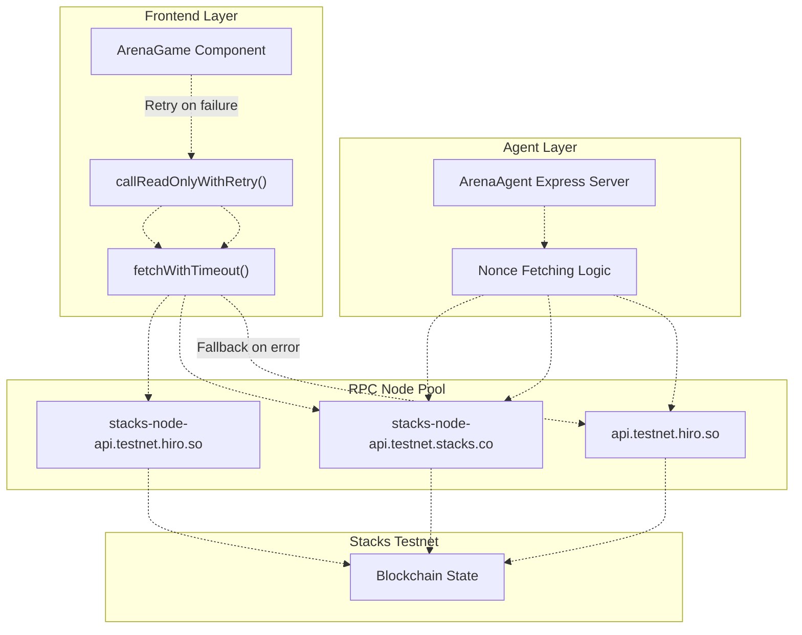
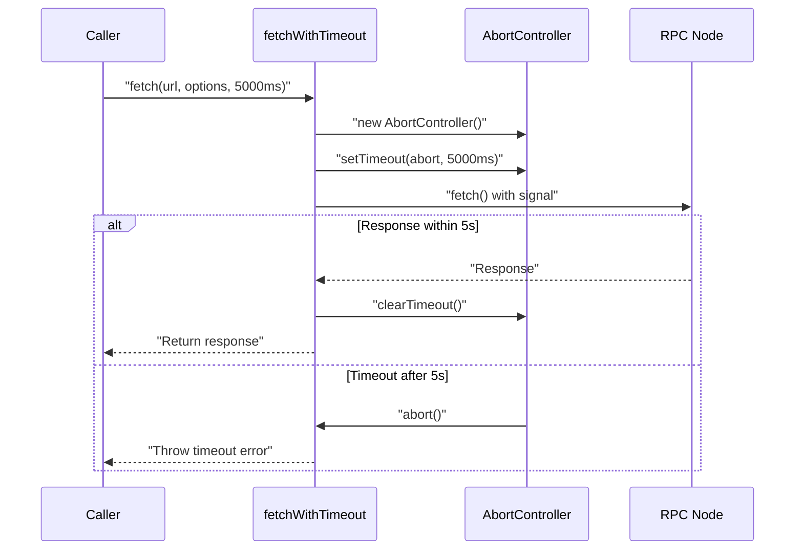
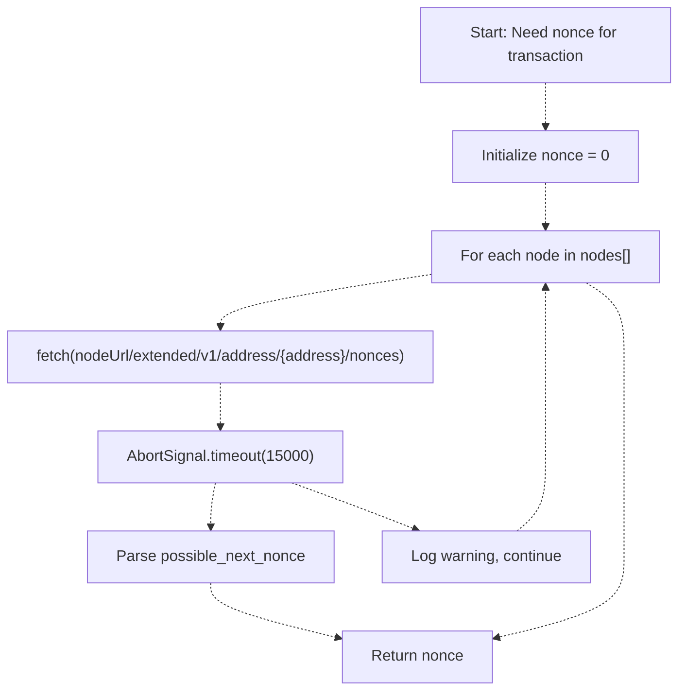
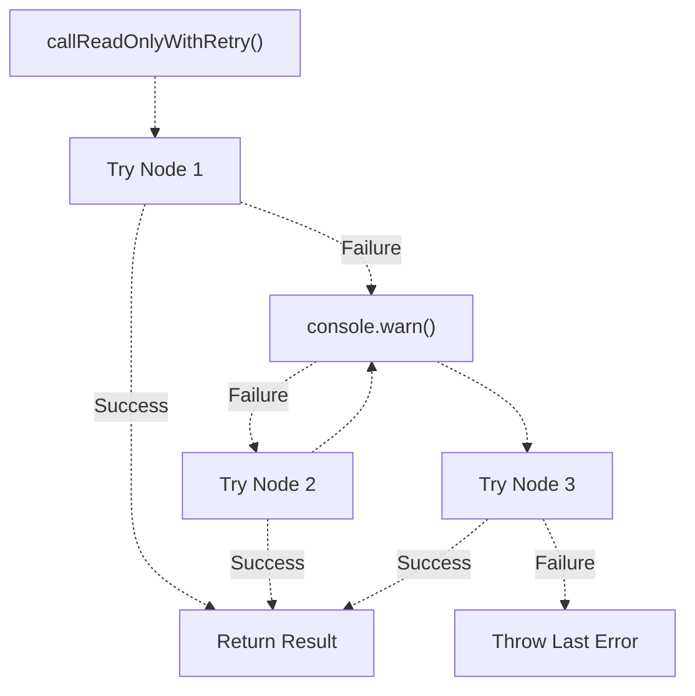
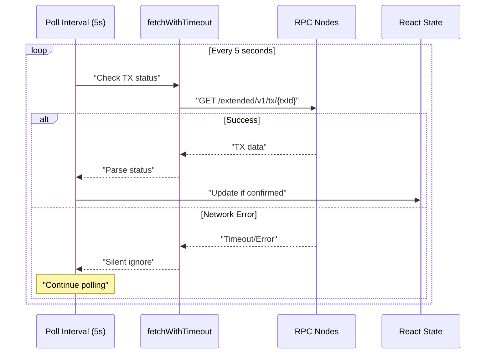

# Multi-Node Failover and Reliability

> **Relevant source files**
> * [README.md](https://github.com/HACK3R-CRYPTO/GameArenaStacks/blob/23ba68fb/README.md)
> * [agent/.env.example](https://github.com/HACK3R-CRYPTO/GameArenaStacks/blob/23ba68fb/agent/.env.example)
> * [agent/src/ArenaAgent.ts](https://github.com/HACK3R-CRYPTO/GameArenaStacks/blob/23ba68fb/agent/src/ArenaAgent.ts)
> * [frontend/src/components/Navigation.jsx](https://github.com/HACK3R-CRYPTO/GameArenaStacks/blob/23ba68fb/frontend/src/components/Navigation.jsx)
> * [frontend/src/pages/ArenaGame.jsx](https://github.com/HACK3R-CRYPTO/GameArenaStacks/blob/23ba68fb/frontend/src/pages/ArenaGame.jsx)

## Purpose and Scope

This document explains the multi-node failover and reliability mechanisms implemented in GameArenaStacks to ensure continuous operation despite RPC node failures, rate limiting, or network interruptions. The system implements automatic node rotation across multiple Stacks testnet API endpoints in both the frontend and agent components.

For information about transaction polling and state synchronization, see [Transaction Management and State Polling](/HACK3R-CRYPTO/GameArenaStacks/2.5-transaction-management-and-state-polling). For details on blockchain integration patterns, see [Stacks Blockchain Integration](/HACK3R-CRYPTO/GameArenaStacks/6-stacks-blockchain-integration).

## High-Level Architecture

GameArenaStacks implements redundant network paths to the Stacks blockchain by maintaining connections to multiple RPC providers. When a primary node fails, the system automatically retries the request against backup nodes without user intervention.



**Sources**: [frontend/src/pages/ArenaGame.jsx L14-L50](https://github.com/HACK3R-CRYPTO/GameArenaStacks/blob/23ba68fb/frontend/src/pages/ArenaGame.jsx#L14-L50)

 [agent/src/ArenaAgent.ts L242-L266](https://github.com/HACK3R-CRYPTO/GameArenaStacks/blob/23ba68fb/agent/src/ArenaAgent.ts#L242-L266)

## Frontend Node Rotation Implementation

### Node Pool Configuration

The frontend maintains an ordered array of Stacks RPC endpoints that are attempted sequentially:

| Priority | Endpoint URL | Purpose |
| --- | --- | --- |
| 1 (Primary) | `https://api.testnet.hiro.so` | Hiro's high-availability API service |
| 2 (Backup) | `https://stacks-node-api.testnet.stacks.co` | Official Stacks Foundation node |
| 3 (Tertiary) | `https://stacks-node-api.testnet.hiro.so` | Alternative Hiro node endpoint |

The node pool is defined at [frontend/src/pages/ArenaGame.jsx L27-L32](https://github.com/HACK3R-CRYPTO/GameArenaStacks/blob/23ba68fb/frontend/src/pages/ArenaGame.jsx#L27-L32)

:

```javascript
const STACKS_NODES = [
    'https://api.testnet.hiro.so',
    'https://stacks-node-api.testnet.stacks.co',
    'https://stacks-node-api.testnet.hiro.so'
];
```

### Retry Logic with callReadOnlyWithRetry

The `callReadOnlyWithRetry` function implements the core failover mechanism by iterating through the node pool until a successful response is received:

```

```

Implementation at [frontend/src/pages/ArenaGame.jsx L34-L50](https://github.com/HACK3R-CRYPTO/GameArenaStacks/blob/23ba68fb/frontend/src/pages/ArenaGame.jsx#L34-L50)

:

* **Input**: Standard `callReadOnlyFunction` options object
* **Process**: Sequentially attempts each node URL by creating a new `StacksTestnet` instance with the node's URL
* **Error Handling**: Logs warnings to console for each failed node attempt
* **Output**: Returns the first successful result or throws the last error if all nodes fail

**Sources**: [frontend/src/pages/ArenaGame.jsx L34-L50](https://github.com/HACK3R-CRYPTO/GameArenaStacks/blob/23ba68fb/frontend/src/pages/ArenaGame.jsx#L34-L50)

### Request Timeout Protection

The `fetchWithTimeout` utility function prevents indefinite hanging on unresponsive nodes by implementing an abort controller pattern:



Key characteristics at [frontend/src/pages/ArenaGame.jsx L14-L25](https://github.com/HACK3R-CRYPTO/GameArenaStacks/blob/23ba68fb/frontend/src/pages/ArenaGame.jsx#L14-L25)

:

* **Timeout Duration**: 5000ms (5 seconds) default
* **Mechanism**: `AbortController` with `setTimeout`
* **Cleanup**: Always clears timeout to prevent memory leaks
* **Usage**: Wraps all HTTP fetch operations for balance checks and transaction polling

**Sources**: [frontend/src/pages/ArenaGame.jsx L14-L25](https://github.com/HACK3R-CRYPTO/GameArenaStacks/blob/23ba68fb/frontend/src/pages/ArenaGame.jsx#L14-L25)

### Usage Patterns in Frontend

The retry mechanism is used throughout the component for critical read operations:

| Function | Purpose | Lines |
| --- | --- | --- |
| `fetchMatches` | Retrieves match count and details | [frontend/src/pages/ArenaGame.jsx L138-L144](https://github.com/HACK3R-CRYPTO/GameArenaStacks/blob/23ba68fb/frontend/src/pages/ArenaGame.jsx#L138-L144) |
| `fetchMatches` (move queries) | Fetches player moves for matches | [frontend/src/pages/ArenaGame.jsx L159-L227](https://github.com/HACK3R-CRYPTO/GameArenaStacks/blob/23ba68fb/frontend/src/pages/ArenaGame.jsx#L159-L227) |
| `fetchBalance` | Gets user STX balance (with timeout) | [frontend/src/pages/ArenaGame.jsx L108-L122](https://github.com/HACK3R-CRYPTO/GameArenaStacks/blob/23ba68fb/frontend/src/pages/ArenaGame.jsx#L108-L122) |

**Sources**: [frontend/src/pages/ArenaGame.jsx L108-L240](https://github.com/HACK3R-CRYPTO/GameArenaStacks/blob/23ba68fb/frontend/src/pages/ArenaGame.jsx#L108-L240)

## Agent Node Rotation Implementation

### Agent Node Pool

The agent maintains a smaller but equivalent node pool for nonce fetching operations:

```javascript
const nodes = [
    'https://api.testnet.hiro.so',
    'https://stacks-node-api.testnet.stacks.co'
];
```

Location: [agent/src/ArenaAgent.ts L246-L249](https://github.com/HACK3R-CRYPTO/GameArenaStacks/blob/23ba68fb/agent/src/ArenaAgent.ts#L246-L249)

### Nonce Fetching with Fallback

The agent's critical nonce fetching logic implements a similar retry pattern with timeout protection:



Implementation details at [agent/src/ArenaAgent.ts L245-L266](https://github.com/HACK3R-CRYPTO/GameArenaStacks/blob/23ba68fb/agent/src/ArenaAgent.ts#L245-L266)

:

* **Timeout**: 15000ms (15 seconds) per node attempt
* **Mechanism**: `AbortSignal.timeout()` for request cancellation
* **Fallback**: Continues to next node on any error
* **Default**: Returns `0` if all nodes fail (relies on SDK's nonce calculation)
* **Logging**: Uses chalk-colored console warnings for visibility

**Sources**: [agent/src/ArenaAgent.ts L242-L266](https://github.com/HACK3R-CRYPTO/GameArenaStacks/blob/23ba68fb/agent/src/ArenaAgent.ts#L242-L266)

### Agent Network Configuration

The agent also configures its base network instance but uses dynamic node selection for nonce operations:

| Component | Network Instance | Location |
| --- | --- | --- |
| Base Configuration | `new StacksTestnet({ url: 'https://api.testnet.hiro.so' })` | [agent/src/ArenaAgent.ts L42](https://github.com/HACK3R-CRYPTO/GameArenaStacks/blob/23ba68fb/agent/src/ArenaAgent.ts#L42-L42) |
| Nonce Fetching | Dynamic node iteration | [agent/src/ArenaAgent.ts L246-L266](https://github.com/HACK3R-CRYPTO/GameArenaStacks/blob/23ba68fb/agent/src/ArenaAgent.ts#L246-L266) |
| Contract Calls | Uses base network instance | [agent/src/ArenaAgent.ts L162-L165](https://github.com/HACK3R-CRYPTO/GameArenaStacks/blob/23ba68fb/agent/src/ArenaAgent.ts#L162-L165) |

**Sources**: [agent/src/ArenaAgent.ts L42](https://github.com/HACK3R-CRYPTO/GameArenaStacks/blob/23ba68fb/agent/src/ArenaAgent.ts#L42-L42)

 [agent/src/ArenaAgent.ts L151-L183](https://github.com/HACK3R-CRYPTO/GameArenaStacks/blob/23ba68fb/agent/src/ArenaAgent.ts#L151-L183)

## Error Handling Strategy

### Frontend Error Handling

The frontend implements a "warn and continue" strategy for non-critical failures:



Error logging pattern at [frontend/src/pages/ArenaGame.jsx L43-L46](https://github.com/HACK3R-CRYPTO/GameArenaStacks/blob/23ba68fb/frontend/src/pages/ArenaGame.jsx#L43-L46)

:

```
console.warn(`Node ${nodeUrl} failed, trying next...`, e);
lastError = e;
continue;
```

For balance fetching at [frontend/src/pages/ArenaGame.jsx L118-L120](https://github.com/HACK3R-CRYPTO/GameArenaStacks/blob/23ba68fb/frontend/src/pages/ArenaGame.jsx#L118-L120)

:

```
console.warn(`Balance fetch failed for ${nodeUrl}, trying next...`);
```

**Sources**: [frontend/src/pages/ArenaGame.jsx L34-L122](https://github.com/HACK3R-CRYPTO/GameArenaStacks/blob/23ba68fb/frontend/src/pages/ArenaGame.jsx#L34-L122)

### Agent Error Handling

The agent logs more detailed errors with chalk coloring for operational visibility:

```
console.warn(chalk.yellow(`Failed to reach ${nodeUrl}: ${err.message}`));
```

Located at [agent/src/ArenaAgent.ts L263](https://github.com/HACK3R-CRYPTO/GameArenaStacks/blob/23ba68fb/agent/src/ArenaAgent.ts#L263-L263)

### Graceful Degradation

Both components implement graceful degradation strategies:

| Component | Failure Scenario | Behavior |
| --- | --- | --- |
| Frontend | All nodes fail for balance | Silent failure, displays last known balance |
| Frontend | All nodes fail for matches | Logs error, displays empty state |
| Frontend | Transaction polling timeout | Silently ignores, continues next poll cycle |
| Agent | All nodes fail for nonce | Uses `nonce = 0`, relies on SDK calculation |
| Agent | Chain monitoring failure | Silently retries after 20s interval |

**Sources**: [frontend/src/pages/ArenaGame.jsx L237-L239](https://github.com/HACK3R-CRYPTO/GameArenaStacks/blob/23ba68fb/frontend/src/pages/ArenaGame.jsx#L237-L239)

 [agent/src/ArenaAgent.ts L471-L474](https://github.com/HACK3R-CRYPTO/GameArenaStacks/blob/23ba68fb/agent/src/ArenaAgent.ts#L471-L474)

## Polling and Monitoring Integration

### Transaction Polling with Node Failover

The frontend's transaction polling system at [frontend/src/pages/ArenaGame.jsx L256-L298](https://github.com/HACK3R-CRYPTO/GameArenaStacks/blob/23ba68fb/frontend/src/pages/ArenaGame.jsx#L256-L298)

 integrates with node failover through `fetchWithTimeout`:



Key characteristics:

* **Interval**: 5000ms for pending transactions only
* **Endpoint**: Uses single node (Hiro API) with timeout
* **Error Handling**: Silently ignores network errors to avoid spam
* **Cleanup**: Removes transaction from tracking on success/abort

**Sources**: [frontend/src/pages/ArenaGame.jsx L256-L298](https://github.com/HACK3R-CRYPTO/GameArenaStacks/blob/23ba68fb/frontend/src/pages/ArenaGame.jsx#L256-L298)

### Agent Chain Monitoring

The agent's `monitorChain` function at [agent/src/ArenaAgent.ts L330-L475](https://github.com/HACK3R-CRYPTO/GameArenaStacks/blob/23ba68fb/agent/src/ArenaAgent.ts#L330-L475)

 runs continuously with silent error recovery:

```javascript
setInterval(async () => {
    try {
        // ... monitoring logic ...
    } catch (e) {
        // Silently retry
    }
}, 20000); // 20s cycle
```

**Sources**: [agent/src/ArenaAgent.ts L330-L475](https://github.com/HACK3R-CRYPTO/GameArenaStacks/blob/23ba68fb/agent/src/ArenaAgent.ts#L330-L475)

## Configuration and Maintenance

### Environment Configuration

The system's node endpoints are hardcoded for testnet but can be extended through environment variables:

| Variable | Component | Current Usage | Location |
| --- | --- | --- | --- |
| `VITE_DEPLOYER_ADDRESS` | Frontend | Contract address | [frontend/src/pages/ArenaGame.jsx L10](https://github.com/HACK3R-CRYPTO/GameArenaStacks/blob/23ba68fb/frontend/src/pages/ArenaGame.jsx#L10-L10) |
| `VITE_AGENT_API_URL` | Frontend | Agent endpoint | [frontend/src/pages/ArenaGame.jsx L12](https://github.com/HACK3R-CRYPTO/GameArenaStacks/blob/23ba68fb/frontend/src/pages/ArenaGame.jsx#L12-L12) |
| `NETWORK_TYPE` | Agent | Network selection | [agent/src/ArenaAgent.ts L41](https://github.com/HACK3R-CRYPTO/GameArenaStacks/blob/23ba68fb/agent/src/ArenaAgent.ts#L41-L41) |
| `CONTRACT_ADDRESS` | Agent | Contract address | [agent/src/ArenaAgent.ts L45](https://github.com/HACK3R-CRYPTO/GameArenaStacks/blob/23ba68fb/agent/src/ArenaAgent.ts#L45-L45) |

**Sources**: [frontend/src/pages/ArenaGame.jsx L10-L12](https://github.com/HACK3R-CRYPTO/GameArenaStacks/blob/23ba68fb/frontend/src/pages/ArenaGame.jsx#L10-L12)

 [agent/src/ArenaAgent.ts L41-L46](https://github.com/HACK3R-CRYPTO/GameArenaStacks/blob/23ba68fb/agent/src/ArenaAgent.ts#L41-L46)

 [agent/.env.example L1-L15](https://github.com/HACK3R-CRYPTO/GameArenaStacks/blob/23ba68fb/agent/.env.example#L1-L15)

### Node Health Considerations

The system does not implement explicit health checks but relies on:

1. **Timeout-based detection**: 5s frontend, 15s agent
2. **Sequential fallback**: Tries next node immediately on failure
3. **No blacklisting**: Failed nodes are re-attempted on next request
4. **Stateless design**: Each request cycle starts fresh from Node 1

### Monitoring Best Practices

For production deployments, consider:

* Monitor console warnings for frequent node failures
* Track success rates per node endpoint
* Add metrics for average response times
* Implement node health checks before request cycles
* Consider dynamic node pool updates based on health

**Sources**: [frontend/src/pages/ArenaGame.jsx L34-L50](https://github.com/HACK3R-CRYPTO/GameArenaStacks/blob/23ba68fb/frontend/src/pages/ArenaGame.jsx#L34-L50)

 [agent/src/ArenaAgent.ts L242-L266](https://github.com/HACK3R-CRYPTO/GameArenaStacks/blob/23ba68fb/agent/src/ArenaAgent.ts#L242-L266)

## Implementation Summary

The multi-node failover system provides:

| Feature | Frontend | Agent |
| --- | --- | --- |
| **Node Pool Size** | 3 nodes | 2 nodes |
| **Retry Mechanism** | `callReadOnlyWithRetry` | Direct loop iteration |
| **Timeout** | 5 seconds | 15 seconds |
| **Error Logging** | `console.warn` | `chalk.yellow` |
| **Fallback Strategy** | Sequential exhaustion | Sequential exhaustion |
| **Default Behavior** | Throw last error | Return `nonce = 0` |

This design ensures the GameArenaStacks platform remains operational even when individual RPC providers experience downtime, rate limiting, or network issues.

**Sources**: [frontend/src/pages/ArenaGame.jsx L14-L50](https://github.com/HACK3R-CRYPTO/GameArenaStacks/blob/23ba68fb/frontend/src/pages/ArenaGame.jsx#L14-L50)

 [agent/src/ArenaAgent.ts L242-L266](https://github.com/HACK3R-CRYPTO/GameArenaStacks/blob/23ba68fb/agent/src/ArenaAgent.ts#L242-L266)

 [README.md L79-L83](https://github.com/HACK3R-CRYPTO/GameArenaStacks/blob/23ba68fb/README.md#L79-L83)