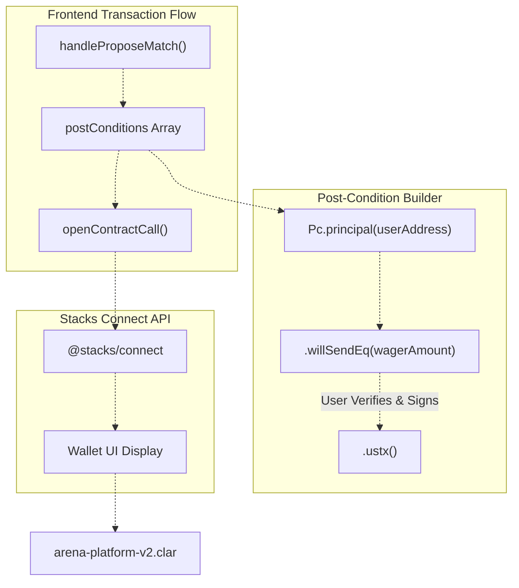
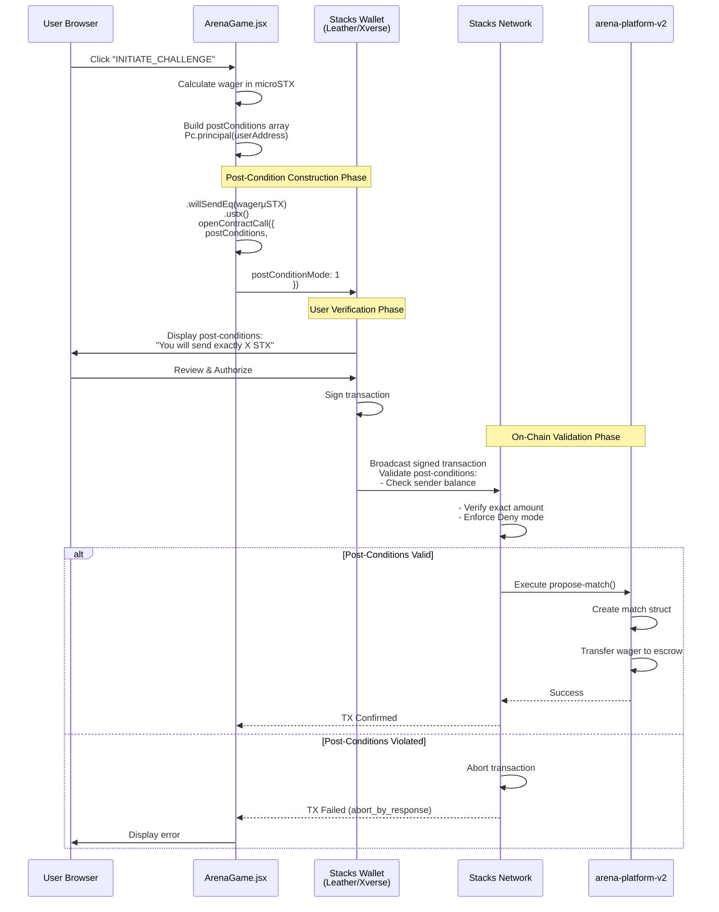
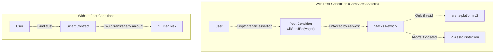

# Post-Conditions and Asset Protection

> **Relevant source files**
> * [README.md](https://github.com/HACK3R-CRYPTO/GameArenaStacks/blob/23ba68fb/README.md)
> * [frontend/src/components/Navigation.jsx](https://github.com/HACK3R-CRYPTO/GameArenaStacks/blob/23ba68fb/frontend/src/components/Navigation.jsx)
> * [frontend/src/pages/ArenaGame.jsx](https://github.com/HACK3R-CRYPTO/GameArenaStacks/blob/23ba68fb/frontend/src/pages/ArenaGame.jsx)

## Purpose and Scope

This page documents the Stacks post-conditions system and its implementation in GameArenaStacks for trustless asset protection during on-chain transactions. Post-conditions are cryptographic assertions that define **exactly** what asset transfers must occur before a transaction is accepted by the network, protecting users from unexpected losses.

For general Stacks blockchain integration patterns, see [Stacks Blockchain Integration](/HACK3R-CRYPTO/GameArenaStacks/6-stacks-blockchain-integration). For network reliability strategies, see [Multi-Node Failover and Reliability](/HACK3R-CRYPTO/GameArenaStacks/6.1-multi-node-failover-and-reliability).

---

## Overview: Post-Conditions as Safety Rails

Stacks post-conditions function as **on-chain circuit breakers** that abort transactions if the actual asset transfers diverge from user expectations. In GameArenaStacks, every wagering transaction includes explicit post-conditions that:

1. Define the **exact STX amount** the user will send
2. Specify the **recipient** (the `arena-platform-v2` contract)
3. Enforce **deny mode** to reject any unexpected transfers
4. Display in **wallet UI** for user verification before signing

This eliminates trust assumptions—users can verify their maximum exposure before authorizing any transaction.

**Sources**: [README.md L79-L82](https://github.com/HACK3R-CRYPTO/GameArenaStacks/blob/23ba68fb/README.md#L79-L82)


---

## Post-Condition Construction API

### Core Data Structures

GameArenaStacks uses the `@stacks/transactions` library's `Pc` (Post-Conditions) API to construct assertions. The following table maps the API components to their roles:

| API Component | Type | Purpose | Example Usage |
| --- | --- | --- | --- |
| `Pc.principal(address)` | Factory | Creates principal-based post-condition | `Pc.principal(userAddress)` |
| `.willSendEq(amount)` | Assertion | Asserts exact amount will be sent | `.willSendEq(1000000)` |
| `.ustx()` | Asset Type | Specifies microSTX as asset | `.ustx()` |
| `postConditionMode: 1` | Mode Flag | Enables Deny mode (strict validation) | `postConditionMode: 1` |

**Sources**: [frontend/src/pages/ArenaGame.jsx L309-L328](https://github.com/HACK3R-CRYPTO/GameArenaStacks/blob/23ba68fb/frontend/src/pages/ArenaGame.jsx#L309-L328)

---

## Implementation: Match Proposal Post-Conditions

### Code Entity Mapping



**Diagram: Post-Condition Construction Pipeline**

The `handleProposeMatch` function constructs post-conditions before invoking `openContractCall`. The wallet UI displays these assertions, allowing users to verify the exact STX amount before authorizing.

**Sources**: [frontend/src/pages/ArenaGame.jsx L300-L348](https://github.com/HACK3R-CRYPTO/GameArenaStacks/blob/23ba68fb/frontend/src/pages/ArenaGame.jsx#L300-L348)

---

## Post-Condition Implementation Details

### Match Proposal Transaction

The primary post-condition implementation occurs in `handleProposeMatch`:

```javascript
// Construct post-condition: User will send exactly the wager amount
const postConditions = [
    Pc.principal(userAddress)
        .willSendEq(Math.floor(parseFloat(wager) * 1000000))
        .ustx()
];
```

**Source**: [frontend/src/pages/ArenaGame.jsx L309-L314](https://github.com/HACK3R-CRYPTO/GameArenaStacks/blob/23ba68fb/frontend/src/pages/ArenaGame.jsx#L309-L314)

This creates a **principal-based post-condition** asserting:

* **Who**: `userAddress` (the connected wallet)
* **What**: Exactly `wager * 1,000,000` microSTX
* **Asset**: Native STX (`.ustx()`)

The post-condition is passed to `openContractCall` along with the **Deny mode** flag:

```javascript
await openContractCall({
    contractAddress: DEPLOYER_ADDRESS,
    contractName: 'arena-platform-v2',
    functionName: 'propose-match',
    functionArgs: [...],
    network,
    postConditions,           // Enforced assertions
    postConditionMode: 1,     // Deny mode (strict)
    onFinish: (data) => {...}
});
```

**Source**: [frontend/src/pages/ArenaGame.jsx L317-L339](https://github.com/HACK3R-CRYPTO/GameArenaStacks/blob/23ba68fb/frontend/src/pages/ArenaGame.jsx#L317-L339)

---

## Post-Condition Modes

Stacks supports two post-condition modes:

| Mode | Value | Behavior | Use Case |
| --- | --- | --- | --- |
| **Allow Mode** | `0` | Allows additional asset transfers not covered by post-conditions | Legacy compatibility, multi-party transactions |
| **Deny Mode** | `1` | **Rejects** any asset transfers not explicitly declared in post-conditions | High-security applications, user asset protection |

GameArenaStacks exclusively uses **Deny Mode** (`postConditionMode: 1`) to ensure that **only** the declared wager amount can be transferred, with **no hidden fees or additional transfers**.

**Sources**: [frontend/src/pages/ArenaGame.jsx L328](https://github.com/HACK3R-CRYPTO/GameArenaStacks/blob/23ba68fb/frontend/src/pages/ArenaGame.jsx#L328-L328)

---

## Transaction Lifecycle with Post-Condition Validation



**Diagram: Complete Transaction Flow with Post-Condition Enforcement**

The diagram illustrates three critical phases:

1. **Construction**: Frontend builds post-conditions using `Pc.principal().willSendEq().ustx()`
2. **Verification**: Wallet displays assertions for user authorization
3. **Validation**: Network enforces post-conditions before contract execution

**Sources**: [frontend/src/pages/ArenaGame.jsx L300-L348](https://github.com/HACK3R-CRYPTO/GameArenaStacks/blob/23ba68fb/frontend/src/pages/ArenaGame.jsx#L300-L348)

 [frontend/src/pages/ArenaGame.jsx L256-L298](https://github.com/HACK3R-CRYPTO/GameArenaStacks/blob/23ba68fb/frontend/src/pages/ArenaGame.jsx#L256-L298)

---

## Asset Protection Guarantees

### Wager Protection Matrix

| Transaction Type | Post-Condition Assertion | Protected Against | Validation Point |
| --- | --- | --- | --- |
| **propose-match** | User sends exactly `wagerAmount` μSTX | Contract overcharging, hidden fees | Pre-execution (network) |
| **play-move** | No asset transfer required | N/A | N/A |
| **Prize Distribution** | Enforced by contract logic (98% winner, 2% platform) | Contract bugs, incorrect distribution | Contract execution |

The `propose-match` transaction is the **only user-initiated asset transfer** in the match lifecycle. All subsequent prize distributions are handled by the smart contract's internal logic and protected by Clarity's built-in safety features.

**Sources**: [frontend/src/pages/ArenaGame.jsx L309-L328](https://github.com/HACK3R-CRYPTO/GameArenaStacks/blob/23ba68fb/frontend/src/pages/ArenaGame.jsx#L309-L328)

 [README.md L81](https://github.com/HACK3R-CRYPTO/GameArenaStacks/blob/23ba68fb/README.md#L81-L81)

---

## Move Transactions: No Post-Conditions Required

The `handlePlayMove` function does **not** include post-conditions because it involves **no asset transfer**:

```javascript
await openContractCall({
    contractAddress: DEPLOYER_ADDRESS,
    contractName: 'arena-platform-v2',
    functionName: 'play-move',
    functionArgs: [
        Cl.uint(matchId),
        Cl.uint(move)
    ],
    network,
    // No postConditions array - no assets transferred
    onFinish: (data) => {...}
});
```

**Source**: [frontend/src/pages/ArenaGame.jsx L447-L482](https://github.com/HACK3R-CRYPTO/GameArenaStacks/blob/23ba68fb/frontend/src/pages/ArenaGame.jsx#L447-L482)

This demonstrates **selective post-condition usage**—only transactions that transfer user assets require explicit protection.

---

## Wallet UI Integration

Post-conditions are automatically displayed in the Stacks wallet UI during transaction authorization. The user sees:

```yaml
Transaction Details
-------------------
Contract: ST3273...AR0MA.arena-platform-v2
Function: propose-match

Post-Conditions:
✓ You will send exactly 0.1000000 STX

[Reject]  [Approve]
```

This **transparent UI** ensures users can:

1. Verify the exact amount before signing
2. Detect unexpected transfers
3. Reject suspicious transactions

The post-condition display is generated automatically by the wallet from the `postConditions` array provided by `openContractCall`.

**Sources**: [frontend/src/pages/ArenaGame.jsx L317-L339](https://github.com/HACK3R-CRYPTO/GameArenaStacks/blob/23ba68fb/frontend/src/pages/ArenaGame.jsx#L317-L339)


---

## Post-Condition Validation Errors

When a transaction violates post-conditions, the Stacks network returns an `abort_by_response` status. The frontend's transaction polling logic detects this:

```javascript
if (txData.tx_status === 'success' || txData.tx_status === 'abort_by_response') {
    if (txData.tx_status === 'success') {
        toast.success(`Transaction Confirmed!`, { id: pending.txId });
    } else {
        toast.error(`Transaction Failed: ${txData.tx_result?.repr || 'Aborted'}`);
    }
    // Cleanup pending transaction
    setPendingTxs(prev => { ... });
}
```

**Source**: [frontend/src/pages/ArenaGame.jsx L274-L289](https://github.com/HACK3R-CRYPTO/GameArenaStacks/blob/23ba68fb/frontend/src/pages/ArenaGame.jsx#L274-L289)

Common post-condition violations include:

* Insufficient balance to cover the declared amount
* Contract attempting to transfer more than asserted
* Unexpected additional asset transfers in Deny mode

---

## Comparison: Agent Transactions vs User Transactions

| Actor | Transaction Type | Post-Conditions Used | Rationale |
| --- | --- | --- | --- |
| **User** | `propose-match` | **Yes** - Exact wager amount | User asset protection |
| **User** | `play-move` | **No** | No asset transfer |
| **Agent** | `accept-match` | **Optional** (implementation-dependent) | Agent's own wallet protection |
| **Agent** | `play-move` | **Optional** (implementation-dependent) | Agent's own wallet protection |

The agent's transaction construction in [agent/src/ArenaAgent.ts](https://github.com/HACK3R-CRYPTO/GameArenaStacks/blob/23ba68fb/agent/src/ArenaAgent.ts)

 does not explicitly show post-condition usage, suggesting the agent trusts the contract logic or implements protection at a different layer. This is acceptable because:

1. The agent is an **autonomous actor**, not requiring UI-based verification
2. The contract's Clarity code already enforces correct prize distribution
3. The agent can validate on-chain state before transacting

**Sources**: [frontend/src/pages/ArenaGame.jsx L300-L482](https://github.com/HACK3R-CRYPTO/GameArenaStacks/blob/23ba68fb/frontend/src/pages/ArenaGame.jsx#L300-L482)

 [agent/src/ArenaAgent.ts L1-L800](https://github.com/HACK3R-CRYPTO/GameArenaStacks/blob/23ba68fb/agent/src/ArenaAgent.ts#L1-L800)

---

## Security Implications

### Trustless Asset Protection

Post-conditions transform GameArenaStacks from a **trust-based** to a **trustless** system:



**Diagram: Trust Model Comparison**

Post-conditions provide **cryptographic enforcement** at the network layer, independent of contract correctness. Even if `arena-platform-v2` contained a bug attempting to over-charge users, the transaction would be rejected by the network.

**Sources**: [README.md L81](https://github.com/HACK3R-CRYPTO/GameArenaStacks/blob/23ba68fb/README.md#L81-L81)


---

## Summary Table: Post-Condition Implementation

| Component | API/Function | Location | Purpose |
| --- | --- | --- | --- |
| **Import** | `Pc` from `@stacks/transactions` | [frontend/src/pages/ArenaGame.jsx L3](https://github.com/HACK3R-CRYPTO/GameArenaStacks/blob/23ba68fb/frontend/src/pages/ArenaGame.jsx#L3-L3) | Post-condition builder API |
| **Construction** | `Pc.principal().willSendEq().ustx()` | [frontend/src/pages/ArenaGame.jsx L310-L313](https://github.com/HACK3R-CRYPTO/GameArenaStacks/blob/23ba68fb/frontend/src/pages/ArenaGame.jsx#L310-L313) | Build exact-amount assertion |
| **Application** | `postConditions` parameter | [frontend/src/pages/ArenaGame.jsx L327](https://github.com/HACK3R-CRYPTO/GameArenaStacks/blob/23ba68fb/frontend/src/pages/ArenaGame.jsx#L327-L327) | Pass to `openContractCall` |
| **Mode** | `postConditionMode: 1` | [frontend/src/pages/ArenaGame.jsx L328](https://github.com/HACK3R-CRYPTO/GameArenaStacks/blob/23ba68fb/frontend/src/pages/ArenaGame.jsx#L328-L328) | Enable Deny mode (strict) |
| **Validation** | Network consensus | N/A (on-chain) | Enforce before execution |
| **Error Handling** | `abort_by_response` detection | [frontend/src/pages/ArenaGame.jsx L274-L278](https://github.com/HACK3R-CRYPTO/GameArenaStacks/blob/23ba68fb/frontend/src/pages/ArenaGame.jsx#L274-L278) | Handle validation failures |

**Sources**: [frontend/src/pages/ArenaGame.jsx L1-L482](https://github.com/HACK3R-CRYPTO/GameArenaStacks/blob/23ba68fb/frontend/src/pages/ArenaGame.jsx#L1-L482)

---

## Integration with x402 Payment Protocol

Post-conditions protect **user-to-contract** transfers, while the x402 protocol handles **user-to-agent** micro-payments. These operate on different layers:

1. **Post-Conditions**: Protect the wagering transaction (`propose-match`) where users send STX to the `arena-platform-v2` escrow
2. **x402 Payments**: Handle separate STX transfers to the agent's wallet for services (match acceptance, move execution)

The x402 payment flow in `handleChallengeAgent` uses `openSTXTransfer` without explicit post-conditions because the amount is pre-negotiated in the HTTP 402 response:

```javascript
await openSTXTransfer({
    recipient: paymentInfo.accepts[0].payTo,
    amount: paymentInfo.accepts[0].amount,    // Pre-negotiated amount
    memo: 'x402 Agent Fee',
    network,
    onFinish: (data) => {...}
});
```

**Source**: [frontend/src/pages/ArenaGame.jsx L371-L389](https://github.com/HACK3R-CRYPTO/GameArenaStacks/blob/23ba68fb/frontend/src/pages/ArenaGame.jsx#L371-L389)

The Stacks wallet inherently protects `openSTXTransfer` by displaying the exact amount and recipient, providing implicit post-condition-like protection.

**Sources**: [frontend/src/pages/ArenaGame.jsx L350-L398](https://github.com/HACK3R-CRYPTO/GameArenaStacks/blob/23ba68fb/frontend/src/pages/ArenaGame.jsx#L350-L398)

---

## Best Practices and Recommendations

### When to Use Post-Conditions

| Scenario | Recommendation | Rationale |
| --- | --- | --- |
| User sending assets to contract | **Always use** | Protects user funds |
| Contract-to-contract internal transfers | **Optional** | Clarity provides safety |
| Read-only function calls | **N/A** | No asset transfer |
| Agent-initiated transactions | **Optional** | Depends on trust model |

### Post-Condition Anti-Patterns

❌ **Avoid**:

* Setting post-conditions for transactions with no asset transfers
* Using Allow mode (`postConditionMode: 0`) without explicit justification
* Omitting post-conditions on user-initiated wager transactions

✓ **Prefer**:

* Deny mode (`postConditionMode: 1`) for all user asset transfers
* Exact amount assertions (`.willSendEq()`) over ranges
* Clear error messaging when post-conditions fail

**Sources**: [frontend/src/pages/ArenaGame.jsx L309-L328](https://github.com/HACK3R-CRYPTO/GameArenaStacks/blob/23ba68fb/frontend/src/pages/ArenaGame.jsx#L309-L328)

---

## Conclusion

Post-conditions are the **foundational security mechanism** enabling trustless wagering in GameArenaStacks. By enforcing exact asset transfer amounts at the network layer, they eliminate the need to trust the smart contract, frontend, or agent logic. Every user transaction that moves STX includes explicit post-conditions, displayed in the wallet UI and validated on-chain before execution.

This architecture demonstrates **defense in depth**—even if multiple system components fail, post-conditions provide a final safety rail preventing unexpected asset losses.

**Sources**: [frontend/src/pages/ArenaGame.jsx L300-L348](https://github.com/HACK3R-CRYPTO/GameArenaStacks/blob/23ba68fb/frontend/src/pages/ArenaGame.jsx#L300-L348)

 [README.md L79-L82](https://github.com/HACK3R-CRYPTO/GameArenaStacks/blob/23ba68fb/README.md#L79-L82)

