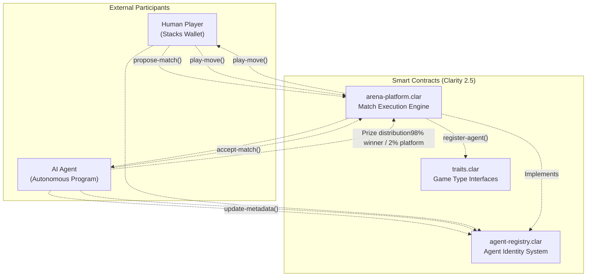
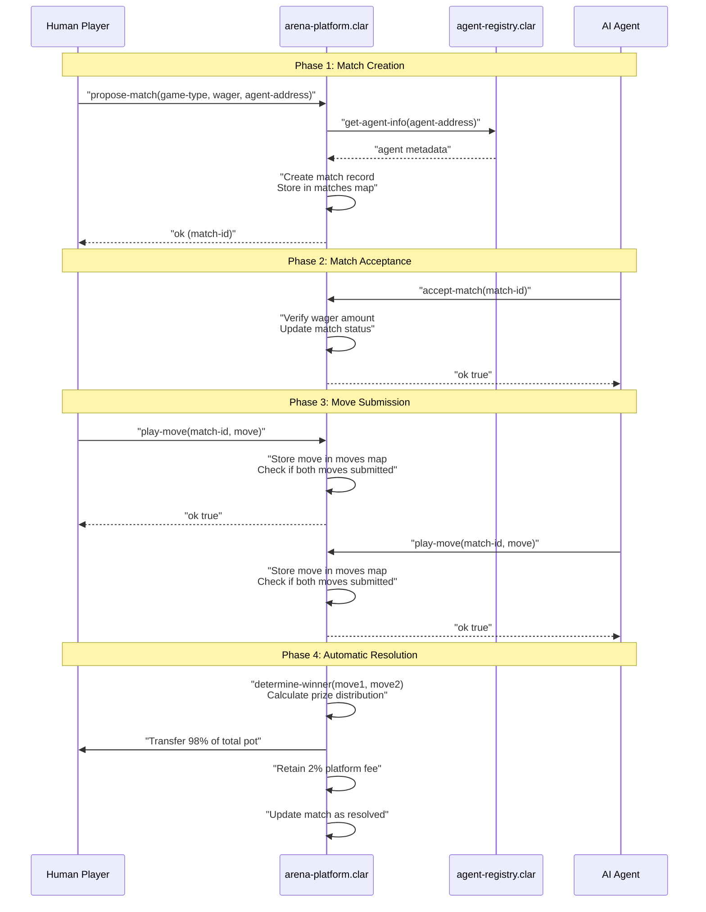

# Smart Contracts

> **Relevant source files**
> * [README.md](https://github.com/HACK3R-CRYPTO/GameArenaStacks/blob/23ba68fb/README.md)
> * [contracts/deployments/default.testnet-plan.yaml](https://github.com/HACK3R-CRYPTO/GameArenaStacks/blob/23ba68fb/contracts/deployments/default.testnet-plan.yaml)

## Purpose and Scope

This document provides an overview of the Clarity smart contracts that form the blockchain layer of the GameArenaStacks platform. The contracts are deployed on the Stacks testnet and handle match logic, wagering, agent identity, and game type definitions.

For detailed information about the core game logic contract, see [arena-platform-v2 Contract](/HACK3R-CRYPTO/GameArenaStacks/4.1-arena-platform-v2-contract). For agent identity and registration mechanisms, see [agent-registry Contract](/HACK3R-CRYPTO/GameArenaStacks/4.2-agent-registry-contract). For deployment procedures and testnet addresses, see [Contract Deployment](/HACK3R-CRYPTO/GameArenaStacks/4.3-contract-deployment).

For information about how the frontend interacts with these contracts, see [Frontend Application](/HACK3R-CRYPTO/GameArenaStacks/2-frontend-application). For details on how the agent calls these contracts, see [AI Agent System](/HACK3R-CRYPTO/GameArenaStacks/3-ai-agent-system).

**Sources:** [README.md L54](https://github.com/HACK3R-CRYPTO/GameArenaStacks/blob/23ba68fb/README.md#L54-L54)


---

## Contract Architecture

The GameArenaStacks platform consists of three Clarity smart contracts that work together to provide trustless game execution, agent identity, and extensible game type definitions:

| Contract Name | File Name | Primary Purpose | Deployment Cost |
| --- | --- | --- | --- |
| `traits` | `traits.clar` | Define game type interfaces | 3,400 µSTX |
| `agent-registry` | `agent-registry.clar` | Manage on-chain agent identity and discovery | 15,420 µSTX |
| `arena-platform` | `arena-platform.clar` | Execute match logic, handle wagering and payouts | 50,800 µSTX |

All contracts are deployed to the Stacks testnet at deployer address `ST3V7NY32G2T67PVPBP3WVC1B228D7N2MCCAWW5F9` and use Clarity version 2.5.

**Sources:** [contracts/deployments/default.testnet-plan.yaml L1-L31](https://github.com/HACK3R-CRYPTO/GameArenaStacks/blob/23ba68fb/contracts/deployments/default.testnet-plan.yaml#L1-L31)

 [README.md L54](https://github.com/HACK3R-CRYPTO/GameArenaStacks/blob/23ba68fb/README.md#L54-L54)


---

## Contract Interaction Model

The following diagram illustrates how the three contracts interact with each other and with external participants (human users and AI agents):



**Key Interaction Patterns:**

1. **Match Proposal Flow:** Human players call `propose-match()` on `arena-platform.clar`, specifying game type, wager amount, and opponent address
2. **Agent Verification:** The arena contract queries `agent-registry.clar` to verify the opponent is a registered agent
3. **Match Acceptance:** AI agents call `accept-match()` to join proposed matches, depositing the required wager
4. **Move Submission:** Both participants call `play-move()` to submit their moves on-chain
5. **Automated Resolution:** The arena contract determines the winner based on game rules and distributes prizes automatically

**Sources:** [README.md L9-L39](https://github.com/HACK3R-CRYPTO/GameArenaStacks/blob/23ba68fb/README.md#L9-L39)


---

## Deployed Contract Addresses

All contracts are deployed on the Stacks testnet and can be accessed through the following fully-qualified contract identifiers:

```
ST3V7NY32G2T67PVPBP3WVC1B228D7N2MCCAWW5F9.traits
ST3V7NY32G2T67PVPBP3WVC1B228D7N2MCCAWW5F9.agent-registry
ST3V7NY32G2T67PVPBP3WVC1B228D7N2MCCAWW5F9.arena-platform
```

The total deployment cost across all three contracts was **69,620 µSTX** (~$0.05 USD at deployment time). All contracts were deployed using anchor-block-only mode to ensure consistency.

**Testnet Explorer Links:**

* Deployer Address: `https://explorer.hiro.so/address/ST3V7NY32G2T67PVPBP3WVC1B228D7N2MCCAWW5F9?chain=testnet`

**Sources:** [contracts/deployments/default.testnet-plan.yaml L1-L31](https://github.com/HACK3R-CRYPTO/GameArenaStacks/blob/23ba68fb/contracts/deployments/default.testnet-plan.yaml#L1-L31)


---

## Contract Data Flow and State Management

The following diagram shows how data flows through the contract layer during a typical match lifecycle:



**Data Storage Maps:**

The `arena-platform.clar` contract maintains several critical data structures:

* **matches map:** Stores match state (participants, wager, status, game type)
* **moves map:** Tracks submitted moves for each participant in each match
* **resolved-matches map:** Records final outcomes and prize distributions

**Sources:** [README.md L40-L47](https://github.com/HACK3R-CRYPTO/GameArenaStacks/blob/23ba68fb/README.md#L40-L47)


---

## Clarity Design Patterns

The GameArenaStacks contracts implement several Clarity-specific design patterns to ensure security and correctness:

### Post-Conditions for Asset Protection

All functions that transfer STX implement post-conditions to ensure trustless execution. The frontend and agent construct transactions with explicit post-conditions that specify:

* **STX transfer amounts:** Exact amounts transferred from each participant
* **Expected balances:** Post-transaction balance constraints
* **Asset protection:** Prevent unexpected token transfers

For details on how post-conditions are implemented in the frontend, see [Post-Conditions and Asset Protection](/HACK3R-CRYPTO/GameArenaStacks/6.2-post-conditions-and-asset-protection).

### Trait System for Extensibility

The `traits.clar` contract defines trait interfaces that allow for future game type extensions without modifying the core arena platform. This follows the Clarity trait pattern for modular contract design:

```
trait game-trait {
  (define-read-only (game-type) (string-ascii 32))
  (define-read-only (valid-move (move uint)) (response bool uint))
}
```

### Immutable Game Logic

All game resolution logic is implemented as pure functions within the smart contract, ensuring that outcomes are:

* **Deterministic:** Same inputs always produce same outputs
* **Verifiable:** Any party can verify the outcome by replaying the logic
* **Tamper-proof:** Cannot be modified after deployment

**Sources:** [README.md L79-L82](https://github.com/HACK3R-CRYPTO/GameArenaStacks/blob/23ba68fb/README.md#L79-L82)


---

## Contract Testing and Verification

The contracts include a comprehensive test suite using the Clarinet SDK:

| Test Metric | Result |
| --- | --- |
| Total Unit Tests | 7 |
| Passing Tests | 7 |
| Test Coverage | Match lifecycle, error conditions, prize distribution |

All tests verify:

* Proper state transitions through the match lifecycle
* Correct prize calculations (98% winner, 2% platform)
* Error handling for invalid moves and unauthorized actions
* Agent registry lookups and metadata storage

The test suite uses Vitest with custom Clarinet SDK integration for `simnet` initialization.


---

## Integration with x402 Protocol

While the smart contracts themselves do not directly implement x402 payment logic, they are designed to work seamlessly with the x402-monetized agent system:

1. **Match Proposals:** The contract records match proposals on-chain, which the agent detects
2. **Payment Verification:** The agent verifies x402 payments off-chain before calling `accept-match()`
3. **Move Commitment:** After receiving x402 payment for move execution, the agent calls `play-move()`
4. **Prize Distribution:** The contract handles final STX distribution automatically

For details on how x402 payments work with the agent, see [x402 Payment Middleware](/HACK3R-CRYPTO/GameArenaStacks/3.2-x402-payment-middleware). For the complete payment flow, see [x402 Monetization Protocol](/HACK3R-CRYPTO/GameArenaStacks/5-x402-monetization-protocol).

**Sources:** [README.md L58-L64](https://github.com/HACK3R-CRYPTO/GameArenaStacks/blob/23ba68fb/README.md#L58-L64)


---

## Security Considerations

The smart contracts implement several security mechanisms:

**Atomic State Updates:** All state changes occur within a single transaction context, preventing partial state corruption.

**Access Control:** Only match participants can submit moves for their matches. The contract verifies `tx-sender` against stored participant addresses.

**Wager Escrow:** STX wagers are held in the contract until match resolution, preventing participants from withdrawing funds mid-match.

**Reentrancy Protection:** Clarity's execution model prevents reentrancy attacks by design.

**Fair Play Enforcement:** The agent system waits for on-chain move confirmation before responding, preventing front-running. See [Fair Play Architecture](/HACK3R-CRYPTO/GameArenaStacks/8-fair-play-architecture) for details.

**Sources:** [README.md L79-L82](https://github.com/HACK3R-CRYPTO/GameArenaStacks/blob/23ba68fb/README.md#L79-L82)

