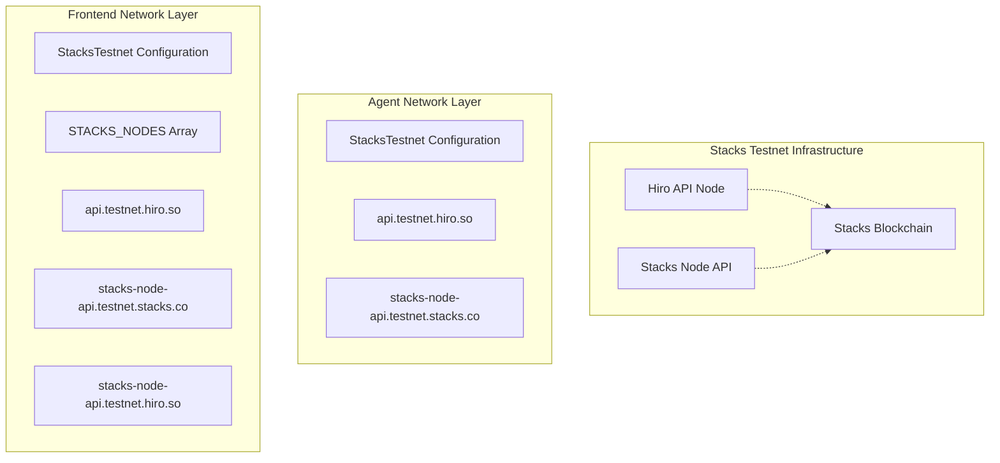
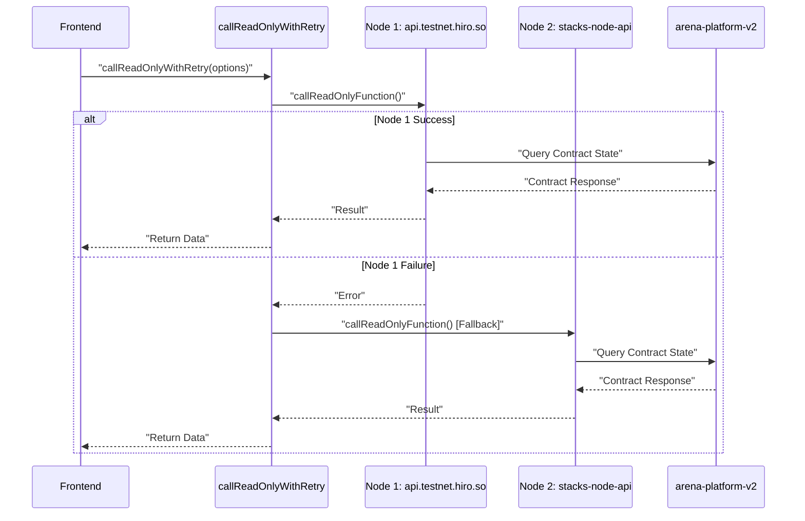
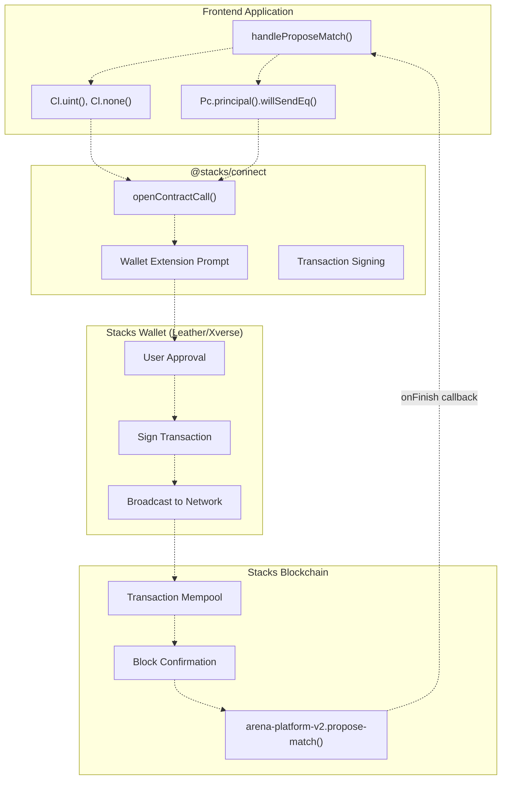
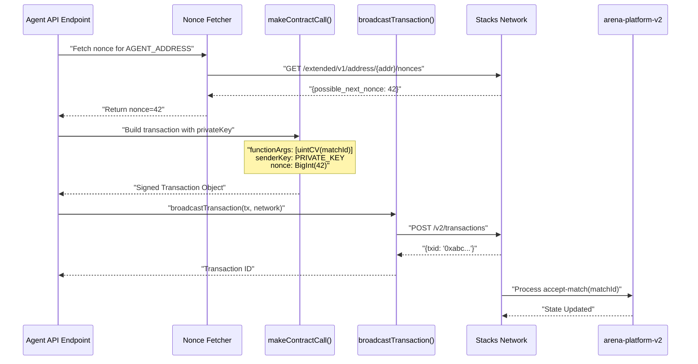
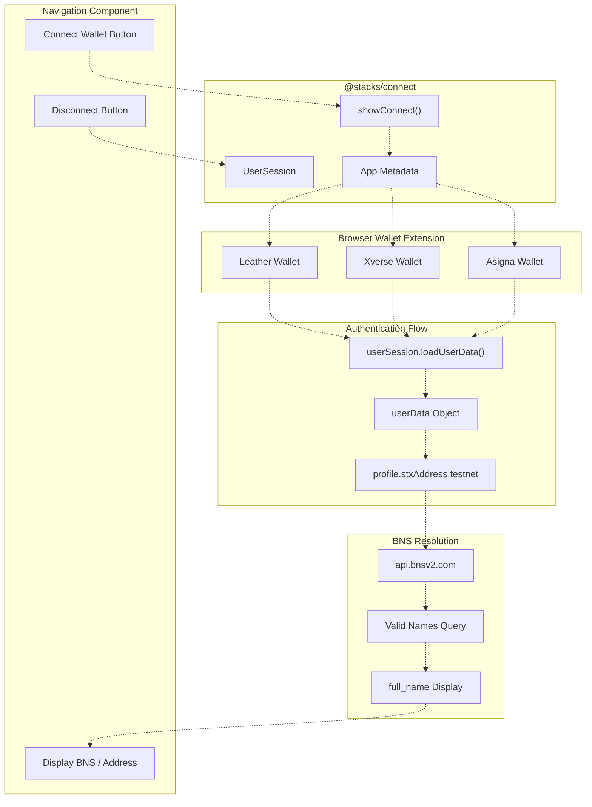
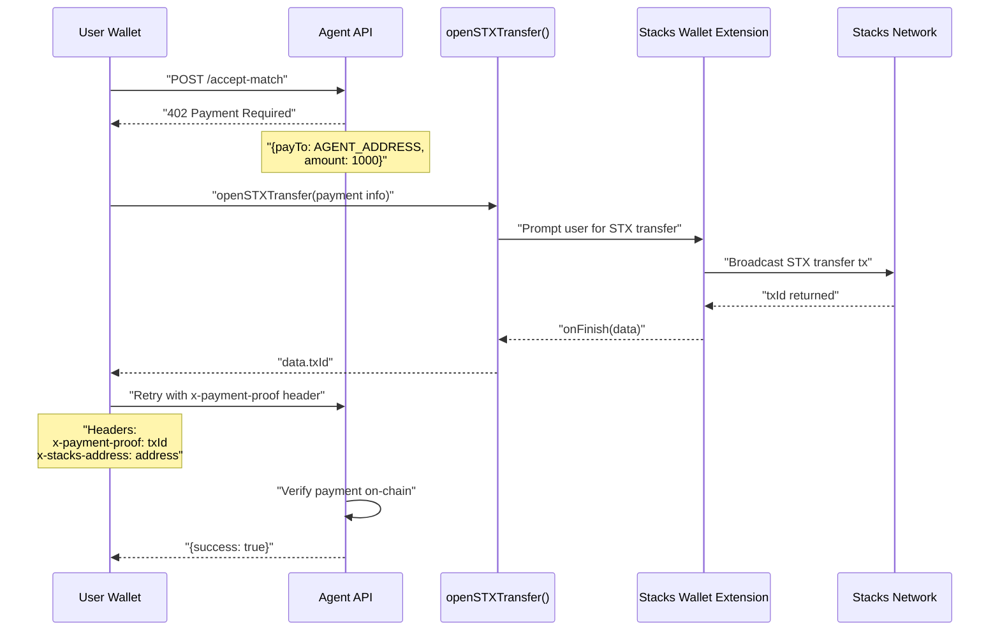
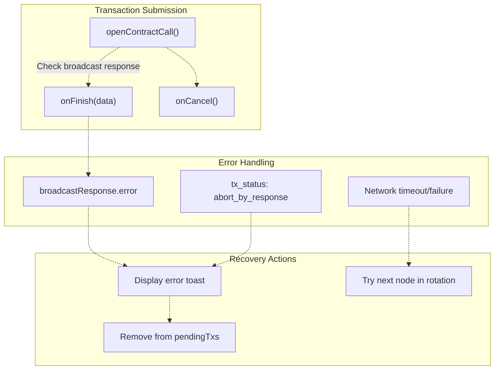

# Stacks Blockchain Integration

> **Relevant source files**
> * [README.md](https://github.com/HACK3R-CRYPTO/GameArenaStacks/blob/23ba68fb/README.md)
> * [agent/.env.example](https://github.com/HACK3R-CRYPTO/GameArenaStacks/blob/23ba68fb/agent/.env.example)
> * [agent/src/ArenaAgent.ts](https://github.com/HACK3R-CRYPTO/GameArenaStacks/blob/23ba68fb/agent/src/ArenaAgent.ts)
> * [frontend/package.json](https://github.com/HACK3R-CRYPTO/GameArenaStacks/blob/23ba68fb/frontend/package.json)
> * [frontend/src/components/Navigation.jsx](https://github.com/HACK3R-CRYPTO/GameArenaStacks/blob/23ba68fb/frontend/src/components/Navigation.jsx)
> * [frontend/src/pages/ArenaGame.jsx](https://github.com/HACK3R-CRYPTO/GameArenaStacks/blob/23ba68fb/frontend/src/pages/ArenaGame.jsx)

## Purpose and Scope

This document describes how GameArenaStacks integrates with the Stacks blockchain for decentralized game logic, wagering, and trustless asset transfers. It covers transaction construction, wallet interactions, contract calls, network configuration, and post-condition enforcement.

For information about the specific smart contract logic and game rules, see [arena-platform-v2 Contract](/HACK3R-CRYPTO/GameArenaStacks/4.1-arena-platform-v2-contract). For multi-node failover and reliability strategies, see [Multi-Node Failover and Reliability](/HACK3R-CRYPTO/GameArenaStacks/6.1-multi-node-failover-and-reliability). For post-condition implementation details, see [Post-Conditions and Asset Protection](/HACK3R-CRYPTO/GameArenaStacks/6.2-post-conditions-and-asset-protection). For x402 payment protocol integration, see [x402 Monetization Protocol](/HACK3R-CRYPTO/GameArenaStacks/5-x402-monetization-protocol).

---

## Core Integration Libraries

GameArenaStacks uses the official Stacks JavaScript SDK to interact with the blockchain. The integration is split between frontend wallet operations and agent autonomous transactions.

### Frontend Dependencies

| Library | Version | Purpose |
| --- | --- | --- |
| `@stacks/connect` | 7.8.3 | Wallet integration and transaction signing |
| `@stacks/transactions` | 6.13.0 | Transaction construction and serialization |
| `@stacks/network` | 6.13.0 | Network configuration and RPC communication |
| `@stacks/common` | 6.13.0 | Common utilities and types |

**Sources:** [frontend/package.json L13-L16](https://github.com/HACK3R-CRYPTO/GameArenaStacks/blob/23ba68fb/frontend/package.json#L13-L16)

### Agent Dependencies

| Library | Version | Purpose |
| --- | --- | --- |
| `@stacks/transactions` | 6.13.0 | Direct transaction construction without wallet |
| `@stacks/network` | 6.13.0 | Network configuration for autonomous operations |

**Sources:** [agent/src/ArenaAgent.ts L6-L19](https://github.com/HACK3R-CRYPTO/GameArenaStacks/blob/23ba68fb/agent/src/ArenaAgent.ts#L6-L19)

---

## Network Configuration and Node Selection



**Network Configuration Schema**

The system instantiates `StacksTestnet` with explicit node URLs for failover support:

```javascript
// Frontend node array
const STACKS_NODES = [
    'https://api.testnet.hiro.so',
    'https://stacks-node-api.testnet.stacks.co',
    'https://stacks-node-api.testnet.hiro.so'
];

// Primary network instance
const network = new StacksTestnet({ url: STACKS_NODES[0] });
```

**Sources:** [frontend/src/pages/ArenaGame.jsx L28-L32](https://github.com/HACK3R-CRYPTO/GameArenaStacks/blob/23ba68fb/frontend/src/pages/ArenaGame.jsx#L28-L32)

 [frontend/src/pages/ArenaGame.jsx L52](https://github.com/HACK3R-CRYPTO/GameArenaStacks/blob/23ba68fb/frontend/src/pages/ArenaGame.jsx#L52-L52)

The agent uses a simpler configuration with manual failback logic:

```javascript
const network = new StacksTestnet({ url: 'https://api.testnet.hiro.so' });
```

**Sources:** [agent/src/ArenaAgent.ts L42](https://github.com/HACK3R-CRYPTO/GameArenaStacks/blob/23ba68fb/agent/src/ArenaAgent.ts#L42-L42)

---

## Transaction Construction Patterns

### Read-Only Contract Calls



The `callReadOnlyWithRetry` function implements automatic failover across multiple Stacks nodes:

```javascript
const callReadOnlyWithRetry = async (options) => {
    let lastError;
    for (const nodeUrl of STACKS_NODES) {
        try {
            const networkWithNode = new StacksTestnet({ url: nodeUrl });
            return await callReadOnlyFunction({
                ...options,
                network: networkWithNode
            });
        } catch (e) {
            console.warn(`Node ${nodeUrl} failed, trying next...`, e);
            lastError = e;
            continue;
        }
    }
    throw lastError;
};
```

**Sources:** [frontend/src/pages/ArenaGame.jsx L34-L50](https://github.com/HACK3R-CRYPTO/GameArenaStacks/blob/23ba68fb/frontend/src/pages/ArenaGame.jsx#L34-L50)

**Key Read-Only Queries:**

| Function Name | Purpose | Return Type |
| --- | --- | --- |
| `get-match-count` | Total matches created | `uint` |
| `get-match-details` | Match metadata and status | `(optional {...})` |
| `get-player-move` | Player's committed move | `(optional uint)` |

**Example: Fetching Match Count**

```javascript
const countResult = await callReadOnlyWithRetry({
    contractAddress: DEPLOYER_ADDRESS,
    contractName: 'arena-platform-v2',
    functionName: 'get-match-count',
    functionArgs: [],
    senderAddress: address,
});

const count = parseInt(cvToJSON(countResult).value);
```

**Sources:** [frontend/src/pages/ArenaGame.jsx L138-L147](https://github.com/HACK3R-CRYPTO/GameArenaStacks/blob/23ba68fb/frontend/src/pages/ArenaGame.jsx#L138-L147)

---

### Write Contract Calls via Stacks Connect



The frontend never handles private keys directly. All write operations use `openContractCall` from `@stacks/connect`, which delegates to browser wallet extensions:

```javascript
await openContractCall({
    contractAddress: DEPLOYER_ADDRESS,
    contractName: 'arena-platform-v2',
    functionName: 'propose-match',
    functionArgs: [
        Cl.none(), // opponent (none for open match)
        Cl.uint(selectedGameType),
        Cl.uint(Math.floor(parseFloat(wager) * 1000000))
    ],
    network,
    postConditions,
    postConditionMode: 1, // Deny mode
    onFinish: (data) => {
        console.log('Match proposed:', data);
        // Handle txId
    },
    onCancel: () => {
        // Handle cancellation
    }
});
```

**Sources:** [frontend/src/pages/ArenaGame.jsx L317-L339](https://github.com/HACK3R-CRYPTO/GameArenaStacks/blob/23ba68fb/frontend/src/pages/ArenaGame.jsx#L317-L339)

**Transaction Argument Construction:**

| Clarity Type | JavaScript Function | Example |
| --- | --- | --- |
| `uint` | `Cl.uint(value)` | `Cl.uint(123456)` |
| `principal` | `Cl.principal(address)` | `Cl.principal("ST1...")` |
| `(optional principal)` | `Cl.none()` / `Cl.some(...)` | `Cl.none()` |
| `bool` | `Cl.bool(value)` | `Cl.bool(true)` |

**Sources:** [frontend/src/pages/ArenaGame.jsx L321-L324](https://github.com/HACK3R-CRYPTO/GameArenaStacks/blob/23ba68fb/frontend/src/pages/ArenaGame.jsx#L321-L324)

---

### Agent Autonomous Transaction Construction



The agent constructs and broadcasts transactions directly without user interaction:

```javascript
// Fetch nonce from network
const nonceResponse = await fetch(`${nodeUrl}/extended/v1/address/${address}/nonces`);
const nonceData = await nonceResponse.json();
const nonce = nonceData.possible_next_nonce || 0;

// Build transaction options
const txOptions = {
    contractAddress: CONTRACT_ADDRESS,
    contractName: CONTRACT_NAME,
    functionName: 'accept-match',
    functionArgs: [uintCV(matchId)],
    senderKey: PRIVATE_KEY,
    validateWithKnownAbi: false,
    network,
    anchorMode: AnchorMode.Any,
    postConditionMode: PostConditionMode.Allow,
};

// Create and broadcast
const transaction = await makeContractCall(txOptions);
const broadcastResponse = await broadcastTransaction(transaction, network);
```

**Sources:** [agent/src/ArenaAgent.ts L151-L172](https://github.com/HACK3R-CRYPTO/GameArenaStacks/blob/23ba68fb/agent/src/ArenaAgent.ts#L151-L172)

**Nonce Fetching with Failover:**

```javascript
const nodes = [
    'https://api.testnet.hiro.so',
    'https://stacks-node-api.testnet.stacks.co'
];

for (const nodeUrl of nodes) {
    try {
        const url = `${nodeUrl}/extended/v1/address/${address}/nonces`;
        const nonceResponse = await fetch(url, { signal: AbortSignal.timeout(15000) });
        if (nonceResponse.ok) {
            const nonceData = await nonceResponse.json();
            nonce = nonceData.possible_next_nonce || 0;
            break; // Success!
        }
    } catch (err) {
        console.warn(`Failed to reach ${nodeUrl}: ${err.message}`);
        continue; // Try next node
    }
}
```

**Sources:** [agent/src/ArenaAgent.ts L246-L266](https://github.com/HACK3R-CRYPTO/GameArenaStacks/blob/23ba68fb/agent/src/ArenaAgent.ts#L246-L266)

---

## Wallet Integration Architecture



**Wallet Connection Initiation:**

```javascript
function connectWallet() {
    showConnect({
        appDetails: {
            name: 'GameArena Stacks',
            icon: window.location.origin + '/logo.png',
        },
        redirectTo: '/',
        onFinish: () => {
            const userDataResult = userSession.loadUserData();
            setUserData(userDataResult);
            
            // Try to fetch BNS name
            const address = userDataResult.profile.stxAddress.testnet;
            getBns(address).then(setBns);
        },
        userSession,
    });
}
```

**Sources:** [frontend/src/components/Navigation.jsx L7-L28](https://github.com/HACK3R-CRYPTO/GameArenaStacks/blob/23ba68fb/frontend/src/components/Navigation.jsx#L7-L28)

**BNS Name Resolution:**

```javascript
async function getBns(stxAddress) {
    try {
        const response = await fetch(
            `https://api.bnsv2.com/testnet/names/address/${stxAddress}/valid`
        );
        const data = await response.json();
        return data.names?.[0]?.full_name || '';
    } catch (error) {
        console.error('Failed to fetch BNS:', error);
        return '';
    }
}
```

**Sources:** [frontend/src/components/Navigation.jsx L36-L45](https://github.com/HACK3R-CRYPTO/GameArenaStacks/blob/23ba68fb/frontend/src/components/Navigation.jsx#L36-L45)

---

## Post-Condition Implementation

Post-conditions are Stacks' mechanism for ensuring trustless asset transfers. They define expected asset movements and cause transactions to abort if violated.

### Post-Condition Construction

```javascript
const postConditions = [
    Pc.principal(userAddress)
        .willSendEq(Math.floor(parseFloat(wager) * 1000000))
        .ustx()
];
```

**Sources:** [frontend/src/pages/ArenaGame.jsx L310-L314](https://github.com/HACK3R-CRYPTO/GameArenaStacks/blob/23ba68fb/frontend/src/pages/ArenaGame.jsx#L310-L314)

This post-condition guarantees:

1. The transaction will **abort** if it attempts to transfer any amount other than the exact wager
2. The user's wallet cannot be drained beyond the specified amount
3. The contract cannot steal funds through unexpected logic paths

### Post-Condition Modes

| Mode | Value | Behavior |
| --- | --- | --- |
| `Allow` | 2 | Allow additional asset transfers not covered by post-conditions |
| `Deny` | 1 | **Reject** any asset transfer not explicitly allowed by post-conditions |

```yaml
postConditionMode: 1, // Deny mode for maximum security
```

**Sources:** [frontend/src/pages/ArenaGame.jsx L328](https://github.com/HACK3R-CRYPTO/GameArenaStacks/blob/23ba68fb/frontend/src/pages/ArenaGame.jsx#L328-L328)

The frontend uses **Deny mode** to ensure no unexpected asset movements can occur during match proposals.

---

## Contract Interaction Mapping

```mermaid
flowchart TD

ProposeMatch["propose-match(opponent, game-type, wager)"]
PlayMove["play-move(match-id, move)"]
GetMatchCount["get-match-count() [Read-Only]"]
GetMatchDetails["get-match-details(match-id) [Read-Only]"]
GetPlayerMove["get-player-move(match-id, player) [Read-Only]"]
AcceptMatch["accept-match(match-id)"]
AgentPlayMove["play-move(match-id, move)"]
ResolveMatch["resolve-match(match-id, winner)"]
AgentReadMatch["get-match-details(match-id) [Read-Only]"]
AgentReadMove["get-player-move(match-id, player) [Read-Only]"]
MatchState["Map: matches"]
MoveState["Map: player-moves"]
MatchCounter["Var: match-counter"]

ProposeMatch -.-> MatchState
ProposeMatch -.-> MatchCounter
AcceptMatch -.-> MatchState
PlayMove -.-> MoveState
AgentPlayMove -.-> MoveState
ResolveMatch -.-> MatchState
GetMatchCount -.-> MatchCounter
GetMatchDetails -.-> MatchState
GetPlayerMove -.-> MoveState
AgentReadMatch -.-> MatchState
AgentReadMove -.-> MoveState

subgraph Contract ["arena-platform-v2.clar"]
    MatchState
    MoveState
    MatchCounter
end

subgraph Agent ["Agent Contract Calls"]
    AcceptMatch
    AgentPlayMove
    ResolveMatch
    AgentReadMatch
    AgentReadMove
end

subgraph Frontend ["Frontend Contract Calls"]
    ProposeMatch
    PlayMove
    GetMatchCount
    GetMatchDetails
    GetPlayerMove
end
```



**Frontend Write Operations:**

| Function | Triggers | Post-Conditions |
| --- | --- | --- |
| `propose-match` | [ArenaGame.jsx L317](https://github.com/HACK3R-CRYPTO/GameArenaStacks/blob/23ba68fb/ArenaGame.jsx#L317-L317) | User sends exact wager amount |
| `play-move` | [ArenaGame.jsx L454](https://github.com/HACK3R-CRYPTO/GameArenaStacks/blob/23ba68fb/ArenaGame.jsx#L454-L454) | None (no asset transfer) |

**Agent Write Operations:**

| Function | Triggers | Post-Conditions |
| --- | --- | --- |
| `accept-match` | [ArenaAgent.ts L151](https://github.com/HACK3R-CRYPTO/GameArenaStacks/blob/23ba68fb/ArenaAgent.ts#L151-L151) | PostConditionMode.Allow |
| `play-move` | [ArenaAgent.ts L268](https://github.com/HACK3R-CRYPTO/GameArenaStacks/blob/23ba68fb/ArenaAgent.ts#L268-L268) | PostConditionMode.Deny |
| `resolve-match` | [ArenaAgent.ts L415](https://github.com/HACK3R-CRYPTO/GameArenaStacks/blob/23ba68fb/ArenaAgent.ts#L415-L415) | PostConditionMode.Deny |

**Sources:** [agent/src/ArenaAgent.ts L151-L172](https://github.com/HACK3R-CRYPTO/GameArenaStacks/blob/23ba68fb/agent/src/ArenaAgent.ts#L151-L172)

 [agent/src/ArenaAgent.ts L268-L286](https://github.com/HACK3R-CRYPTO/GameArenaStacks/blob/23ba68fb/agent/src/ArenaAgent.ts#L268-L286)

 [agent/src/ArenaAgent.ts L415-L428](https://github.com/HACK3R-CRYPTO/GameArenaStacks/blob/23ba68fb/agent/src/ArenaAgent.ts#L415-L428)

---

## Transaction Lifecycle and State Polling

```

```

The system implements the **BitSubs pattern** for efficient transaction tracking:

```javascript
useEffect(() => {
    const pendingIds = Object.keys(pendingTxs);
    if (pendingIds.length === 0) return;

    const txPollInterval = setInterval(async () => {
        for (const matchId of pendingIds) {
            const pending = pendingTxs[matchId];
            if (!pending || !pending.txId) continue;

            const response = await fetchWithTimeout(
                `https://api.testnet.hiro.so/extended/v1/tx/${pending.txId}`
            );
            if (response.ok) {
                const txData = await response.json();
                
                if (txData.tx_status === 'success' || 
                    txData.tx_status === 'abort_by_response') {
                    // Cleanup and refresh
                    setPendingTxs(prev => {
                        const next = { ...prev };
                        delete next[matchId];
                        return next;
                    });
                    fetchMatches();
                    fetchBalance();
                }
            }
        }
    }, 5000); // Poll every 5s for pending transactions

    return () => clearInterval(txPollInterval);
}, [pendingTxs, fetchMatches, fetchBalance]);
```

**Sources:** [frontend/src/pages/ArenaGame.jsx L257-L298](https://github.com/HACK3R-CRYPTO/GameArenaStacks/blob/23ba68fb/frontend/src/pages/ArenaGame.jsx#L257-L298)

**Polling Strategy:**

* **General State**: 60-second intervals for match list and balance [ArenaGame.jsx L247-L254](https://github.com/HACK3R-CRYPTO/GameArenaStacks/blob/23ba68fb/ArenaGame.jsx#L247-L254)
* **Pending Transactions**: 5-second intervals with targeted queries [ArenaGame.jsx L295](https://github.com/HACK3R-CRYPTO/GameArenaStacks/blob/23ba68fb/ArenaGame.jsx#L295-L295)
* **Timeout Protection**: `fetchWithTimeout` with 5-second abort [ArenaGame.jsx L14-L25](https://github.com/HACK3R-CRYPTO/GameArenaStacks/blob/23ba68fb/ArenaGame.jsx#L14-L25)

---

## STX Transfer for x402 Payments



The x402 payment flow uses `openSTXTransfer` for micro-payments to the agent:

```javascript
await openSTXTransfer({
    recipient: paymentInfo.accepts[0].payTo,
    amount: paymentInfo.accepts[0].amount,
    memo: 'x402 Agent Fee',
    network,
    onFinish: (data) => {
        // Retry with payment proof
        setTimeout(() => {
            processRequest({
                'x-payment-proof': data.txId,
                'x-stacks-address': userData.profile.stxAddress.testnet
            });
        }, 2000);
    },
    onCancel: () => {
        toast.error('Payment cancelled - Agent refused match');
    }
});
```

**Sources:** [frontend/src/pages/ArenaGame.jsx L371-L389](https://github.com/HACK3R-CRYPTO/GameArenaStacks/blob/23ba68fb/frontend/src/pages/ArenaGame.jsx#L371-L389)

**Payment Parameters:**

| Parameter | Type | Purpose |
| --- | --- | --- |
| `recipient` | `string` | Agent's Stacks address |
| `amount` | `string` | Micro-STX amount (e.g., "1000") |
| `memo` | `string` | Transaction memo for identification |
| `network` | `StacksTestnet` | Network configuration |

---

## Contract Address Configuration

The system uses environment variables to configure deployed contract addresses:

**Frontend:**

```javascript
const DEPLOYER_ADDRESS = import.meta.env.VITE_DEPLOYER_ADDRESS || 
                         'ST3273FDNHADRB84GK2C0GWQQW9WXZGR1V5GAR0MA';
const ARENA_CONTRACT = `${DEPLOYER_ADDRESS}.arena-platform-v2`;
```

**Sources:** [frontend/src/pages/ArenaGame.jsx L10-L11](https://github.com/HACK3R-CRYPTO/GameArenaStacks/blob/23ba68fb/frontend/src/pages/ArenaGame.jsx#L10-L11)

**Agent:**

```javascript
const CONTRACT_ADDRESS = process.env.CONTRACT_ADDRESS || 
                         'ST3V7NY32G2T67PVPBP3WVC1B228D7N2MCCAWW5F9';
const CONTRACT_NAME = 'arena-platform-v2';
```

**Sources:** [agent/src/ArenaAgent.ts L45-L46](https://github.com/HACK3R-CRYPTO/GameArenaStacks/blob/23ba68fb/agent/src/ArenaAgent.ts#L45-L46)

 [agent/.env.example L9](https://github.com/HACK3R-CRYPTO/GameArenaStacks/blob/23ba68fb/agent/.env.example#L9-L9)

**Deployed Contracts:**

| Contract | Deployer Address |
| --- | --- |
| `arena-platform-v2` | `ST3V7NY32G2T67PVPBP3WVC1B228D7N2MCCAWW5F9` |
| `agent-registry` | `ST3V7NY32G2T67PVPBP3WVC1B228D7N2MCCAWW5F9` |

---

## Error Handling and Transaction Verification



**Agent Transaction Error Handling:**

```javascript
const broadcastResponse = await broadcastTransaction(transaction, network);

if (broadcastResponse.error) {
    console.error(`Broadcast failed: ${broadcastResponse.error} - ${broadcastResponse.reason}`);
    throw new Error(`Broadcast failed: ${broadcastResponse.error}`);
}

res.json({
    success: true,
    txid: broadcastResponse.txid,
    message: 'Match accepted on Stacks'
});
```

**Sources:** [agent/src/ArenaAgent.ts L169-L178](https://github.com/HACK3R-CRYPTO/GameArenaStacks/blob/23ba68fb/agent/src/ArenaAgent.ts#L169-L178)

**Frontend Transaction Polling Error Handling:**

```
if (txData.tx_status === 'success') {
    toast.success(`Transaction Confirmed!`, { id: pending.txId });
} else {
    toast.error(`Transaction Failed: ${txData.tx_result?.repr || 'Aborted'}`);
}
```

**Sources:** [frontend/src/pages/ArenaGame.jsx L275-L279](https://github.com/HACK3R-CRYPTO/GameArenaStacks/blob/23ba68fb/frontend/src/pages/ArenaGame.jsx#L275-L279)

---

**Sources:** [frontend/src/pages/ArenaGame.jsx L1-L1141](https://github.com/HACK3R-CRYPTO/GameArenaStacks/blob/23ba68fb/frontend/src/pages/ArenaGame.jsx#L1-L1141)

 [agent/src/ArenaAgent.ts L1-L482](https://github.com/HACK3R-CRYPTO/GameArenaStacks/blob/23ba68fb/agent/src/ArenaAgent.ts#L1-L482)

 [frontend/src/components/Navigation.jsx L1-L93](https://github.com/HACK3R-CRYPTO/GameArenaStacks/blob/23ba68fb/frontend/src/components/Navigation.jsx#L1-L93)

 [frontend/package.json L1-L37](https://github.com/HACK3R-CRYPTO/GameArenaStacks/blob/23ba68fb/frontend/package.json#L1-L37)

 [agent/.env.example L1-L16](https://github.com/HACK3R-CRYPTO/GameArenaStacks/blob/23ba68fb/agent/.env.example#L1-L16)

 [README.md L1-L86](https://github.com/HACK3R-CRYPTO/GameArenaStacks/blob/23ba68fb/README.md#L1-L86)