# System Architecture

> **Relevant source files**
> * [README.md](https://github.com/HACK3R-CRYPTO/GameArenaStacks/blob/23ba68fb/README.md)
> * [agent/.env.example](https://github.com/HACK3R-CRYPTO/GameArenaStacks/blob/23ba68fb/agent/.env.example)
> * [agent/src/ArenaAgent.ts](https://github.com/HACK3R-CRYPTO/GameArenaStacks/blob/23ba68fb/agent/src/ArenaAgent.ts)
> * [frontend/src/components/Navigation.jsx](https://github.com/HACK3R-CRYPTO/GameArenaStacks/blob/23ba68fb/frontend/src/components/Navigation.jsx)
> * [frontend/src/pages/ArenaGame.jsx](https://github.com/HACK3R-CRYPTO/GameArenaStacks/blob/23ba68fb/frontend/src/pages/ArenaGame.jsx)

## Purpose and Scope

This document describes the technical architecture of GameArenaStacks, a decentralized 1v1 wagering platform. It covers the three-tier system design (Frontend, Agent, Blockchain), component responsibilities, and inter-tier communication protocols including x402 monetization.

For smart contract specifications, see [arena-platform-v2 Contract](/HACK3R-CRYPTO/GameArenaStacks/4.1-arena-platform-v2-contract). For x402 protocol details, see [x402 Monetization Protocol](/HACK3R-CRYPTO/GameArenaStacks/5-x402-monetization-protocol). For agent AI implementation, see [Markov Chain AI Strategy](/HACK3R-CRYPTO/GameArenaStacks/3.3-markov-chain-ai-strategy).

## Three-Tier Architecture Overview

GameArenaStacks implements a layered architecture where each tier has distinct responsibilities and communicates through well-defined interfaces.

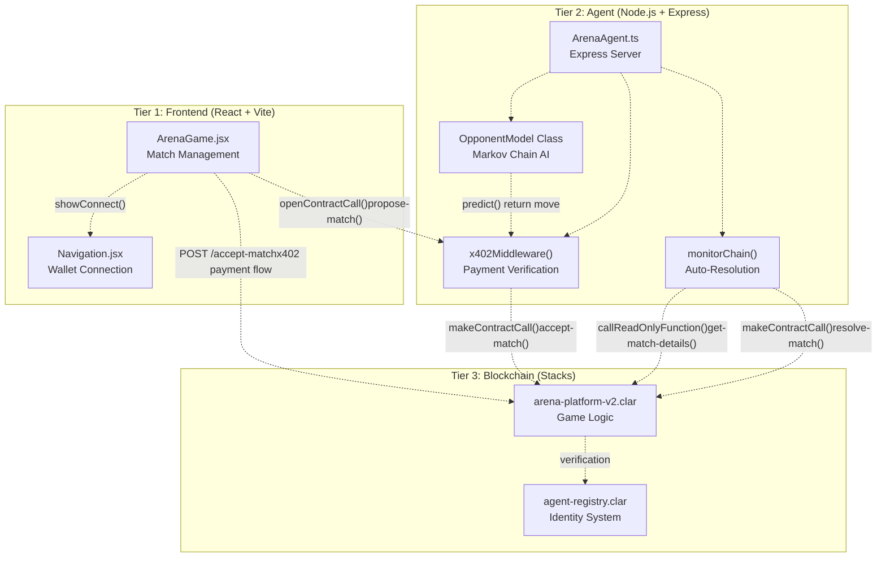

**Sources:** [frontend/src/pages/ArenaGame.jsx L1-L720](https://github.com/HACK3R-CRYPTO/GameArenaStacks/blob/23ba68fb/frontend/src/pages/ArenaGame.jsx#L1-L720)

 [agent/src/ArenaAgent.ts L1-L482](https://github.com/HACK3R-CRYPTO/GameArenaStacks/blob/23ba68fb/agent/src/ArenaAgent.ts#L1-L482)

 [README.md L5-L39](https://github.com/HACK3R-CRYPTO/GameArenaStacks/blob/23ba68fb/README.md#L5-L39)

## Frontend Tier (React Application)

The frontend tier provides user interface and blockchain transaction management through React components and Stacks Connect integration.

### Component Structure

| Component | File Path | Primary Responsibilities |
| --- | --- | --- |
| `ArenaGame` | [frontend/src/pages/ArenaGame.jsx](https://github.com/HACK3R-CRYPTO/GameArenaStacks/blob/23ba68fb/frontend/src/pages/ArenaGame.jsx) | Match proposal, move submission, x402 payment flows, state polling |
| `Navigation` | [frontend/src/components/Navigation.jsx](https://github.com/HACK3R-CRYPTO/GameArenaStacks/blob/23ba68fb/frontend/src/components/Navigation.jsx) | Wallet connection via `showConnect()`, BNS resolution |

### Network Configuration and Resilience

The frontend implements multi-node failover through the `callReadOnlyWithRetry()` function:

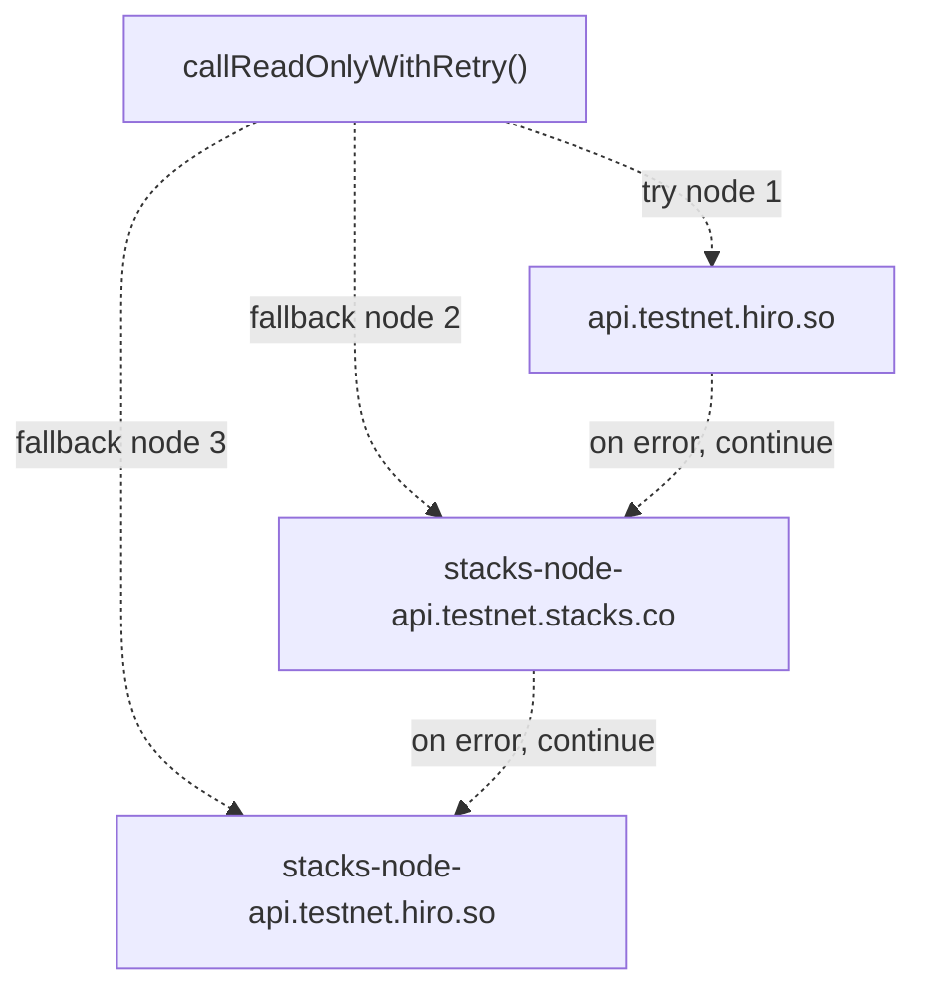

The `STACKS_NODES` array at [frontend/src/pages/ArenaGame.jsx L28-L32](https://github.com/HACK3R-CRYPTO/GameArenaStacks/blob/23ba68fb/frontend/src/pages/ArenaGame.jsx#L28-L32)

 defines available RPC endpoints. The `callReadOnlyWithRetry()` function at [frontend/src/pages/ArenaGame.jsx L34-L50](https://github.com/HACK3R-CRYPTO/GameArenaStacks/blob/23ba68fb/frontend/src/pages/ArenaGame.jsx#L34-L50)

 iterates through nodes until success or exhaustion.

**Sources:** [frontend/src/pages/ArenaGame.jsx L28-L50](https://github.com/HACK3R-CRYPTO/GameArenaStacks/blob/23ba68fb/frontend/src/pages/ArenaGame.jsx#L28-L50)

 [README.md L79-L82](https://github.com/HACK3R-CRYPTO/GameArenaStacks/blob/23ba68fb/README.md#L79-L82)

### Transaction Management (BitSubs Pattern)

The frontend uses targeted transaction polling to track pending operations:

```sql
#mermaid-qjlvd7lwki{font-family:ui-sans-serif,-apple-system,system-ui,Segoe UI,Helvetica;font-size:16px;fill:#333;}@keyframes edge-animation-frame{from{stroke-dashoffset:0;}}@keyframes dash{to{stroke-dashoffset:0;}}#mermaid-qjlvd7lwki .edge-animation-slow{stroke-dasharray:9,5!important;stroke-dashoffset:900;animation:dash 50s linear infinite;stroke-linecap:round;}#mermaid-qjlvd7lwki .edge-animation-fast{stroke-dasharray:9,5!important;stroke-dashoffset:900;animation:dash 20s linear infinite;stroke-linecap:round;}#mermaid-qjlvd7lwki .error-icon{fill:#dddddd;}#mermaid-qjlvd7lwki .error-text{fill:#222222;stroke:#222222;}#mermaid-qjlvd7lwki .edge-thickness-normal{stroke-width:1px;}#mermaid-qjlvd7lwki .edge-thickness-thick{stroke-width:3.5px;}#mermaid-qjlvd7lwki .edge-pattern-solid{stroke-dasharray:0;}#mermaid-qjlvd7lwki .edge-thickness-invisible{stroke-width:0;fill:none;}#mermaid-qjlvd7lwki .edge-pattern-dashed{stroke-dasharray:3;}#mermaid-qjlvd7lwki .edge-pattern-dotted{stroke-dasharray:2;}#mermaid-qjlvd7lwki .marker{fill:#999;stroke:#999;}#mermaid-qjlvd7lwki .marker.cross{stroke:#999;}#mermaid-qjlvd7lwki svg{font-family:ui-sans-serif,-apple-system,system-ui,Segoe UI,Helvetica;font-size:16px;}#mermaid-qjlvd7lwki p{margin:0;}#mermaid-qjlvd7lwki defs #statediagram-barbEnd{fill:#999;stroke:#999;}#mermaid-qjlvd7lwki g.stateGroup text{fill:#dddddd;stroke:none;font-size:10px;}#mermaid-qjlvd7lwki g.stateGroup text{fill:#333;stroke:none;font-size:10px;}#mermaid-qjlvd7lwki g.stateGroup .state-title{font-weight:bolder;fill:#333;}#mermaid-qjlvd7lwki g.stateGroup rect{fill:#ffffff;stroke:#dddddd;}#mermaid-qjlvd7lwki g.stateGroup line{stroke:#999;stroke-width:1;}#mermaid-qjlvd7lwki .transition{stroke:#999;stroke-width:1;fill:none;}#mermaid-qjlvd7lwki .stateGroup .composit{fill:#f4f4f4;border-bottom:1px;}#mermaid-qjlvd7lwki .stateGroup .alt-composit{fill:#e0e0e0;border-bottom:1px;}#mermaid-qjlvd7lwki .state-note{stroke:#e6d280;fill:#fff5ad;}#mermaid-qjlvd7lwki .state-note text{fill:#333;stroke:none;font-size:10px;}#mermaid-qjlvd7lwki .stateLabel .box{stroke:none;stroke-width:0;fill:#ffffff;opacity:0.5;}#mermaid-qjlvd7lwki .edgeLabel .label rect{fill:#ffffff;opacity:0.5;}#mermaid-qjlvd7lwki .edgeLabel{background-color:#ffffff;text-align:center;}#mermaid-qjlvd7lwki .edgeLabel p{background-color:#ffffff;}#mermaid-qjlvd7lwki .edgeLabel rect{opacity:0.5;background-color:#ffffff;fill:#ffffff;}#mermaid-qjlvd7lwki .edgeLabel .label text{fill:#333;}#mermaid-qjlvd7lwki .label div .edgeLabel{color:#333;}#mermaid-qjlvd7lwki .stateLabel text{fill:#333;font-size:10px;font-weight:bold;}#mermaid-qjlvd7lwki .node circle.state-start{fill:#999;stroke:#999;}#mermaid-qjlvd7lwki .node .fork-join{fill:#999;stroke:#999;}#mermaid-qjlvd7lwki .node circle.state-end{fill:#dddddd;stroke:#f4f4f4;stroke-width:1.5;}#mermaid-qjlvd7lwki .end-state-inner{fill:#f4f4f4;stroke-width:1.5;}#mermaid-qjlvd7lwki .node rect{fill:#ffffff;stroke:#dddddd;stroke-width:1px;}#mermaid-qjlvd7lwki .node polygon{fill:#ffffff;stroke:#dddddd;stroke-width:1px;}#mermaid-qjlvd7lwki #statediagram-barbEnd{fill:#999;}#mermaid-qjlvd7lwki .statediagram-cluster rect{fill:#ffffff;stroke:#dddddd;stroke-width:1px;}#mermaid-qjlvd7lwki .cluster-label,#mermaid-qjlvd7lwki .nodeLabel{color:#333;}#mermaid-qjlvd7lwki .statediagram-cluster rect.outer{rx:5px;ry:5px;}#mermaid-qjlvd7lwki .statediagram-state .divider{stroke:#dddddd;}#mermaid-qjlvd7lwki .statediagram-state .title-state{rx:5px;ry:5px;}#mermaid-qjlvd7lwki .statediagram-cluster.statediagram-cluster .inner{fill:#f4f4f4;}#mermaid-qjlvd7lwki .statediagram-cluster.statediagram-cluster-alt .inner{fill:#f8f8f8;}#mermaid-qjlvd7lwki .statediagram-cluster .inner{rx:0;ry:0;}#mermaid-qjlvd7lwki .statediagram-state rect.basic{rx:5px;ry:5px;}#mermaid-qjlvd7lwki .statediagram-state rect.divider{stroke-dasharray:10,10;fill:#f8f8f8;}#mermaid-qjlvd7lwki .note-edge{stroke-dasharray:5;}#mermaid-qjlvd7lwki .statediagram-note rect{fill:#fff5ad;stroke:#e6d280;stroke-width:1px;rx:0;ry:0;}#mermaid-qjlvd7lwki .statediagram-note rect{fill:#fff5ad;stroke:#e6d280;stroke-width:1px;rx:0;ry:0;}#mermaid-qjlvd7lwki .statediagram-note text{fill:#333;}#mermaid-qjlvd7lwki .statediagram-note .nodeLabel{color:#333;}#mermaid-qjlvd7lwki .statediagram .edgeLabel{color:red;}#mermaid-qjlvd7lwki #dependencyStart,#mermaid-qjlvd7lwki #dependencyEnd{fill:#999;stroke:#999;stroke-width:1;}#mermaid-qjlvd7lwki .statediagramTitleText{text-anchor:middle;font-size:18px;fill:#333;}#mermaid-qjlvd7lwki :root{--mermaid-font-family:"trebuchet ms",verdana,arial,sans-serif;}"setPendingTxs()""useEffect() triggered""fetchWithTimeout()""txData.tx_status""tx_status === 'success'""tx_status === 'abort_by_response'""else (pending)""delete pendingTxs[matchId]""delete pendingTxs[matchId]""fetchMatches(), fetchBalance()"PendingTxsPollingIntervalFetchTxStatusCheckStatusSuccessFailedCleanupStateRefreshData
```

The `pendingTxs` state object at [frontend/src/pages/ArenaGame.jsx L101](https://github.com/HACK3R-CRYPTO/GameArenaStacks/blob/23ba68fb/frontend/src/pages/ArenaGame.jsx#L101-L101)

 stores transactions with structure `{ [matchId]: { type: 'user'|'agent', txId: string } }`. The polling logic at [frontend/src/pages/ArenaGame.jsx L256-L298](https://github.com/HACK3R-CRYPTO/GameArenaStacks/blob/23ba68fb/frontend/src/pages/ArenaGame.jsx#L256-L298)

 runs every 5 seconds for targeted updates.

**Sources:** [frontend/src/pages/ArenaGame.jsx L101](https://github.com/HACK3R-CRYPTO/GameArenaStacks/blob/23ba68fb/frontend/src/pages/ArenaGame.jsx#L101-L101)

 [frontend/src/pages/ArenaGame.jsx L256-L298](https://github.com/HACK3R-CRYPTO/GameArenaStacks/blob/23ba68fb/frontend/src/pages/ArenaGame.jsx#L256-L298)

### Key Frontend Functions

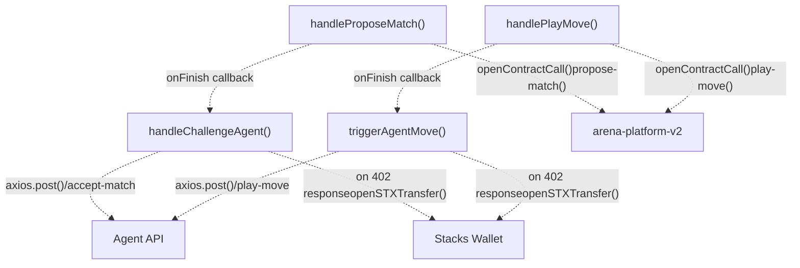

* `handleProposeMatch()` at [frontend/src/pages/ArenaGame.jsx L300-L348](https://github.com/HACK3R-CRYPTO/GameArenaStacks/blob/23ba68fb/frontend/src/pages/ArenaGame.jsx#L300-L348) : Creates match with post-conditions protecting user wager
* `handleChallengeAgent()` at [frontend/src/pages/ArenaGame.jsx L350-L398](https://github.com/HACK3R-CRYPTO/GameArenaStacks/blob/23ba68fb/frontend/src/pages/ArenaGame.jsx#L350-L398) : Implements x402 payment flow with retry logic
* `handlePlayMove()` at [frontend/src/pages/ArenaGame.jsx L447-L482](https://github.com/HACK3R-CRYPTO/GameArenaStacks/blob/23ba68fb/frontend/src/pages/ArenaGame.jsx#L447-L482) : Submits user move on-chain
* `triggerAgentMove()` at [frontend/src/pages/ArenaGame.jsx L401-L445](https://github.com/HACK3R-CRYPTO/GameArenaStacks/blob/23ba68fb/frontend/src/pages/ArenaGame.jsx#L401-L445) : Signals agent to play with x402 payment handling

**Sources:** [frontend/src/pages/ArenaGame.jsx L300-L482](https://github.com/HACK3R-CRYPTO/GameArenaStacks/blob/23ba68fb/frontend/src/pages/ArenaGame.jsx#L300-L482)

## Agent Tier (Node.js Server)

The agent tier implements an autonomous Express server that accepts match challenges, executes AI-driven moves, and monitors the blockchain for resolution opportunities.

### Agent Architecture

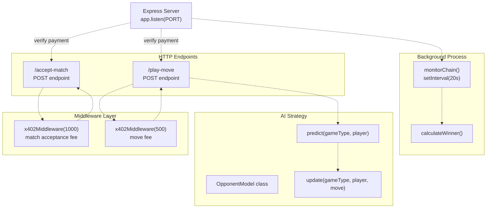

**Sources:** [agent/src/ArenaAgent.ts L26-L481](https://github.com/HACK3R-CRYPTO/GameArenaStacks/blob/23ba68fb/agent/src/ArenaAgent.ts#L26-L481)

### x402 Middleware Implementation

The `x402Middleware()` function at [agent/src/ArenaAgent.ts L109-L140](https://github.com/HACK3R-CRYPTO/GameArenaStacks/blob/23ba68fb/agent/src/ArenaAgent.ts#L109-L140)

 implements HTTP 402 Payment Required responses:

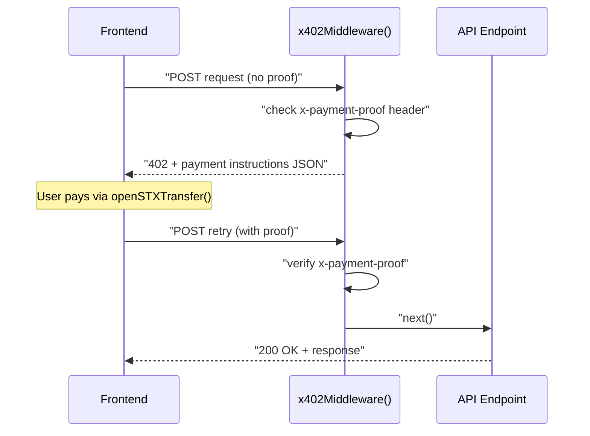

The payment instruction structure at [agent/src/ArenaAgent.ts L116-L128](https://github.com/HACK3R-CRYPTO/GameArenaStacks/blob/23ba68fb/agent/src/ArenaAgent.ts#L116-L128)

 includes:

* `x402Version: 2`
* `accepts[0].scheme: 'direct-payment'`
* `accepts[0].network: 'stacks-testnet'`
* `accepts[0].amount: '1000'` or `'500'`
* `accepts[0].payTo: AGENT_ADDRESS`

**Sources:** [agent/src/ArenaAgent.ts L109-L140](https://github.com/HACK3R-CRYPTO/GameArenaStacks/blob/23ba68fb/agent/src/ArenaAgent.ts#L109-L140)

### OpponentModel Class (Markov Chain)

The `OpponentModel` class at [agent/src/ArenaAgent.ts L63-L102](https://github.com/HACK3R-CRYPTO/GameArenaStacks/blob/23ba68fb/agent/src/ArenaAgent.ts#L63-L102)

 implements first-order Markov Chain learning:

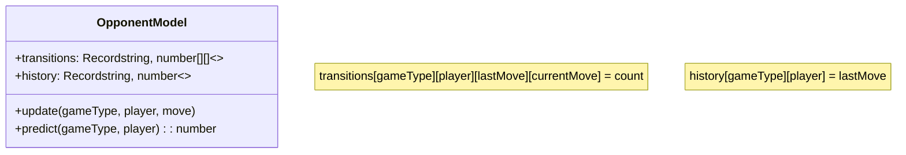

Data structures:

* `transitions`: Tracks move patterns as `gameType → player → lastMove → currentMove → count`
* `history`: Stores most recent move as `gameType → player → lastMove`

Counter-strategies at [agent/src/ArenaAgent.ts L98-L100](https://github.com/HACK3R-CRYPTO/GameArenaStacks/blob/23ba68fb/agent/src/ArenaAgent.ts#L98-L100)

:

* **Rock-Paper-Scissors**: `(predictedMove + 1) % 3` (counter the prediction)
* **Dice Roll**: `Math.random() > 0.3 ? 5 : random` (70% favor rolling 6)
* **Coin Flip**: `Math.random() > 0.5 ? predicted : 1 - predicted` (adaptive)

**Sources:** [agent/src/ArenaAgent.ts L63-L102](https://github.com/HACK3R-CRYPTO/GameArenaStacks/blob/23ba68fb/agent/src/ArenaAgent.ts#L63-L102)

### Chain Monitoring and Auto-Resolution

The `monitorChain()` function at [agent/src/ArenaAgent.ts L330-L475](https://github.com/HACK3R-CRYPTO/GameArenaStacks/blob/23ba68fb/agent/src/ArenaAgent.ts#L330-L475)

 runs every 20 seconds:

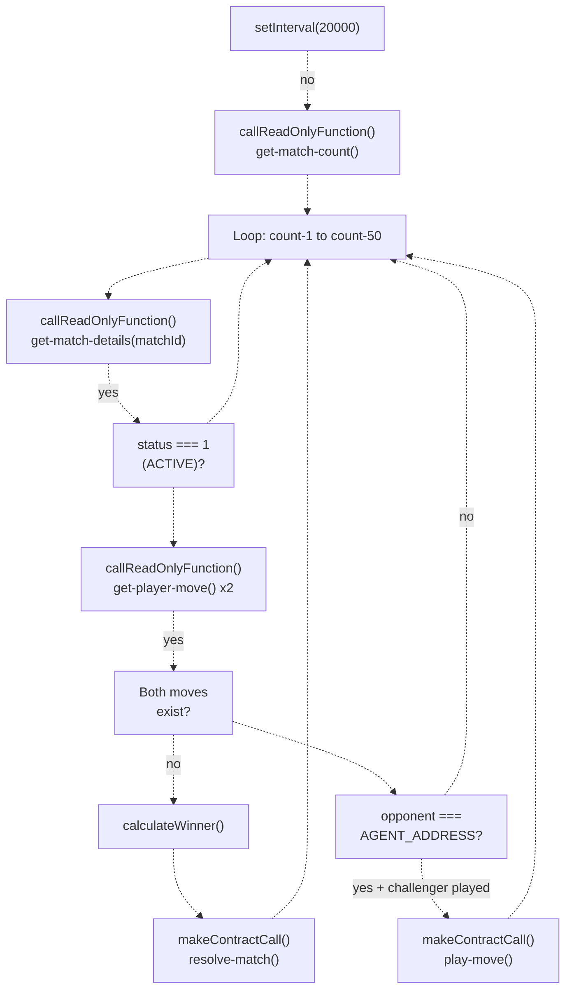

The function scans the last 50 matches to catch any missed due to network latency. Winner calculation at [agent/src/ArenaAgent.ts L305-L327](https://github.com/HACK3R-CRYPTO/GameArenaStacks/blob/23ba68fb/agent/src/ArenaAgent.ts#L305-L327)

 implements game-specific rules.

**Sources:** [agent/src/ArenaAgent.ts L330-L475](https://github.com/HACK3R-CRYPTO/GameArenaStacks/blob/23ba68fb/agent/src/ArenaAgent.ts#L330-L475)

 [agent/src/ArenaAgent.ts L305-L327](https://github.com/HACK3R-CRYPTO/GameArenaStacks/blob/23ba68fb/agent/src/ArenaAgent.ts#L305-L327)

## Blockchain Tier (Clarity Smart Contracts)

The blockchain tier provides immutable game logic and asset custody through Clarity smart contracts deployed on Stacks testnet.

### Contract Deployment

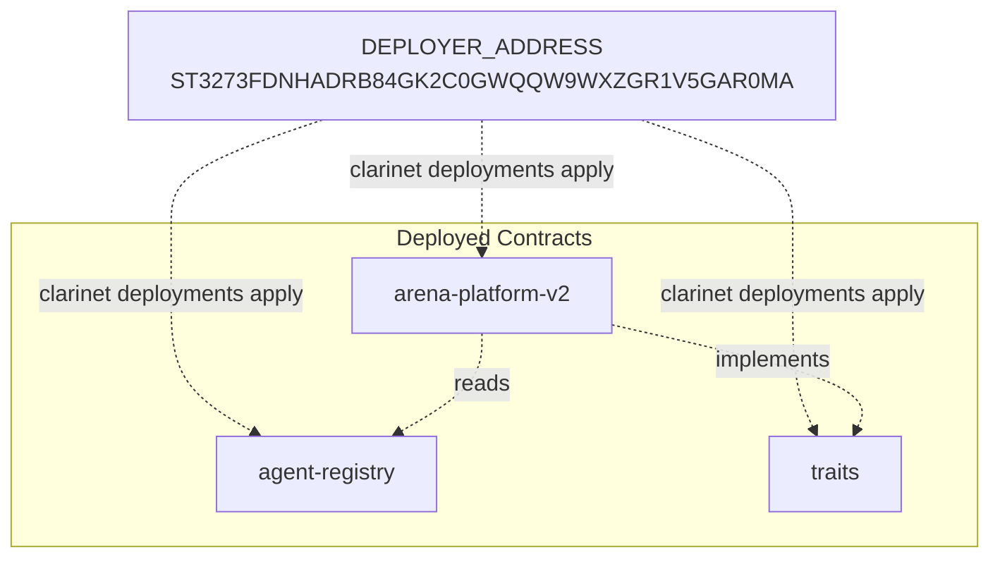

Configuration at [frontend/src/pages/ArenaGame.jsx L10-L11](https://github.com/HACK3R-CRYPTO/GameArenaStacks/blob/23ba68fb/frontend/src/pages/ArenaGame.jsx#L10-L11)

 and [agent/src/ArenaAgent.ts L45-L46](https://github.com/HACK3R-CRYPTO/GameArenaStacks/blob/23ba68fb/agent/src/ArenaAgent.ts#L45-L46)

:

* `DEPLOYER_ADDRESS`: Environment variable or default
* `ARENA_CONTRACT`: `${DEPLOYER_ADDRESS}.arena-platform-v2`
* `CONTRACT_ADDRESS`: Shared deployer address

**Sources:** [frontend/src/pages/ArenaGame.jsx L10-L11](https://github.com/HACK3R-CRYPTO/GameArenaStacks/blob/23ba68fb/frontend/src/pages/ArenaGame.jsx#L10-L11)

 [agent/src/ArenaAgent.ts L45-L46](https://github.com/HACK3R-CRYPTO/GameArenaStacks/blob/23ba68fb/agent/src/ArenaAgent.ts#L45-L46)

 [README.md L80-L81](https://github.com/HACK3R-CRYPTO/GameArenaStacks/blob/23ba68fb/README.md#L80-L81)

### Contract Function Mapping

| Frontend Action | Agent Action | Contract Function | Description |
| --- | --- | --- | --- |
| `handleProposeMatch()` | - | `propose-match(opponent, game-type, wager)` | Creates new match with wager deposit |
| - | `/accept-match` endpoint | `accept-match(match-id)` | Agent accepts and matches wager |
| `handlePlayMove()` | `/play-move` endpoint | `play-move(match-id, move)` | Commits player move |
| - | `monitorChain()` | `resolve-match(match-id, winner)` | Distributes prize to winner |
| `fetchMatches()` | `monitorChain()` | `get-match-details(match-id)` | Reads match state |
| `fetchMatches()` | `monitorChain()` | `get-player-move(match-id, player)` | Reads committed move |
| `fetchMatches()` | - | `get-match-count()` | Gets total match count |

**Sources:** [frontend/src/pages/ArenaGame.jsx L300-L482](https://github.com/HACK3R-CRYPTO/GameArenaStacks/blob/23ba68fb/frontend/src/pages/ArenaGame.jsx#L300-L482)

 [agent/src/ArenaAgent.ts L143-L301](https://github.com/HACK3R-CRYPTO/GameArenaStacks/blob/23ba68fb/agent/src/ArenaAgent.ts#L143-L301)

## Integration Layer: x402 Payment Flow

The x402 protocol enables machine-to-machine micropayments between frontend and agent.

### x402 Complete Handshake

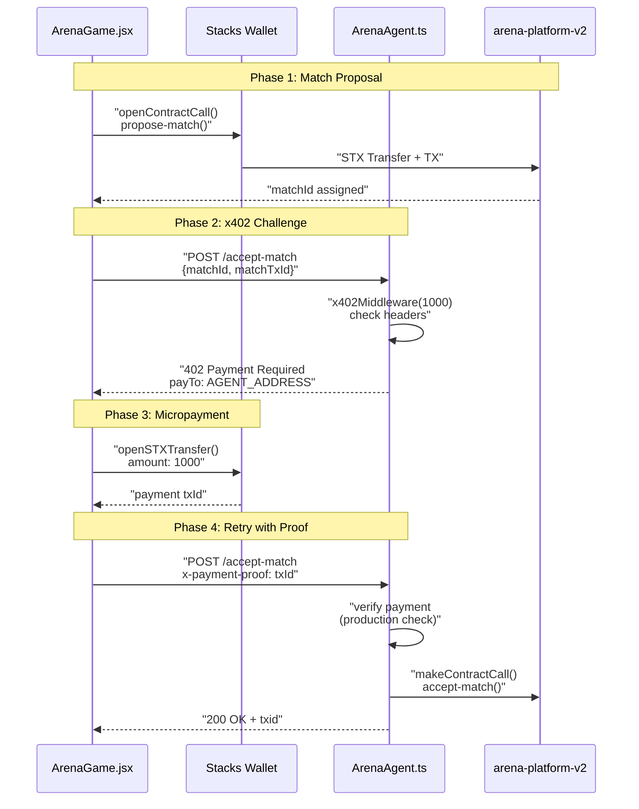

Implementation files:

* Frontend request: [frontend/src/pages/ArenaGame.jsx L353-L398](https://github.com/HACK3R-CRYPTO/GameArenaStacks/blob/23ba68fb/frontend/src/pages/ArenaGame.jsx#L353-L398)
* Agent middleware: [agent/src/ArenaAgent.ts L109-L140](https://github.com/HACK3R-CRYPTO/GameArenaStacks/blob/23ba68fb/agent/src/ArenaAgent.ts#L109-L140)
* Agent endpoint: [agent/src/ArenaAgent.ts L143-L183](https://github.com/HACK3R-CRYPTO/GameArenaStacks/blob/23ba68fb/agent/src/ArenaAgent.ts#L143-L183)

**Sources:** [frontend/src/pages/ArenaGame.jsx L350-L398](https://github.com/HACK3R-CRYPTO/GameArenaStacks/blob/23ba68fb/frontend/src/pages/ArenaGame.jsx#L350-L398)

 [agent/src/ArenaAgent.ts L109-L183](https://github.com/HACK3R-CRYPTO/GameArenaStacks/blob/23ba68fb/agent/src/ArenaAgent.ts#L109-L183)

### Payment Header Protocol

The x402 protocol uses custom HTTP headers:

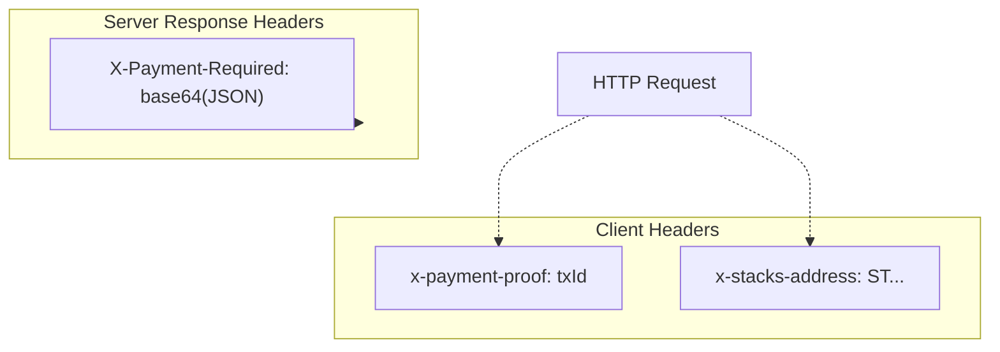

Header definitions:

* `x-payment-proof`: Transaction ID of STX payment at [frontend/src/pages/ArenaGame.jsx L381](https://github.com/HACK3R-CRYPTO/GameArenaStacks/blob/23ba68fb/frontend/src/pages/ArenaGame.jsx#L381-L381)
* `x-stacks-address`: User's testnet address at [frontend/src/pages/ArenaGame.jsx L382](https://github.com/HACK3R-CRYPTO/GameArenaStacks/blob/23ba68fb/frontend/src/pages/ArenaGame.jsx#L382-L382)
* `X-Payment-Required`: Base64-encoded payment instructions at [agent/src/ArenaAgent.ts L130-L132](https://github.com/HACK3R-CRYPTO/GameArenaStacks/blob/23ba68fb/agent/src/ArenaAgent.ts#L130-L132)

The `X402_HEADERS` constant from `x402-stacks` package is imported at [agent/src/ArenaAgent.ts L3-L4](https://github.com/HACK3R-CRYPTO/GameArenaStacks/blob/23ba68fb/agent/src/ArenaAgent.ts#L3-L4)

**Sources:** [frontend/src/pages/ArenaGame.jsx L381-L382](https://github.com/HACK3R-CRYPTO/GameArenaStacks/blob/23ba68fb/frontend/src/pages/ArenaGame.jsx#L381-L382)

 [agent/src/ArenaAgent.ts L3-L4](https://github.com/HACK3R-CRYPTO/GameArenaStacks/blob/23ba68fb/agent/src/ArenaAgent.ts#L3-L4)

 [agent/src/ArenaAgent.ts L130-L132](https://github.com/HACK3R-CRYPTO/GameArenaStacks/blob/23ba68fb/agent/src/ArenaAgent.ts#L130-L132)

## Data Flow: Complete Match Lifecycle

```mermaid
flowchart TD

ProposeMatch["1. User: handleProposeMatch()openContractCall(propose-match)"]
OnChainProposal["2. Contract: match createdstatus = PENDING"]
ChallengeAgent["3. User: handleChallengeAgent()POST /accept-match"]
Payment402["4. Agent: return 402x402Middleware(1000)"]
UserPays["5. User: openSTXTransfer()1000 microSTX to agent"]
RetryWithProof["6. User: retry POSTwith x-payment-proof"]
AgentAccepts["7. Agent: makeContractCall()accept-match()"]
OnChainAccepted["8. Contract: match acceptedstatus = ACTIVE"]
UserMove["9. User: handlePlayMove()openContractCall(play-move)"]
OnChainUserMove["10. Contract: move committed"]
TriggerAgent["11. User: triggerAgentMove()POST /play-move"]
Payment402Move["12. Agent: return 402x402Middleware(500)"]
UserPaysMove["13. User: openSTXTransfer()500 microSTX"]
RetryMove["14. User: retry POSTwith proof"]
FairnessCheck["15. Agent: verify challengerplayed on-chain"]
MarkovPredict["16. Agent: OpponentModel.predict()strategic counter-move"]
AgentMove["17. Agent: makeContractCall()play-move()"]
OnChainAgentMove["18. Contract: both moves committed"]
MonitorDetects["19. monitorChain(): scan matchesdetects both played"]
CalculateWinner["20. calculateWinner()game-specific logic"]
ResolveMatch["21. makeContractCall()resolve-match(winner)"]
OnChainResolved["22. Contract: status = COMPLETEDprize distributed (98%)"]

ProposeMatch -.-> OnChainProposal
OnChainProposal -.-> ChallengeAgent
ChallengeAgent -.-> Payment402
Payment402 -.-> UserPays
UserPays -.-> RetryWithProof
RetryWithProof -.-> AgentAccepts
AgentAccepts -.-> OnChainAccepted
OnChainAccepted -.-> UserMove
UserMove -.-> OnChainUserMove
OnChainUserMove -.-> TriggerAgent
TriggerAgent -.-> Payment402Move
Payment402Move -.-> UserPaysMove
UserPaysMove -.-> RetryMove
RetryMove -.-> FairnessCheck
FairnessCheck -.-> MarkovPredict
MarkovPredict -.-> AgentMove
AgentMove -.-> OnChainAgentMove
OnChainAgentMove -.-> MonitorDetects
MonitorDetects -.-> CalculateWinner
CalculateWinner -.-> ResolveMatch
ResolveMatch -.-> OnChainResolved
```

Key safeguards:

* **Post-Conditions**: [frontend/src/pages/ArenaGame.jsx L310-L314](https://github.com/HACK3R-CRYPTO/GameArenaStacks/blob/23ba68fb/frontend/src/pages/ArenaGame.jsx#L310-L314)  ensures user only sends exact wager amount
* **Fairness Check**: [agent/src/ArenaAgent.ts L194-L224](https://github.com/HACK3R-CRYPTO/GameArenaStacks/blob/23ba68fb/agent/src/ArenaAgent.ts#L194-L224)  verifies challenger played before agent responds
* **Auto-Resolution**: [agent/src/ArenaAgent.ts L392-L434](https://github.com/HACK3R-CRYPTO/GameArenaStacks/blob/23ba68fb/agent/src/ArenaAgent.ts#L392-L434)  prevents manual intervention

**Sources:** [frontend/src/pages/ArenaGame.jsx L300-L482](https://github.com/HACK3R-CRYPTO/GameArenaStacks/blob/23ba68fb/frontend/src/pages/ArenaGame.jsx#L300-L482)

 [agent/src/ArenaAgent.ts L143-L301](https://github.com/HACK3R-CRYPTO/GameArenaStacks/blob/23ba68fb/agent/src/ArenaAgent.ts#L143-L301)

 [agent/src/ArenaAgent.ts L330-L475](https://github.com/HACK3R-CRYPTO/GameArenaStacks/blob/23ba68fb/agent/src/ArenaAgent.ts#L330-L475)

## Configuration and Environment

### Frontend Environment Variables

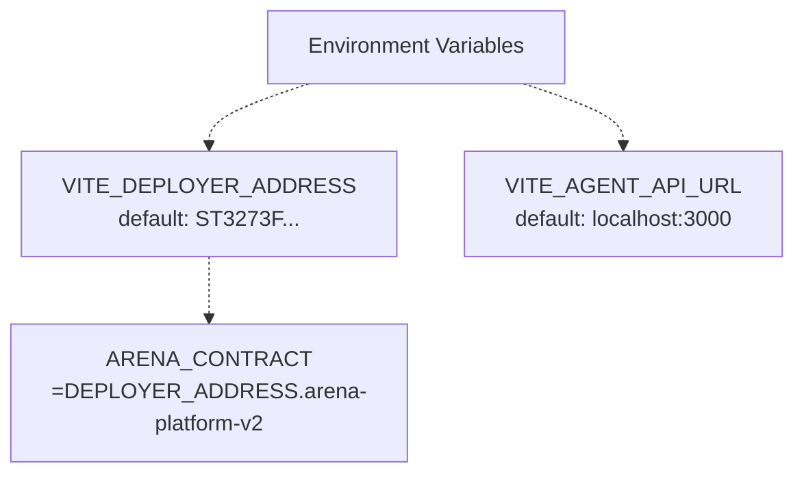

Defined at [frontend/src/pages/ArenaGame.jsx L10-L12](https://github.com/HACK3R-CRYPTO/GameArenaStacks/blob/23ba68fb/frontend/src/pages/ArenaGame.jsx#L10-L12)

:

* `VITE_DEPLOYER_ADDRESS`: Contract deployer principal
* `VITE_AGENT_API_URL`: Agent server base URL

### Agent Environment Variables

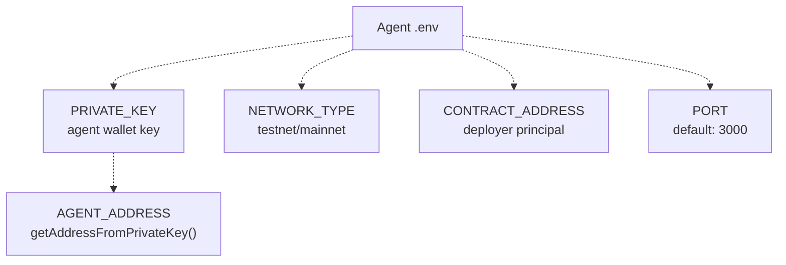

Configuration at [agent/src/ArenaAgent.ts L40-L48](https://github.com/HACK3R-CRYPTO/GameArenaStacks/blob/23ba68fb/agent/src/ArenaAgent.ts#L40-L48)

:

* `PRIVATE_KEY`: Required for signing transactions
* `NETWORK_TYPE`: Determines address version
* `CONTRACT_ADDRESS`: Defaults to testnet deployer
* `PORT`: HTTP server port

Example at [agent/.env.example L1-L16](https://github.com/HACK3R-CRYPTO/GameArenaStacks/blob/23ba68fb/agent/.env.example#L1-L16)

 shows required variables.

**Sources:** [frontend/src/pages/ArenaGame.jsx L10-L12](https://github.com/HACK3R-CRYPTO/GameArenaStacks/blob/23ba68fb/frontend/src/pages/ArenaGame.jsx#L10-L12)

 [agent/src/ArenaAgent.ts L40-L48](https://github.com/HACK3R-CRYPTO/GameArenaStacks/blob/23ba68fb/agent/src/ArenaAgent.ts#L40-L48)

 [agent/.env.example L1-L16](https://github.com/HACK3R-CRYPTO/GameArenaStacks/blob/23ba68fb/agent/.env.example#L1-L16)