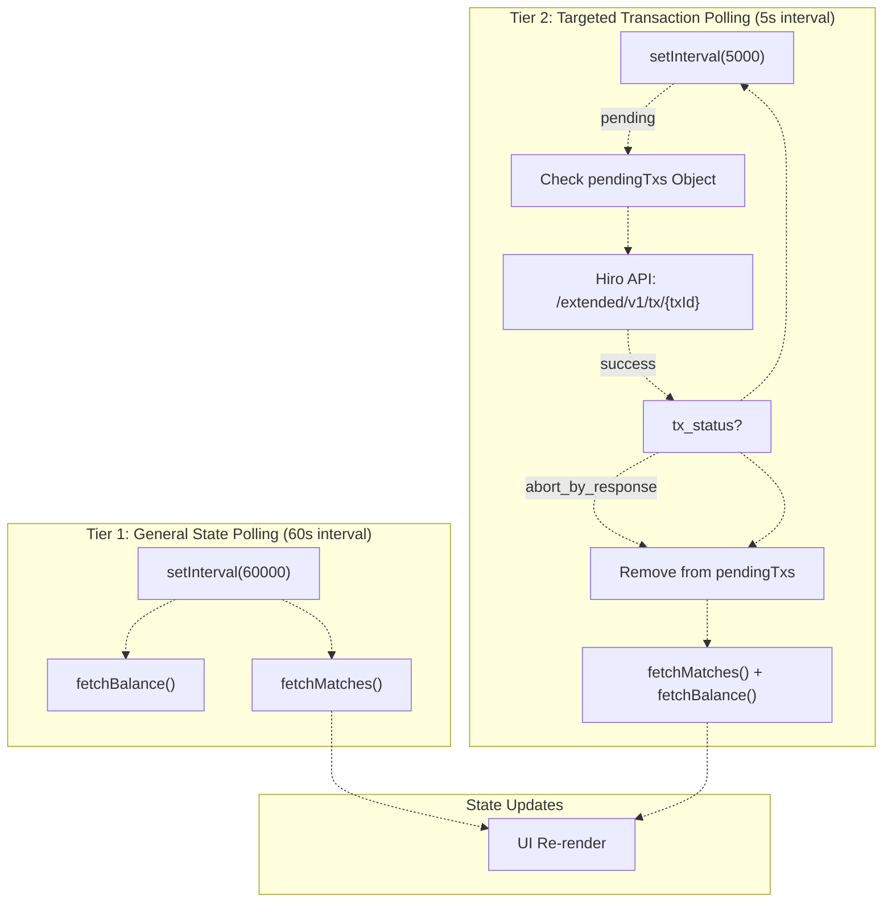
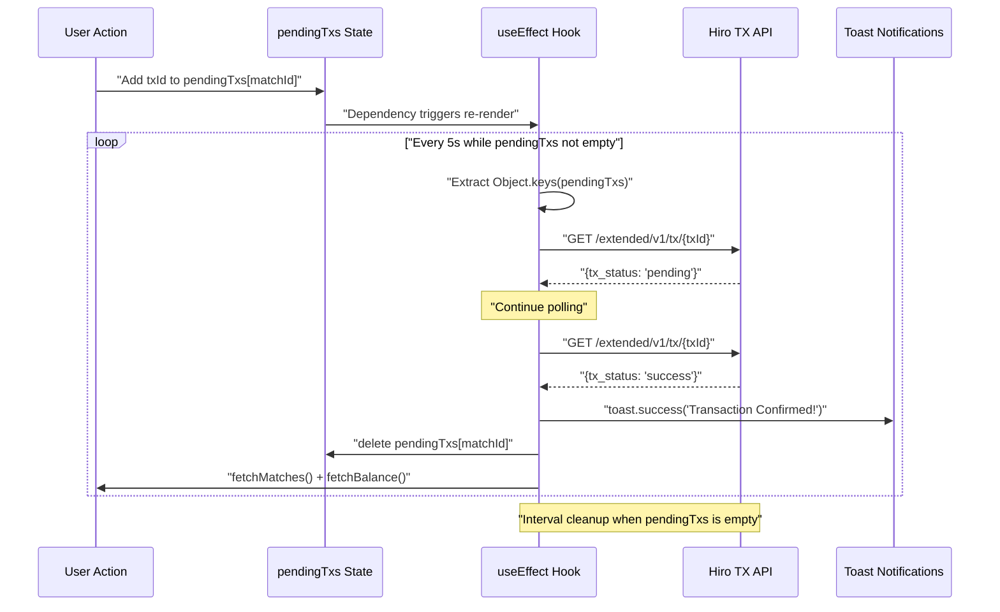
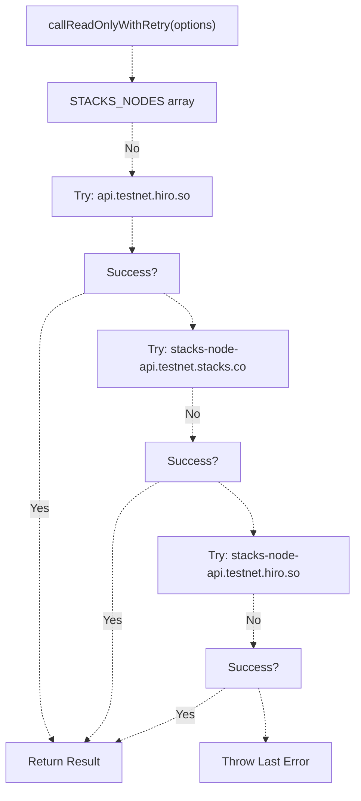
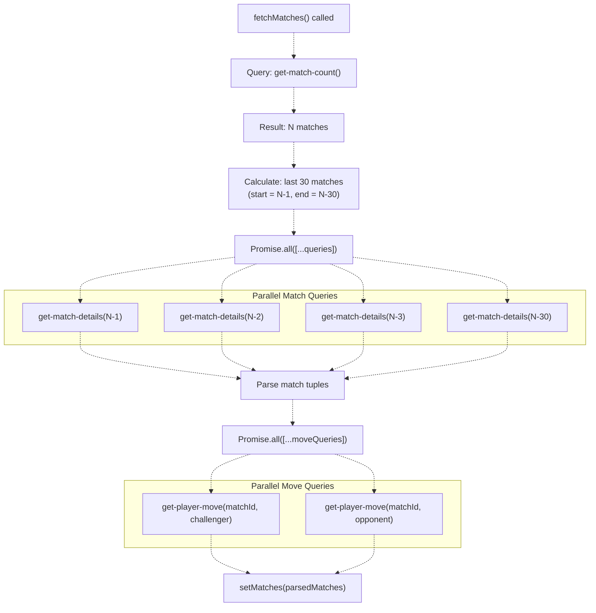
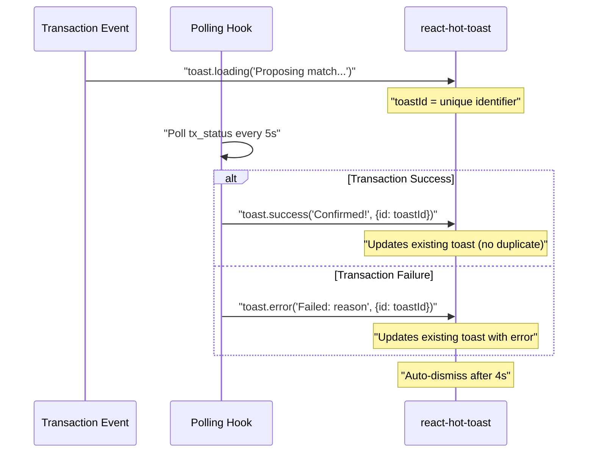

# Transaction Management and State Polling

> **Relevant source files**
> * [README.md](https://github.com/HACK3R-CRYPTO/GameArenaStacks/blob/23ba68fb/README.md)
> * [frontend/src/components/Navigation.jsx](https://github.com/HACK3R-CRYPTO/GameArenaStacks/blob/23ba68fb/frontend/src/components/Navigation.jsx)
> * [frontend/src/pages/ArenaGame.jsx](https://github.com/HACK3R-CRYPTO/GameArenaStacks/blob/23ba68fb/frontend/src/pages/ArenaGame.jsx)

## Purpose and Scope

This document describes the frontend's transaction management system and state synchronization mechanisms. It covers how the application tracks pending blockchain transactions, implements efficient polling strategies to monitor transaction confirmation, and maintains consistency between the UI and on-chain state. The system implements a **BitSubs-inspired pattern** that minimizes RPC calls while ensuring responsive updates.

For wallet integration and transaction signing, see [Wallet Integration and Navigation](/HACK3R-CRYPTO/GameArenaStacks/2.2-wallet-integration-and-navigation). For multi-node failover strategies, see [Multi-Node Failover and Reliability](/HACK3R-CRYPTO/GameArenaStacks/6.1-multi-node-failover-and-reliability). For the complete match state lifecycle, see [Match Lifecycle and State Management](/HACK3R-CRYPTO/GameArenaStacks/9-match-lifecycle-and-state-management).

---

## Transaction State Management

### Pending Transaction Tracking

The frontend maintains a `pendingTxs` state object that tracks all in-flight transactions by match ID:

```yaml
// State structure
pendingTxs: {
  [matchId: string]: {
    type: 'proposal' | 'user' | 'agent',
    txId: string
  }
}
```

**Sources**: [frontend/src/pages/ArenaGame.jsx L101](https://github.com/HACK3R-CRYPTO/GameArenaStacks/blob/23ba68fb/frontend/src/pages/ArenaGame.jsx#L101-L101)

This centralized tracking enables the UI to display transaction status indicators and trigger targeted polling for confirmation. When transactions are initiated through `openContractCall` or `openSTXTransfer`, their `txId` values are captured in the `onFinish` callbacks and stored in this state.

### Transaction Recording Points

| Action | Recording Location | Type Value |
| --- | --- | --- |
| Match Proposal | `handleProposeMatch` onFinish callback | `'proposal'` |
| User Move | `handlePlayMove` onFinish callback | `'user'` |
| Agent Move Response | `triggerAgentMove` response handler | `'agent'` |

**Sources**: [frontend/src/pages/ArenaGame.jsx L332](https://github.com/HACK3R-CRYPTO/GameArenaStacks/blob/23ba68fb/frontend/src/pages/ArenaGame.jsx#L332-L332)

 [frontend/src/pages/ArenaGame.jsx L465](https://github.com/HACK3R-CRYPTO/GameArenaStacks/blob/23ba68fb/frontend/src/pages/ArenaGame.jsx#L465-L465)

 [frontend/src/pages/ArenaGame.jsx L408](https://github.com/HACK3R-CRYPTO/GameArenaStacks/blob/23ba68fb/frontend/src/pages/ArenaGame.jsx#L408-L408)

---

## Polling Architecture: Two-Tier Strategy

### Two-Tier Polling Strategy



**Tier 1: General State Polling** runs every 60 seconds and queries the full match list and user balance. This provides a baseline synchronization with on-chain state and captures changes from other users or agents.

**Tier 2: Targeted Transaction Polling** (BitSubs pattern) runs every 5 seconds but **only for matches with pending transactions**. This aggressive polling is scoped to minimize RPC load while ensuring rapid confirmation feedback.

**Sources**: [frontend/src/pages/ArenaGame.jsx L242-L254](https://github.com/HACK3R-CRYPTO/GameArenaStacks/blob/23ba68fb/frontend/src/pages/ArenaGame.jsx#L242-L254)

 [frontend/src/pages/ArenaGame.jsx L256-L298](https://github.com/HACK3R-CRYPTO/GameArenaStacks/blob/23ba68fb/frontend/src/pages/ArenaGame.jsx#L256-L298)

---

## BitSubs Pattern Implementation

### Targeted Transaction Polling



**Sources**: [frontend/src/pages/ArenaGame.jsx L256-L298](https://github.com/HACK3R-CRYPTO/GameArenaStacks/blob/23ba68fb/frontend/src/pages/ArenaGame.jsx#L256-L298)

### Implementation Details

The BitSubs pattern is implemented using a `useEffect` hook that depends on `pendingTxs`:

```javascript
useEffect(() => {
  const pendingIds = Object.keys(pendingTxs);
  if (pendingIds.length === 0) return;
  
  console.log('📡 Starting Targeted Polling for:', pendingIds);
  
  const txPollInterval = setInterval(async () => {
    for (const matchId of pendingIds) {
      const pending = pendingTxs[matchId];
      if (!pending || !pending.txId) continue;
      
      try {
        const response = await fetchWithTimeout(
          `https://api.testnet.hiro.so/extended/v1/tx/${pending.txId}`
        );
        if (response.ok) {
          const txData = await response.json();
          
          if (txData.tx_status === 'success' || 
              txData.tx_status === 'abort_by_response') {
            // Handle confirmation/failure
            setPendingTxs(prev => {
              const next = { ...prev };
              delete next[matchId];
              return next;
            });
            fetchMatches();
            fetchBalance();
          }
        }
      } catch (e) {
        // Silently ignore network errors during high-frequency polling
      }
    }
  }, 5000);
  
  return () => clearInterval(txPollInterval);
}, [pendingTxs, fetchMatches, fetchBalance]);
```

**Key characteristics**:

* **Conditional activation**: Polling only starts when `pendingIds.length > 0`
* **Auto-cleanup**: Interval is cleared when `pendingTxs` becomes empty
* **Graceful error handling**: Network errors are silently ignored to prevent notification spam
* **State synchronization**: Successful confirmation triggers full state refresh

**Sources**: [frontend/src/pages/ArenaGame.jsx L256-L298](https://github.com/HACK3R-CRYPTO/GameArenaStacks/blob/23ba68fb/frontend/src/pages/ArenaGame.jsx#L256-L298)

---

## Multi-Node Resilience in State Queries

### Node Rotation for Read-Only Calls



**Sources**: [frontend/src/pages/ArenaGame.jsx L27-L50](https://github.com/HACK3R-CRYPTO/GameArenaStacks/blob/23ba68fb/frontend/src/pages/ArenaGame.jsx#L27-L50)

The `callReadOnlyWithRetry` wrapper function iterates through multiple Stacks RPC nodes:

```javascript
const STACKS_NODES = [
  'https://api.testnet.hiro.so',
  'https://stacks-node-api.testnet.stacks.co',
  'https://stacks-node-api.testnet.hiro.so'
];

const callReadOnlyWithRetry = async (options) => {
  let lastError;
  for (const nodeUrl of STACKS_NODES) {
    try {
      const networkWithNode = new StacksTestnet({ url: nodeUrl });
      return await callReadOnlyFunction({
        ...options,
        network: networkWithNode
      });
    } catch (e) {
      console.warn(`Node ${nodeUrl} failed, trying next...`, e);
      lastError = e;
      continue;
    }
  }
  throw lastError;
};
```

This pattern ensures that temporary node failures or rate limiting do not disrupt the UI. All contract queries (`get-match-details`, `get-player-move`, `get-match-count`) use this wrapper.

**Sources**: [frontend/src/pages/ArenaGame.jsx L27-L50](https://github.com/HACK3R-CRYPTO/GameArenaStacks/blob/23ba68fb/frontend/src/pages/ArenaGame.jsx#L27-L50)

### Timeout Protection

The `fetchWithTimeout` utility adds a 5-second timeout to all HTTP requests:

```javascript
const fetchWithTimeout = async (url, options = {}, timeout = 5000) => {
  const controller = new AbortController();
  const id = setTimeout(() => controller.abort(), timeout);
  try {
    const response = await fetch(url, { ...options, signal: controller.signal });
    clearTimeout(id);
    return response;
  } catch (error) {
    clearTimeout(id);
    throw error;
  }
};
```

This prevents hanging requests from blocking the UI thread during high-frequency polling.

**Sources**: [frontend/src/pages/ArenaGame.jsx L14-L25](https://github.com/HACK3R-CRYPTO/GameArenaStacks/blob/23ba68fb/frontend/src/pages/ArenaGame.jsx#L14-L25)

---

## Transaction Lifecycle and State Transitions

### Complete Transaction Flow

```

```

**Sources**: [frontend/src/pages/ArenaGame.jsx L256-L298](https://github.com/HACK3R-CRYPTO/GameArenaStacks/blob/23ba68fb/frontend/src/pages/ArenaGame.jsx#L256-L298)

 [frontend/src/pages/ArenaGame.jsx L329-L338](https://github.com/HACK3R-CRYPTO/GameArenaStacks/blob/23ba68fb/frontend/src/pages/ArenaGame.jsx#L329-L338)

### State Synchronization Table

| Event | Pending State Update | UI Update | Data Refresh |
| --- | --- | --- | --- |
| Transaction Initiated | Add to `pendingTxs` | Show "Processing..." badge | None |
| Transaction Pending | No change | Animate status indicator | None (targeted polling continues) |
| Transaction Confirmed | Remove from `pendingTxs` | Show success toast | `fetchMatches()` + `fetchBalance()` |
| Transaction Failed | Remove from `pendingTxs` | Show error toast with reason | `fetchMatches()` (to reflect rejected state) |

**Sources**: [frontend/src/pages/ArenaGame.jsx L274-L289](https://github.com/HACK3R-CRYPTO/GameArenaStacks/blob/23ba68fb/frontend/src/pages/ArenaGame.jsx#L274-L289)

---

## Global State Fetching

### Match Data Retrieval

The `fetchMatches()` function implements a parallel query strategy to minimize latency:



**Sources**: [frontend/src/pages/ArenaGame.jsx L132-L240](https://github.com/HACK3R-CRYPTO/GameArenaStacks/blob/23ba68fb/frontend/src/pages/ArenaGame.jsx#L132-L240)

### Optimization Strategy

1. **Match Count Query**: Single call to `get-match-count()` determines the total number of matches
2. **Batched Detail Queries**: Up to 30 parallel queries for `get-match-details(i)` using `Promise.all`
3. **Conditional Move Queries**: Only fetch moves for matches that have opponents (status > 0)
4. **Error Resilience**: Individual query failures are caught and logged but don't block other queries

This approach reduces total query time from O(60) sequential calls to O(2-3) parallel batches.

**Sources**: [frontend/src/pages/ArenaGame.jsx L150-L231](https://github.com/HACK3R-CRYPTO/GameArenaStacks/blob/23ba68fb/frontend/src/pages/ArenaGame.jsx#L150-L231)

---

## Notification System Integration

### Toast Notification Lifecycle



**Sources**: [frontend/src/pages/ArenaGame.jsx L274-L279](https://github.com/HACK3R-CRYPTO/GameArenaStacks/blob/23ba68fb/frontend/src/pages/ArenaGame.jsx#L274-L279)

The notification system uses **toast ID reuse** to update existing notifications rather than spawning duplicates:

```javascript
const toastId = toast.loading('Proposing match on-chain...');

// Later, in polling hook:
if (txData.tx_status === 'success') {
  toast.success(`Transaction Confirmed!`, { id: toastId });
} else {
  toast.error(`Transaction Failed: ${txData.tx_result?.repr || 'Aborted'}`, 
             { id: toastId });
}
```

This creates a seamless user experience where a single notification transitions from "loading" → "success/error".

**Sources**: [frontend/src/pages/ArenaGame.jsx L304](https://github.com/HACK3R-CRYPTO/GameArenaStacks/blob/23ba68fb/frontend/src/pages/ArenaGame.jsx#L304-L304)

 [frontend/src/pages/ArenaGame.jsx L276-L278](https://github.com/HACK3R-CRYPTO/GameArenaStacks/blob/23ba68fb/frontend/src/pages/ArenaGame.jsx#L276-L278)

---

## Performance Characteristics

### Polling Load Analysis

| Scenario | Active Intervals | RPC Calls/Minute | Network Load |
| --- | --- | --- | --- |
| No pending transactions | 1 (60s interval) | ~30-50 calls | Low |
| 1 pending transaction | 2 (60s + 5s intervals) | ~40-60 calls | Medium |
| 3 pending transactions | 2 (60s + 5s intervals) | ~60-80 calls | High |

**Key Optimization**: The targeted polling interval polls **all pending transactions** in a single loop iteration, preventing multiplicative scaling of intervals.

**Sources**: [frontend/src/pages/ArenaGame.jsx L263-L295](https://github.com/HACK3R-CRYPTO/GameArenaStacks/blob/23ba68fb/frontend/src/pages/ArenaGame.jsx#L263-L295)

### Memory Management

The `useEffect` cleanup function ensures that intervals are properly destroyed:

```javascript
return () => clearInterval(txPollInterval);
```

This prevents memory leaks and orphaned intervals when the component unmounts or `pendingTxs` changes.

**Sources**: [frontend/src/pages/ArenaGame.jsx L297](https://github.com/HACK3R-CRYPTO/GameArenaStacks/blob/23ba68fb/frontend/src/pages/ArenaGame.jsx#L297-L297)

---

## Error Handling Strategies

### Silent Failure in High-Frequency Polling

During 5-second transaction polling, network errors are intentionally suppressed:

```javascript
try {
  const response = await fetchWithTimeout(...);
  // Process response
} catch (e) {
  // Silently ignore network errors during high-frequency polling
}
```

**Rationale**: Aggressive polling may occasionally encounter transient network failures. Showing error toasts for every failed poll would create notification spam. The system continues polling until success or user intervention.

**Sources**: [frontend/src/pages/ArenaGame.jsx L291-L293](https://github.com/HACK3R-CRYPTO/GameArenaStacks/blob/23ba68fb/frontend/src/pages/ArenaGame.jsx#L291-L293)

### Explicit Failure Handling in User-Initiated Actions

In contrast, user-initiated actions (match proposals, move plays) display explicit error messages:

```
try {
  await openContractCall(...);
} catch (error) {
  console.error(error);
  toast.error('Failed to propose match', { id: toastId });
}
```

This distinction ensures users receive feedback when their actions fail, while background polling remains unobtrusive.

**Sources**: [frontend/src/pages/ArenaGame.jsx L342-L347](https://github.com/HACK3R-CRYPTO/GameArenaStacks/blob/23ba68fb/frontend/src/pages/ArenaGame.jsx#L342-L347)

 [frontend/src/pages/ArenaGame.jsx L476-L480](https://github.com/HACK3R-CRYPTO/GameArenaStacks/blob/23ba68fb/frontend/src/pages/ArenaGame.jsx#L476-L480)

---

## Summary

The transaction management system implements a sophisticated two-tier polling architecture that balances responsiveness with RPC efficiency:

* **General State Polling (60s)**: Maintains baseline synchronization with blockchain state
* **Targeted Transaction Polling (5s)**: Provides rapid feedback for pending user transactions
* **Multi-Node Resilience**: Automatically fails over across three Stacks RPC nodes
* **Parallel Query Batching**: Fetches up to 30 matches concurrently to minimize latency
* **Graceful Degradation**: Silent failure handling during high-frequency polling prevents UI spam

This architecture enables the frontend to provide near-real-time updates while maintaining reasonable network efficiency, supporting the broader GameArena user experience described in [Match Lifecycle and State Management](/HACK3R-CRYPTO/GameArenaStacks/9-match-lifecycle-and-state-management).