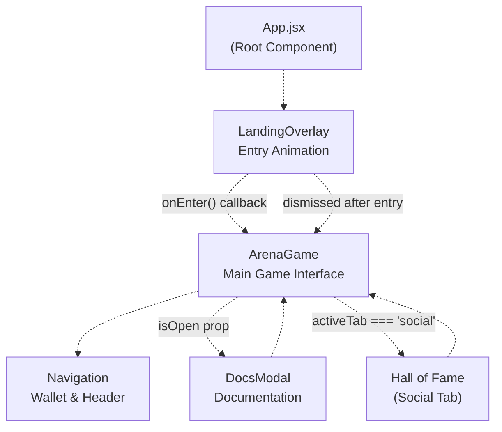
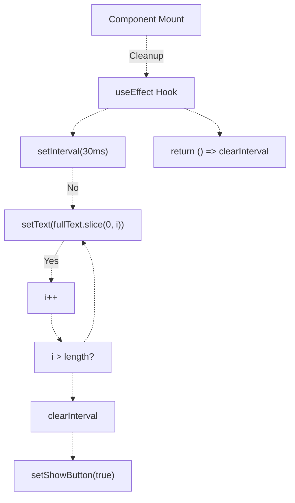
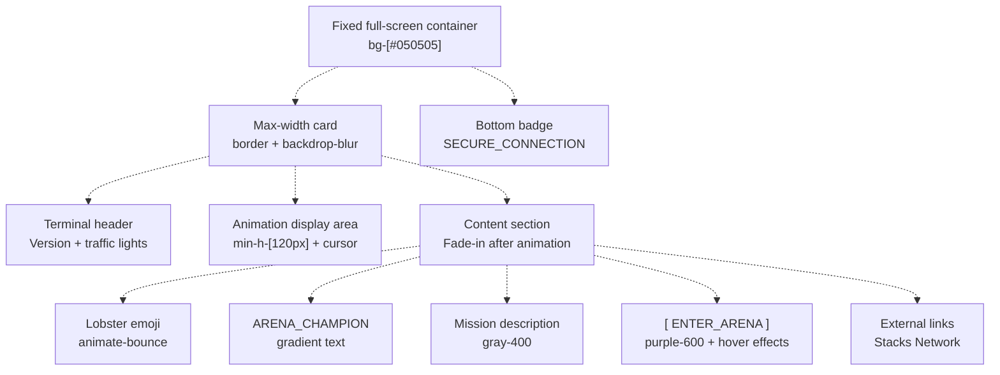
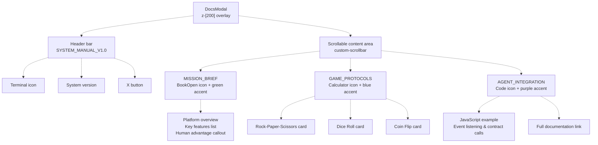
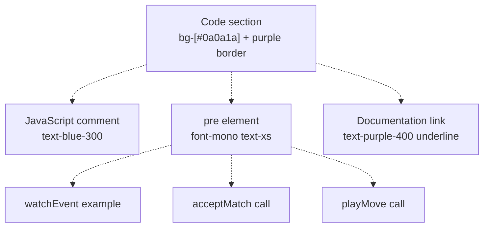
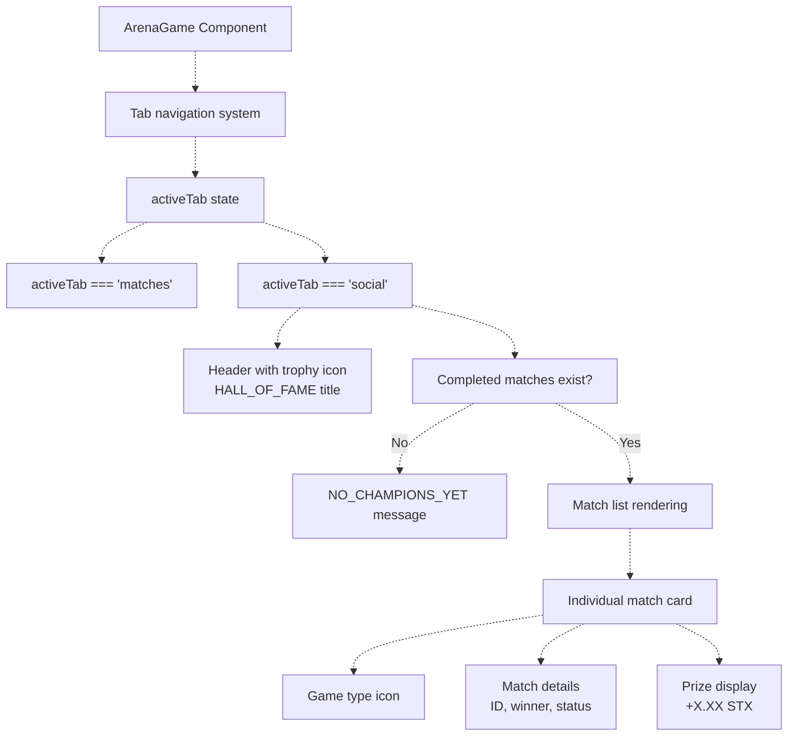
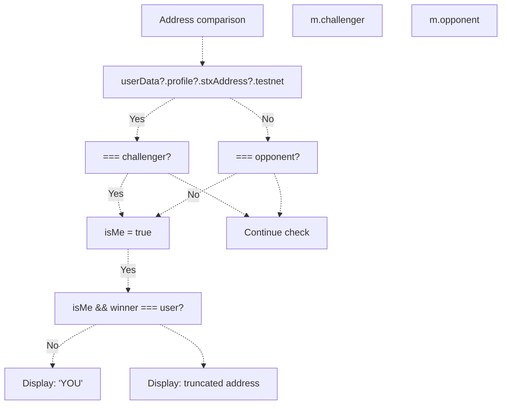
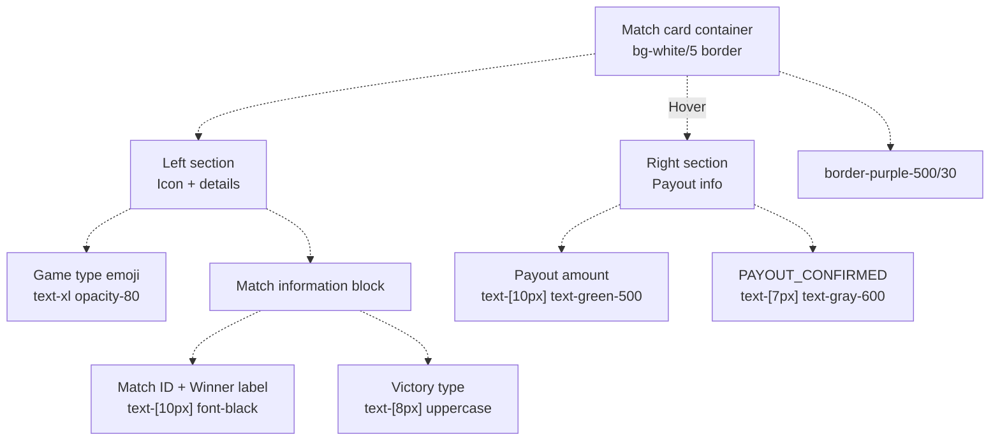
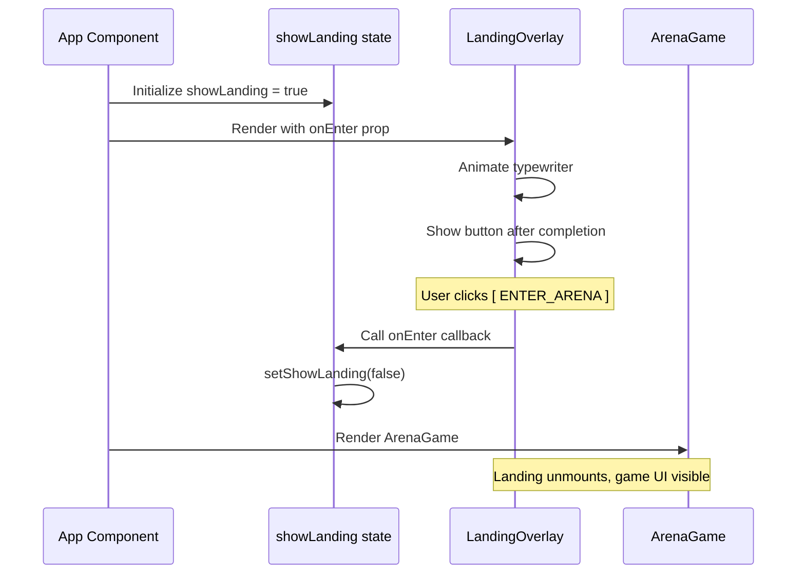
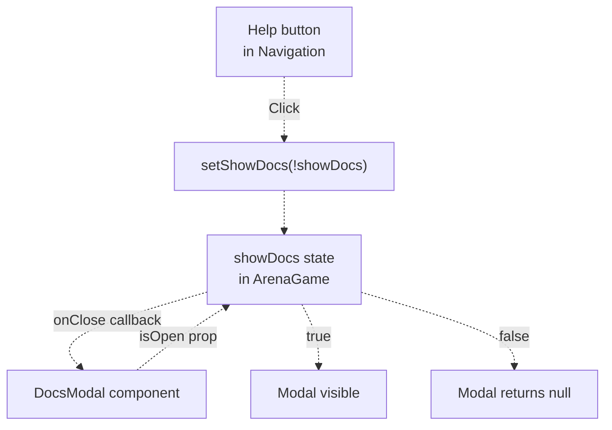

# User Interface Components

> **Relevant source files**
> * [.gitignore](https://github.com/HACK3R-CRYPTO/GameArenaStacks/blob/23ba68fb/.gitignore)
> * [frontend/index.html](https://github.com/HACK3R-CRYPTO/GameArenaStacks/blob/23ba68fb/frontend/index.html)
> * [frontend/src/components/DocsModal.jsx](https://github.com/HACK3R-CRYPTO/GameArenaStacks/blob/23ba68fb/frontend/src/components/DocsModal.jsx)
> * [frontend/src/components/LandingOverlay.jsx](https://github.com/HACK3R-CRYPTO/GameArenaStacks/blob/23ba68fb/frontend/src/components/LandingOverlay.jsx)
> * [temp_snippet.txt](https://github.com/HACK3R-CRYPTO/GameArenaStacks/blob/23ba68fb/temp_snippet.txt)

This page documents the presentational UI components in the GameArenaStacks frontend that provide user onboarding, documentation, and match history visualization. These components complement the core game interaction layer documented in [ArenaGame Component](/HACK3R-CRYPTO/GameArenaStacks/2.1-arenagame-component) and work alongside the wallet integration in [Navigation](/HACK3R-CRYPTO/GameArenaStacks/2.2-wallet-integration-and-navigation).

For information about the main game interface and match management, see [ArenaGame Component](/HACK3R-CRYPTO/GameArenaStacks/2.1-arenagame-component). For wallet connection UI, see [Wallet Integration and Navigation](/HACK3R-CRYPTO/GameArenaStacks/2.2-wallet-integration-and-navigation).

---

## Overview of UI Component Architecture

The frontend implements three specialized UI components that handle non-gameplay interactions:

| Component | File | Purpose | Integration Point |
| --- | --- | --- | --- |
| `LandingOverlay` | `frontend/src/components/LandingOverlay.jsx` | System initialization screen with typewriter animation | Wraps entire application, dismissed via callback |
| `DocsModal` | `frontend/src/components/DocsModal.jsx` | In-app documentation modal with game rules and API examples | Toggled from main game interface |
| Hall of Fame | Inline in `ArenaGame.jsx` | Match history display showing winners and payouts | Embedded in social tab of main interface |



**Sources:** [frontend/src/components/LandingOverlay.jsx L1-L79](https://github.com/HACK3R-CRYPTO/GameArenaStacks/blob/23ba68fb/frontend/src/components/LandingOverlay.jsx#L1-L79)

 [frontend/src/components/DocsModal.jsx L1-L127](https://github.com/HACK3R-CRYPTO/GameArenaStacks/blob/23ba68fb/frontend/src/components/DocsModal.jsx#L1-L127)

 [temp_snippet.txt L1-L44](https://github.com/HACK3R-CRYPTO/GameArenaStacks/blob/23ba68fb/temp_snippet.txt#L1-L44)

---

## LandingOverlay Component

### Component Structure and Props

The `LandingOverlay` component implements a full-screen entry animation with a terminal aesthetic. It accepts a single callback prop:

| Prop | Type | Purpose |
| --- | --- | --- |
| `onEnter` | `() => void` | Callback invoked when user dismisses overlay |

The component manages two pieces of local state:

```css
#mermaid-3lvtz66sv8o{font-family:ui-sans-serif,-apple-system,system-ui,Segoe UI,Helvetica;font-size:16px;fill:#333;}@keyframes edge-animation-frame{from{stroke-dashoffset:0;}}@keyframes dash{to{stroke-dashoffset:0;}}#mermaid-3lvtz66sv8o .edge-animation-slow{stroke-dasharray:9,5!important;stroke-dashoffset:900;animation:dash 50s linear infinite;stroke-linecap:round;}#mermaid-3lvtz66sv8o .edge-animation-fast{stroke-dasharray:9,5!important;stroke-dashoffset:900;animation:dash 20s linear infinite;stroke-linecap:round;}#mermaid-3lvtz66sv8o .error-icon{fill:#dddddd;}#mermaid-3lvtz66sv8o .error-text{fill:#222222;stroke:#222222;}#mermaid-3lvtz66sv8o .edge-thickness-normal{stroke-width:1px;}#mermaid-3lvtz66sv8o .edge-thickness-thick{stroke-width:3.5px;}#mermaid-3lvtz66sv8o .edge-pattern-solid{stroke-dasharray:0;}#mermaid-3lvtz66sv8o .edge-thickness-invisible{stroke-width:0;fill:none;}#mermaid-3lvtz66sv8o .edge-pattern-dashed{stroke-dasharray:3;}#mermaid-3lvtz66sv8o .edge-pattern-dotted{stroke-dasharray:2;}#mermaid-3lvtz66sv8o .marker{fill:#999;stroke:#999;}#mermaid-3lvtz66sv8o .marker.cross{stroke:#999;}#mermaid-3lvtz66sv8o svg{font-family:ui-sans-serif,-apple-system,system-ui,Segoe UI,Helvetica;font-size:16px;}#mermaid-3lvtz66sv8o p{margin:0;}#mermaid-3lvtz66sv8o defs #statediagram-barbEnd{fill:#999;stroke:#999;}#mermaid-3lvtz66sv8o g.stateGroup text{fill:#dddddd;stroke:none;font-size:10px;}#mermaid-3lvtz66sv8o g.stateGroup text{fill:#333;stroke:none;font-size:10px;}#mermaid-3lvtz66sv8o g.stateGroup .state-title{font-weight:bolder;fill:#333;}#mermaid-3lvtz66sv8o g.stateGroup rect{fill:#ffffff;stroke:#dddddd;}#mermaid-3lvtz66sv8o g.stateGroup line{stroke:#999;stroke-width:1;}#mermaid-3lvtz66sv8o .transition{stroke:#999;stroke-width:1;fill:none;}#mermaid-3lvtz66sv8o .stateGroup .composit{fill:#f4f4f4;border-bottom:1px;}#mermaid-3lvtz66sv8o .stateGroup .alt-composit{fill:#e0e0e0;border-bottom:1px;}#mermaid-3lvtz66sv8o .state-note{stroke:#e6d280;fill:#fff5ad;}#mermaid-3lvtz66sv8o .state-note text{fill:#333;stroke:none;font-size:10px;}#mermaid-3lvtz66sv8o .stateLabel .box{stroke:none;stroke-width:0;fill:#ffffff;opacity:0.5;}#mermaid-3lvtz66sv8o .edgeLabel .label rect{fill:#ffffff;opacity:0.5;}#mermaid-3lvtz66sv8o .edgeLabel{background-color:#ffffff;text-align:center;}#mermaid-3lvtz66sv8o .edgeLabel p{background-color:#ffffff;}#mermaid-3lvtz66sv8o .edgeLabel rect{opacity:0.5;background-color:#ffffff;fill:#ffffff;}#mermaid-3lvtz66sv8o .edgeLabel .label text{fill:#333;}#mermaid-3lvtz66sv8o .label div .edgeLabel{color:#333;}#mermaid-3lvtz66sv8o .stateLabel text{fill:#333;font-size:10px;font-weight:bold;}#mermaid-3lvtz66sv8o .node circle.state-start{fill:#999;stroke:#999;}#mermaid-3lvtz66sv8o .node .fork-join{fill:#999;stroke:#999;}#mermaid-3lvtz66sv8o .node circle.state-end{fill:#dddddd;stroke:#f4f4f4;stroke-width:1.5;}#mermaid-3lvtz66sv8o .end-state-inner{fill:#f4f4f4;stroke-width:1.5;}#mermaid-3lvtz66sv8o .node rect{fill:#ffffff;stroke:#dddddd;stroke-width:1px;}#mermaid-3lvtz66sv8o .node polygon{fill:#ffffff;stroke:#dddddd;stroke-width:1px;}#mermaid-3lvtz66sv8o #statediagram-barbEnd{fill:#999;}#mermaid-3lvtz66sv8o .statediagram-cluster rect{fill:#ffffff;stroke:#dddddd;stroke-width:1px;}#mermaid-3lvtz66sv8o .cluster-label,#mermaid-3lvtz66sv8o .nodeLabel{color:#333;}#mermaid-3lvtz66sv8o .statediagram-cluster rect.outer{rx:5px;ry:5px;}#mermaid-3lvtz66sv8o .statediagram-state .divider{stroke:#dddddd;}#mermaid-3lvtz66sv8o .statediagram-state .title-state{rx:5px;ry:5px;}#mermaid-3lvtz66sv8o .statediagram-cluster.statediagram-cluster .inner{fill:#f4f4f4;}#mermaid-3lvtz66sv8o .statediagram-cluster.statediagram-cluster-alt .inner{fill:#f8f8f8;}#mermaid-3lvtz66sv8o .statediagram-cluster .inner{rx:0;ry:0;}#mermaid-3lvtz66sv8o .statediagram-state rect.basic{rx:5px;ry:5px;}#mermaid-3lvtz66sv8o .statediagram-state rect.divider{stroke-dasharray:10,10;fill:#f8f8f8;}#mermaid-3lvtz66sv8o .note-edge{stroke-dasharray:5;}#mermaid-3lvtz66sv8o .statediagram-note rect{fill:#fff5ad;stroke:#e6d280;stroke-width:1px;rx:0;ry:0;}#mermaid-3lvtz66sv8o .statediagram-note rect{fill:#fff5ad;stroke:#e6d280;stroke-width:1px;rx:0;ry:0;}#mermaid-3lvtz66sv8o .statediagram-note text{fill:#333;}#mermaid-3lvtz66sv8o .statediagram-note .nodeLabel{color:#333;}#mermaid-3lvtz66sv8o .statediagram .edgeLabel{color:red;}#mermaid-3lvtz66sv8o #dependencyStart,#mermaid-3lvtz66sv8o #dependencyEnd{fill:#999;stroke:#999;stroke-width:1;}#mermaid-3lvtz66sv8o .statediagramTitleText{text-anchor:middle;font-size:18px;fill:#333;}#mermaid-3lvtz66sv8o :root{--mermaid-font-family:"trebuchet ms",verdana,arial,sans-serif;}Component mountsuseEffect triggersText fully renderedsetShowButton(true)User clicks EnteronEnter() callbackInitializingAnimatingAnimationCompleteButtonVisibleDismisseduseState: textTypewriter effect at 30ms/charuseState: showButtonFade-in transition
```

**Sources:** [frontend/src/components/LandingOverlay.jsx L3-L6](https://github.com/HACK3R-CRYPTO/GameArenaStacks/blob/23ba68fb/frontend/src/components/LandingOverlay.jsx#L3-L6)

 [frontend/src/components/LandingOverlay.jsx L8-L19](https://github.com/HACK3R-CRYPTO/GameArenaStacks/blob/23ba68fb/frontend/src/components/LandingOverlay.jsx#L8-L19)

### Typewriter Animation Implementation

The component uses `useEffect` with `setInterval` to create a typewriter effect:



The full animation text is defined as a constant: [frontend/src/components/LandingOverlay.jsx L5](https://github.com/HACK3R-CRYPTO/GameArenaStacks/blob/23ba68fb/frontend/src/components/LandingOverlay.jsx#L5-L5)

```
">> SYSTEM_INITIALIZING...\n>> CONNECTING_TO_STACKS_TESTNET...\n>> ESTABLISHING_SECURE_LINK...\n>> ACCESSING_ARENA_PROTOCOL..."
```

Animation parameters:

* **Character interval:** 30 milliseconds per character
* **Button fade-in:** 1000ms CSS transition after text completion
* **Cleanup:** `clearInterval` called on unmount to prevent memory leaks

**Sources:** [frontend/src/components/LandingOverlay.jsx L8-L19](https://github.com/HACK3R-CRYPTO/GameArenaStacks/blob/23ba68fb/frontend/src/components/LandingOverlay.jsx#L8-L19)

 [frontend/src/components/LandingOverlay.jsx L38](https://github.com/HACK3R-CRYPTO/GameArenaStacks/blob/23ba68fb/frontend/src/components/LandingOverlay.jsx#L38-L38)

### Visual Structure and Styling

The overlay implements a terminal-inspired design with the following layout hierarchy:



Key styling features:

* **Font family:** `font-mono` applied to entire overlay
* **Terminal header:** Simulated window controls at [frontend/src/components/LandingOverlay.jsx L26-L30](https://github.com/HACK3R-CRYPTO/GameArenaStacks/blob/23ba68fb/frontend/src/components/LandingOverlay.jsx#L26-L30)
* **Animated cursor:** Pulsing underscore using `animate-pulse` class
* **Gradient text:** Applied to title using Tailwind gradient utilities
* **Shadow effects:** Purple glow on button using `shadow-[0_0_20px_rgba(147,51,234,0.3)]`

**Sources:** [frontend/src/components/LandingOverlay.jsx L22-L74](https://github.com/HACK3R-CRYPTO/GameArenaStacks/blob/23ba68fb/frontend/src/components/LandingOverlay.jsx#L22-L74)

---

## DocsModal Component

### Modal State Management and Props

The `DocsModal` component implements a full-screen documentation overlay with the following interface:

| Prop | Type | Purpose |
| --- | --- | --- |
| `isOpen` | `boolean` | Controls modal visibility |
| `onClose` | `() => void` | Callback to dismiss modal |

Early return pattern for conditional rendering: [frontend/src/components/DocsModal.jsx L5](https://github.com/HACK3R-CRYPTO/GameArenaStacks/blob/23ba68fb/frontend/src/components/DocsModal.jsx#L5-L5)

```
if (!isOpen) return null;
```

**Sources:** [frontend/src/components/DocsModal.jsx L4-L5](https://github.com/HACK3R-CRYPTO/GameArenaStacks/blob/23ba68fb/frontend/src/components/DocsModal.jsx#L4-L5)

### Content Structure and Sections

The modal organizes documentation into three primary sections with distinct visual styling:



**Sources:** [frontend/src/components/DocsModal.jsx L8-L122](https://github.com/HACK3R-CRYPTO/GameArenaStacks/blob/23ba68fb/frontend/src/components/DocsModal.jsx#L8-L122)

### Game Protocols Documentation

The `GAME_PROTOCOLS` section displays game rules in a responsive grid layout using Tailwind's `grid-cols-1 md:grid-cols-3` pattern. Each game card includes:

| Element | Implementation |
| --- | --- |
| Icon | Emoji character (✊, 🎲, 🪙) |
| Title | Bold game name |
| Description | Rules explanation in `text-xs` |
| Hover effect | Border color transition to `blue-500/30` |

**Key messaging highlights:**

* Rock-Paper-Scissors: AI pattern analysis mentioned at [frontend/src/components/DocsModal.jsx L57](https://github.com/HACK3R-CRYPTO/GameArenaStacks/blob/23ba68fb/frontend/src/components/DocsModal.jsx#L57-L57)
* Dice Roll: "If you roll same as AI, YOU WIN" emphasized
* Coin Flip: Pattern detection in user choices

**Sources:** [frontend/src/components/DocsModal.jsx L47-L75](https://github.com/HACK3R-CRYPTO/GameArenaStacks/blob/23ba68fb/frontend/src/components/DocsModal.jsx#L47-L75)

### Agent Integration Code Example

The modal includes a live code example demonstrating how developers can integrate with the arena platform. The code block structure:



The example code demonstrates three key integration steps:

1. **Event watching:** Using `client.watchEvent()` to detect `MatchProposed` events
2. **Match acceptance:** Calling `acceptMatch` with `matchId` and `wagerAmount`
3. **Move submission:** Invoking `playMove` with `matchId` and `move` parameters

External documentation link target: `/ARENA_SKILL.md` [frontend/src/components/DocsModal.jsx L111](https://github.com/HACK3R-CRYPTO/GameArenaStacks/blob/23ba68fb/frontend/src/components/DocsModal.jsx#L111-L111)

**Sources:** [frontend/src/components/DocsModal.jsx L78-L118](https://github.com/HACK3R-CRYPTO/GameArenaStacks/blob/23ba68fb/frontend/src/components/DocsModal.jsx#L78-L118)

### Styling and Accessibility

Modal accessibility features:

* **Z-index:** Set to `200` to ensure overlay priority
* **Backdrop:** `bg-black/80 backdrop-blur-sm` for visual separation
* **Scrolling:** Custom scrollbar styling via `custom-scrollbar` class
* **Close button:** Keyboard-accessible with hover state transitions
* **Height constraint:** Fixed to `80vh` to prevent overflow on small screens

**Sources:** [frontend/src/components/DocsModal.jsx L8-L9](https://github.com/HACK3R-CRYPTO/GameArenaStacks/blob/23ba68fb/frontend/src/components/DocsModal.jsx#L8-L9)

---

## Hall of Fame Display

### Component Location and Context

The Hall of Fame is not a separate component file but rather an inline section within the `ArenaGame` component, rendered conditionally when `activeTab === 'social'`. The implementation exists in the main game file as part of the tab navigation system.



**Sources:** [temp_snippet.txt L1-L44](https://github.com/HACK3R-CRYPTO/GameArenaStacks/blob/23ba68fb/temp_snippet.txt#L1-L44)

### Data Filtering and Match Display

The Hall of Fame filters matches using array methods to show only completed games:

```javascript
matches.filter(m => m.status === 'Completed')
```

Match card rendering logic:

| Data Point | Source | Display Format |
| --- | --- | --- |
| Match ID | `m.id` | `#${m.id}` in purple-400 |
| Winner address | `m.winner.value |  |
| Game type | `GAME_TYPES.find(gt => gt.id === m.gameType)?.icon` | Emoji icon |
| Payout | `m.wager * 1.96 / 1000000` | `+X.XX STX` in green-500 |
| Status | Derived from winner type | `CHALLENGER_VICTORY` or `OPPONENT_VICTORY` |

**Sources:** [temp_snippet.txt L10-L42](https://github.com/HACK3R-CRYPTO/GameArenaStacks/blob/23ba68fb/temp_snippet.txt#L10-L42)

### User Context Detection

The component detects if the current user participated in a match by comparing wallet addresses:



Winner label logic at [temp_snippet.txt L14](https://github.com/HACK3R-CRYPTO/GameArenaStacks/blob/23ba68fb/temp_snippet.txt#L14-L14)

:

* If user is participant AND winner: Display "YOU" in `text-green-400`
* Otherwise: Display truncated address `${winnerAddr.slice(0, 4)}...${winnerAddr.slice(-4)}`

**Sources:** [temp_snippet.txt L14-L28](https://github.com/HACK3R-CRYPTO/GameArenaStacks/blob/23ba68fb/temp_snippet.txt#L14-L28)

### Visual Hierarchy and Styling

Each completed match is rendered as a card with the following structure:



**Card styling features:**

* **Border transition:** `group hover:border-purple-500/30 transition-all`
* **Payout calculation:** `(m.wager * 1.96 / 1000000).toFixed(2)` represents 98% prize distribution
* **Typography scale:** Ultra-small font sizes (`text-[7px]`, `text-[8px]`, `text-[10px]`) for compact display
* **Color coding:** Green for payouts, purple for match IDs, gray for metadata

**Empty state:** When no completed matches exist, displays centered message: `"NO_CHAMPIONS_YET"` in `text-[10px] text-gray-600 font-bold uppercase tracking-widest`

**Sources:** [temp_snippet.txt L10-L42](https://github.com/HACK3R-CRYPTO/GameArenaStacks/blob/23ba68fb/temp_snippet.txt#L10-L42)

---

## Component Integration Patterns

### LandingOverlay Integration

The `LandingOverlay` is controlled by a boolean state in the parent component:



**Integration pattern:** Single-use dismissible overlay that conditionally renders the main application.

**Sources:** [frontend/src/components/LandingOverlay.jsx L3](https://github.com/HACK3R-CRYPTO/GameArenaStacks/blob/23ba68fb/frontend/src/components/LandingOverlay.jsx#L3-L3)

 [frontend/src/components/LandingOverlay.jsx L52](https://github.com/HACK3R-CRYPTO/GameArenaStacks/blob/23ba68fb/frontend/src/components/LandingOverlay.jsx#L52-L52)

### DocsModal Toggle Integration

The documentation modal is toggled via state in `ArenaGame`:



**Props flow:**

* `isOpen={showDocs}` controls visibility
* `onClose={() => setShowDocs(false)}` handles dismissal via X button or overlay click

**Sources:** [frontend/src/components/DocsModal.jsx L4](https://github.com/HACK3R-CRYPTO/GameArenaStacks/blob/23ba68fb/frontend/src/components/DocsModal.jsx#L4-L4)

### Hall of Fame Data Dependencies

The Hall of Fame display depends on several data sources from the `ArenaGame` component:

| Dependency | Type | Usage |
| --- | --- | --- |
| `matches` | `Array<Match>` | Source data filtered for completed matches |
| `userData` | `Object` | Current user address for "YOU" detection |
| `GAME_TYPES` | `Array<GameType>` | Maps game type ID to emoji icon |
| `activeTab` | `string` | Controls visibility when set to 'social' |

**Data transformation pipeline:**

```
matches → filter(status === 'Completed') → map(match card) → render
```

**Sources:** [temp_snippet.txt L10-L14](https://github.com/HACK3R-CRYPTO/GameArenaStacks/blob/23ba68fb/temp_snippet.txt#L10-L14)

 [temp_snippet.txt L21](https://github.com/HACK3R-CRYPTO/GameArenaStacks/blob/23ba68fb/temp_snippet.txt#L21-L21)

---

## Summary of UI Component Responsibilities

The three UI components serve distinct roles in the user experience flow:

1. **LandingOverlay:** One-time entry animation that establishes the terminal aesthetic and provides a dramatic entrance to the platform. Implements typewriter effect and dismisses via callback.
2. **DocsModal:** On-demand reference documentation that explains game rules, platform features, and provides API integration examples. Toggled from main interface and implements scrollable content with code examples.
3. **Hall of Fame:** Embedded social feature that displays completed match history with winner information and payout amounts. Filters match data and provides user context awareness for personalized display.

All three components use consistent monospace typography, terminal-inspired styling, and minimal color palettes (purple, green accents on dark backgrounds) to maintain visual coherence with the overall platform aesthetic.

**Sources:** [frontend/src/components/LandingOverlay.jsx L1-L79](https://github.com/HACK3R-CRYPTO/GameArenaStacks/blob/23ba68fb/frontend/src/components/LandingOverlay.jsx#L1-L79)

 [frontend/src/components/DocsModal.jsx L1-L127](https://github.com/HACK3R-CRYPTO/GameArenaStacks/blob/23ba68fb/frontend/src/components/DocsModal.jsx#L1-L127)

 [temp_snippet.txt L1-L44](https://github.com/HACK3R-CRYPTO/GameArenaStacks/blob/23ba68fb/temp_snippet.txt#L1-L44)