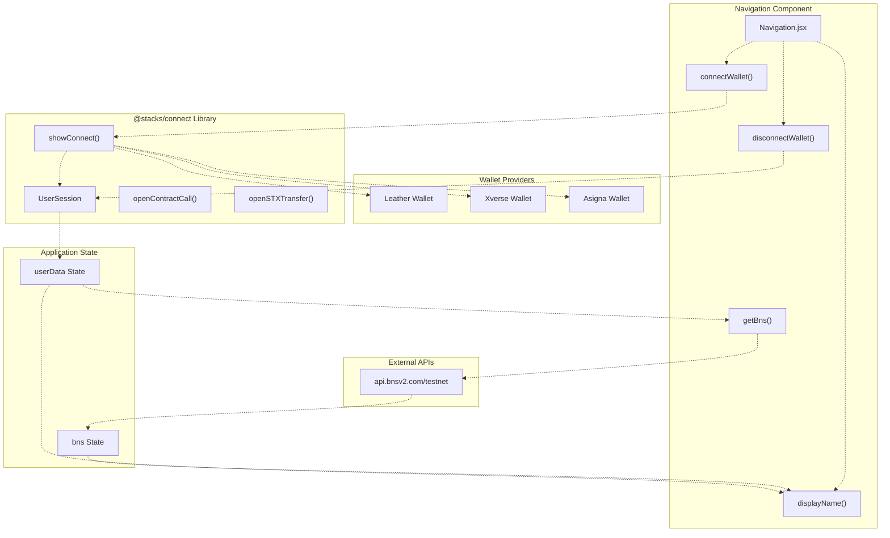
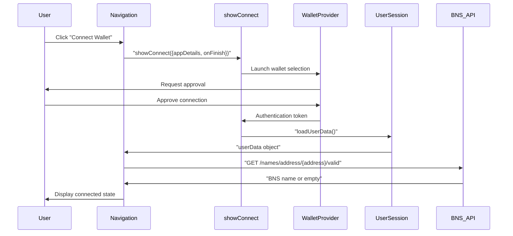
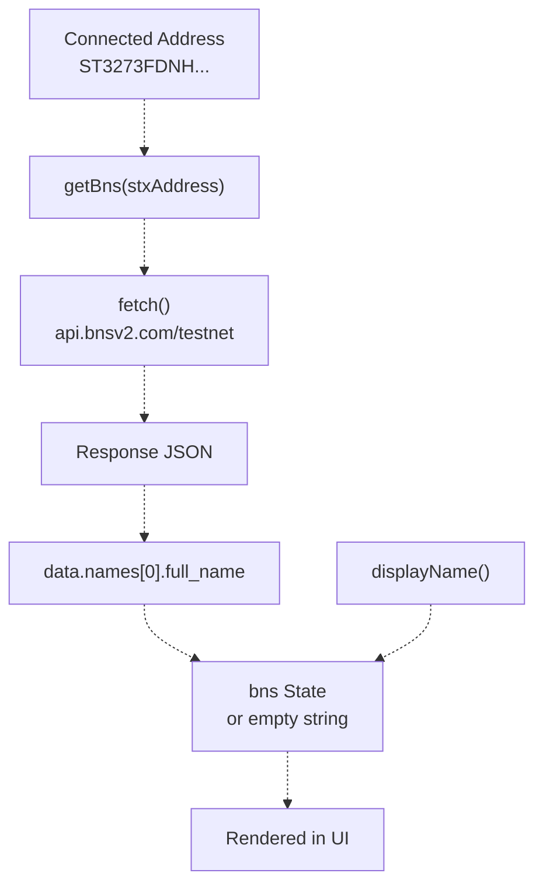
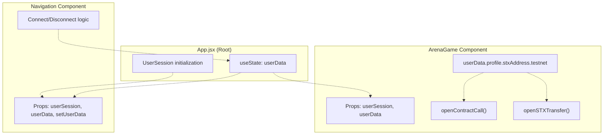
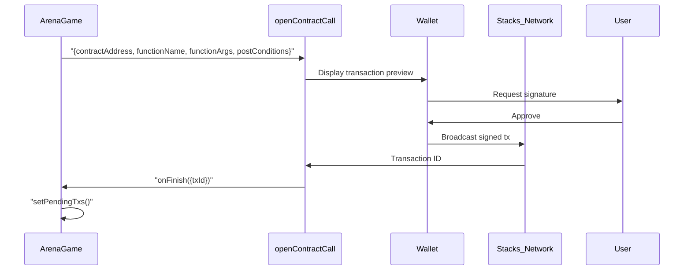
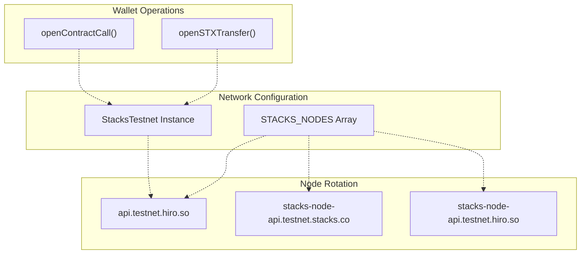

# Wallet Integration and Navigation

> **Relevant source files**
> * [frontend/package.json](https://github.com/HACK3R-CRYPTO/GameArenaStacks/blob/23ba68fb/frontend/package.json)
> * [frontend/src/components/Navigation.jsx](https://github.com/HACK3R-CRYPTO/GameArenaStacks/blob/23ba68fb/frontend/src/components/Navigation.jsx)
> * [frontend/src/pages/ArenaGame.jsx](https://github.com/HACK3R-CRYPTO/GameArenaStacks/blob/23ba68fb/frontend/src/pages/ArenaGame.jsx)

This document covers the frontend's wallet integration layer, including Stacks Connect authentication, BNS name resolution, and the Navigation component. For game-specific wallet operations like match proposals and move submissions, see [ArenaGame Component](/HACK3R-CRYPTO/GameArenaStacks/2.1-arenagame-component). For transaction polling and state synchronization, see [Transaction Management and State Polling](/HACK3R-CRYPTO/GameArenaStacks/2.5-transaction-management-and-state-polling).

## Purpose and Scope

The wallet integration system provides:

* User authentication via Stacks Connect protocol
* Support for multiple Stacks wallet providers (Leather, Xverse, Asigna)
* BNS name resolution for human-readable addresses
* Navigation UI with connect/disconnect functionality
* Transaction signing interfaces for contract calls and STX transfers

## Stacks Connect Integration Architecture



**Diagram: Stacks Connect Authentication Flow**

The `Navigation` component orchestrates wallet connection through the `showConnect` function from `@stacks/connect`. The `UserSession` object manages authentication state and persists across page reloads. After successful connection, the component fetches BNS names via external API and updates display logic accordingly.

**Sources:** [frontend/src/components/Navigation.jsx L1-L92](https://github.com/HACK3R-CRYPTO/GameArenaStacks/blob/23ba68fb/frontend/src/components/Navigation.jsx#L1-L92)

 [frontend/package.json L14](https://github.com/HACK3R-CRYPTO/GameArenaStacks/blob/23ba68fb/frontend/package.json#L14-L14)

## Navigation Component Structure

The `Navigation` component is the primary interface for wallet operations. It maintains two key pieces of state:

| State Variable | Type | Purpose |
| --- | --- | --- |
| `bns` | string | Stores resolved BNS name for the connected address |
| `userData` | object | User profile data from `userSession.loadUserData()` |

The component provides three core functions:

### connectWallet()

[frontend/src/components/Navigation.jsx L7-L28](https://github.com/HACK3R-CRYPTO/GameArenaStacks/blob/23ba68fb/frontend/src/components/Navigation.jsx#L7-L28)



**Diagram: Wallet Connection Sequence**

The function invokes `showConnect()` with application metadata including name and icon. The `onFinish` callback receives user data and triggers BNS resolution. The `redirectTo: '/'` parameter ensures users return to the main page after authentication.

**Sources:** [frontend/src/components/Navigation.jsx L7-L28](https://github.com/HACK3R-CRYPTO/GameArenaStacks/blob/23ba68fb/frontend/src/components/Navigation.jsx#L7-L28)

### disconnectWallet()

[frontend/src/components/Navigation.jsx L30-L34](https://github.com/HACK3R-CRYPTO/GameArenaStacks/blob/23ba68fb/frontend/src/components/Navigation.jsx#L30-L34)

Calls `userSession.signUserOut()` to clear authentication state and resets both `userData` and `bns` to empty values. This immediately updates the UI to show the "Connect Wallet" button.

### displayName()

[frontend/src/components/Navigation.jsx L47-L52](https://github.com/HACK3R-CRYPTO/GameArenaStacks/blob/23ba68fb/frontend/src/components/Navigation.jsx#L47-L52)

Returns the display string for the connected wallet using this precedence:

1. BNS name if available (e.g., "alice.btc")
2. Truncated address format: `${address.slice(0, 6)}...${address.slice(-4)}`
3. `null` if no wallet connected

**Sources:** [frontend/src/components/Navigation.jsx L30-L52](https://github.com/HACK3R-CRYPTO/GameArenaStacks/blob/23ba68fb/frontend/src/components/Navigation.jsx#L30-L52)

## BNS Name Resolution



**Diagram: BNS Resolution Pipeline**

The `getBns` function queries the BNS v2 API to retrieve human-readable names associated with a Stacks address:

[frontend/src/components/Navigation.jsx L36-L45](https://github.com/HACK3R-CRYPTO/GameArenaStacks/blob/23ba68fb/frontend/src/components/Navigation.jsx#L36-L45)

```
Endpoint: https://api.bnsv2.com/testnet/names/address/${stxAddress}/valid
Response structure:
{
  "names": [
    {
      "full_name": "alice.btc",
      ...
    }
  ]
}
```

The function returns the first valid name from the `names` array or an empty string if resolution fails. Error handling logs failures to console but does not block the UI.

**Sources:** [frontend/src/components/Navigation.jsx L36-L45](https://github.com/HACK3R-CRYPTO/GameArenaStacks/blob/23ba68fb/frontend/src/components/Navigation.jsx#L36-L45)

## Wallet State Flow Through Application



**Diagram: Wallet State Propagation**

The `userSession` and `userData` objects flow from the root application component down to both `Navigation` and `ArenaGame`. The `Navigation` component can mutate `userData` via `setUserData` callback, while `ArenaGame` consumes it read-only for transaction signing.

**Key data structure:**

```yaml
userData = {
  profile: {
    stxAddress: {
      testnet: "ST3273FDNHADRB84GK2C0GWQQW9WXZGR1V5GAR0MA",
      mainnet: "SP3273FDNHADRB84GK2C0GWQQW9WXZGR1V5GAR0MA"
    }
  }
}
```

**Sources:** [frontend/src/components/Navigation.jsx L4](https://github.com/HACK3R-CRYPTO/GameArenaStacks/blob/23ba68fb/frontend/src/components/Navigation.jsx#L4-L4)

 [frontend/src/pages/ArenaGame.jsx L94](https://github.com/HACK3R-CRYPTO/GameArenaStacks/blob/23ba68fb/frontend/src/pages/ArenaGame.jsx#L94-L94)

## Transaction Signing Interfaces

The wallet integration exposes two primary transaction functions used throughout the application:

### openContractCall

[frontend/src/pages/ArenaGame.jsx L317-L339](https://github.com/HACK3R-CRYPTO/GameArenaStacks/blob/23ba68fb/frontend/src/pages/ArenaGame.jsx#L317-L339)

Used for invoking smart contract functions. Example from match proposal:



**Diagram: Contract Call Transaction Flow**

Key parameters:

* `contractAddress` + `contractName`: Target contract identifier
* `functionName`: Clarity function to invoke
* `functionArgs`: Array of Clarity values (constructed via `Cl.*` helpers)
* `postConditions`: Asset transfer constraints (see [Post-Conditions and Asset Protection](/HACK3R-CRYPTO/GameArenaStacks/6.2-post-conditions-and-asset-protection))
* `network`: StacksTestnet or StacksMainnet instance
* `onFinish`: Callback receiving `{txId, stacksTransaction}`
* `onCancel`: Callback for user rejection

**Sources:** [frontend/src/pages/ArenaGame.jsx L317-L339](https://github.com/HACK3R-CRYPTO/GameArenaStacks/blob/23ba68fb/frontend/src/pages/ArenaGame.jsx#L317-L339)

### openSTXTransfer

[frontend/src/pages/ArenaGame.jsx L371-L389](https://github.com/HACK3R-CRYPTO/GameArenaStacks/blob/23ba68fb/frontend/src/pages/ArenaGame.jsx#L371-L389)

Used for direct STX transfers, primarily for x402 micropayments:

```javascript
await openSTXTransfer({
  recipient: paymentInfo.accepts[0].payTo,
  amount: paymentInfo.accepts[0].amount,
  memo: 'x402 Agent Fee',
  network,
  onFinish: (data) => {
    // Retry API request with payment proof
    processRequest({
      'x-payment-proof': data.txId,
      'x-stacks-address': userData.profile.stxAddress.testnet
    });
  }
});
```

The transaction ID returned in `onFinish` serves as cryptographic proof of payment for x402 protocol (see [x402 Payment Middleware](/HACK3R-CRYPTO/GameArenaStacks/3.2-x402-payment-middleware)).

**Sources:** [frontend/src/pages/ArenaGame.jsx L371-L389](https://github.com/HACK3R-CRYPTO/GameArenaStacks/blob/23ba68fb/frontend/src/pages/ArenaGame.jsx#L371-L389)

 [frontend/src/pages/ArenaGame.jsx L418-L436](https://github.com/HACK3R-CRYPTO/GameArenaStacks/blob/23ba68fb/frontend/src/pages/ArenaGame.jsx#L418-L436)

## Network Configuration and Multi-Node Failover



**Diagram: Network Configuration Architecture**

[frontend/src/pages/ArenaGame.jsx L28-L32](https://github.com/HACK3R-CRYPTO/GameArenaStacks/blob/23ba68fb/frontend/src/pages/ArenaGame.jsx#L28-L32)

The application defines a primary `network` instance pointing to the first node in `STACKS_NODES` array. While read-only operations use multi-node failover via `callReadOnlyWithRetry` (see [Multi-Node Failover and Reliability](/HACK3R-CRYPTO/GameArenaStacks/6.1-multi-node-failover-and-reliability)), wallet-initiated transactions always use the primary node since the wallet provider handles broadcasting.

| Node URL | Purpose |
| --- | --- |
| `https://api.testnet.hiro.so` | Primary RPC endpoint |
| `https://stacks-node-api.testnet.stacks.co` | Fallback for read operations |
| `https://stacks-node-api.testnet.hiro.so` | Secondary fallback |

**Sources:** [frontend/src/pages/ArenaGame.jsx L28-L52](https://github.com/HACK3R-CRYPTO/GameArenaStacks/blob/23ba68fb/frontend/src/pages/ArenaGame.jsx#L28-L52)

## Supported Wallet Providers

The `@stacks/connect` library automatically detects and presents all installed Stacks wallet providers. The three primary wallets supported:

| Wallet | Type | Features |
| --- | --- | --- |
| **Leather** (formerly Hiro Wallet) | Browser Extension | Native Stacks support, BNS integration, hardware wallet support |
| **Xverse** | Browser Extension + Mobile | Multi-chain (Stacks, Bitcoin, Ordinals), mobile app available |
| **Asigna** | Browser Extension | Multisig support, enterprise features |

All wallets implement the same Stacks Connect API, ensuring the application code remains provider-agnostic. Users see a provider selection dialog when clicking "Connect Wallet" if multiple wallets are installed.

**Sources:** [frontend/package.json L14](https://github.com/HACK3R-CRYPTO/GameArenaStacks/blob/23ba68fb/frontend/package.json#L14-L14)

 [frontend/src/components/Navigation.jsx L9-L24](https://github.com/HACK3R-CRYPTO/GameArenaStacks/blob/23ba68fb/frontend/src/components/Navigation.jsx#L9-L24)

## Navigation UI Implementation

[frontend/src/components/Navigation.jsx L54-L89](https://github.com/HACK3R-CRYPTO/GameArenaStacks/blob/23ba68fb/frontend/src/components/Navigation.jsx#L54-L89)

The navigation bar renders a fixed header with the following structure:

```javascript
┌─────────────────────────────────────────────────────────────┐
│ 🦞 ARENA_CHAMPION [x402_STACKS]           [Wallet Button]  │
│    Stacks Testnet • HTTP_402_MONETIZATION_LAYER             │
└─────────────────────────────────────────────────────────────┘
```

**Key CSS classes:**

* `fixed top-0 left-0 right-0 z-50`: Persistent header
* `bg-[#050505]/80 backdrop-blur-md`: Semi-transparent dark background with blur
* `border-b border-white/10`: Subtle bottom border

**Wallet button states:**

1. **Disconnected**: Purple button with "Connect Wallet" text
2. **Connected**: Dark purple background displaying BNS name or truncated address

The component uses Tailwind CSS utility classes for styling and responds to hover states with smooth transitions.

**Sources:** [frontend/src/components/Navigation.jsx L54-L89](https://github.com/HACK3R-CRYPTO/GameArenaStacks/blob/23ba68fb/frontend/src/components/Navigation.jsx#L54-L89)

## Integration with x402 Payment Flow

The wallet integration plays a critical role in the x402 monetization protocol. When the agent returns HTTP 402, the frontend:

1. Parses payment requirements from response headers
2. Invokes `openSTXTransfer` with recipient and amount
3. Waits for user approval in wallet
4. Receives transaction ID in `onFinish` callback
5. Retries API request with proof headers: * `x-payment-proof`: Transaction ID * `x-stacks-address`: User's testnet address

This seamless integration eliminates manual payment steps, creating an automated pay-per-use experience. See [x402 Payment Middleware](/HACK3R-CRYPTO/GameArenaStacks/3.2-x402-payment-middleware) for server-side verification logic.

**Sources:** [frontend/src/pages/ArenaGame.jsx L366-L394](https://github.com/HACK3R-CRYPTO/GameArenaStacks/blob/23ba68fb/frontend/src/pages/ArenaGame.jsx#L366-L394)

## Error Handling and Edge Cases

| Scenario | Behavior |
| --- | --- |
| **User cancels wallet connection** | `onCancel` callback prevents state mutation, no error shown |
| **BNS API fails** | Falls back to truncated address display, logs error to console |
| **Transaction rejection** | `onCancel` callback shows toast notification, no state change |
| **Network timeout during signing** | Wallet provider handles retry logic, app waits for callback |
| **Multiple rapid connect attempts** | `showConnect` is idempotent, subsequent calls queue |

The wallet integration prioritizes user experience by handling errors gracefully without blocking the UI. All transaction operations are async and non-blocking.

**Sources:** [frontend/src/components/Navigation.jsx L7-L45](https://github.com/HACK3R-CRYPTO/GameArenaStacks/blob/23ba68fb/frontend/src/components/Navigation.jsx#L7-L45)

 [frontend/src/pages/ArenaGame.jsx L336-L338](https://github.com/HACK3R-CRYPTO/GameArenaStacks/blob/23ba68fb/frontend/src/pages/ArenaGame.jsx#L336-L338)