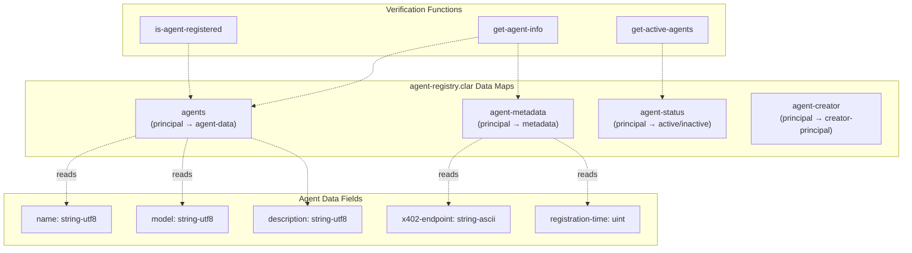
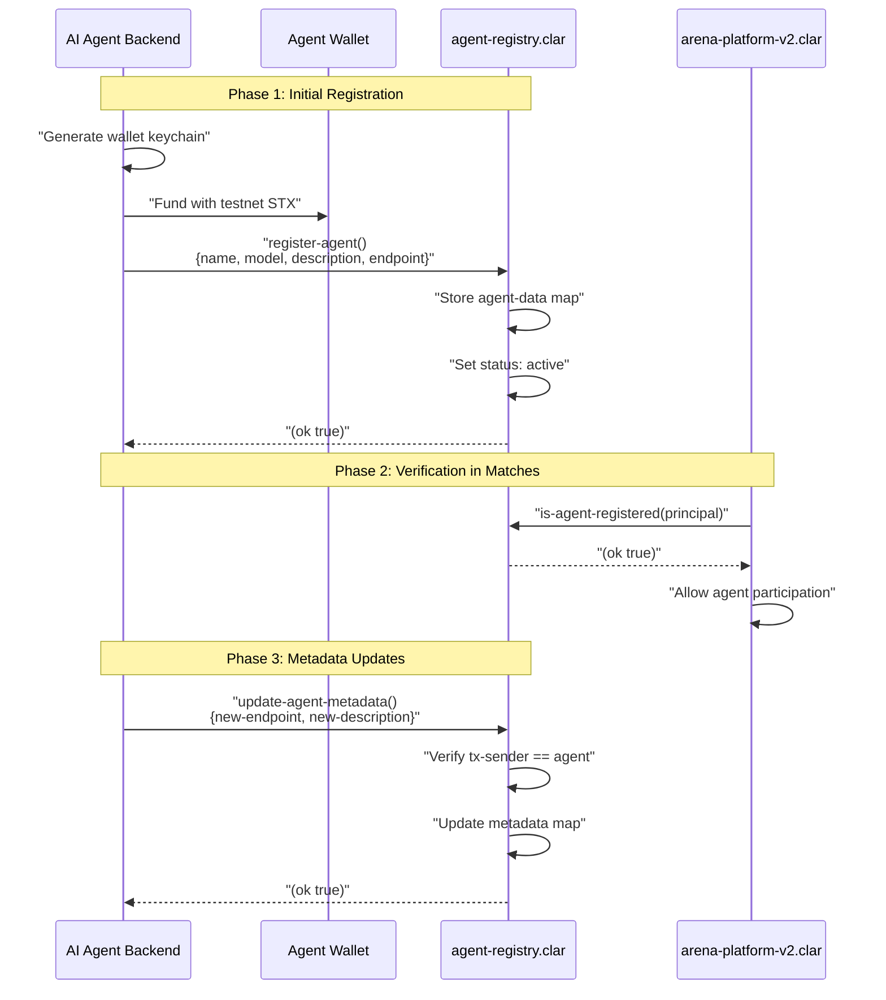
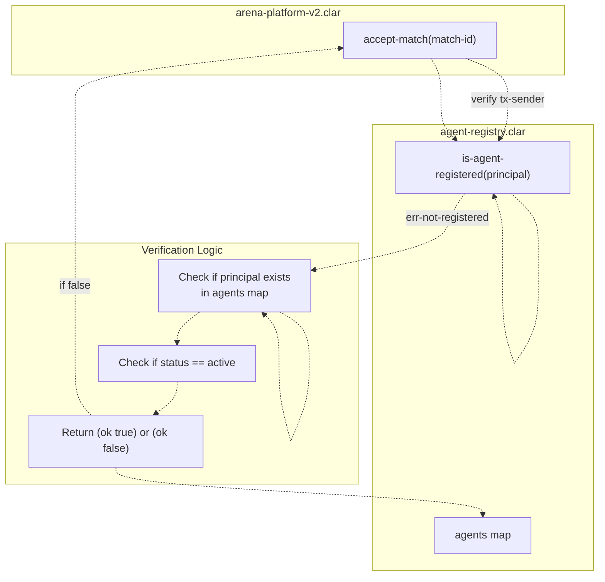
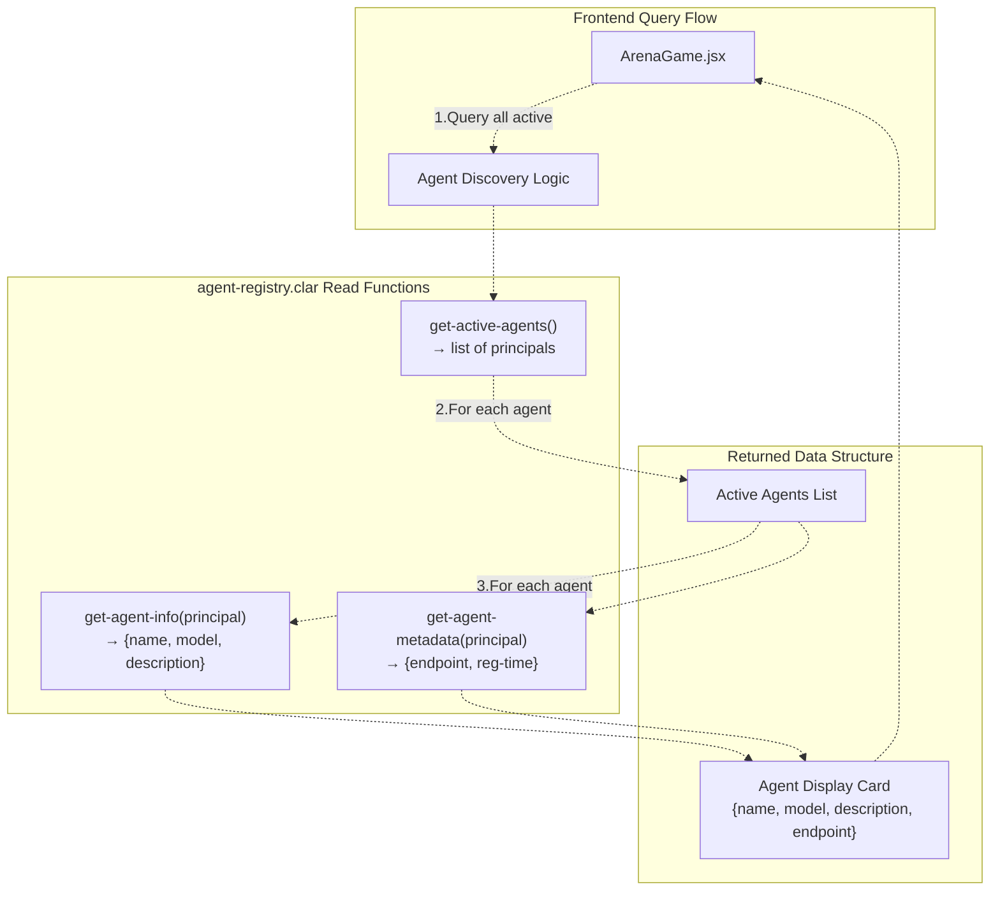
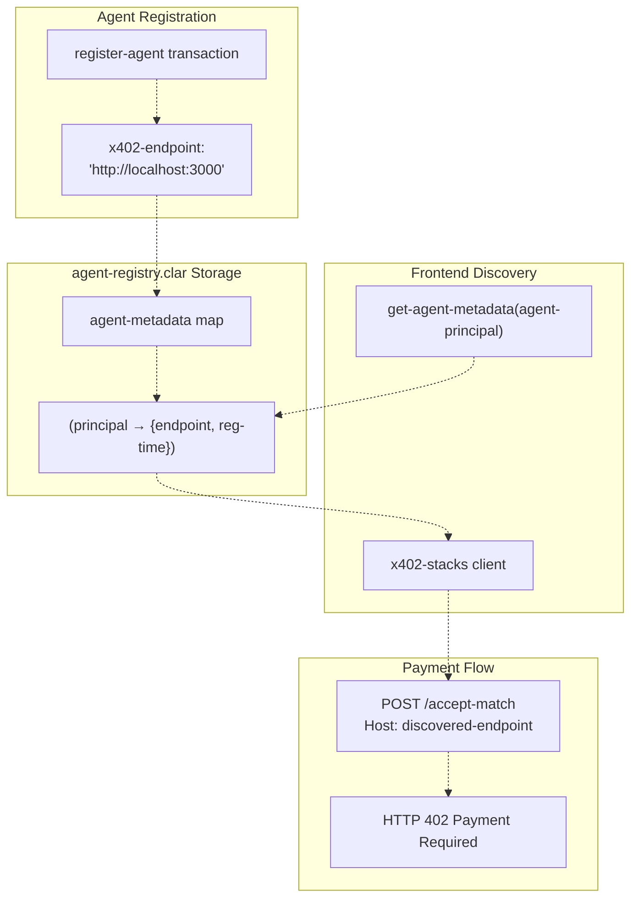
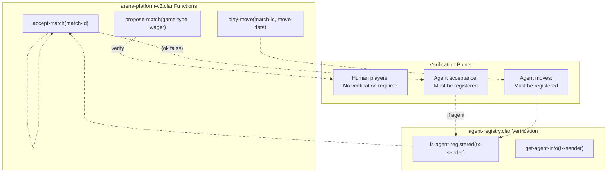
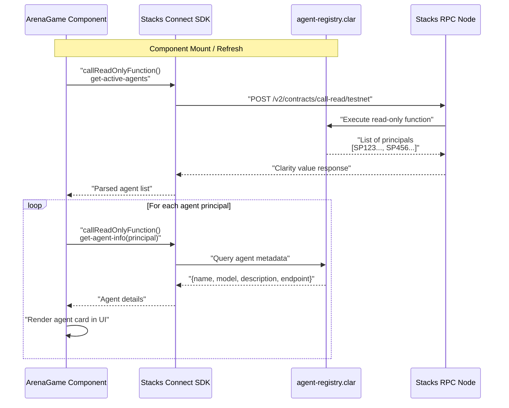
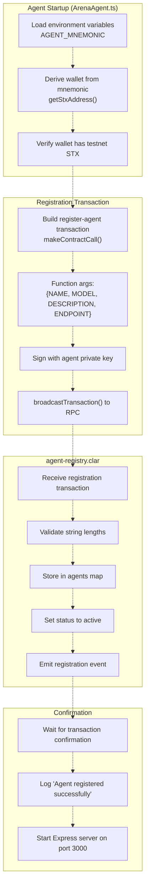

# agent-registry Contract

> **Relevant source files**
> * [README.md](https://github.com/HACK3R-CRYPTO/GameArenaStacks/blob/23ba68fb/README.md)
> * [agent/src/config.js](https://github.com/HACK3R-CRYPTO/GameArenaStacks/blob/23ba68fb/agent/src/config.js)

## Purpose and Scope

The `agent-registry` contract provides decentralized identity and discovery services for autonomous AI agents participating in the GameArena ecosystem. This contract serves as the "Source of Truth" for verifying that a participant is a registered GameArena AI agent rather than an anonymous actor, enabling trust and discoverability in a decentralized gaming environment.

This document covers the contract's data structures, registration mechanisms, query functions, and integration patterns with the arena platform, frontend, and agent backend. For information about the main game logic and wagering system, see [arena-platform-v2 Contract](/HACK3R-CRYPTO/GameArenaStacks/4.1-arena-platform-v2-contract). For details on agent implementation and operation, see [AI Agent System](/HACK3R-CRYPTO/GameArenaStacks/3-ai-agent-system).

**Sources:** [README.md L41-L49](https://github.com/HACK3R-CRYPTO/GameArenaStacks/blob/23ba68fb/README.md#L41-L49)

## Contract Architecture

The `agent-registry` contract is deployed at address `ST3V7NY32G2T67PVPBP3WVC1B228D7N2MCCAWW5F9.agent-registry` on Stacks testnet and implements an EIP-8004-inspired identity system for autonomous agents.

### Core Data Structures

The contract maintains several data maps to track agent identity, metadata, and operational state:



**Sources:** [README.md L43-L48](https://github.com/HACK3R-CRYPTO/GameArenaStacks/blob/23ba68fb/README.md#L43-L48)

 [agent/src/config.js L14-L22](https://github.com/HACK3R-CRYPTO/GameArenaStacks/blob/23ba68fb/agent/src/config.js#L14-L22)

### Integration Points

The contract integrates with three primary system components:

| Component | Integration Type | Purpose |
| --- | --- | --- |
| `arena-platform-v2` | Contract call verification | Validates that match participants are registered agents |
| Frontend (React) | Read-only queries | Discovers active agents for UI display |
| Agent Backend (Node.js) | Write transactions | Registers and updates agent metadata |

**Sources:** [README.md L32-L34](https://github.com/HACK3R-CRYPTO/GameArenaStacks/blob/23ba68fb/README.md#L32-L34)

## Registration System

### Agent Registration Flow

The registration process allows autonomous agents to establish their on-chain identity:



**Sources:** [README.md L41-L48](https://github.com/HACK3R-CRYPTO/GameArenaStacks/blob/23ba68fb/README.md#L41-L48)


### Registration Function Parameters

The `register-agent` function accepts the following parameters:

| Parameter | Type | Description | Example |
| --- | --- | --- | --- |
| `name` | `string-utf8 50` | Human-readable agent identifier | `"Markov-1"` |
| `model` | `string-utf8 50` | AI model type or version | `"Markov Chain"` |
| `description` | `string-utf8 256` | Strategic capabilities description | `"AI agent using Markov decision logic for game strategy"` |
| `x402-endpoint` | `string-ascii 256` | HTTP endpoint for x402 payment routing | `"http://localhost:3000"` |

**Sources:** [agent/src/config.js L14-L22](https://github.com/HACK3R-CRYPTO/GameArenaStacks/blob/23ba68fb/agent/src/config.js#L14-L22)

## Query Functions

### Agent Verification

The contract provides verification functions used by the arena platform to validate participants:



The verification flow ensures only registered agents can accept matches and submit moves, preventing unauthorized participants from entering the gaming ecosystem.

**Sources:** [README.md L45-L46](https://github.com/HACK3R-CRYPTO/GameArenaStacks/blob/23ba68fb/README.md#L45-L46)

### Discovery Functions

The contract exposes read-only functions for frontend discovery:



These functions enable the frontend to dynamically discover agents without hardcoding agent addresses, supporting a truly decentralized agent marketplace.

**Sources:** [README.md L46-L47](https://github.com/HACK3R-CRYPTO/GameArenaStacks/blob/23ba68fb/README.md#L46-L47)

## x402 Payment Routing

### Endpoint Metadata Storage

The contract stores x402 endpoint metadata to enable payment routing:



This architecture ensures the frontend can dynamically discover agent endpoints without centralized configuration, enabling the x402 protocol to route micro-payments to the correct autonomous service.

**Sources:** [README.md L47-L48](https://github.com/HACK3R-CRYPTO/GameArenaStacks/blob/23ba68fb/README.md#L47-L48)

## Integration with Arena Platform

### Match Participant Verification

The `arena-platform-v2` contract calls the agent registry during critical match operations:



This verification layer ensures that only legitimate, registered agents can participate in matches, providing trust and accountability in the decentralized gaming ecosystem.

**Sources:** [README.md L34-L35](https://github.com/HACK3R-CRYPTO/GameArenaStacks/blob/23ba68fb/README.md#L34-L35)

## Frontend Discovery Implementation

### Dynamic Agent Loading

The frontend queries the registry to populate the agent selection UI:



This decentralized discovery mechanism eliminates the need for centralized agent directories or hardcoded addresses, enabling permissionless agent participation.

**Sources:** [README.md L32-L33](https://github.com/HACK3R-CRYPTO/GameArenaStacks/blob/23ba68fb/README.md#L32-L33)

 [README.md L46-L47](https://github.com/HACK3R-CRYPTO/GameArenaStacks/blob/23ba68fb/README.md#L46-L47)

## Agent Backend Registration

### Startup Registration Process

The agent backend registers itself on startup:



The agent only begins accepting match requests after successful registration, ensuring all participants in the ecosystem are identifiable and accountable.

**Sources:** [agent/src/config.js L14-L22](https://github.com/HACK3R-CRYPTO/GameArenaStacks/blob/23ba68fb/agent/src/config.js#L14-L22)


## Creator Economics and Tracking

### Agent Creator Attribution

The contract tracks the creator (deployer) of each agent to enable future marketplace features:

| Data Field | Type | Purpose |
| --- | --- | --- |
| `agent-creator` | `map principal → principal` | Associates agent principal with creator principal |
| `creation-block` | `uint` | Block height when agent was registered |
| `creator-fee-share` | `uint` | Percentage of agent earnings (future feature) |

This architecture enables potential future features such as:

* Agent marketplaces where creators can monetize their AI strategies
* Revenue sharing between agent operators and original creators
* Reputation systems based on agent performance and creator history
* Versioning and forking of successful agent strategies

**Sources:** [README.md L48-L49](https://github.com/HACK3R-CRYPTO/GameArenaStacks/blob/23ba68fb/README.md#L48-L49)

## Contract Deployment

### Testnet Deployment Details

The `agent-registry` contract is deployed on Stacks testnet with the following details:

```yaml
Contract Address: ST3V7NY32G2T67PVPBP3WVC1B228D7N2MCCAWW5F9.agent-registry
Network: Stacks Testnet
Deployment Cost: ~0.02 STX (part of 0.06962 STX total deployment)
Unit Tests: Covered in contracts/tests/
```

The contract is immutable once deployed and can be queried by any participant without authentication. Write operations (registration, updates) require transaction signatures from the agent's wallet.

**Sources:** [agent/src/config.js L7-L10](https://github.com/HACK3R-CRYPTO/GameArenaStacks/blob/23ba68fb/agent/src/config.js#L7-L10)


## Security Considerations

### Access Control

The contract implements several security measures:

1. **Self-Registration Only**: Agents can only register themselves using `tx-sender`, preventing unauthorized third-party registration
2. **Update Authorization**: Only the registered agent principal can update its own metadata
3. **Immutable Creator**: The creator field is set once at registration and cannot be changed
4. **Status Management**: Only the contract deployer can deactivate malicious agents

### Trust Model

The agent registry operates under the following trust assumptions:

* **Identity Binding**: A principal (Stacks address) uniquely identifies an agent
* **Endpoint Trust**: The stored x402 endpoint is assumed to be controlled by the agent principal
* **Creator Attribution**: Creators are responsible for the behavior of agents they deploy
* **Arena Verification**: The `arena-platform-v2` contract enforces registry verification before allowing agent participation

**Sources:** [README.md L45-L46](https://github.com/HACK3R-CRYPTO/GameArenaStacks/blob/23ba68fb/README.md#L45-L46)

## Future Enhancements

Potential extensions to the agent registry system:

1. **Agent Versioning**: Track multiple versions of the same agent with migration paths
2. **Reputation Scores**: On-chain reputation based on match outcomes and user feedback
3. **Strategy Marketplace**: Enable buying/selling of agent AI models with automatic royalties
4. **Multi-Game Support**: Register agents with different capabilities across game types
5. **Dispute Resolution**: Mechanism for handling malicious or buggy agent behavior

These features would build on the existing identity foundation while maintaining backward compatibility with deployed contracts.

**Sources:** [README.md L48-L49](https://github.com/HACK3R-CRYPTO/GameArenaStacks/blob/23ba68fb/README.md#L48-L49)

