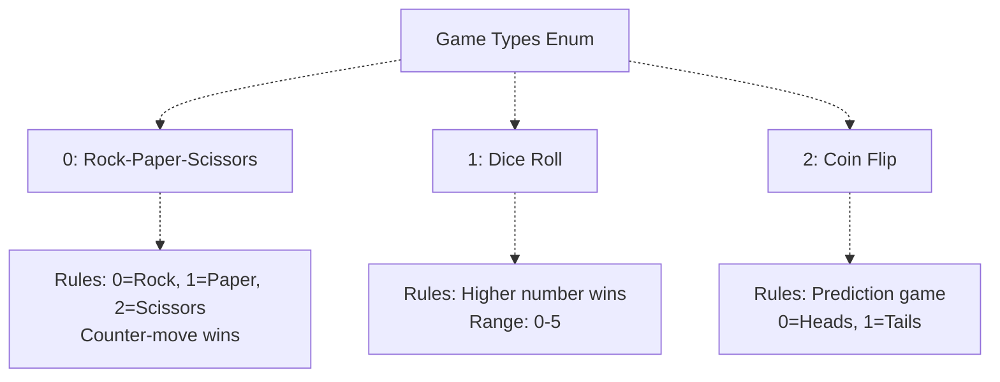
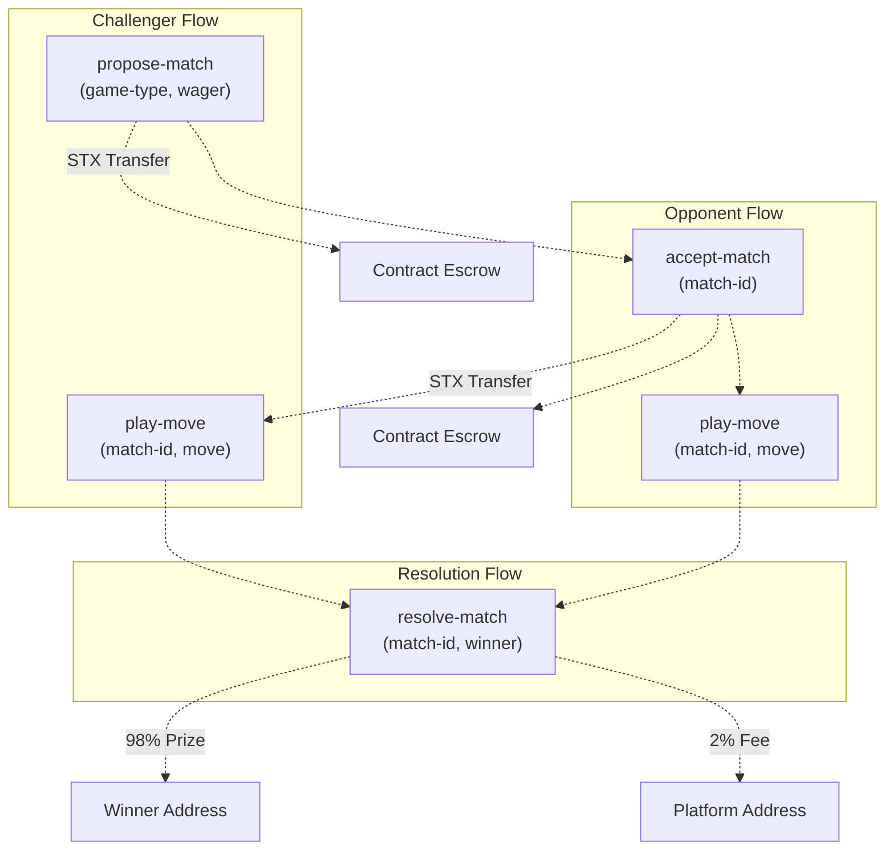
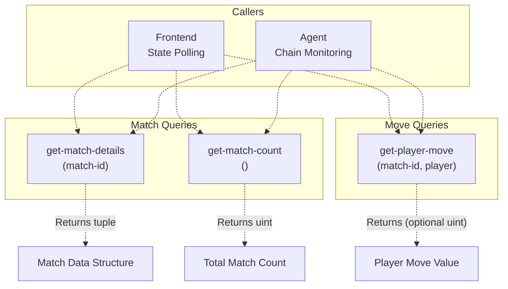
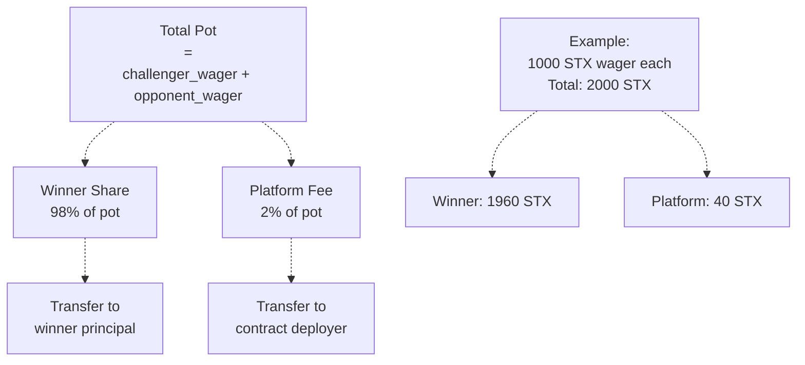
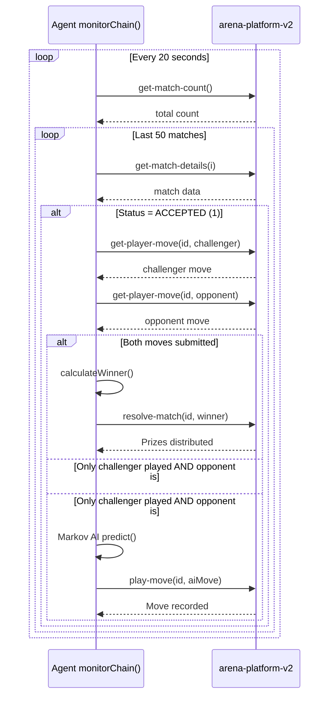
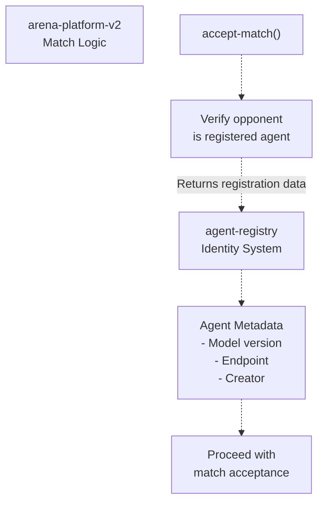

# arena-platform-v2 Contract

> **Relevant source files**
> * [PROJECT_SUMMARY.md](https://github.com/HACK3R-CRYPTO/GameArenaStacks/blob/23ba68fb/PROJECT_SUMMARY.md)
> * [README.md](https://github.com/HACK3R-CRYPTO/GameArenaStacks/blob/23ba68fb/README.md)
> * [agent/.env.example](https://github.com/HACK3R-CRYPTO/GameArenaStacks/blob/23ba68fb/agent/.env.example)
> * [agent/src/ArenaAgent.ts](https://github.com/HACK3R-CRYPTO/GameArenaStacks/blob/23ba68fb/agent/src/ArenaAgent.ts)

## Purpose and Scope

This document provides technical documentation for the `arena-platform-v2` Clarity smart contract, which implements the core game logic, wagering system, and match lifecycle management for the GameArenaStacks platform. The contract is deployed on Stacks testnet at address `ST3V7NY32G2T67PVPBP3WVC1B228D7N2MCCAWW5F9`.

This page covers the contract's data structures, state transitions, public functions, and prize distribution mechanisms. For agent identity management, see [agent-registry Contract](/HACK3R-CRYPTO/GameArenaStacks/4.2-agent-registry-contract). For frontend integration with the contract, see [ArenaGame Component](/HACK3R-CRYPTO/GameArenaStacks/2.1-arenagame-component). For agent-side contract interactions, see [Chain Monitoring and Auto-Resolution](/HACK3R-CRYPTO/GameArenaStacks/3.4-chain-monitoring-and-auto-resolution).

**Sources**: [agent/src/ArenaAgent.ts L45-L46](https://github.com/HACK3R-CRYPTO/GameArenaStacks/blob/23ba68fb/agent/src/ArenaAgent.ts#L45-L46)

 [README.md L40-L43](https://github.com/HACK3R-CRYPTO/GameArenaStacks/blob/23ba68fb/README.md#L40-L43)

---

## Contract Overview

### Deployment Information

| Property | Value |
| --- | --- |
| Contract Name | `arena-platform-v2` |
| Deployer Address | `ST3V7NY32G2T67PVPBP3WVC1B228D7N2MCCAWW5F9` |
| Network | Stacks Testnet |
| Language | Clarity 2.5 |
| Deployment Cost | 0.06962 STX |

The contract serves as the immutable game engine for 1v1 wagered matches, enforcing rules for three game types and managing STX transfers between players. All game state is stored on-chain, ensuring transparency and trustless execution.

**Sources**: [agent/src/ArenaAgent.ts L45-L46](https://github.com/HACK3R-CRYPTO/GameArenaStacks/blob/23ba68fb/agent/src/ArenaAgent.ts#L45-L46)

 [PROJECT_SUMMARY.md L11](https://github.com/HACK3R-CRYPTO/GameArenaStacks/blob/23ba68fb/PROJECT_SUMMARY.md#L11-L11)

 [agent/.env.example L8-L9](https://github.com/HACK3R-CRYPTO/GameArenaStacks/blob/23ba68fb/agent/.env.example#L8-L9)

### Supported Game Types



**Sources**: [agent/src/ArenaAgent.ts L70](https://github.com/HACK3R-CRYPTO/GameArenaStacks/blob/23ba68fb/agent/src/ArenaAgent.ts#L70-L70)

 [agent/src/ArenaAgent.ts L306-L327](https://github.com/HACK3R-CRYPTO/GameArenaStacks/blob/23ba68fb/agent/src/ArenaAgent.ts#L306-L327)

 [README.md L66-L71](https://github.com/HACK3R-CRYPTO/GameArenaStacks/blob/23ba68fb/README.md#L66-L71)

---

## Data Structures

### Match Data Structure

The contract stores match information using a tuple with the following fields:

| Field | Type | Description |
| --- | --- | --- |
| `challenger` | `principal` | Address of the player who proposed the match |
| `opponent` | `(optional principal)` | Address of the accepting player (none until accepted) |
| `game-type` | `uint` | Game type identifier (0, 1, or 2) |
| `wager` | `uint` | Amount in microSTX wagered by each player |
| `status` | `uint` | Current match state (see Match Status Codes) |
| `winner` | `(optional principal)` | Final winner after resolution (none until resolved) |

**Sources**: [agent/src/ArenaAgent.ts L202-L205](https://github.com/HACK3R-CRYPTO/GameArenaStacks/blob/23ba68fb/agent/src/ArenaAgent.ts#L202-L205)

 [agent/src/ArenaAgent.ts L361-L364](https://github.com/HACK3R-CRYPTO/GameArenaStacks/blob/23ba68fb/agent/src/ArenaAgent.ts#L361-L364)

### Match Status Codes

```css
#mermaid-1lbbfsrcevq{font-family:ui-sans-serif,-apple-system,system-ui,Segoe UI,Helvetica;font-size:16px;fill:#333;}@keyframes edge-animation-frame{from{stroke-dashoffset:0;}}@keyframes dash{to{stroke-dashoffset:0;}}#mermaid-1lbbfsrcevq .edge-animation-slow{stroke-dasharray:9,5!important;stroke-dashoffset:900;animation:dash 50s linear infinite;stroke-linecap:round;}#mermaid-1lbbfsrcevq .edge-animation-fast{stroke-dasharray:9,5!important;stroke-dashoffset:900;animation:dash 20s linear infinite;stroke-linecap:round;}#mermaid-1lbbfsrcevq .error-icon{fill:#dddddd;}#mermaid-1lbbfsrcevq .error-text{fill:#222222;stroke:#222222;}#mermaid-1lbbfsrcevq .edge-thickness-normal{stroke-width:1px;}#mermaid-1lbbfsrcevq .edge-thickness-thick{stroke-width:3.5px;}#mermaid-1lbbfsrcevq .edge-pattern-solid{stroke-dasharray:0;}#mermaid-1lbbfsrcevq .edge-thickness-invisible{stroke-width:0;fill:none;}#mermaid-1lbbfsrcevq .edge-pattern-dashed{stroke-dasharray:3;}#mermaid-1lbbfsrcevq .edge-pattern-dotted{stroke-dasharray:2;}#mermaid-1lbbfsrcevq .marker{fill:#999;stroke:#999;}#mermaid-1lbbfsrcevq .marker.cross{stroke:#999;}#mermaid-1lbbfsrcevq svg{font-family:ui-sans-serif,-apple-system,system-ui,Segoe UI,Helvetica;font-size:16px;}#mermaid-1lbbfsrcevq p{margin:0;}#mermaid-1lbbfsrcevq defs #statediagram-barbEnd{fill:#999;stroke:#999;}#mermaid-1lbbfsrcevq g.stateGroup text{fill:#dddddd;stroke:none;font-size:10px;}#mermaid-1lbbfsrcevq g.stateGroup text{fill:#333;stroke:none;font-size:10px;}#mermaid-1lbbfsrcevq g.stateGroup .state-title{font-weight:bolder;fill:#333;}#mermaid-1lbbfsrcevq g.stateGroup rect{fill:#ffffff;stroke:#dddddd;}#mermaid-1lbbfsrcevq g.stateGroup line{stroke:#999;stroke-width:1;}#mermaid-1lbbfsrcevq .transition{stroke:#999;stroke-width:1;fill:none;}#mermaid-1lbbfsrcevq .stateGroup .composit{fill:#f4f4f4;border-bottom:1px;}#mermaid-1lbbfsrcevq .stateGroup .alt-composit{fill:#e0e0e0;border-bottom:1px;}#mermaid-1lbbfsrcevq .state-note{stroke:#e6d280;fill:#fff5ad;}#mermaid-1lbbfsrcevq .state-note text{fill:#333;stroke:none;font-size:10px;}#mermaid-1lbbfsrcevq .stateLabel .box{stroke:none;stroke-width:0;fill:#ffffff;opacity:0.5;}#mermaid-1lbbfsrcevq .edgeLabel .label rect{fill:#ffffff;opacity:0.5;}#mermaid-1lbbfsrcevq .edgeLabel{background-color:#ffffff;text-align:center;}#mermaid-1lbbfsrcevq .edgeLabel p{background-color:#ffffff;}#mermaid-1lbbfsrcevq .edgeLabel rect{opacity:0.5;background-color:#ffffff;fill:#ffffff;}#mermaid-1lbbfsrcevq .edgeLabel .label text{fill:#333;}#mermaid-1lbbfsrcevq .label div .edgeLabel{color:#333;}#mermaid-1lbbfsrcevq .stateLabel text{fill:#333;font-size:10px;font-weight:bold;}#mermaid-1lbbfsrcevq .node circle.state-start{fill:#999;stroke:#999;}#mermaid-1lbbfsrcevq .node .fork-join{fill:#999;stroke:#999;}#mermaid-1lbbfsrcevq .node circle.state-end{fill:#dddddd;stroke:#f4f4f4;stroke-width:1.5;}#mermaid-1lbbfsrcevq .end-state-inner{fill:#f4f4f4;stroke-width:1.5;}#mermaid-1lbbfsrcevq .node rect{fill:#ffffff;stroke:#dddddd;stroke-width:1px;}#mermaid-1lbbfsrcevq .node polygon{fill:#ffffff;stroke:#dddddd;stroke-width:1px;}#mermaid-1lbbfsrcevq #statediagram-barbEnd{fill:#999;}#mermaid-1lbbfsrcevq .statediagram-cluster rect{fill:#ffffff;stroke:#dddddd;stroke-width:1px;}#mermaid-1lbbfsrcevq .cluster-label,#mermaid-1lbbfsrcevq .nodeLabel{color:#333;}#mermaid-1lbbfsrcevq .statediagram-cluster rect.outer{rx:5px;ry:5px;}#mermaid-1lbbfsrcevq .statediagram-state .divider{stroke:#dddddd;}#mermaid-1lbbfsrcevq .statediagram-state .title-state{rx:5px;ry:5px;}#mermaid-1lbbfsrcevq .statediagram-cluster.statediagram-cluster .inner{fill:#f4f4f4;}#mermaid-1lbbfsrcevq .statediagram-cluster.statediagram-cluster-alt .inner{fill:#f8f8f8;}#mermaid-1lbbfsrcevq .statediagram-cluster .inner{rx:0;ry:0;}#mermaid-1lbbfsrcevq .statediagram-state rect.basic{rx:5px;ry:5px;}#mermaid-1lbbfsrcevq .statediagram-state rect.divider{stroke-dasharray:10,10;fill:#f8f8f8;}#mermaid-1lbbfsrcevq .note-edge{stroke-dasharray:5;}#mermaid-1lbbfsrcevq .statediagram-note rect{fill:#fff5ad;stroke:#e6d280;stroke-width:1px;rx:0;ry:0;}#mermaid-1lbbfsrcevq .statediagram-note rect{fill:#fff5ad;stroke:#e6d280;stroke-width:1px;rx:0;ry:0;}#mermaid-1lbbfsrcevq .statediagram-note text{fill:#333;}#mermaid-1lbbfsrcevq .statediagram-note .nodeLabel{color:#333;}#mermaid-1lbbfsrcevq .statediagram .edgeLabel{color:red;}#mermaid-1lbbfsrcevq #dependencyStart,#mermaid-1lbbfsrcevq #dependencyEnd{fill:#999;stroke:#999;stroke-width:1;}#mermaid-1lbbfsrcevq .statediagramTitleText{text-anchor:middle;font-size:18px;fill:#333;}#mermaid-1lbbfsrcevq :root{--mermaid-font-family:"trebuchet ms",verdana,arial,sans-serif;}propose-match()accept-match()resolve-match()STATUS_PROPOSEDSTATUS_ACCEPTEDSTATUS_RESOLVEDstatus = 0challenger fundedopponent = nonestatus = 1both players fundedmoves can be playedstatus = 2winner determinedprizes distributed
```

| Status Code | Name | Description |
| --- | --- | --- |
| `0` | `STATUS-PROPOSED` | Match created by challenger, awaiting opponent acceptance |
| `1` | `STATUS-ACCEPTED` | Both players have joined and wagered, game in progress |
| `2` | `STATUS-RESOLVED` | Match completed with winner determined and prizes distributed |

**Sources**: [agent/src/ArenaAgent.ts L364-L367](https://github.com/HACK3R-CRYPTO/GameArenaStacks/blob/23ba68fb/agent/src/ArenaAgent.ts#L364-L367)

### Player Move Storage

Player moves are stored separately using a composite key of `(match-id, player-principal)`. The move value is an optional uint that remains `none` until the player submits their move.

**Sources**: [agent/src/ArenaAgent.ts L207-L215](https://github.com/HACK3R-CRYPTO/GameArenaStacks/blob/23ba68fb/agent/src/ArenaAgent.ts#L207-L215)

 [agent/src/ArenaAgent.ts L372-L387](https://github.com/HACK3R-CRYPTO/GameArenaStacks/blob/23ba68fb/agent/src/ArenaAgent.ts#L372-L387)

---

## Core Public Functions

### Function Call Patterns



**Sources**: [agent/src/ArenaAgent.ts L143-L183](https://github.com/HACK3R-CRYPTO/GameArenaStacks/blob/23ba68fb/agent/src/ArenaAgent.ts#L143-L183)

 [agent/src/ArenaAgent.ts L186-L301](https://github.com/HACK3R-CRYPTO/GameArenaStacks/blob/23ba68fb/agent/src/ArenaAgent.ts#L186-L301)

 [agent/src/ArenaAgent.ts L415-L434](https://github.com/HACK3R-CRYPTO/GameArenaStacks/blob/23ba68fb/agent/src/ArenaAgent.ts#L415-L434)

### propose-match

```
(define-public (propose-match (game-type uint) (wager uint))
```

Creates a new match with the caller as the challenger. This function:

* Transfers `wager` amount of STX from challenger to the contract
* Creates a match record with `STATUS-PROPOSED`
* Assigns a sequential match ID
* Returns the match ID to the caller

**Parameters**:

* `game-type`: Game type identifier (0, 1, or 2)
* `wager`: Amount in microSTX to wager

**Returns**: `(ok uint)` with the match ID, or error code

**Frontend Usage**: Called when user clicks "Propose Match" after selecting game type and wager amount.

**Sources**: [agent/src/ArenaAgent.ts L151-L161](https://github.com/HACK3R-CRYPTO/GameArenaStacks/blob/23ba68fb/agent/src/ArenaAgent.ts#L151-L161)

### accept-match

```
(define-public (accept-match (match-id uint))
```

Allows an opponent to accept a proposed match. This function:

* Verifies the match is in `STATUS-PROPOSED` state
* Transfers the same `wager` amount from opponent to contract
* Updates match status to `STATUS-ACCEPTED`
* Records the opponent's principal

**Parameters**:

* `match-id`: The match identifier to accept

**Returns**: `(ok true)` on success, or error code

**Agent Usage**: Called by the AI agent after receiving x402 payment via the `/accept-match` endpoint.

**Sources**: [agent/src/ArenaAgent.ts L143-L183](https://github.com/HACK3R-CRYPTO/GameArenaStacks/blob/23ba68fb/agent/src/ArenaAgent.ts#L143-L183)

### play-move

```
(define-public (play-move (match-id uint) (move uint))
```

Records a player's move for an active match. This function:

* Verifies the match is in `STATUS-ACCEPTED` state
* Confirms the caller is a participant (challenger or opponent)
* Stores the move value for the player
* Validates the move is within valid range for the game type

**Parameters**:

* `match-id`: The match identifier
* `move`: The player's move value (0-2 for RPS, 0-5 for Dice, 0-1 for Coin)

**Returns**: `(ok true)` on success, or error code

**Fair Play Guarantee**: The agent waits for the challenger's move to be confirmed on-chain before submitting its own move, preventing front-running.

**Sources**: [agent/src/ArenaAgent.ts L186-L301](https://github.com/HACK3R-CRYPTO/GameArenaStacks/blob/23ba68fb/agent/src/ArenaAgent.ts#L186-L301)

 [agent/src/ArenaAgent.ts L435-L468](https://github.com/HACK3R-CRYPTO/GameArenaStacks/blob/23ba68fb/agent/src/ArenaAgent.ts#L435-L468)

### resolve-match

```
(define-public (resolve-match (match-id uint) (winner principal))
```

Finalizes a match and distributes prizes. This function:

* Verifies both players have submitted moves
* Updates match status to `STATUS-RESOLVED`
* Transfers 98% of total pot to winner
* Transfers 2% platform fee to contract deployer
* Records the winner in the match record

**Parameters**:

* `match-id`: The match identifier
* `winner`: The principal address of the winning player

**Returns**: `(ok true)` on success, or error code

**Auto-Resolution**: Typically called by the AI agent's `monitorChain` process after detecting both moves on-chain.

**Sources**: [agent/src/ArenaAgent.ts L415-L434](https://github.com/HACK3R-CRYPTO/GameArenaStacks/blob/23ba68fb/agent/src/ArenaAgent.ts#L415-L434)

 [agent/src/ArenaAgent.ts L396-L409](https://github.com/HACK3R-CRYPTO/GameArenaStacks/blob/23ba68fb/agent/src/ArenaAgent.ts#L396-L409)

---

## Read-Only Functions

### Contract Query Functions



**Sources**: [agent/src/ArenaAgent.ts L194-L215](https://github.com/HACK3R-CRYPTO/GameArenaStacks/blob/23ba68fb/agent/src/ArenaAgent.ts#L194-L215)

 [agent/src/ArenaAgent.ts L336-L344](https://github.com/HACK3R-CRYPTO/GameArenaStacks/blob/23ba68fb/agent/src/ArenaAgent.ts#L336-L344)

 [agent/src/ArenaAgent.ts L352-L360](https://github.com/HACK3R-CRYPTO/GameArenaStacks/blob/23ba68fb/agent/src/ArenaAgent.ts#L352-L360)

### get-match-details

Returns the complete match data structure for a given match ID.

**Usage in Agent**: [agent/src/ArenaAgent.ts L194-L205](https://github.com/HACK3R-CRYPTO/GameArenaStacks/blob/23ba68fb/agent/src/ArenaAgent.ts#L194-L205)

**Usage in Frontend**: Used to display match status and participants

### get-match-count

Returns the total number of matches created. Used for iteration and discovery.

**Usage in Agent**: [agent/src/ArenaAgent.ts L336-L344](https://github.com/HACK3R-CRYPTO/GameArenaStacks/blob/23ba68fb/agent/src/ArenaAgent.ts#L336-L344)

**Usage Pattern**: Agent scans last 50 matches for active games requiring moves or resolution

### get-player-move

Returns the move value submitted by a specific player for a specific match.

**Usage in Agent**: [agent/src/ArenaAgent.ts L207-L215](https://github.com/HACK3R-CRYPTO/GameArenaStacks/blob/23ba68fb/agent/src/ArenaAgent.ts#L207-L215)

**Fair Play Check**: Agent verifies challenger has played before submitting its own move

**Sources**: [agent/src/ArenaAgent.ts L194-L215](https://github.com/HACK3R-CRYPTO/GameArenaStacks/blob/23ba68fb/agent/src/ArenaAgent.ts#L194-L215)

 [agent/src/ArenaAgent.ts L336-L360](https://github.com/HACK3R-CRYPTO/GameArenaStacks/blob/23ba68fb/agent/src/ArenaAgent.ts#L336-L360)

---

## Match Lifecycle

### Complete State Transition Diagram

```python
#mermaid-ufm9om60vfj{font-family:ui-sans-serif,-apple-system,system-ui,Segoe UI,Helvetica;font-size:16px;fill:#333;}@keyframes edge-animation-frame{from{stroke-dashoffset:0;}}@keyframes dash{to{stroke-dashoffset:0;}}#mermaid-ufm9om60vfj .edge-animation-slow{stroke-dasharray:9,5!important;stroke-dashoffset:900;animation:dash 50s linear infinite;stroke-linecap:round;}#mermaid-ufm9om60vfj .edge-animation-fast{stroke-dasharray:9,5!important;stroke-dashoffset:900;animation:dash 20s linear infinite;stroke-linecap:round;}#mermaid-ufm9om60vfj .error-icon{fill:#dddddd;}#mermaid-ufm9om60vfj .error-text{fill:#222222;stroke:#222222;}#mermaid-ufm9om60vfj .edge-thickness-normal{stroke-width:1px;}#mermaid-ufm9om60vfj .edge-thickness-thick{stroke-width:3.5px;}#mermaid-ufm9om60vfj .edge-pattern-solid{stroke-dasharray:0;}#mermaid-ufm9om60vfj .edge-thickness-invisible{stroke-width:0;fill:none;}#mermaid-ufm9om60vfj .edge-pattern-dashed{stroke-dasharray:3;}#mermaid-ufm9om60vfj .edge-pattern-dotted{stroke-dasharray:2;}#mermaid-ufm9om60vfj .marker{fill:#999;stroke:#999;}#mermaid-ufm9om60vfj .marker.cross{stroke:#999;}#mermaid-ufm9om60vfj svg{font-family:ui-sans-serif,-apple-system,system-ui,Segoe UI,Helvetica;font-size:16px;}#mermaid-ufm9om60vfj p{margin:0;}#mermaid-ufm9om60vfj defs #statediagram-barbEnd{fill:#999;stroke:#999;}#mermaid-ufm9om60vfj g.stateGroup text{fill:#dddddd;stroke:none;font-size:10px;}#mermaid-ufm9om60vfj g.stateGroup text{fill:#333;stroke:none;font-size:10px;}#mermaid-ufm9om60vfj g.stateGroup .state-title{font-weight:bolder;fill:#333;}#mermaid-ufm9om60vfj g.stateGroup rect{fill:#ffffff;stroke:#dddddd;}#mermaid-ufm9om60vfj g.stateGroup line{stroke:#999;stroke-width:1;}#mermaid-ufm9om60vfj .transition{stroke:#999;stroke-width:1;fill:none;}#mermaid-ufm9om60vfj .stateGroup .composit{fill:#f4f4f4;border-bottom:1px;}#mermaid-ufm9om60vfj .stateGroup .alt-composit{fill:#e0e0e0;border-bottom:1px;}#mermaid-ufm9om60vfj .state-note{stroke:#e6d280;fill:#fff5ad;}#mermaid-ufm9om60vfj .state-note text{fill:#333;stroke:none;font-size:10px;}#mermaid-ufm9om60vfj .stateLabel .box{stroke:none;stroke-width:0;fill:#ffffff;opacity:0.5;}#mermaid-ufm9om60vfj .edgeLabel .label rect{fill:#ffffff;opacity:0.5;}#mermaid-ufm9om60vfj .edgeLabel{background-color:#ffffff;text-align:center;}#mermaid-ufm9om60vfj .edgeLabel p{background-color:#ffffff;}#mermaid-ufm9om60vfj .edgeLabel rect{opacity:0.5;background-color:#ffffff;fill:#ffffff;}#mermaid-ufm9om60vfj .edgeLabel .label text{fill:#333;}#mermaid-ufm9om60vfj .label div .edgeLabel{color:#333;}#mermaid-ufm9om60vfj .stateLabel text{fill:#333;font-size:10px;font-weight:bold;}#mermaid-ufm9om60vfj .node circle.state-start{fill:#999;stroke:#999;}#mermaid-ufm9om60vfj .node .fork-join{fill:#999;stroke:#999;}#mermaid-ufm9om60vfj .node circle.state-end{fill:#dddddd;stroke:#f4f4f4;stroke-width:1.5;}#mermaid-ufm9om60vfj .end-state-inner{fill:#f4f4f4;stroke-width:1.5;}#mermaid-ufm9om60vfj .node rect{fill:#ffffff;stroke:#dddddd;stroke-width:1px;}#mermaid-ufm9om60vfj .node polygon{fill:#ffffff;stroke:#dddddd;stroke-width:1px;}#mermaid-ufm9om60vfj #statediagram-barbEnd{fill:#999;}#mermaid-ufm9om60vfj .statediagram-cluster rect{fill:#ffffff;stroke:#dddddd;stroke-width:1px;}#mermaid-ufm9om60vfj .cluster-label,#mermaid-ufm9om60vfj .nodeLabel{color:#333;}#mermaid-ufm9om60vfj .statediagram-cluster rect.outer{rx:5px;ry:5px;}#mermaid-ufm9om60vfj .statediagram-state .divider{stroke:#dddddd;}#mermaid-ufm9om60vfj .statediagram-state .title-state{rx:5px;ry:5px;}#mermaid-ufm9om60vfj .statediagram-cluster.statediagram-cluster .inner{fill:#f4f4f4;}#mermaid-ufm9om60vfj .statediagram-cluster.statediagram-cluster-alt .inner{fill:#f8f8f8;}#mermaid-ufm9om60vfj .statediagram-cluster .inner{rx:0;ry:0;}#mermaid-ufm9om60vfj .statediagram-state rect.basic{rx:5px;ry:5px;}#mermaid-ufm9om60vfj .statediagram-state rect.divider{stroke-dasharray:10,10;fill:#f8f8f8;}#mermaid-ufm9om60vfj .note-edge{stroke-dasharray:5;}#mermaid-ufm9om60vfj .statediagram-note rect{fill:#fff5ad;stroke:#e6d280;stroke-width:1px;rx:0;ry:0;}#mermaid-ufm9om60vfj .statediagram-note rect{fill:#fff5ad;stroke:#e6d280;stroke-width:1px;rx:0;ry:0;}#mermaid-ufm9om60vfj .statediagram-note text{fill:#333;}#mermaid-ufm9om60vfj .statediagram-note .nodeLabel{color:#333;}#mermaid-ufm9om60vfj .statediagram .edgeLabel{color:red;}#mermaid-ufm9om60vfj #dependencyStart,#mermaid-ufm9om60vfj #dependencyEnd{fill:#999;stroke:#999;stroke-width:1;}#mermaid-ufm9om60vfj .statediagramTitleText{text-anchor:middle;font-size:18px;fill:#333;}#mermaid-ufm9om60vfj :root{--mermaid-font-family:"trebuchet ms",verdana,arial,sans-serif;}propose-match(type, wager)accept-match(id)"Both players funded""play-move(id, move)from challenger""play-move(id, move)from opponent""play-move(id, move)from opponent""play-move(id, move)from challenger""resolve-match(id, winner)"ProposedAcceptedWaitingMovesChallengerPlayedOpponentPlayedBothPlayedResolvedStatus: 0 (PROPOSED)Escrow: 1x wagerOpponent: noneStatus: 1 (ACCEPTED)Escrow: 2x wagerBoth players recordedStatus: 1 (ACCEPTED)Ready for resolutionWinner can be determinedStatus: 2 (RESOLVED)Prizes distributedMatch immutable
```

**Sources**: [agent/src/ArenaAgent.ts L330-L474](https://github.com/HACK3R-CRYPTO/GameArenaStacks/blob/23ba68fb/agent/src/ArenaAgent.ts#L330-L474)

### Typical Match Timeline

| Step | Action | Actor | Contract State Change |
| --- | --- | --- | --- |
| 1 | Propose match | Challenger (Human/Agent) | Create match record, transfer wager to contract |
| 2 | Accept match | Opponent (Agent/Human) | Update opponent field, transfer wager, set status=1 |
| 3 | Play move | Challenger | Store move for challenger principal |
| 4 | Play move (after fairness wait) | Opponent | Store move for opponent principal |
| 5 | Resolve match | Any participant or agent | Calculate winner, distribute prizes, set status=2 |

**Sources**: [agent/src/ArenaAgent.ts L143-L183](https://github.com/HACK3R-CRYPTO/GameArenaStacks/blob/23ba68fb/agent/src/ArenaAgent.ts#L143-L183)

 [agent/src/ArenaAgent.ts L186-L301](https://github.com/HACK3R-CRYPTO/GameArenaStacks/blob/23ba68fb/agent/src/ArenaAgent.ts#L186-L301)

 [agent/src/ArenaAgent.ts L415-L434](https://github.com/HACK3R-CRYPTO/GameArenaStacks/blob/23ba68fb/agent/src/ArenaAgent.ts#L415-L434)

---

## Prize Distribution

### Distribution Formula



**Sources**: [PROJECT_SUMMARY.md L43](https://github.com/HACK3R-CRYPTO/GameArenaStacks/blob/23ba68fb/PROJECT_SUMMARY.md#L43-L43)

 [README.md L40-L43](https://github.com/HACK3R-CRYPTO/GameArenaStacks/blob/23ba68fb/README.md#L40-L43)

### Post-Conditions in Frontend

The frontend application enforces post-conditions to protect users during match proposal:

* Ensures exactly `wager` amount is transferred from user to contract
* Prevents excessive STX deductions
* Visible to user in wallet confirmation dialog

For detailed post-condition implementation, see [Post-Conditions and Asset Protection](/HACK3R-CRYPTO/GameArenaStacks/6.2-post-conditions-and-asset-protection).

**Sources**: [PROJECT_SUMMARY.md L67-L70](https://github.com/HACK3R-CRYPTO/GameArenaStacks/blob/23ba68fb/PROJECT_SUMMARY.md#L67-L70)

---

## Winner Determination Logic

### Game-Specific Rules Implementation

The winner is determined off-chain by the agent's `calculateWinner` function and then committed on-chain via `resolve-match`. The contract trusts the resolution caller to provide the correct winner based on these rules:

#### Rock-Paper-Scissors (game-type = 0)

```
// 0: Rock, 1: Paper, 2: Scissors
if (move1 === move2) return null; // Draw
if ((move1 === 0 && move2 === 2) || 
    (move1 === 1 && move2 === 0) || 
    (move1 === 2 && move2 === 1)) {
    return player1; // Challenger wins
}
return player2; // Opponent wins
```

**Sources**: [agent/src/ArenaAgent.ts L306-L313](https://github.com/HACK3R-CRYPTO/GameArenaStacks/blob/23ba68fb/agent/src/ArenaAgent.ts#L306-L313)

#### Dice Roll (game-type = 1)

```
// Higher number wins (0-5 range)
if (move1 === move2) return null; // Draw
return move1 > move2 ? player1 : player2;
```

**Sources**: [agent/src/ArenaAgent.ts L315-L318](https://github.com/HACK3R-CRYPTO/GameArenaStacks/blob/23ba68fb/agent/src/ArenaAgent.ts#L315-L318)

#### Coin Flip (game-type = 2)

```
// Prediction game: 0=Heads, 1=Tails
// Challenger wins if prediction (move1) matches result (move2)
return move1 === move2 ? player1 : player2;
```

**Sources**: [agent/src/ArenaAgent.ts L320-L324](https://github.com/HACK3R-CRYPTO/GameArenaStacks/blob/23ba68fb/agent/src/ArenaAgent.ts#L320-L324)

### Draw Handling

In case of a draw (equal moves in RPS or Dice), the agent defaults to awarding the challenger to ensure smooth operation during demonstrations. Production implementations should refund both players or implement a rematch mechanism.

**Sources**: [agent/src/ArenaAgent.ts L401-L406](https://github.com/HACK3R-CRYPTO/GameArenaStacks/blob/23ba68fb/agent/src/ArenaAgent.ts#L401-L406)

---

## Agent Integration Patterns

### Chain Monitoring Loop

The AI agent continuously monitors the contract for matches requiring action:



**Sources**: [agent/src/ArenaAgent.ts L330-L475](https://github.com/HACK3R-CRYPTO/GameArenaStacks/blob/23ba68fb/agent/src/ArenaAgent.ts#L330-L475)

### Fairness Verification

Before playing a move, the agent performs a fairness check:

1. Queries `get-player-move` for the challenger
2. If challenger move is `none`, returns HTTP 403 error
3. Only proceeds with AI move after challenger move is confirmed on-chain

This prevents front-running and ensures the agent cannot see the user's move before committing its own.

**Sources**: [agent/src/ArenaAgent.ts L194-L224](https://github.com/HACK3R-CRYPTO/GameArenaStacks/blob/23ba68fb/agent/src/ArenaAgent.ts#L194-L224)

 [README.md L64](https://github.com/HACK3R-CRYPTO/GameArenaStacks/blob/23ba68fb/README.md#L64-L64)

---

## Error Handling

### Common Error Scenarios

| Error Condition | Contract Response | Mitigation |
| --- | --- | --- |
| Insufficient balance | Transaction fails | Frontend checks balance before proposal |
| Invalid game type | Function returns error | Frontend validates game type selection |
| Match not found | Read-only returns none | Agent handles missing matches gracefully |
| Duplicate move | Function returns error | Frontend disables button after submission |
| Invalid match status | Function returns error | Contract enforces status transitions |

**Sources**: [agent/src/ArenaAgent.ts L169-L172](https://github.com/HACK3R-CRYPTO/GameArenaStacks/blob/23ba68fb/agent/src/ArenaAgent.ts#L169-L172)

 [agent/src/ArenaAgent.ts L290-L293](https://github.com/HACK3R-CRYPTO/GameArenaStacks/blob/23ba68fb/agent/src/ArenaAgent.ts#L290-L293)

### Transaction Broadcasting Failures

The agent implements retry logic for failed broadcasts:

* Attempts multiple Stacks RPC nodes
* Logs errors but continues monitoring
* Uses manual nonce fetching for reliability

For detailed resilience architecture, see [Multi-Node Failover and Reliability](/HACK3R-CRYPTO/GameArenaStacks/6.1-multi-node-failover-and-reliability).

**Sources**: [agent/src/ArenaAgent.ts L245-L266](https://github.com/HACK3R-CRYPTO/GameArenaStacks/blob/23ba68fb/agent/src/ArenaAgent.ts#L245-L266)

 [agent/src/ArenaAgent.ts L430-L432](https://github.com/HACK3R-CRYPTO/GameArenaStacks/blob/23ba68fb/agent/src/ArenaAgent.ts#L430-L432)

---

## Integration with Agent Registry

The contract integrates with the `agent-registry` contract for identity verification:



While not currently enforced at the contract level, the frontend can query the registry to:

* Display agent information to users
* Verify opponent authenticity
* Show AI model version and strategy type

For detailed registry documentation, see [agent-registry Contract](/HACK3R-CRYPTO/GameArenaStacks/4.2-agent-registry-contract).

**Sources**: [README.md L41-L48](https://github.com/HACK3R-CRYPTO/GameArenaStacks/blob/23ba68fb/README.md#L41-L48)

---

## Contract Deployment

### Testnet Deployment Details

The contract was deployed using Clarinet with the following configuration:

```yaml
# contracts/deployments/default.testnet-plan.yaml
- contract-publish:
    contract-name: arena-platform-v2
    expected-sender: ST3V7NY32G2T67PVPBP3WVC1B228D7N2MCCAWW5F9
    cost: 23140
    path: contracts/arena-platform-v2.clar
```

**Network Parameters**:

* Network: Stacks Testnet
* Explorer: [https://explorer.hiro.so/address/ST3V7NY32G2T67PVPBP3WVC1B228D7N2MCCAWW5F9?chain=testnet](https://explorer.hiro.so/address/ST3V7NY32G2T67PVPBP3WVC1B228D7N2MCCAWW5F9?chain=testnet)
* RPC Endpoints: Multiple nodes with failover support

For deployment instructions, see [Contract Deployment](/HACK3R-CRYPTO/GameArenaStacks/4.3-contract-deployment).

**Sources**: [README.md L40](https://github.com/HACK3R-CRYPTO/GameArenaStacks/blob/23ba68fb/README.md#L40-L40)

 [PROJECT_SUMMARY.md L81](https://github.com/HACK3R-CRYPTO/GameArenaStacks/blob/23ba68fb/PROJECT_SUMMARY.md#L81-L81)

 [agent/.env.example L8-L9](https://github.com/HACK3R-CRYPTO/GameArenaStacks/blob/23ba68fb/agent/.env.example#L8-L9)

---

## Summary

The `arena-platform-v2` contract provides a trustless, transparent gaming platform with the following key characteristics:

| Feature | Implementation |
| --- | --- |
| **State Management** | Three-state lifecycle (Proposed → Accepted → Resolved) |
| **Asset Security** | Post-conditions protect user funds during transactions |
| **Fair Play** | On-chain move verification prevents front-running |
| **Prize Distribution** | Automated 98/2 split via smart contract logic |
| **Multi-Game Support** | Flexible game-type enum supports RPS, Dice, Coin Flip |
| **Agent Integration** | Read-only functions enable autonomous monitoring |
| **Immutability** | Resolved matches are permanent on-chain records |

The contract serves as the immutable foundation for the GameArenaStacks ecosystem, enabling trustless wagering between human players and autonomous AI agents while ensuring transparent, verifiable game outcomes.

**Sources**: [README.md L1-L86](https://github.com/HACK3R-CRYPTO/GameArenaStacks/blob/23ba68fb/README.md#L1-L86)

 [PROJECT_SUMMARY.md L1-L142](https://github.com/HACK3R-CRYPTO/GameArenaStacks/blob/23ba68fb/PROJECT_SUMMARY.md#L1-L142)

 [agent/src/ArenaAgent.ts L1-L482](https://github.com/HACK3R-CRYPTO/GameArenaStacks/blob/23ba68fb/agent/src/ArenaAgent.ts#L1-L482)