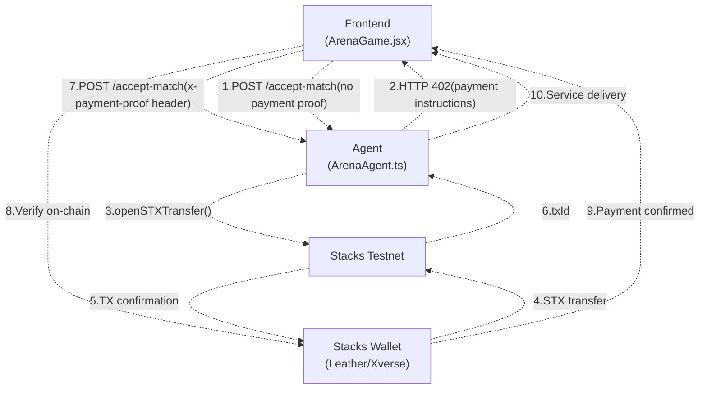
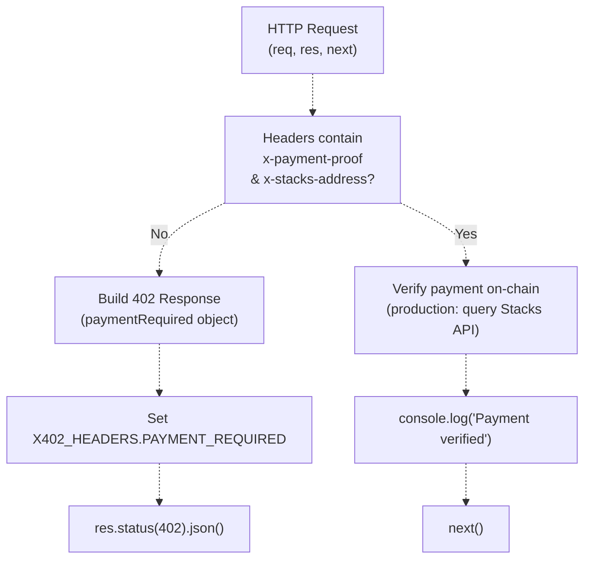
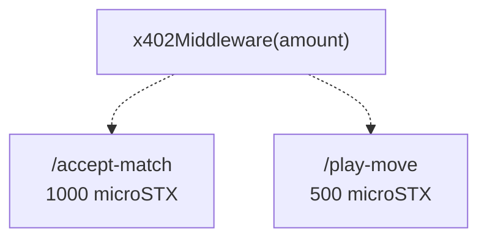
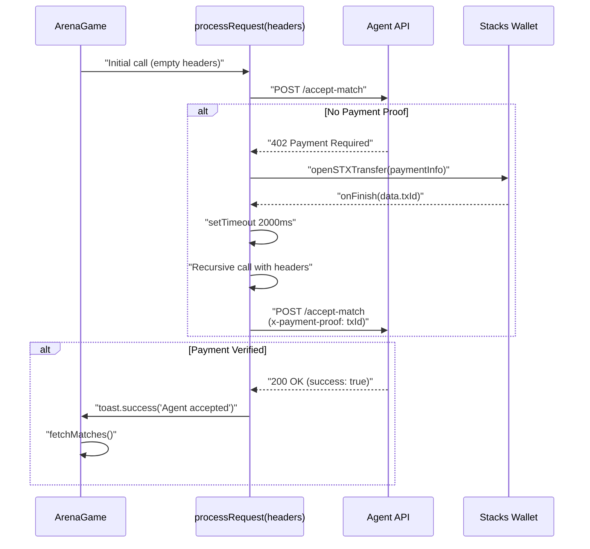
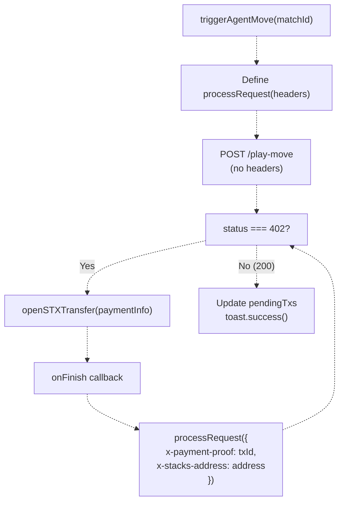
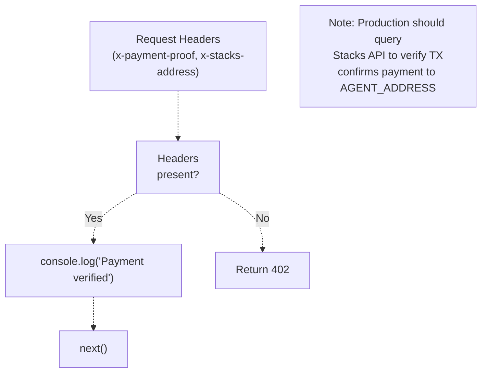
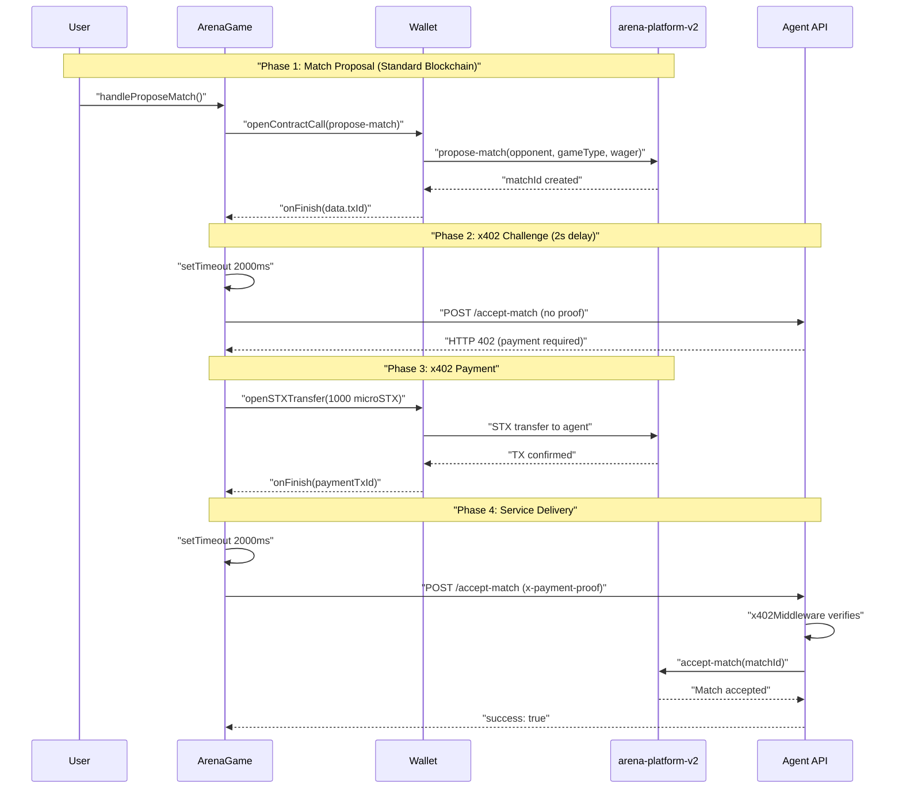

# x402 Monetization Protocol

> **Relevant source files**
> * [PROJECT_SUMMARY.md](https://github.com/HACK3R-CRYPTO/GameArenaStacks/blob/23ba68fb/PROJECT_SUMMARY.md)
> * [README.md](https://github.com/HACK3R-CRYPTO/GameArenaStacks/blob/23ba68fb/README.md)
> * [agent/.env.example](https://github.com/HACK3R-CRYPTO/GameArenaStacks/blob/23ba68fb/agent/.env.example)
> * [agent/src/ArenaAgent.ts](https://github.com/HACK3R-CRYPTO/GameArenaStacks/blob/23ba68fb/agent/src/ArenaAgent.ts)
> * [frontend/src/components/Navigation.jsx](https://github.com/HACK3R-CRYPTO/GameArenaStacks/blob/23ba68fb/frontend/src/components/Navigation.jsx)
> * [frontend/src/pages/ArenaGame.jsx](https://github.com/HACK3R-CRYPTO/GameArenaStacks/blob/23ba68fb/frontend/src/pages/ArenaGame.jsx)

## Purpose and Scope

This document describes the implementation of the **x402 payment protocol** within GameArena Stacks, enabling automated machine-to-machine micropayments between the frontend client and the autonomous AI agent. The x402 protocol allows the agent to monetize its services by returning HTTP 402 status codes with payment instructions, which are automatically fulfilled by the frontend before service delivery.

For information about the smart contract layer that handles match wagering and prize distribution, see [arena-platform-v2 Contract](/HACK3R-CRYPTO/GameArenaStacks/4.1-arena-platform-v2-contract). For details about the AI strategy that the agent uses after payment verification, see [Markov Chain AI Strategy](/HACK3R-CRYPTO/GameArenaStacks/3.3-markov-chain-ai-strategy).

**Key aspects covered:**

* HTTP 402 payment request/response structure
* Agent-side middleware implementation
* Frontend payment automation flow
* On-chain payment verification
* Integration with Stacks Connect wallets

---

## Protocol Architecture

The x402 protocol operates as a challenge-response payment layer between the frontend and agent, where services are gated behind micro-payment requirements verified on the Stacks blockchain.

### High-Level x402 Flow



**Sources:** [frontend/src/pages/ArenaGame.jsx L350-L398](https://github.com/HACK3R-CRYPTO/GameArenaStacks/blob/23ba68fb/frontend/src/pages/ArenaGame.jsx#L350-L398)

 [agent/src/ArenaAgent.ts L108-L140](https://github.com/HACK3R-CRYPTO/GameArenaStacks/blob/23ba68fb/agent/src/ArenaAgent.ts#L108-L140)

---

## Agent-Side Implementation

### x402Middleware Function

The agent implements payment gating through the `x402Middleware` function, which wraps Express endpoints and enforces payment requirements.



**Sources:** [agent/src/ArenaAgent.ts L108-L140](https://github.com/HACK3R-CRYPTO/GameArenaStacks/blob/23ba68fb/agent/src/ArenaAgent.ts#L108-L140)

#### Payment Required Response Structure

When payment proof is absent, the middleware constructs a standardized 402 response:

| Field | Type | Description |
| --- | --- | --- |
| `status` | `number` | Always `402` |
| `error` | `string` | `"Payment Required"` |
| `x402Version` | `number` | Protocol version (`2`) |
| `resource.url` | `string` | Endpoint path (e.g., `/accept-match`) |
| `resource.description` | `string` | Human-readable service description |
| `accepts[0].scheme` | `string` | `"direct-payment"` |
| `accepts[0].network` | `string` | `"stacks-testnet"` |
| `accepts[0].token` | `string` | `"STX"` |
| `accepts[0].amount` | `string` | Micropayment amount in microSTX |
| `accepts[0].payTo` | `string` | Agent's Stacks address |

**Sources:** [agent/src/ArenaAgent.ts L116-L127](https://github.com/HACK3R-CRYPTO/GameArenaStacks/blob/23ba68fb/agent/src/ArenaAgent.ts#L116-L127)

#### Endpoint Payment Configuration

The agent defines different payment tiers for various services:



**Implementation:**

* **Match Acceptance:** `app.post('/accept-match', x402Middleware(1000), ...)`
* **Move Execution:** `app.post('/play-move', x402Middleware(500), ...)`

**Sources:** [agent/src/ArenaAgent.ts L143](https://github.com/HACK3R-CRYPTO/GameArenaStacks/blob/23ba68fb/agent/src/ArenaAgent.ts#L143-L143)

 [agent/src/ArenaAgent.ts L186](https://github.com/HACK3R-CRYPTO/GameArenaStacks/blob/23ba68fb/agent/src/ArenaAgent.ts#L186-L186)

---

## Frontend-Side Implementation

### Axios Instance Configuration

The frontend creates a pre-configured axios instance that communicates with the agent API:

```javascript
const api = axios.create({ baseURL: AGENT_API_URL });
```

**Sources:** [frontend/src/pages/ArenaGame.jsx L55](https://github.com/HACK3R-CRYPTO/GameArenaStacks/blob/23ba68fb/frontend/src/pages/ArenaGame.jsx#L55-L55)

### Payment Automation Functions

#### handleChallengeAgent: Match Acceptance Flow

The `handleChallengeAgent` function demonstrates the complete x402 payment cycle for match acceptance.



**Sources:** [frontend/src/pages/ArenaGame.jsx L350-L398](https://github.com/HACK3R-CRYPTO/GameArenaStacks/blob/23ba68fb/frontend/src/pages/ArenaGame.jsx#L350-L398)

**Key Implementation Details:**

1. **Recursive Request Pattern:** The `processRequest` function is defined as an async closure that can call itself with updated headers
2. **Error Handling:** `error.response?.status === 402` triggers the payment flow
3. **Payment Proof Header:** After wallet confirmation, retry includes `'x-payment-proof': data.txId`
4. **User Address Header:** `'x-stacks-address': userData.profile.stxAddress.testnet`
5. **Delayed Retry:** `setTimeout(() => processRequest({...}), 2000)` allows on-chain confirmation

**Sources:** [frontend/src/pages/ArenaGame.jsx L366-L389](https://github.com/HACK3R-CRYPTO/GameArenaStacks/blob/23ba68fb/frontend/src/pages/ArenaGame.jsx#L366-L389)

#### triggerAgentMove: AI Move Payment Flow

The `triggerAgentMove` function uses an identical payment automation pattern for requesting AI moves.



**Sources:** [frontend/src/pages/ArenaGame.jsx L401-L445](https://github.com/HACK3R-CRYPTO/GameArenaStacks/blob/23ba68fb/frontend/src/pages/ArenaGame.jsx#L401-L445)

**Differences from Match Acceptance:**

* **Amount:** `paymentInfo.accepts[0].amount` is 500 microSTX (vs 1000 for match acceptance)
* **Memo:** `'x402 Agent Move Fee'` (vs `'x402 Agent Fee'`)
* **Post-Processing:** Sets `pendingTxs` with agent's transaction ID from response

**Sources:** [frontend/src/pages/ArenaGame.jsx L413-L432](https://github.com/HACK3R-CRYPTO/GameArenaStacks/blob/23ba68fb/frontend/src/pages/ArenaGame.jsx#L413-L432)

---

## Payment Verification Architecture

### Agent-Side Verification (Current Implementation)



**Current Behavior:**

* The middleware logs payment verification but does not query the blockchain
* In production, should call Stacks API: `GET /extended/v1/tx/{txId}`
* Verify transaction status is `success` and recipient matches `AGENT_ADDRESS`

**Sources:** [agent/src/ArenaAgent.ts L136-L138](https://github.com/HACK3R-CRYPTO/GameArenaStacks/blob/23ba68fb/agent/src/ArenaAgent.ts#L136-L138)

### On-Chain Payment Structure

When the frontend executes `openSTXTransfer`, the following transaction is constructed:

| Parameter | Value |
| --- | --- |
| `recipient` | `paymentInfo.accepts[0].payTo` (agent address) |
| `amount` | `paymentInfo.accepts[0].amount` (microSTX) |
| `memo` | `'x402 Agent Fee'` or `'x402 Agent Move Fee'` |
| `network` | `StacksTestnet` instance |

**Sources:** [frontend/src/pages/ArenaGame.jsx L371-L375](https://github.com/HACK3R-CRYPTO/GameArenaStacks/blob/23ba68fb/frontend/src/pages/ArenaGame.jsx#L371-L375)

 [frontend/src/pages/ArenaGame.jsx L418-L422](https://github.com/HACK3R-CRYPTO/GameArenaStacks/blob/23ba68fb/frontend/src/pages/ArenaGame.jsx#L418-L422)

---

## Configuration and Environment Setup

### Agent Environment Variables

The agent requires the following environment configuration for x402 operation:

```
PRIVATE_KEY=<agent_wallet_private_key>
NETWORK_TYPE=testnet
CONTRACT_ADDRESS=ST3V7NY32G2T67PVPBP3WVC1B228D7N2MCCAWW5F9
PORT=3000
X402_FACILITATOR_URL=https://v2.x402stacks.xyz
```

**Key Configuration:**

* **AGENT_ADDRESS:** Derived from `PRIVATE_KEY` using `getAddressFromPrivateKey()`
* **Payment Recipient:** All x402 payments are directed to `AGENT_ADDRESS`

**Sources:** [agent/.env.example L1-L16](https://github.com/HACK3R-CRYPTO/GameArenaStacks/blob/23ba68fb/agent/.env.example#L1-L16)

 [agent/src/ArenaAgent.ts L40-L43](https://github.com/HACK3R-CRYPTO/GameArenaStacks/blob/23ba68fb/agent/src/ArenaAgent.ts#L40-L43)

### Frontend Environment Variables

```
VITE_DEPLOYER_ADDRESS=ST3V7NY32G2T67PVPBP3WVC1B228D7N2MCCAWW5F9
VITE_AGENT_API_URL=http://localhost:3000
```

**Sources:** [frontend/src/pages/ArenaGame.jsx L10-L12](https://github.com/HACK3R-CRYPTO/GameArenaStacks/blob/23ba68fb/frontend/src/pages/ArenaGame.jsx#L10-L12)

---

## x402 Integration with Match Lifecycle

### Complete Payment Flow in Match Proposal



**Sources:** [frontend/src/pages/ArenaGame.jsx L300-L348](https://github.com/HACK3R-CRYPTO/GameArenaStacks/blob/23ba68fb/frontend/src/pages/ArenaGame.jsx#L300-L348)

 [frontend/src/pages/ArenaGame.jsx L350-L398](https://github.com/HACK3R-CRYPTO/GameArenaStacks/blob/23ba68fb/frontend/src/pages/ArenaGame.jsx#L350-L398)

---

## Error Handling and Edge Cases

### Payment Cancellation

Both payment flows handle user cancellation:

```javascript
onCancel: () => {
    toast.error('Payment cancelled - Agent refused match', { id: toastId });
}
```

**Behavior:**

* No retry is attempted
* Error toast notifies user
* Match remains in pending state

**Sources:** [frontend/src/pages/ArenaGame.jsx L386-L388](https://github.com/HACK3R-CRYPTO/GameArenaStacks/blob/23ba68fb/frontend/src/pages/ArenaGame.jsx#L386-L388)

 [frontend/src/pages/ArenaGame.jsx L433-L435](https://github.com/HACK3R-CRYPTO/GameArenaStacks/blob/23ba68fb/frontend/src/pages/ArenaGame.jsx#L433-L435)

### Network Failures

If the agent API is unreachable during initial request or retry:

```
catch (error) {
    if (error.response?.status === 402) {
        // Handle payment flow
    } else {
        console.error(error);
        toast.error('Challenge failed', { id: toastId });
    }
}
```

**Sources:** [frontend/src/pages/ArenaGame.jsx L390-L394](https://github.com/HACK3R-CRYPTO/GameArenaStacks/blob/23ba68fb/frontend/src/pages/ArenaGame.jsx#L390-L394)

### Double Payment Prevention

The recursive `processRequest` pattern prevents double payments:

1. First call has no headers → triggers 402
2. After payment, headers are added to retry
3. Agent middleware checks headers before returning 402
4. Subsequent calls with valid proof bypass payment gate

**Sources:** [frontend/src/pages/ArenaGame.jsx L353-L397](https://github.com/HACK3R-CRYPTO/GameArenaStacks/blob/23ba68fb/frontend/src/pages/ArenaGame.jsx#L353-L397)

---

## x402 Protocol Dependencies

### NPM Package: x402-stacks

Both frontend and agent depend on the `x402-stacks` package (v2.0.1):

**Agent Import:**

```javascript
import { X402_HEADERS } from 'x402-stacks';
```

**Usage:** The `X402_HEADERS.PAYMENT_REQUIRED` constant is used to set the standardized HTTP response header.

**Sources:** [agent/src/ArenaAgent.ts L3-L4](https://github.com/HACK3R-CRYPTO/GameArenaStacks/blob/23ba68fb/agent/src/ArenaAgent.ts#L3-L4)

 [agent/src/ArenaAgent.ts L130-L131](https://github.com/HACK3R-CRYPTO/GameArenaStacks/blob/23ba68fb/agent/src/ArenaAgent.ts#L130-L131)

**Frontend Integration:**
The frontend uses axios directly for x402 flows, but the protocol structure aligns with x402-stacks specifications.

**Sources:** Frontend does not directly import x402-stacks, relying on axios for HTTP handling

---

## Security Considerations

### Payment Proof Validation

**Current Implementation Limitation:**
The agent's `x402Middleware` does not verify payment proofs against the blockchain. It only checks for header presence.

**Production Requirements:**

1. Query Stacks API: `GET https://api.testnet.hiro.so/extended/v1/tx/${paymentProof}`
2. Verify `tx_status === 'success'`
3. Parse `tx_result` to confirm: * Token transfer recipient matches `AGENT_ADDRESS` * Transfer amount matches required fee * Transaction is recent (within reasonable time window)

**Sources:** [agent/src/ArenaAgent.ts L136-L138](https://github.com/HACK3R-CRYPTO/GameArenaStacks/blob/23ba68fb/agent/src/ArenaAgent.ts#L136-L138)

### CORS Configuration

The agent allows all origins for development:

```
res.header('Access-Control-Allow-Origin', '*');
res.header('Access-Control-Allow-Headers', 'Origin, X-Requested-With, Content-Type, Accept, x-payment-proof, x-stacks-address');
```

**Production Consideration:** Restrict `Access-Control-Allow-Origin` to trusted frontend domains.

**Sources:** [agent/src/ArenaAgent.ts L29-L30](https://github.com/HACK3R-CRYPTO/GameArenaStacks/blob/23ba68fb/agent/src/ArenaAgent.ts#L29-L30)

### Replay Attack Prevention

Current implementation is vulnerable to payment proof replay. Recommended mitigations:

1. **Nonce System:** Include request-specific nonce in 402 response
2. **TTL Enforcement:** Reject payment proofs older than 5 minutes
3. **Used Proof Tracking:** Maintain in-memory set of consumed transaction IDs

**Sources:** Implicit from [agent/src/ArenaAgent.ts L108-L140](https://github.com/HACK3R-CRYPTO/GameArenaStacks/blob/23ba68fb/agent/src/ArenaAgent.ts#L108-L140)

 payment verification logic

---

## Cost Structure

The agent enforces the following fee schedule:

| Service | Endpoint | Cost (microSTX) | Cost (STX) |
| --- | --- | --- | --- |
| Match Acceptance | `/accept-match` | 1000 | 0.001 |
| AI Move Execution | `/play-move` | 500 | 0.0005 |

**Rationale:**

* Match acceptance fee covers computational cost of Markov model initialization and on-chain transaction
* Move execution fee is lower as model is already trained
* Total agent cost per complete match: **1500 microSTX (0.0015 STX)**

**Sources:** [agent/src/ArenaAgent.ts L143](https://github.com/HACK3R-CRYPTO/GameArenaStacks/blob/23ba68fb/agent/src/ArenaAgent.ts#L143-L143)

 [agent/src/ArenaAgent.ts L186](https://github.com/HACK3R-CRYPTO/GameArenaStacks/blob/23ba68fb/agent/src/ArenaAgent.ts#L186-L186)

---

## Integration Points

### Relationship to Smart Contracts

The x402 protocol operates independently from smart contract logic:

1. **Match Proposal:** User pays wager to contract (separate from agent fees)
2. **x402 Payment:** User pays service fee to agent wallet
3. **Agent Action:** Agent calls contract functions after payment verification
4. **Prize Distribution:** Contract pays winner (98% of total wager)

**Key Insight:** Agent fees are off-contract micropayments, while wagers are on-contract escrowed funds.

**Sources:** [frontend/src/pages/ArenaGame.jsx L309-L339](https://github.com/HACK3R-CRYPTO/GameArenaStacks/blob/23ba68fb/frontend/src/pages/ArenaGame.jsx#L309-L339)

 (match proposal with post-conditions), [agent/src/ArenaAgent.ts L143-L183](https://github.com/HACK3R-CRYPTO/GameArenaStacks/blob/23ba68fb/agent/src/ArenaAgent.ts#L143-L183)

 (agent contract calls after x402 verification)

### Connection to Markov AI

After x402 payment verification succeeds, the agent executes strategic logic:

```javascript
app.post('/play-move', x402Middleware(500), async (req, res) => {
    // After payment verified by middleware...
    
    // Fetch challenger's move from blockchain
    const challengerMoveRes = await callReadOnlyFunction(...);
    const challengerMoveValue = Number(moveData.value);
    
    // Update Markov model
    model.update(gameType, challenger, challengerMoveValue);
    
    // Generate counter-strategy
    move = model.predict(gameType, challenger);
    
    // Execute on-chain
    await makeContractCall({ functionName: 'play-move', ... });
});
```

**Sources:** [agent/src/ArenaAgent.ts L186-L301](https://github.com/HACK3R-CRYPTO/GameArenaStacks/blob/23ba68fb/agent/src/ArenaAgent.ts#L186-L301)

---

## Summary

The x402 protocol enables GameArena's autonomous agent to monetize its services through automated micropayments:

* **Agent Implementation:** `x402Middleware` function gates endpoints, returning HTTP 402 with payment instructions
* **Frontend Automation:** Recursive `processRequest` pattern handles payment flow transparently
* **Integration:** Operates alongside smart contract wagers as a separate service fee layer
* **Cost Structure:** 1000 microSTX for match acceptance, 500 microSTX for move execution
* **Security:** Current implementation requires production enhancements for payment verification and replay protection

**Sources:** [agent/src/ArenaAgent.ts L108-L140](https://github.com/HACK3R-CRYPTO/GameArenaStacks/blob/23ba68fb/agent/src/ArenaAgent.ts#L108-L140)

 [frontend/src/pages/ArenaGame.jsx L350-L445](https://github.com/HACK3R-CRYPTO/GameArenaStacks/blob/23ba68fb/frontend/src/pages/ArenaGame.jsx#L350-L445)

 [README.md L58-L64](https://github.com/HACK3R-CRYPTO/GameArenaStacks/blob/23ba68fb/README.md#L58-L64)