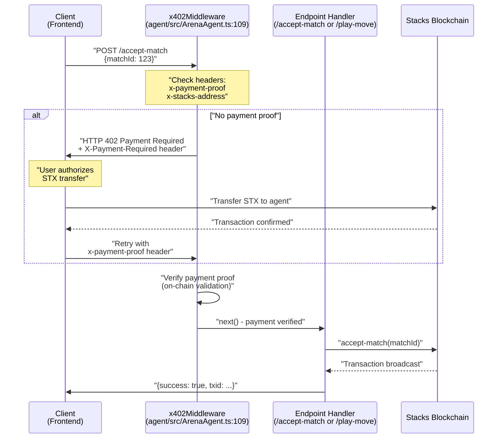
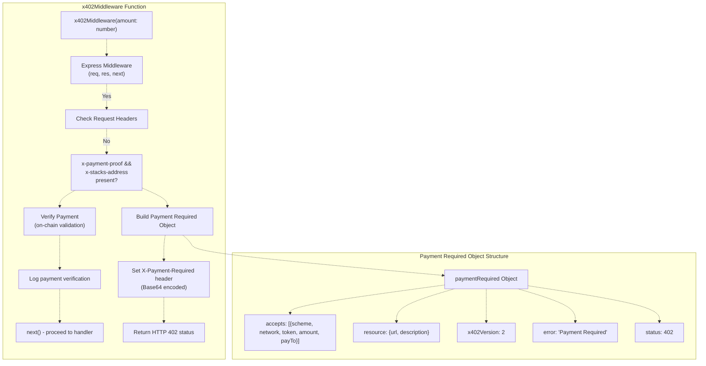
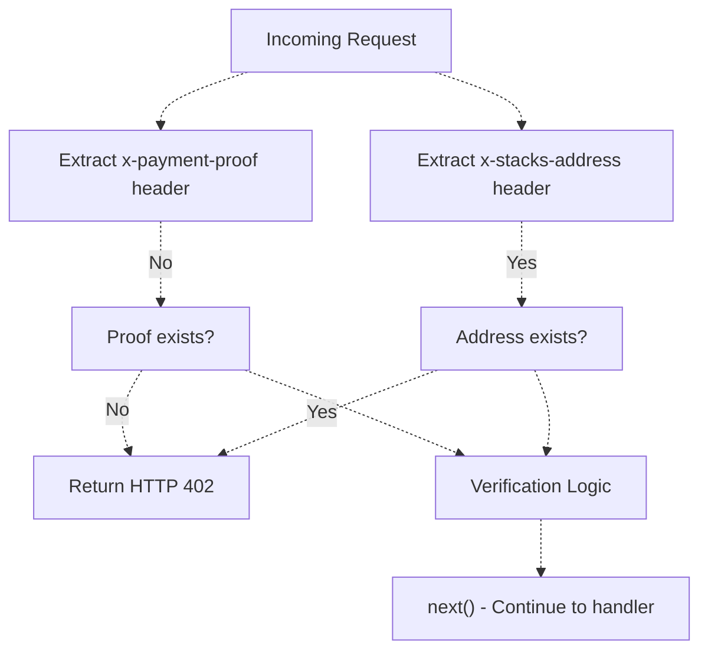
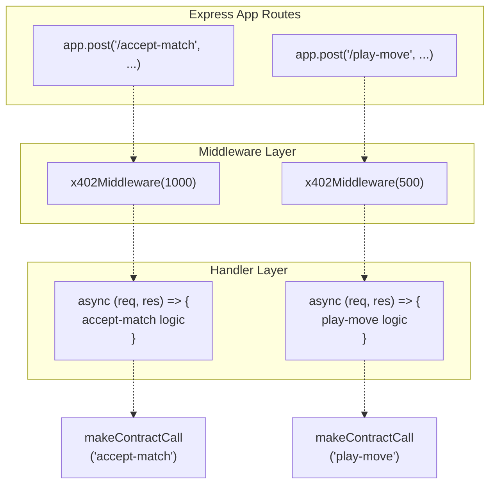
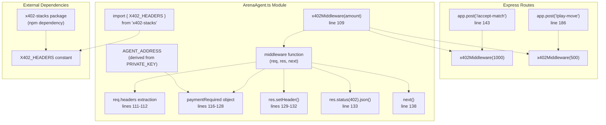
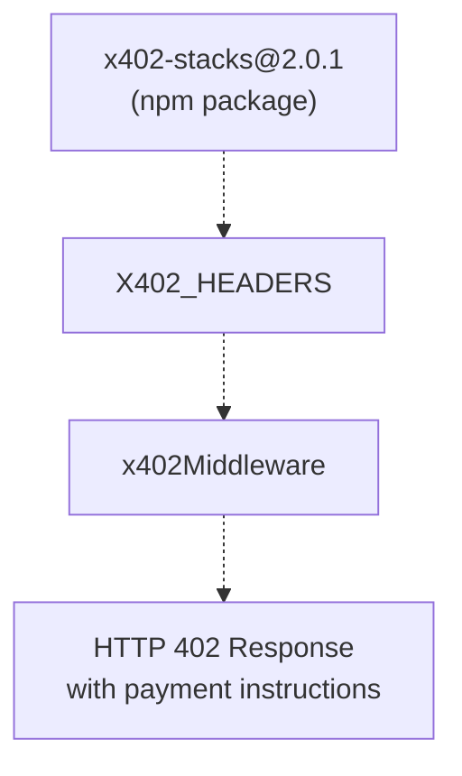

# x402 Payment Middleware

> **Relevant source files**
> * [README.md](https://github.com/HACK3R-CRYPTO/GameArenaStacks/blob/23ba68fb/README.md)
> * [agent/.env.example](https://github.com/HACK3R-CRYPTO/GameArenaStacks/blob/23ba68fb/agent/.env.example)
> * [agent/README.md](https://github.com/HACK3R-CRYPTO/GameArenaStacks/blob/23ba68fb/agent/README.md)
> * [agent/src/ArenaAgent.ts](https://github.com/HACK3R-CRYPTO/GameArenaStacks/blob/23ba68fb/agent/src/ArenaAgent.ts)

## Purpose and Scope

This document describes the x402 payment middleware implementation in the GameArenaStacks agent system. The middleware enables machine-to-machine monetization by requiring micro-payments before the agent provides services. This document covers the middleware function implementation, HTTP 402 protocol handling, payment verification logic, and integration with agent API endpoints.

For information about the complete agent architecture, see [AI Agent System](/HACK3R-CRYPTO/GameArenaStacks/3-ai-agent-system). For details on the API endpoints that use this middleware, see [Agent API Endpoints](/HACK3R-CRYPTO/GameArenaStacks/3.5-agent-api-endpoints). For the frontend's client-side x402 integration, see [ArenaGame Component](/HACK3R-CRYPTO/GameArenaStacks/2.1-arenagame-component).

## HTTP 402 Payment Required Protocol

The x402 middleware implements the HTTP 402 status code, traditionally reserved for "Payment Required" scenarios. When a request arrives without valid payment proof, the agent responds with a 402 status and structured payment instructions.

### Payment Request/Response Cycle



**Sources**: [agent/src/ArenaAgent.ts L109-L140](https://github.com/HACK3R-CRYPTO/GameArenaStacks/blob/23ba68fb/agent/src/ArenaAgent.ts#L109-L140)

 [agent/src/ArenaAgent.ts L143-L183](https://github.com/HACK3R-CRYPTO/GameArenaStacks/blob/23ba68fb/agent/src/ArenaAgent.ts#L143-L183)

## Middleware Function Implementation

The `x402Middleware` function is a higher-order function that returns Express middleware configured with a specific payment amount.

### Function Signature and Structure



**Sources**: [agent/src/ArenaAgent.ts L109-L140](https://github.com/HACK3R-CRYPTO/GameArenaStacks/blob/23ba68fb/agent/src/ArenaAgent.ts#L109-L140)

### Payment Required Response Structure

The middleware constructs a standardized payment instruction object when payment proof is absent:

| Field | Type | Description |
| --- | --- | --- |
| `status` | `number` | Always `402` |
| `error` | `string` | `"Payment Required"` |
| `x402Version` | `number` | Protocol version (`2`) |
| `resource` | `object` | `{url: string, description: string}` |
| `accepts` | `array` | Array of payment scheme objects |

**Payment Scheme Object**:

| Field | Type | Example Value |
| --- | --- | --- |
| `scheme` | `string` | `"direct-payment"` |
| `network` | `string` | `"stacks-testnet"` |
| `token` | `string` | `"STX"` |
| `amount` | `string` | `"1000"` (microSTX) |
| `payTo` | `string` | Agent's Stacks address |

**Sources**: [agent/src/ArenaAgent.ts L116-L128](https://github.com/HACK3R-CRYPTO/GameArenaStacks/blob/23ba68fb/agent/src/ArenaAgent.ts#L116-L128)

## Request Header Validation

The middleware extracts and validates two critical headers from incoming requests:



**Header Specifications**:

* **`x-payment-proof`**: Transaction ID or proof of payment completion
* **`x-stacks-address`**: Payer's Stacks address for verification

**Sources**: [agent/src/ArenaAgent.ts L111-L112](https://github.com/HACK3R-CRYPTO/GameArenaStacks/blob/23ba68fb/agent/src/ArenaAgent.ts#L111-L112)

 [agent/src/ArenaAgent.ts L115-L134](https://github.com/HACK3R-CRYPTO/GameArenaStacks/blob/23ba68fb/agent/src/ArenaAgent.ts#L115-L134)

## CORS Configuration for x402 Headers

The agent's Express server is configured to allow x402-specific headers in cross-origin requests:

```
Access-Control-Allow-Headers: Origin, X-Requested-With, Content-Type, Accept, x-payment-proof, x-stacks-address
```

This configuration at [agent/src/ArenaAgent.ts L28-L36](https://github.com/HACK3R-CRYPTO/GameArenaStacks/blob/23ba68fb/agent/src/ArenaAgent.ts#L28-L36)

 ensures that browsers do not block the custom payment headers during preflight OPTIONS requests.

**Sources**: [agent/src/ArenaAgent.ts L28-L36](https://github.com/HACK3R-CRYPTO/GameArenaStacks/blob/23ba68fb/agent/src/ArenaAgent.ts#L28-L36)

## Endpoint Integration

The middleware is applied to two primary API endpoints with different pricing tiers:

### Endpoint Pricing Table

| Endpoint | Middleware Config | Amount (microSTX) | Purpose |
| --- | --- | --- | --- |
| `POST /accept-match` | `x402Middleware(1000)` | 1000 | Agent accepts match proposal |
| `POST /play-move` | `x402Middleware(500)` | 500 | Agent commits game move |

### Endpoint Middleware Application



**Sources**: [agent/src/ArenaAgent.ts L143](https://github.com/HACK3R-CRYPTO/GameArenaStacks/blob/23ba68fb/agent/src/ArenaAgent.ts#L143-L143)

 [agent/src/ArenaAgent.ts L186](https://github.com/HACK3R-CRYPTO/GameArenaStacks/blob/23ba68fb/agent/src/ArenaAgent.ts#L186-L186)

## Payment Verification Implementation

The current implementation logs payment verification but includes a placeholder for production-level on-chain verification.

### Verification Flow

```css
#mermaid-ltn8ocmti5{font-family:ui-sans-serif,-apple-system,system-ui,Segoe UI,Helvetica;font-size:16px;fill:#333;}@keyframes edge-animation-frame{from{stroke-dashoffset:0;}}@keyframes dash{to{stroke-dashoffset:0;}}#mermaid-ltn8ocmti5 .edge-animation-slow{stroke-dasharray:9,5!important;stroke-dashoffset:900;animation:dash 50s linear infinite;stroke-linecap:round;}#mermaid-ltn8ocmti5 .edge-animation-fast{stroke-dasharray:9,5!important;stroke-dashoffset:900;animation:dash 20s linear infinite;stroke-linecap:round;}#mermaid-ltn8ocmti5 .error-icon{fill:#dddddd;}#mermaid-ltn8ocmti5 .error-text{fill:#222222;stroke:#222222;}#mermaid-ltn8ocmti5 .edge-thickness-normal{stroke-width:1px;}#mermaid-ltn8ocmti5 .edge-thickness-thick{stroke-width:3.5px;}#mermaid-ltn8ocmti5 .edge-pattern-solid{stroke-dasharray:0;}#mermaid-ltn8ocmti5 .edge-thickness-invisible{stroke-width:0;fill:none;}#mermaid-ltn8ocmti5 .edge-pattern-dashed{stroke-dasharray:3;}#mermaid-ltn8ocmti5 .edge-pattern-dotted{stroke-dasharray:2;}#mermaid-ltn8ocmti5 .marker{fill:#999;stroke:#999;}#mermaid-ltn8ocmti5 .marker.cross{stroke:#999;}#mermaid-ltn8ocmti5 svg{font-family:ui-sans-serif,-apple-system,system-ui,Segoe UI,Helvetica;font-size:16px;}#mermaid-ltn8ocmti5 p{margin:0;}#mermaid-ltn8ocmti5 defs #statediagram-barbEnd{fill:#999;stroke:#999;}#mermaid-ltn8ocmti5 g.stateGroup text{fill:#dddddd;stroke:none;font-size:10px;}#mermaid-ltn8ocmti5 g.stateGroup text{fill:#333;stroke:none;font-size:10px;}#mermaid-ltn8ocmti5 g.stateGroup .state-title{font-weight:bolder;fill:#333;}#mermaid-ltn8ocmti5 g.stateGroup rect{fill:#ffffff;stroke:#dddddd;}#mermaid-ltn8ocmti5 g.stateGroup line{stroke:#999;stroke-width:1;}#mermaid-ltn8ocmti5 .transition{stroke:#999;stroke-width:1;fill:none;}#mermaid-ltn8ocmti5 .stateGroup .composit{fill:#f4f4f4;border-bottom:1px;}#mermaid-ltn8ocmti5 .stateGroup .alt-composit{fill:#e0e0e0;border-bottom:1px;}#mermaid-ltn8ocmti5 .state-note{stroke:#e6d280;fill:#fff5ad;}#mermaid-ltn8ocmti5 .state-note text{fill:#333;stroke:none;font-size:10px;}#mermaid-ltn8ocmti5 .stateLabel .box{stroke:none;stroke-width:0;fill:#ffffff;opacity:0.5;}#mermaid-ltn8ocmti5 .edgeLabel .label rect{fill:#ffffff;opacity:0.5;}#mermaid-ltn8ocmti5 .edgeLabel{background-color:#ffffff;text-align:center;}#mermaid-ltn8ocmti5 .edgeLabel p{background-color:#ffffff;}#mermaid-ltn8ocmti5 .edgeLabel rect{opacity:0.5;background-color:#ffffff;fill:#ffffff;}#mermaid-ltn8ocmti5 .edgeLabel .label text{fill:#333;}#mermaid-ltn8ocmti5 .label div .edgeLabel{color:#333;}#mermaid-ltn8ocmti5 .stateLabel text{fill:#333;font-size:10px;font-weight:bold;}#mermaid-ltn8ocmti5 .node circle.state-start{fill:#999;stroke:#999;}#mermaid-ltn8ocmti5 .node .fork-join{fill:#999;stroke:#999;}#mermaid-ltn8ocmti5 .node circle.state-end{fill:#dddddd;stroke:#f4f4f4;stroke-width:1.5;}#mermaid-ltn8ocmti5 .end-state-inner{fill:#f4f4f4;stroke-width:1.5;}#mermaid-ltn8ocmti5 .node rect{fill:#ffffff;stroke:#dddddd;stroke-width:1px;}#mermaid-ltn8ocmti5 .node polygon{fill:#ffffff;stroke:#dddddd;stroke-width:1px;}#mermaid-ltn8ocmti5 #statediagram-barbEnd{fill:#999;}#mermaid-ltn8ocmti5 .statediagram-cluster rect{fill:#ffffff;stroke:#dddddd;stroke-width:1px;}#mermaid-ltn8ocmti5 .cluster-label,#mermaid-ltn8ocmti5 .nodeLabel{color:#333;}#mermaid-ltn8ocmti5 .statediagram-cluster rect.outer{rx:5px;ry:5px;}#mermaid-ltn8ocmti5 .statediagram-state .divider{stroke:#dddddd;}#mermaid-ltn8ocmti5 .statediagram-state .title-state{rx:5px;ry:5px;}#mermaid-ltn8ocmti5 .statediagram-cluster.statediagram-cluster .inner{fill:#f4f4f4;}#mermaid-ltn8ocmti5 .statediagram-cluster.statediagram-cluster-alt .inner{fill:#f8f8f8;}#mermaid-ltn8ocmti5 .statediagram-cluster .inner{rx:0;ry:0;}#mermaid-ltn8ocmti5 .statediagram-state rect.basic{rx:5px;ry:5px;}#mermaid-ltn8ocmti5 .statediagram-state rect.divider{stroke-dasharray:10,10;fill:#f8f8f8;}#mermaid-ltn8ocmti5 .note-edge{stroke-dasharray:5;}#mermaid-ltn8ocmti5 .statediagram-note rect{fill:#fff5ad;stroke:#e6d280;stroke-width:1px;rx:0;ry:0;}#mermaid-ltn8ocmti5 .statediagram-note rect{fill:#fff5ad;stroke:#e6d280;stroke-width:1px;rx:0;ry:0;}#mermaid-ltn8ocmti5 .statediagram-note text{fill:#333;}#mermaid-ltn8ocmti5 .statediagram-note .nodeLabel{color:#333;}#mermaid-ltn8ocmti5 .statediagram .edgeLabel{color:red;}#mermaid-ltn8ocmti5 #dependencyStart,#mermaid-ltn8ocmti5 #dependencyEnd{fill:#999;stroke:#999;stroke-width:1;}#mermaid-ltn8ocmti5 .statediagramTitleText{text-anchor:middle;font-size:18px;fill:#333;}#mermaid-ltn8ocmti5 :root{--mermaid-font-family:"trebuchet ms",verdana,arial,sans-serif;}"Request arrives""No payment headers""Headers found""Build payment instructions""HTTP 402 response""Validate payment proof""Log verification success""next()""Execute endpoint logic"CheckHeadersHeadersMissingHeadersPresentReturn402VerifyPaymentProduction TODO:Query Stacks APIVerify transactionCheck amount/recipientLogVerificationProceedToHandler
```

**Current Implementation** at [agent/src/ArenaAgent.ts L136-L138](https://github.com/HACK3R-CRYPTO/GameArenaStacks/blob/23ba68fb/agent/src/ArenaAgent.ts#L136-L138)

:

```javascript
// In production, verify payment proof here
console.log(chalk.green(`✅ Payment verified from ${stacksAddress}`));
next();
```

**Production Enhancement**: The verification logic should query the Stacks blockchain to:

1. Confirm the transaction exists and is confirmed
2. Verify the transfer amount matches the required payment
3. Validate the recipient is the agent's address
4. Ensure the transaction is recent (prevent replay attacks)

**Sources**: [agent/src/ArenaAgent.ts L136-L139](https://github.com/HACK3R-CRYPTO/GameArenaStacks/blob/23ba68fb/agent/src/ArenaAgent.ts#L136-L139)

## Configuration and Constants

### Agent Address Configuration

The agent's payment recipient address is derived from the private key at startup:

```
AGENT_ADDRESS = getAddressFromPrivateKey(PRIVATE_KEY, TransactionVersion)
```

This address is used in the `payTo` field of all payment instructions. Configuration source: [agent/src/ArenaAgent.ts L43](https://github.com/HACK3R-CRYPTO/GameArenaStacks/blob/23ba68fb/agent/src/ArenaAgent.ts#L43-L43)

### X-Payment-Required Header Encoding

The payment instructions are Base64-encoded and attached to the response header:

```
res.setHeader(
    X402_HEADERS.PAYMENT_REQUIRED,
    Buffer.from(JSON.stringify(paymentRequired)).toString('base64')
);
```

The `X402_HEADERS.PAYMENT_REQUIRED` constant is imported from the `x402-stacks` package at [agent/src/ArenaAgent.ts L3-L4](https://github.com/HACK3R-CRYPTO/GameArenaStacks/blob/23ba68fb/agent/src/ArenaAgent.ts#L3-L4)

**Sources**: [agent/src/ArenaAgent.ts L129-L132](https://github.com/HACK3R-CRYPTO/GameArenaStacks/blob/23ba68fb/agent/src/ArenaAgent.ts#L129-L132)

 [agent/src/ArenaAgent.ts L3-L4](https://github.com/HACK3R-CRYPTO/GameArenaStacks/blob/23ba68fb/agent/src/ArenaAgent.ts#L3-L4)

## Complete Code Entity Map



**Sources**: [agent/src/ArenaAgent.ts L1-L481](https://github.com/HACK3R-CRYPTO/GameArenaStacks/blob/23ba68fb/agent/src/ArenaAgent.ts#L1-L481)

## Environment Configuration

The x402 middleware requires specific environment variables for operation:

| Variable | Purpose | Example Value |
| --- | --- | --- |
| `PRIVATE_KEY` | Agent's wallet private key | `your_private_key_here` |
| `NETWORK_TYPE` | Stacks network | `testnet` |
| `CONTRACT_ADDRESS` | Platform contract address | `ST3V7NY32G2...` |
| `PORT` | Agent API server port | `3000` |

The `X402_FACILITATOR_URL` is documented in [agent/.env.example L14-L15](https://github.com/HACK3R-CRYPTO/GameArenaStacks/blob/23ba68fb/agent/.env.example#L14-L15)

 for future integration with x402 facilitator services.

**Sources**: [agent/.env.example L1-L16](https://github.com/HACK3R-CRYPTO/GameArenaStacks/blob/23ba68fb/agent/.env.example#L1-L16)

 [agent/src/ArenaAgent.ts L40-L48](https://github.com/HACK3R-CRYPTO/GameArenaStacks/blob/23ba68fb/agent/src/ArenaAgent.ts#L40-L48)

## Error Handling and Logging

The middleware includes comprehensive logging using the `chalk` library for colored console output:

**Success Case** (payment verified):

```javascript
console.log(chalk.green(`✅ Payment verified from ${stacksAddress}`));
```

**Rejection Case** (no payment proof):

* Returns HTTP 402 status
* Includes structured error object
* Logs warning (implicit through response)

The endpoint handlers downstream from the middleware include their own error handling for contract call failures, which are separate from payment verification failures.

**Sources**: [agent/src/ArenaAgent.ts L137](https://github.com/HACK3R-CRYPTO/GameArenaStacks/blob/23ba68fb/agent/src/ArenaAgent.ts#L137-L137)

 [agent/src/ArenaAgent.ts L179-L182](https://github.com/HACK3R-CRYPTO/GameArenaStacks/blob/23ba68fb/agent/src/ArenaAgent.ts#L179-L182)

## Integration with x402-stacks Package

The agent leverages the `x402-stacks` npm package (version 2.0.1) for protocol constants and utilities:



The package provides standardized header names and response formats that ensure compatibility with x402-aware clients. Package specification: [agent/package.json](https://github.com/HACK3R-CRYPTO/GameArenaStacks/blob/23ba68fb/agent/package.json)

**Sources**: [agent/README.md L29](https://github.com/HACK3R-CRYPTO/GameArenaStacks/blob/23ba68fb/agent/README.md#L29-L29)

 [agent/src/ArenaAgent.ts L3-L4](https://github.com/HACK3R-CRYPTO/GameArenaStacks/blob/23ba68fb/agent/src/ArenaAgent.ts#L3-L4)